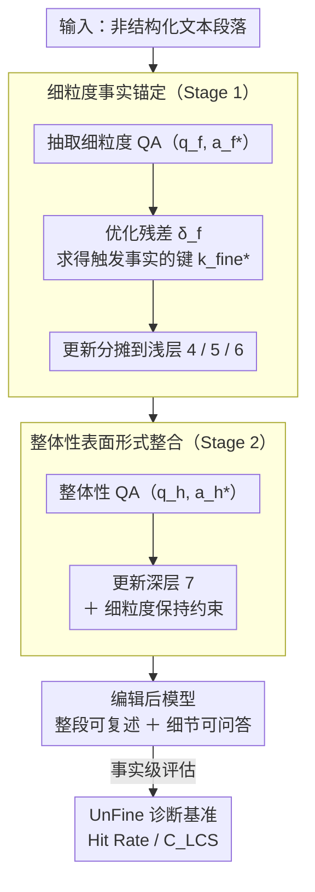

# FABLE: Fine-grained Fact Anchoring for Unstructured Model Editing

**会议**: ACL 2026  
**arXiv**: [2604.12559](https://arxiv.org/abs/2604.12559)  
**代码**: [https://github.com/caskcsg/FABLE](https://github.com/caskcsg/FABLE)  
**领域**: 知识编辑 / LLM  
**关键词**: 模型编辑、非结构化知识、细粒度事实注入、层次化键值存储、UnFine基准

## 一句话总结
本文发现现有非结构化模型编辑方法虽能整体性回忆编辑文本但无法进行细粒度事实访问，提出FABLE框架通过两阶段层次化策略将细粒度事实锚定到浅层、整体性叙事整合到深层，并构建UnFine诊断基准进行系统评估。

## 研究背景与动机

**领域现状**：模型编辑旨在通过修改少量参数来更新LLM的特定知识。结构化编辑（如ROME、MEMIT）在<主语,关系,对象>三元组上取得了成功。近期的UnKE和AnyEdit将编辑扩展到非结构化文本——能让模型记住并整体性回忆完整段落。

**现有痛点**：现有非结构化编辑方法虽能整体性回忆编辑文本，但无法支持细粒度事实访问。如图1所示，UnKE编辑后的模型能复述完整文本，但当问到文本中的具体细节时却无法给出准确答案。模型学到的是从问题到表面形式表示的高层映射，而非将底层原子事实编码到知识存储中。

**核心矛盾**：整体性回忆和细粒度事实访问之间存在不匹配。Transformer的单向信息流中，表面形式生成放大而非纠正底层事实表示——如果浅层没有正确编码事实，深层的叙事生成无法补救。

**本文目标**：设计能同时支持整体性文本回忆和细粒度事实访问的模型编辑方法。

**切入角度**：利用Transformer的"early decoding"现象——浅层擅长捕获局部细粒度特征，深层整合为全局语义表示。因此应该先在浅层锚定细粒度事实，再在深层进行表面形式整合。

**核心 idea**：将键生成器解耦为两级——细粒度事实键生成器（浅层，注入离散事实）和整体性语义键生成器（深层，整合为连贯叙事），实现"事实优先、生成在后"。

## 方法详解

### 整体框架

FABLE 想解决的是非结构化编辑"能整段复述、却答不出细节"的割裂：模型学到的是从问题到表面形式的高层映射，而非把底层原子事实真正写进知识存储。它的破题点是把 N 层 Transformer 的键生成器按层深拆成两级——浅层（层 1 到 $L_f$）的细粒度键生成器 $\mathcal{F}_{\text{fine}}$ 负责锚定离散事实，深层（层 $L_f+1$ 到 $L_h$）的整体性键生成器 $\mathcal{F}_{\text{hol}}$ 负责把事实整合成连贯叙事，最后由值生成器 $\mathcal{V}$（层 $L_h+1$ 到 N）输出。编辑因此走两阶段：先把细粒度事实注入浅层，再对深层做最小化调整以保证叙事流畅，并在第二阶段加约束防止覆盖第一阶段的事实信号。最后用 UnFine 诊断基准从事实级评估编辑效果。

### 关键设计

**1. 细粒度事实锚定（Stage 1）：把离散事实写进浅层，作为整条信息流的地基。** 

Transformer 的单向信息流决定了一旦浅层没把事实编码对，深层的叙事生成只会放大而非纠正错误，因此事实必须先被锚定在浅层。对每个细粒度 QA 对 $(q_f, a_f^*)$，FABLE 先优化一个残差向量 $\delta_f$，找到能触发目标事实的键 $k_{\text{fine}}^* = k_{\text{fine}} + \delta_f$；优化目标同时兼顾编辑效力（最后一个 token 的偏移指向目标答案）、前缀一致性（前 $n-1$ 个 token 保持不变）和局部性保持（无关样本不受影响）。求得偏移后，参数更新被分摊到层 4、5、6 三层，每层只承担一部分偏移，既把事实牢牢钉在浅层成为后续所有层的基础，又避免单层承受过大扰动而失稳。

**2. 整体性表面形式整合（Stage 2）：在已锚定事实之上补叙事，同时不抹掉事实信号。** 

光有浅层事实还不够，模型仍需在深层把这些事实组织成流畅的非结构化叙事。Stage 2 采用与 Stage 1 类似的优化，但只更新单层 $L_h=7$，并改用整体性 QA 对 $(q_h, a_h^*)$。关键区别在于它在编辑效力、前缀一致性、局部性保持之外，额外加了一项"细粒度保持约束"——要求更新 $\mathcal{F}_{\text{hol}}$ 时不覆盖 Stage 1 已注入的细粒度事实信号。正是这一项化解了两阶段之间的信号冲突：让叙事能力建立在事实之上，而不是把刚写好的事实重新冲刷掉。

**3. UnFine 诊断基准：用事实级指标把"理解事实"和"记住表面形式"分开。** 

现有评估只看整体性输出（ROUGE-L、BERT-Score），高分既可能来自真正理解、也可能只是背下了表面形式，二者无法区分。UnFine 在 UnKEBench、AKEW-CF、AKEW-MQ 三个非结构化编辑数据集之上，补充细粒度 QA 对并抽取关键知识短语，再设计两个事实级指标——Hit Rate（精确短语匹配）与 $C_{\text{LCS}}$（最长公共子序列覆盖率），直接检验模型是否真的掌握了编辑文本中的具体事实。它填补的正是非结构化编辑长期缺失的细粒度评估维度。

### 一个完整示例

以"把一段关于某人物的非结构化段落注入模型"为例：Stage 1 从段落里抽出若干细粒度 QA（如"此人出生于哪一年""任职于哪家机构"），逐一优化残差 $\delta_f$ 并把更新分摊到层 4、5、6，把这些原子事实钉进浅层；Stage 2 再用整体性 QA（如"请复述这段简介"）更新层 7，让模型能流畅复述整段，同时靠细粒度保持约束确保此前写入的出生年份、任职机构等不被覆盖。编辑完成后，模型既能整段复述（高 BERT-Score / ROUGE-L），也能在被追问具体细节时给出正确答案（高 Hit Rate / $C_{\text{LCS}}$）。

### 损失函数 / 训练策略

两阶段均为闭式优化。Stage 1 更新层 4、5、6，使用约 5 倍于种子 QA 数量的细粒度 QA；Stage 2 更新层 7，仅用 1 个整体性 QA。两阶段的局部性保持都依赖每个编辑样本配 20 个从 Alpaca 数据集随机采样的无关样本，确保编辑不外溢到不相关知识。

## 实验关键数据

### 主实验

| 方法 | 整体性(BERT-Score) | 整体性(Rouge-L) | 细粒度(HR) | 细粒度($C_{\text{LCS}}$) |
|------|-------------------|----------------|-----------|------------------------|
| UnKE | 高 | 高 | 低 | 低 |
| AnyEdit | 高 | 高 | 低 | 低 |
| FABLE | **高** | **高** | **显著提升** | **显著提升** |

### 消融实验

| 配置 | 整体性 | 细粒度 | 说明 |
|------|--------|--------|------|
| Full FABLE | 高 | 高 | 两阶段完整 |
| 仅Stage 2 | 高 | 低 | 缺少细粒度锚定 |
| 仅Stage 1 | 低 | 高 | 缺少叙事整合 |
| w/o 细粒度保持约束 | 高 | 中 | Stage 2覆盖了部分事实信号 |

### 关键发现
- FABLE在保持SOTA整体性编辑性能的同时，大幅提升细粒度事实访问能力
- 现有方法的整体性回忆得分高但细粒度得分低，验证了"记住表面形式≠理解事实"的假设
- 将事实注入浅层（4-6层）优于深层，验证了"early decoding"现象的实用价值
- 细粒度保持约束对两阶段协同至关重要——没有它Stage 2会覆盖Stage 1的信号

## 亮点与洞察
- **整体回忆vs细粒度访问的区分**：指出了非结构化模型编辑中一个被忽视的根本问题——能复述文本≠理解文本中的事实。这个洞察可推广到RAG和知识增强等更广泛的领域。
- **层次化编辑的理论基础**：利用Transformer的信息流方向和early decoding现象，为"浅层事实+深层叙事"的设计提供了理论支撑。
- **UnFine基准的贡献**：提出的HR和$C_{\text{LCS}}$指标直接评估事实级别的编辑效果，比ROUGE/BERT-Score更精确。

## 局限与展望
- 目前需要手动或通过LLM提取细粒度QA对，增加了编辑流程的复杂性
- 层选择（4-6层用于事实、7层用于叙事）可能因模型架构而异
- 多次编辑后的累积效果未充分讨论
- 仅在单一模型架构上验证，跨架构适用性未知

## 相关工作与启发
- **vs ROME/MEMIT**：专注于结构化三元组编辑，FABLE扩展到非结构化文本的细粒度编辑
- **vs UnKE**：UnKE实现了整体性非结构化编辑，但缺乏细粒度事实访问。FABLE通过层次化解耦解决了这个问题
- **vs AnyEdit**：AnyEdit扩展了编辑的适用范围，但同样存在细粒度事实不可靠的问题

## 评分
- 新颖性: ⭐⭐⭐⭐⭐ 精准识别了非结构化编辑的核心局限，层次化解耦设计优雅
- 实验充分度: ⭐⭐⭐⭐ 三个数据集、多个基线、详细消融
- 写作质量: ⭐⭐⭐⭐⭐ 问题定义精确、理论分析透彻、方法描述清晰
- 价值: ⭐⭐⭐⭐ 对模型编辑领域有重要推进，UnFine基准将推动更精确的评估

<!-- RELATED:START -->

## 相关论文

- [\[ICLR 2026\] Fine-tuning Done Right in Model Editing](../../ICLR2026/knowledge_editing/fine-tuning_done_right_in_model_editing.md)
- [\[ACL 2026\] HiEdit: Lifelong Model Editing with Hierarchical Reinforcement Learning](hiedit_lifelong_model_editing_with_hierarchical_reinforcement_learning.md)
- [\[ACL 2026\] The Model Agreed, But Didn't Learn: Diagnosing Surface Compliance in Large Language Models](the_model_agreed_but_didn39t_learn_diagnosing_surface_compliance_in_large_langua.md)
- [\[ACL 2026\] CLaRE-ty Amid Chaos: Quantifying Representational Entanglement to Predict Ripple Effects in LLM Editing](clare-ty_amid_chaos_quantifying_representational_entanglement_to_predict_ripple_.md)
- [\[AAAI 2026\] Model Editing as a Double-Edged Sword: Steering Agent Ethical Behavior](../../AAAI2026/knowledge_editing/model_editing_as_a_double-edged_sword_steering_agent_ethical_behavior_toward_ben.md)

<!-- RELATED:END -->
