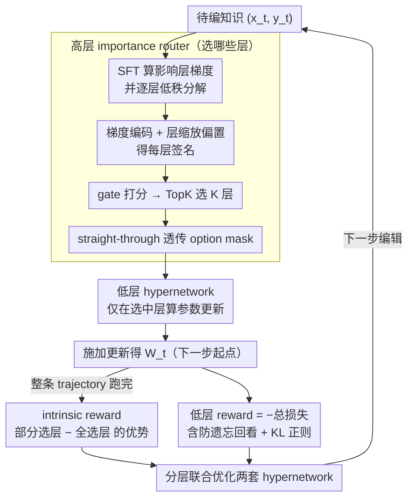

# HiEdit: Lifelong Model Editing with Hierarchical Reinforcement Learning

**会议**: ACL 2026  
**arXiv**: [2604.11214](https://arxiv.org/abs/2604.11214)  
**代码**: https://github.com/yangfanww/hiedit  
**领域**: 知识编辑 / 终身学习 / 分层强化学习  
**关键词**: lifelong model editing, hierarchical RL, hypernetwork, layer selection, sparse update

## 一句话总结
HiEdit 用分层强化学习把"终身模型编辑"拆成 high-level 选层 + low-level 算梯度更新两个子任务，让 hypernetwork 按知识自适应地只动一半的层，把强基线 RLEdit 平均再提 8.48%。

## 研究背景与动机

**领域现状**：终身模型编辑（Lifelong Model Editing, LME）要在不重训的前提下对部署中的 LLM 持续注入新知识。主流范式是"先定位再编辑"：先确定影响层 $\mathcal{W}$，再施加扰动 $\tilde{\nabla}_{\mathcal{W}}$；近期 RLEdit 把整个序列编辑建模成 RL 任务，让 hypernetwork 通过 PPO 风格优化跨越上万次编辑。

**现有痛点**：所有现存方法都把扰动施加在"静态、稠密"的一组层上——不管要编的是哪条知识，都对同一批层（往往是 5–7 层 MLP）做更新。在 Llama-3-8B 上跑 ZsRE 序列编辑，5000 步后泛化能力和过往编辑都开始崩塌（catastrophic forgetting）。

**核心矛盾**：研究已表明不同知识激活 LLM 中不同组件，但"locating"阶段给所有 instance 用同一套层，相当于过度修改了与当前知识无关的参数；同时也把 hypernetwork 的优化空间不必要地收紧到一个次优解上。

**本文目标**：把"该编哪些层"从离线一次定好的静态决策，变成对每条知识的可学习动态决策。

**切入角度**：把 LME 从扁平的 MDP 升级为 Hierarchical MDP——高层 option 选层，低层 action 算参数更新，离散选层和连续更新分离开训练。

**核心 idea**：用分层 RL 把"where to edit"和"how to edit"解耦，并加一个 intrinsic reward 鼓励稀疏选层，做到 instance-aware、localized 的精准编辑。

## 方法详解

### 整体框架
HiEdit 把每一步终身编辑建模成一个 Hierarchical MDP $(\mathcal{S}, \mathcal{A}, \Omega, \mathcal{P}, r, \gamma)$，核心是把"该编哪些层"和"每层怎么改"拆成两个由不同 hypernetwork 负责的子任务。在第 $t$ 步，先对待编知识 $(x_t, y_t)$ 做一次标准 SFT，拿到所有影响层的梯度矩阵 $\nabla \mathcal{W}_t = \{\nabla \mathcal{W}_{t,1}, \dots, \nabla \mathcal{W}_{t,L}\}$ 并逐层低秩分解为 $\nabla \mathcal{W}_{t,l} = v_l u_l^\top$；高层 hypernetwork $\pi_\phi$ 读这组梯度信号、吐出一个只激活 $K$ 个层的 option mask $\omega_t \in \{0,1\}^L$；低层 hypernetwork $\mathcal{H}_\theta$ 只在被点亮的层上算真正的参数更新 $\tilde{\nabla} \mathcal{W}_{t,l} = \tilde v_l \tilde u_l^\top$。整条编辑轨迹跑完后，再按高/低两层各自的 reward 联合回传，更新这两套 hypernetwork。

### 关键设计

**1. 高层 importance router：让"选哪些层"变成可学习的动态决策**

终身编辑里最隐蔽的浪费是"locating"阶段对所有知识都用同一批稠密的层，等于把大量无关参数也一起改了。HiEdit 把每层的梯度签名 $(u_l \| v_l)$ 先过一个 layer-shared 的梯度编码器 $\mathbf{W}_{\text{GradEnc}}$，再叠上 layer-specific 的缩放与偏置 $\mathbf{SPE}_l$ 得到 $h_l$，所有 $h_l$ concat 后送进 gate network 输出打分 $z_t \in \mathbb{R}^L$，最后 $\mathbf{TopK}(z_t, K)$ 只保留得分最高的 $K$ 层产生 mask $m_t$。这样不同知识可以走不同的层路径，而不是离线一次定死。难点在于 TopK 是离散的、挡住了梯度，HiEdit 借用 MoE 的 straight-through estimator $m_t = \mathbf{sg}(m_t - z_t) + z_t$，前向用硬 mask、反向把梯度直接透传回 $z_t$，让选层决策仍可端到端学习。

**2. Intrinsic reward：用"部分 vs. 全部"的相对优势逼出稀疏**

直接给高层写一个"选得越少越好"的稀疏惩罚很难调系数，也容易牺牲编辑质量。HiEdit 改成让高层 reward 等于部分选层相对全选层的优势 $r_{\text{high},t} = r_{\text{low}}(s_t, \omega_t, a_t) - r_{\text{low}}(s_t, \mathbf{1}, a_t)$，其中 $\mathbf{1}$ 表示全选。只有当"只动 $K$ 层"的编辑损失不差于"动全部层"时，高层才拿到正 reward。这本质上是在学一个"这层对当前这条知识到底有没有用"的因果对比信号，天然鼓励稀疏却不掉点——消融里去掉这个相对优势、改成最大化绝对 reward，高层就退化成全选、整套方法塌回 RLEdit。

**3. 分层联合优化与防遗忘正则：让探索的高层和利用的低层互相校正**

低层 reward 取负的总损失 $r_{\text{low},t} = -\mathcal{L}_t$，其中 $\mathcal{L}_t = \eta \|\tilde{\nabla} \mathcal{W}_t\|^2 + \sum_{i=t-k}^t \mu^{t-i} \mathcal{L}_{t,i}$，单步损失 $\mathcal{L}_{t,i} = -\log p_{\mathcal{W}_t}(y_i|x_i) + \tilde\lambda \mathrm{KL}[p_{\mathcal{W}_{t-1}}(\cdot|\tilde x_i) \| p_{\mathcal{W}_t}(\cdot|\tilde x_i)]$。它一边回看过去 $k$ 步编辑做 memory backtracking 防遗忘，一边用 KL 项约束无关输入的分布尽量不动。两套 hypernetwork 各按累积折扣 reward $\sum \gamma^t r_{\beta,t}$ 优化，且取 $\gamma=1$ 让整条长序列里每一步权重一致。因为稀疏 mask 已经截断了普通梯度回传，只有把 straight-through 透传和这套联合优化合在一起，high-level 的探索（选层）和 low-level 的利用（算更新）才能彼此对齐。

### 损失函数 / 训练策略
训练与推理共用同一个 TopK 的 $K$，强制 sparsity-consistency，避免"训练稠密、推理稀疏"带来的分布偏移；每条编辑序列也是跑完整条 trajectory 再做 trajectory-level 的梯度回传，比逐步更新更稳定。

## 实验关键数据

### 主实验
在 Llama-3-8B 与 Gemma-2-9B 两个底座、ZsRE 与 CounterFact 两个数据集、20000 次长程序列编辑下，HiEdit 对比 11 种基线（FT、ROME、MEMIT、PRUNE、RECT、AlphaEdit、MEND、MALMEN、DAFNet、RLEdit 等）。指标包括 Efficacy / Generalization / Specificity / Retention。

| 模型 | 方法 | ZsRE-Eff. | ZsRE-Gen. | ZsRE-Spe. | ZsRE-Ret. | CounterFact-Eff. |
|------|------|-----------|-----------|-----------|-----------|------------------|
| Llama-3-8B | RLEdit | 81.43 | 79.49 | 42.73 | 70.72 | 66.35 |
| Llama-3-8B | HiEdit (rand) | 81.95 | 79.63 | 47.97 | 74.66 | 66.40 |
| Llama-3-8B | HiEdit (full) | **82.10** | **79.99** | **48.42** | **75.16** | **66.53** |
| Gemma-2-9B | AlphaEdit | 15.79 | 15.32 | 20.21 | 13.19 | 38.17 |
| Gemma-2-9B | RECT | 11.26 | 11.25 | 16.19 | 9.62 | 30.72 |

在长程编辑设置下，AlphaEdit / ROME / MEMIT 在 Gemma-2-9B 上多数掉到 0，HiEdit 在 ZsRE 上把 RLEdit 的平均得分再提 8.48%，且每次只动一半层（$K=L/2$）。

### 消融实验

| 配置 | 关键效果 | 说明 |
|------|---------|------|
| HiEdit-full | 82.10 / 75.16 | 训练 + 推理都用学到的 TopK mask |
| HiEdit-rand | 81.95 / 74.66 | 推理时换成随机 mask（同 K）→ 仍优于 RLEdit，但 Retention 掉 0.5 |
| RLEdit (dense, all layers) | 81.43 / 70.72 | 不做选层，Retention 显著下降 |
| Static fixed K layers | < 81 | 固定一组层（非学得），明显劣于 HiEdit |

### 关键发现
- intrinsic reward 是关键：去掉相对优势奖励（直接最大化绝对 reward），高层倾向选所有层退化为 RLEdit。
- 随机 mask 也能拿到大部分增益，说明稀疏更新本身就缓解了过修改；而学得的 mask 在 Retention（过往编辑保留率）上额外多 0.5–1 分。
- 在 20k 步长程编辑下，传统 closed-form 方法（PRUNE/RECT）直接归零，hypernetwork 系（RLEdit、HiEdit）能撑住——印证了"参数更新空间需要更结构化的探索"。

## 亮点与洞察
- **把 MoE 的 router 思想搬进 LME**：编辑器和 MoE 一样面对"该路由到哪个专家/层"问题，gate + straight-through 几乎可以无缝迁移，是个很优雅的跨任务复用。
- **Intrinsic reward 的设计**：用"部分 vs. 全部"的相对优势替代绝对稀疏惩罚，避免了 hand-tune sparsity coefficient，给所有"想学稀疏 mask"的任务提供了模板。
- **解耦 where / how 的训练范式**：分层 MDP 把原本扁平的 $\{0,1\}^L \times \mathbb{R}^{d \times d}$ 巨大动作空间拆开，让 high-level 用 RL，low-level 走梯度，是 RL+SL 混合优化的一个干净例子。

## 局限与展望
- 高层 router 只看本步梯度信号，没有显式的"过往编辑历史"输入；长程下能否一直保持对历史 mask 分布的稳定，论文只跑到 20k 步。
- $K$ 是固定超参（实验用 $K=L/2$），没有让模型自适应决定每步该激活多少层；理想方法应该让 $K$ 也是 learnable。
- 只在 hypernetwork 系上验证；和 closed-form 方法（如 AlphaEdit）能否结合，尚未尝试。

## 相关工作与启发
- **vs RLEdit**：把扁平 RL 升级为分层 RL，新增可学习的 layer selection；同样的 hypernetwork 主干换上 HiEdit 框架就直接涨点。
- **vs AlphaEdit / MEMIT (closed-form)**：闭式解方法在长程编辑下容易爆炸，HiEdit 走的是可学习路径，更适合 LME 这种 streaming 场景。
- **vs MoE routing**：思想同源（gate + TopK + straight-through），但目标从"专家选择"换成"知识相关层选择"。

## 评分
- 新颖性: ⭐⭐⭐⭐ 首个把 LME 建模成分层 MDP 的工作，intrinsic reward 设计也有巧思。
- 实验充分度: ⭐⭐⭐⭐ 覆盖 2 个底座 × 2 个数据集 × 11 个基线，长程编辑设置足够严苛。
- 写作质量: ⭐⭐⭐⭐ HRL 的 motivation 讲得清晰，公式编号略多但逻辑顺畅。
- 价值: ⭐⭐⭐⭐ 长程模型编辑是部署侧刚需，能稳过 5k 步遗忘点的方法不多。

<!-- RELATED:START -->

## 相关论文

- [\[CVPR 2026\] SAME: Sparse and Anchored Model Editing for Heterogeneous Incremental Learning under Limited Data](../../CVPR2026/knowledge_editing/same_sparse_and_anchored_model_editing_for_heterogeneous_incremental_learning_un.md)
- [\[NeurIPS 2025\] MEMOIR: Lifelong Model Editing with Minimal Overwrite and Informed Retention for LLMs](../../NeurIPS2025/knowledge_editing/memoir_lifelong_model_editing_with_minimal_overwrite_and_informed_retention_for_.md)
- [\[ACL 2026\] Representation Interventions Enable Lifelong Knowledge Memory Control in LLMs](representation_interventions_enable_lifelong_knowledge_memory_control_in_llms.md)
- [\[ICLR 2026\] Rote Learning Considered Useful: Generalizing over Memorized Training Examples](../../ICLR2026/knowledge_editing/rote_learning_considered_useful_generalizing_over_memorized_training_examples.md)
- [\[ICML 2025\] WikiBigEdit: Understanding the Limits of Lifelong Knowledge Editing in LLMs](../../ICML2025/knowledge_editing/wikibigedit_understanding_the_limits_of_lifelong_knowledge_editing_in_llms.md)

<!-- RELATED:END -->
