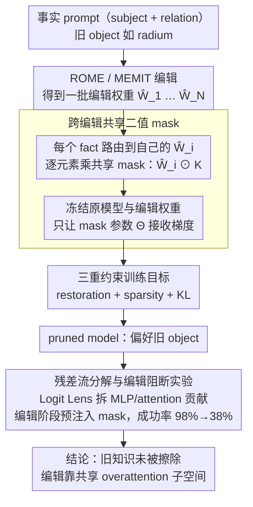

# One Mask to Rule Them All: On Hidden Facts after Editing and How to Find Them

**会议**: ACL2026 Findings  
**arXiv**: [2605.28839](https://arxiv.org/abs/2605.28839)  
**代码**: https://github.com/holmov1/one-mask-ke  
**领域**: 知识编辑 / 机制解释  
**关键词**: ROME, MEMIT, knowledge editing, binary mask, overattention

## 一句话总结
这篇论文发现 ROME / MEMIT 并没有真正覆盖旧知识，而是通过共享的过度注意力机制压制旧知识；一个稀疏二值 mask 就能反转多数编辑，并把新编辑成功率从 98% 降到 38%。

## 研究背景与动机

**领域现状**：知识编辑希望在不重新训练 LLM 的情况下更新特定事实。ROME 和 MEMIT 这类 locate-and-edit 方法会定位与目标事实相关的 MLP 权重并直接修改，被广泛解释为“把旧事实覆盖成新事实”。常见评估主要看输出行为：模型是否对编辑 prompt 输出新 object。

**现有痛点**：仅看输出行为并不能说明内部知识真的被改写。Transformer 的事实知识通常存在冗余路径和自修复机制，如果知识分布在多个层和路径中，为什么修改单层或少数连续层就能让模型稳定输出新事实？这与“知识被真正覆盖”的说法存在张力。

**核心矛盾**：如果 ROME / MEMIT 真在每个事实上引入事实特异更新，那么不同编辑应依赖不同权重位置；但如果多种编辑都能被同一个 mask 反转，就说明这些方法共享某种功能机制，而不只是各自写入新事实。

**本文目标**：作者想回答三个问题：单个 mask 能否反转大量不同 facts 的编辑；这个 mask 是否能泛化到未见过的编辑和关系；它反转编辑时到底破坏了什么内部机制。

**切入角度**：论文训练一个紧凑二值 mask，作用在编辑后的 MLP 权重矩阵上。mask 不重新训练原模型，不修改未编辑层，只学习“哪些编辑权重对维持编辑是必要的”。若少量权重置零就能恢复原事实，说明旧知识仍在模型中。

**核心 idea**：知识编辑成功依赖一个跨 facts 共享的 overattention 子空间；学习到的 mask 通过消除后续层过度注意力来恢复旧知识，而不是简单回滚最大权重变化。

## 方法详解

论文先用 ROME / MEMIT 对模型做事实编辑，再固定所有编辑权重，只训练一个二值 mask。这个 mask 被应用到编辑权重矩阵上，形成 pruned model。训练目标是：让 pruned model 更偏好原 object 而不是 edited object，同时尽量少剪权重，并保持整体语言建模分布接近原模型。

### 整体框架

给定原模型 $M$，一个事实 prompt $x$ 包含 subject 和 relation，例如 “Marie Curie discovered”，原 object 是 “radium”。知识编辑把 object 改成 $o^*$，得到编辑模型 $M_e$。论文在一批不同 facts 上得到一组编辑后的权重矩阵 $\{\hat{W}_1, \ldots, \hat{W}_N\}$，并学习共享 mask $K$。

训练时，每个样本路由到自己对应的编辑矩阵 $\hat{W}_i$，然后与共享 mask 做逐元素乘积 $\hat{W}_i \odot K$。只有 mask 参数 $\Theta$ 接收梯度；原模型和编辑权重都冻结。这样训练出的 mask 不能记住某个单独 fact，而必须捕捉多种编辑共同依赖的权重结构。

实验使用 CounterFact。ROME 实验在单个编辑上训练 mask；MEMIT 支持 batch editing，作者一次编辑 1,000 个 facts，并只在单个编辑层上训练 mask。模型包括 GPT-2 XL (1.5B)、LLaMA-3.2 (3B) 和 Qwen2.5 (7B)。训练集 3,000 个 samples，覆盖 10 个 relations；测试集为 1,700 个 held-out samples。部分 OOD 实验还额外使用 1,000 个 ROME edits 和 10 个未见 relations。

### 关键设计

**1. 跨编辑共享二值 mask：用同一个 mask 检验不同编辑是不是依赖同一组权重位置**

如果知识编辑真是事实特异的，每个 fact 应该写在不同的权重上，一个共享 mask 就不该泛化。论文反过来用这点做判据：训练一个二值 mask，值为 1 表示保留编辑权重、0 表示移除它的贡献，并让同一个 $K$ 同时作用到一批不同 facts 的编辑矩阵上，训练中只有 $K$ 接收梯度、原模型和编辑权重全部冻结。这样 mask 没法死记某一个 fact，只能去捕捉多种编辑共同依赖的权重结构——一旦它能反转甚至阻断没见过的编辑，就说明 ROME / MEMIT 走的是一条共享机制，而非各写各的新事实。

**2. 三重约束训练目标：让 mask 恢复旧事实的同时别把模型剪坏**

只追求“反转编辑”很容易退化成直接把模型剪崩，靠破坏语言建模来“恢复”旧答案。论文给训练目标加了三股力：restoration loss 要求 pruned model 给原 object 的概率高于 edited object；sparsity loss 限制被剪权重的比例；KL preservation loss 把 pruned model 的输出分布拉回原模型附近。综合目标写成 $\mathcal{L}_{KL}+\max(0,\mathcal{L}_{sparsity}-S_{max})+\max(0,\mathcal{L}_{restoration}+\delta)$，稀疏和 KL 两个约束逼着 mask 去定位真正维持编辑的少量关键通路，而不是为了把概率掰回来牺牲整体能力。

**3. 残差流分解与编辑阻断实验：证明 mask 消除的 overattention 既能解释反转、又是编辑成功的必要条件**

高 RSR 只能说明 mask 管用，说不清它为什么管用。论文用 Logit Lens 把 residual stream 中 MLP 与 attention 对目标 token logit 的贡献拆开，对照 original、edited、pruned 三种模型，发现编辑后 MLP 路径仍大体保留旧知识轨迹，真正被异常放大的是后续 attention，mask 的作用正是抹掉这些 attention spikes。为了进一步证明这条子空间不是旁观者，作者还在编辑过程中预先注入 mask，看 ROME 能不能绕开它完成新编辑——结果编辑成功率从 98% 掉到 38%，说明这个 overattention 子空间对编辑成功本身就是必要的。

### 损失函数 / 训练策略

二值 mask 不可微，因此作者初始化可训练参数 $\Theta$，经 sigmoid 得到 soft mask $K \in (0,1)$；推理时用阈值 $\gamma$ 二值化。Restoration loss 形式为 $\mathcal{L}_{restoration}=-[\log P_{M_p}(o|x)-\log P_{M_p}(o^*|x)]$，并用 margin $\delta$ 鼓励原 object 明显优于 edited object。Sparsity loss 计算被剪权重比例 $\frac{1}{|K|}\sum(1-k_{a,b})$，KL loss 约束行为保持。评估指标包括 Reversal Success Rate (RSR)、Top-1 Overlap 和 WikiText-2 perplexity。

## 实验关键数据

### 主实验

| 方法 | 模型 | 剪枝比例 | Train RSR / Top-1 | Test RSR / Top-1 | 原始 / 编辑 / mask 后 PPL | 观察 |
|------|------|----------|-------------------|------------------|---------------------------|------|
| ROME | GPT-2 XL | 10.0% | 83% / 78% | 82% / 77% | 17.80 / 44.51 / 25.68 | 少量剪枝恢复大部分编辑并修复 PPL 恶化 |
| ROME | LLaMA-3.2 | 10.0% | 90% / 75% | 79% / 72% | 9.46 / 9.59 / 10.14 | 编辑本身较稳定，mask 仍能反转 |
| ROME | Qwen-2.5 | 15.3% | 87% / 77% | 68% / 66% | 7.43 / 8.07 / 7.76 | 更大模型需要更高剪枝比例 |
| MEMIT | GPT-2 XL | 4.5% | 82% / 81% | 74% / 78% | 17.80 / 17.90 / 19.00 | 分布式编辑也依赖少量关键权重 |
| MEMIT | LLaMA-3.2 | 8.8% | 87% / 67% | 78% / 65% | 9.46 / 10.78 / 12.53 | test RSR 保持 78% |
| MEMIT | Qwen-2.5 | 7.9% | 88% / 67% | 70% / 60% | 7.43 / 7.66 / 7.74 | PPL 几乎不变但编辑仍可被反转 |

### 机制与消融分析

| 分析项 | 关键数字 | 结论 |
|--------|----------|------|
| 编辑后原事实残留 | 编辑模型 RSR / Top-1 大多接近 0 | 编辑在输出行为上确实成功覆盖旧答案 |
| ROME GPT-2 XL 概率放大 | 原模型原事实概率 0.045，编辑模型编辑事实概率 0.866，Cohen's d=3.78 | 编辑事实被异常强地推高 |
| MEMIT GPT-2 XL 概率放大 | 0.046 → 0.614，Cohen's d=1.54 | MEMIT 较温和但仍显著放大 |
| LLaMA-3.2 概率放大 | ROME: $2.46e{-5}$ → $1.96e{-4}$；MEMIT: $2.48e{-5}$ → $1.17e{-4}$ | 绝对概率低但方向一致 |
| 编辑阻断 | ROME editing success 从 98% 降到 38% | mask 指向的子空间对新编辑成功是必要的 |
| OOD relations | GPT-2 XL RSR 77%，LLaMA-3.2 RSR 59% | mask 不只是记住训练关系 |
| mask 结构 | GPT-2 XL 第 214 维 pruning 达 74.6%；LLaMA 第 1659 维达 62.0% | 剪枝集中在少数输出维度，但不是整列全删 |
| ΔW 幅度对比 | GPT-2 XL: edited 18.47 vs masked 1.85；LLaMA: 3.91 vs 0.57 | mask 不是简单剪最大权重更新，而是找功能路径 |

### 关键发现

- 单个 mask 能反转训练集 80% 左右编辑，也能在测试集和 OOD relations 上保持较高 RSR，这强烈支持“共享编辑机制”假设。
- 残差流分解显示，编辑后 MLP 路径仍大体保留旧知识轨迹，真正被放大的是后续 attention；mask 的作用是消除这些 attention spikes。
- 对 ROME，编辑可能显著破坏 PPL；mask 还能恢复部分语言建模能力，例如 GPT-2 XL 从 44.51 降到 25.68。对 MEMIT，PPL 本来变化小，但 mask 仍能反转编辑，说明编辑维持机制和整体困惑度损伤不是同一件事。

## 亮点与洞察

- 论文最有冲击力的结论是“编辑并未擦除知识”。旧事实仍在 MLP/残差路径中，只是被编辑引发的过度注意力压制，因而一个小 mask 可以让旧事实重新浮现。
- 用同一个 mask 泛化到不同 facts 和未见 relations 是很强的因果证据。它比单纯观察 attention drift 更进一步，因为它展示了阻断该结构会直接反转或阻止编辑。
- 这篇工作把以往被视为编辑副作用的 overattention 重新解释为编辑成功的核心机制。这个视角也解释了为什么 ROME / MEMIT 很难把更改传播到相关事实：它们压制检索，而不是更新知识图谱。
- mask 没有简单剪最大 $\Delta W$，而是剪一些更新幅度较小但功能关键的位置，这提示知识编辑防御不能只看权重变化大小。

## 局限与展望

- **方法范围集中在 locate-and-edit**：论文主要研究 ROME 和 MEMIT，未覆盖 AlphaEdit、MEND、MALMEN 等其他参数修改或 meta-learning 编辑方法。
- **未考虑 parameter-preserving 编辑**：检索记忆、外部 memory、in-context editing 等方法可能不依赖同一 MLP 权重子空间，mask 结论不能直接外推。
- **数据集以 CounterFact 为主**：CounterFact 是标准反事实编辑 benchmark，但真实世界知识更新、长上下文和多跳关联可能有不同内部机制。
- **mask 是防御线索但不是完整系统**：实际部署中要检测何时需要 mask、如何避免误伤合法更新、如何面对攻击者自适应绕过，仍需额外设计。
- **计算成本限制**：作者明确没有研究 meta-learning KE，原因是训练 editing hypernetworks 成本高。未来若资源允许，应比较不同编辑范式的内部机制。

## 相关工作与启发

- **vs ROME / MEMIT 原始假设**: ROME / MEMIT 建立在 MLP 层是 associative memory 的直觉上，认为直接改 MLP 权重能覆盖事实；本文显示输出改变更像 attention hijacking，而非真正覆盖知识。
- **vs attention drift / superficial editing 分析**: 既有工作把过度关注 edited entity 视作 specificity failure 或对抗 prompt 下恢复旧事实的原因；本文进一步说明 overattention 是编辑成功本身的结构机制。
- **vs edit detection 方法**: 已有工作从内部表征检测 edited facts；本文给出可能解释：不同编辑留下共享 attention signature，因此分类器能学到通用模式。
- **启发**：知识编辑评估不应只看 rewrite success，还要看相关事实传播、内部检索路径、attention/MLP 分解和可逆性。对安全防御而言，小型共享 mask 可能成为 open-weight 模型防恶意编辑的一种工具。

## 评分
- 新颖性: ⭐⭐⭐⭐⭐ 用共享 mask 反转和阻断编辑，直接挑战“知识被覆盖”的默认解释，机制洞察很强。
- 实验充分度: ⭐⭐⭐⭐☆ 覆盖 ROME/MEMIT、三种模型、train/test/OOD、PPL 和残差流分析；缺少更多编辑方法和真实知识更新场景。
- 写作质量: ⭐⭐⭐⭐☆ 论证链很清楚，表格数字有说服力；部分机制图需要结合正文理解。
- 价值: ⭐⭐⭐⭐⭐ 对知识编辑、安全防御和 mechanistic interpretability 都很有价值，尤其提醒社区重新审视 locate-and-edit 的能力边界。

<!-- RELATED:START -->

## 相关论文

- [\[ACL 2025\] CKnowEdit: A New Chinese Knowledge Editing Dataset for Linguistics, Facts, and Logic Error Correction in LLMs](../../ACL2025/knowledge_editing/cknowedit_chinese_knowledge_editing_dataset_llms.md)
- [\[ACL 2025\] ChainEdit: Propagating Ripple Effects in LLM Knowledge Editing through Logical Rule-Guided Chains](../../ACL2025/knowledge_editing/chainedit_propagating_ripple_effects_in_llm.md)
- [\[ACL 2025\] Efficient Knowledge Editing via Minimal Precomputation](../../ACL2025/knowledge_editing/efficient_knowledge_editing.md)
- [\[ICLR 2026\] EAMET: Robust Massive Model Editing via Embedding Alignment Optimization](../../ICLR2026/knowledge_editing/eamet_robust_massive_model_editing_via_embedding_alignment_optimization.md)
- [\[NeurIPS 2025\] Rethinking Residual Distribution in Locate-then-Edit Model Editing](../../NeurIPS2025/knowledge_editing/rethinking_residual_distribution_in_locate-then-edit_model_editing.md)

<!-- RELATED:END -->
