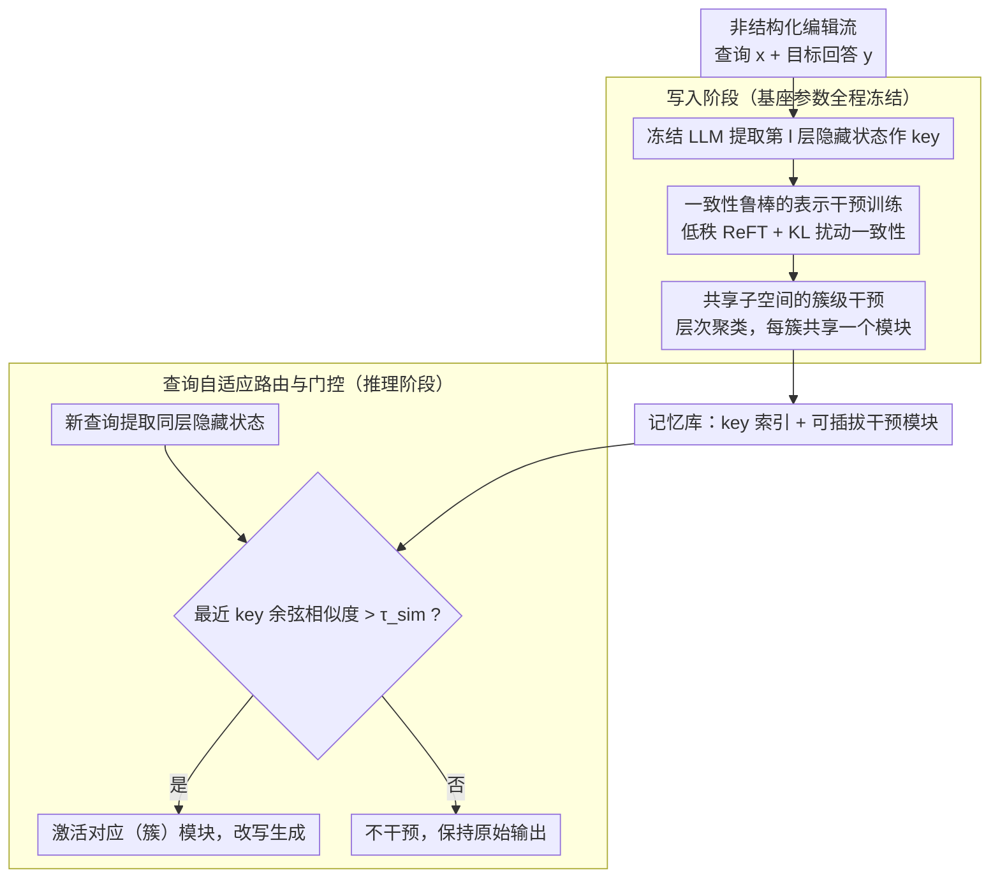

# Representation Interventions Enable Lifelong Knowledge Memory Control in LLMs

**会议**: ACL2026  
**arXiv**: [2511.20892](https://arxiv.org/abs/2511.20892)  
**代码**: 未公开  
**领域**: knowledge_editing  
**关键词**: 知识编辑、表示干预、终身记忆控制、路由器、低秩子空间

## 一句话总结
这篇论文提出 RILKE，把终身知识编辑从“改模型权重”转成“在隐藏表示空间施加低秩干预”，通过鲁棒训练、查询自适应路由和共享子空间模块，在 1,000 次非结构化知识编辑后仍保持接近满分的编辑成功率和较好的泛化能力，同时显著降低存储开销。

## 研究背景与动机
**领域现状**：LLM 的参数知识一旦训练完成就很难随现实世界更新。常见方案包括继续预训练、检索增强生成和模型编辑：继续训练成本高且容易遗忘；RAG 不改参数，但会受检索质量和参数记忆冲突影响；模型编辑试图直接改变模型内部知识，适合低成本修正错误事实。

**现有痛点**：许多编辑方法仍围绕结构化三元组，例如“某主体的某属性是什么”。现实知识更新却经常是非结构化、长文本、带上下文的自由回答。更麻烦的是，部署后的模型会持续接收新编辑，单次有效不代表多次累积后还能稳定：权重编辑会出现 edit collapse，外部记忆模块也可能因为容量和路由不准而互相干扰。

**核心矛盾**：终身知识控制同时要求三个目标：每条编辑要足够精确，不能污染无关问题；同义改写要能触发同一条编辑；编辑数量增长时，存储和训练成本不能线性爆炸。现有方法通常只能兼顾其中一两项。

**本文目标**：作者希望把复杂非结构化知识以可累积、可路由、可压缩的方式写入 LLM，使模型权重保持冻结，同时在推理时只激活与当前问题相关的知识干预。

**切入角度**：论文从隐藏表示几何出发，观察到语义相近的问题在中间层表示中距离更近，而且相近知识独立训练出的 ReFT 干预子空间也更对齐。这说明知识编辑不一定要改权重；如果能在表示空间中找到局部低维方向，就可以像“可插拔记忆”一样控制模型输出。

**核心 idea**：用“隐藏表示索引 + 低秩表示干预模块 + 相似度路由”管理终身知识，每个查询先在冻结模型的表示空间中找对应记忆，再只对相关表示施加局部干预。

## 方法详解

### 整体框架
RILKE 不去训练一个新的知识库模型，而是把冻结 LLM 的某个中间层表示空间当成一个稳定的"检索索引"，并在其上挂载一批可路由、可插拔的低秩干预模块。输入是一串持续到来的非结构化编辑样本，每条由查询 $x$ 和目标回答 $y$ 组成；系统先用冻结模型提取每条查询在指定层的隐藏状态作为 key、并为它（或它所属的语义簇）训练一个 ReFT 风格干预模块，使模型在不改原权重的前提下生成目标回答；推理时对新查询提取同层表示，用余弦相似度检索最近的 key，相似度超过门控阈值就激活对应模块、否则保持原始输出。整套流程把终身编辑拆成"稳定的 key 空间 + 可插拔的 value 模块"，从根上绕开了多次权重编辑导致的参数漂移。

### 关键设计

**1. 一致性鲁棒的表示干预训练：把一条编辑从"一个点"撑成"一个语义邻域"**

如果只在原始问法上拟合目标回答，模块会过拟合表面措辞，换个 paraphrase 就失效。RILKE 沿用 ReFT 的低秩干预形式，在隐藏状态 $h$ 上学一个由 $R,A,b$ 参数化的变换 $\Phi(h)=h+R^\top(Ah+b-Rh)$。关键假设是 paraphrase 的隐藏状态会落在原查询附近的 $\epsilon$-ball 内，于是训练时主动对表示加扰动，并用一个 KL 项约束原分布与扰动分布的输出一致，总目标为语言建模交叉熵加上鲁棒正则 $\lambda_{robu}\,\mathrm{KL}(p(h)\|p(h+\epsilon))$。这相当于一种廉价的数据增强：不用真去采集大量 paraphrase，仅靠隐藏空间邻域内的输出一致性，就把编辑从单点扩成局部区域——消融显示它主要拉高 paraphrase 泛化而几乎不损原始查询成功率。

**2. 共享子空间的簇级干预：把"每条知识一块内存"压成"每簇一块内存"**

逐条挂 adapter 会让存储随编辑数线性膨胀。RILKE 先对层表示做层次凝聚聚类（要求簇内相似度高于阈值、簇大小不超上限），再为每个语义簇训练一个共享干预模块；推理时仍先找到最近的知识项，再映射到它所属簇的共享模块。这个压缩不是蛮力合并，而是建立在"语义相近知识的 ReFT 干预子空间也更对齐"这一经验性质上——把不相似知识硬塞进同一簇反而会把编辑向量推偏。实测共享版把 UnKE 存储从单条版的约 43% WISE 进一步压到约 13%，只付出有限的 paraphrase 泛化损失。

**3. 查询自适应路由与门控：在海量编辑里选对模块，并挡住无关问题**

训练后把每条编辑查询的层表示 $h_x^l$ 存成 key。推理时新查询表示 $h_{\hat{x}}^l$ 与所有 key 做余弦相似度，路由到最近的模块；若最大相似度低于阈值 $\tau_{sim}$（实验取 0.9）则不施加任何干预，从而压制 spurious activation。这一步之所以成立，是因为基座被冻结后 key 空间不会随后续编辑漂移，而语义相近的问题天然在该空间里靠得更近，paraphrase 因此能被送回同一条记忆。

### 损失函数 / 训练策略
RILKE 冻结 LLaMA-3.1-8B-Instruct 或 Qwen2.5-7B-Instruct，只训练表示干预模块。单条知识用 teacher forcing 的自回归交叉熵，并叠加隐藏表示扰动后的 KL 一致性正则；共享子空间版本先按隐藏状态聚类、再在簇内 batch 训练一个模块。推理用确定性生成，编辑评估采用 Rouge-L、BertScore、MMLU 保留率，以及 ZsRE 上的 reliability / generalization / locality 指标。

## 实验关键数据

### 主实验
UnKE 是主要非结构化知识编辑基准。下面保留 LLaMA-3.1-8B-Instruct 上最关键的 1,000 次顺序编辑结果；RILKE 在原始查询上几乎满分，在 paraphrase 上也明显优于 WISE、GRACE 等长期编辑基线，同时 MMLU 保留接近未编辑模型。

| 方法 | 1,000 edits 原查询 BertS↑ | 1,000 edits paraphrase BertS↑ | MMLU↑ | ZsRE Avg↑ | 主要现象 |
|------|---------------------------|-------------------------------|-------|----------|----------|
| MEMIT | 0.033 | 0.034 | 0.188 | 0.00 | 累积编辑后明显崩溃 |
| GRACE | 0.810 | 0.521 | 0.594 | 0.49 | 原查询尚可，泛化不足 |
| WISE | 0.681 | 0.673 | 0.584 | 0.73 | 稳定但编辑精度有限 |
| RILKE | 1.000 | 0.963 | 0.622 | 0.88 | 高编辑成功率、高 paraphrase 泛化、低 utility 损失 |

存储成本也体现了 representation intervention 的轻量性。RILKE 单条模块已经比 WISE 省内存，共享子空间进一步把开销压到约三分之一。

| 方法 | UnKE 存储成本 | 相对 WISE | 说明 |
|------|---------------|-----------|------|
| WISE | 224.0 MiB | 100% | 存储外部记忆/子模块 |
| RILKE (Individual) | 96.1 MiB | 42.9% | 每条知识一个低秩干预模块 |
| RILKE (Shared) | 29.4 MiB | 13.1% | 每个语义簇共享一个模块 |

### 消融实验
鲁棒训练项主要提升 paraphrase 泛化，而不会损害原始查询编辑成功率。共享子空间则带来明显压缩，只付出有限泛化损失。

| 配置 | T=100 原查询 BertS↑ | T=100 paraphrase BertS↑ | T=1,000 原查询 BertS↑ | T=1,000 paraphrase BertS↑ |
|------|--------------------|--------------------------|----------------------|----------------------------|
| w/o $\mathcal{L}_{robu}$ | 1.000 | 0.959 | 0.999 | 0.909 |
| w/ $\mathcal{L}_{robu}$ | 1.000 | 0.984 | 1.000 | 0.963 |

| 配置 | 原查询 BertS↑ | paraphrase BertS↑ | MMLU↑ | 说明 |
|------|----------------|--------------------|-------|------|
| RILKE (Individual) | 1.000 | 0.963 | 0.622 | 精度和泛化最好 |
| RILKE (Shared) | 0.999 | 0.901 | 0.621 | 泛化略降，但存储大幅降低 |
| Batched RILKE | 1.000 | 0.834 | - | 簇内联合训练效果更强 |
| Sequential RILKE | 0.742 | 0.723 | - | 严格在线逐条吸收仍优于 AnyEdit/UnKE |

### 关键发现
- 表示空间的语义局部性是真正的支点：paraphrase 和原查询距离更近，给路由和鲁棒训练提供了共同基础。
- 共享子空间不是简单压缩技巧，而是建立在“相似知识的干预方向也相似”这个经验性质上；随机把不相似知识 batch 到一起会明显推偏编辑向量。
- RILKE 的强项在长尾、非结构化和多次累积编辑，尤其适合把“模型上线后持续接收新知识”作为核心场景。

## 亮点与洞察
- 最巧妙的是把知识编辑拆成“稳定 key 空间”和“可插拔 value 模块”。冻结基座模型后，中间层表示成为一个可检索索引，避免了多次权重编辑导致的参数漂移。
- 鲁棒 KL 正则很像把单点编辑扩展为语义邻域编辑。它没有显式收集大量 paraphrase，也能提高 paraphrase 表现，说明隐藏空间扰动可以作为一种廉价的数据增强。
- 共享子空间给 lifelong editing 提供了可扩展方向。未来如果结合在线聚类、adapter 合并或周期性重训练，就可以把新知识先单条写入，再在后台合并到簇级模块。
- 这篇论文也提醒我们，知识编辑不一定要追求“把事实永久写进参数”。在很多应用里，可撤销、可路由、可审计的表示干预可能更符合工程需求。

## 局限与展望
- 作者明确把系统性风险分析留给未来工作，包括恶意编辑、偏见放大和带偏编辑策略下的鲁棒性。
- 路由阈值是核心超参。阈值过低会误激活无关知识，过高会漏掉 paraphrase；大规模开放域场景下可能需要校准、置信度估计或多级检索。
- RILKE 需要访问并存储目标层隐藏表示，还要为目标模型单独训练干预模块；换模型或换层后，已有模块不能直接迁移。
- 共享子空间会牺牲一部分 paraphrase 泛化，说明相似知识之间仍可能存在细粒度冲突。后续可以考虑簇内 mixture-of-adapters、动态 rank 或冲突检测。
- 论文的编辑效果很强，但对安全边界、可撤销性、审计日志和权限控制讨论较少；这些会决定它能否用于真实知识管理系统。

## 相关工作与启发
- **vs ReFT**: ReFT 提供低秩表示干预的基础形式，RILKE 把它扩展到知识编辑，并加入 paraphrase 鲁棒性、路由和终身累积管理。
- **vs MEMIT / locate-then-edit**: MEMIT 等方法直接修改权重，适合单次或少量事实编辑；RILKE 冻结权重，用模块化干预避免多次编辑后的 edit collapse。
- **vs GRACE / WISE**: 这些外部记忆方法也保留原模型参数，但通常在单一子模块或外部内存中学习控制；RILKE 用隐藏表示 key 做精细路由，并通过低秩模块降低存储。
- **vs RAG**: RAG 在文本层插入检索证据，容易受检索失败和参数知识冲突影响；RILKE 在表示层直接改变生成轨迹，更像对模型内部状态做条件化控制。

## 评分
- 新颖性: ⭐⭐⭐⭐⭐ 从表示几何、路由和共享子空间三方面重构 lifelong knowledge editing，思路完整且有辨识度。
- 实验充分度: ⭐⭐⭐⭐ 覆盖 UnKE、EditEverything、ZsRE、MMLU 和多种消融，但真实开放域安全性还需要更系统评估。
- 写作质量: ⭐⭐⭐⭐ 动机和方法链条清晰，表格充分；部分几何性质与工程超参之间的关系还可以解释得更细。
- 价值: ⭐⭐⭐⭐⭐ 对终身知识更新、企业知识定制和可控模型记忆都有直接启发，尤其适合需要可插拔编辑的场景。

<!-- RELATED:START -->

## 相关论文

- [\[ICML 2025\] WikiBigEdit: Understanding the Limits of Lifelong Knowledge Editing in LLMs](../../ICML2025/knowledge_editing/wikibigedit_understanding_the_limits_of_lifelong_knowledge_editing_in_llms.md)
- [\[NeurIPS 2025\] MEMOIR: Lifelong Model Editing with Minimal Overwrite and Informed Retention for LLMs](../../NeurIPS2025/knowledge_editing/memoir_lifelong_model_editing_with_minimal_overwrite_and_informed_retention_for_.md)
- [\[NeurIPS 2025\] Edit Less, Achieve More: Dynamic Sparse Neuron Masking for Lifelong Knowledge Editing in LLMs](../../NeurIPS2025/knowledge_editing/edit_less_achieve_more_dynamic_sparse_neuron_masking_for_lifelong_knowledge_edit.md)
- [\[ACL 2026\] HiEdit: Lifelong Model Editing with Hierarchical Reinforcement Learning](hiedit_lifelong_model_editing_with_hierarchical_reinforcement_learning.md)
- [\[ICML 2025\] Representation Shattering in Transformers: A Synthetic Study with Knowledge Editing](../../ICML2025/knowledge_editing/representation_shattering_in_transformers_a_synthetic_study_with_knowledge_editi.md)

<!-- RELATED:END -->
