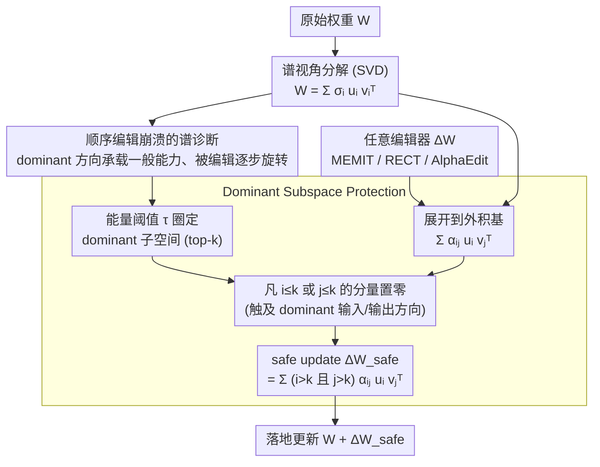

# Spectral Characterization and Mitigation of Sequential Knowledge Editing Collapse

**会议**: ACL2026  
**arXiv**: [2601.11042](https://arxiv.org/abs/2601.11042)  
**代码**: 无公开代码  
**领域**: 知识编辑 / LLM可靠性 / 参数高效修正  
**关键词**: 顺序知识编辑、谱分析、奇异子空间、模型崩溃、REVIVE

## 一句话总结
论文从 SVD 谱结构解释顺序知识编辑为何会让 LLM 一般能力崩溃，并提出 REVIVE，在原始权重的奇异向量基中滤除会干扰 dominant singular subspace 的更新分量，使 MEMIT、RECT、AlphaEdit 等编辑器在 10,000 到 20,000 次连续编辑下同时保持编辑成功率和通用能力。

## 研究背景与动机
**领域现状**：知识编辑希望在不重新训练 LLM 的情况下修改具体事实，例如把过时或错误知识替换为新知识。MEMIT、ROME、MEND 等参数修改方法在单次或少量编辑上表现强，近年又出现了面向顺序编辑的 RECT、PRUNE、AlphaEdit、NSE 等方法。

**现有痛点**：真实场景中编辑往往持续发生，而不是一次性修改一个事实。随着编辑次数增加，参数修改方法会逐渐损伤模型的一般能力，表现为 GLUE 等任务崩溃、生成流畅度下降、邻域知识被破坏，甚至编辑本身也失败。已有方法通常通过 update norm、历史编辑方向或外部协方差做约束，但缺少对崩溃机制的结构解释。

**核心矛盾**：编辑需要改变局部事实，但模型一般能力依赖预训练权重中高度组织化的全局结构。如果连续编辑不断扰动这些关键结构，即便每次更新看似很小，累积后也可能把模型推离原有功能子空间。

**本文目标**：作者希望回答两个问题：第一，模型一般能力在权重矩阵的哪些谱成分中集中；第二，能否设计一个与具体编辑器解耦的 wrapper，在不改变编辑目标的前提下保护这些关键谱方向。

**切入角度**：论文把 FFN 权重矩阵做 SVD，认为每个 rank-one component 是一个独立 input-output mapping。通过重构、扰动和顺序编辑过程监控，作者发现 dominant singular directions 既承载大量一般能力，又对扰动极其敏感。

**核心 idea**：顺序编辑崩溃来自 dominant singular subspace 被逐渐旋转和腐蚀；REVIVE 通过在原始 SVD 基中投影更新，并删除触及 dominant input/output directions 的分量，保护模型一般能力。

## 方法详解

### 整体框架
论文分"机制分析"和"干预方法"两部分：前者用 LLaMA3-8B 的 FFN 权重把一般能力和谱结构对应起来，后者据此提出与编辑器解耦的 plug-and-play wrapper——REVIVE。REVIVE 不改编辑器如何算更新，而是在更新落地前插一道谱过滤：给定任意编辑器产生的权重更新 $\Delta W$，先对原始权重 $W$ 做 SVD 得到左右奇异向量 $u_i,v_j$ 和奇异值 $\sigma_i$，用能量阈值 $\tau$ 圈出 dominant subspace，再把 $\Delta W$ 展开到这组外积基 $\sum_{i,j}\alpha_{ij}u_iv_j^\top$ 上，凡是触及 dominant input/output 方向的分量一律置零，只把更新留在低能谱区域，输出一个 safe update。

### 关键设计

**1. 谱视角解读权重作用：一般能力到底藏在哪**

REVIVE 的出发点是把 FFN 权重看成一组独立的 input-output mapping：对 $W$ 做 SVD 后 $W=\sum_i \sigma_i u_iv_i^\top$，每个 rank-one 分量把输入沿 $v_i$ 投影、按 $\sigma_i$ 缩放、再沿 $u_i$ 输出。作者只保留 top energy 分量重构权重去跑 GLUE，发现 top 5% 的奇异分量就能恢复约 62.6% 的原始性能。这把一个关键判断坐实了：一般能力高度集中在少量 dominant directions 上，因此顺序编辑真正的风险并不是更新范数大小，而是更新有没有撞到这些高能功能方向。

**2. 顺序编辑崩溃的谱诊断：把"编多了会坏"落到"dominant 方向被转走"**

为了验证崩溃机制，作者把谱按能量切成 0-10%、10-20% 等组，对不同组注入相同 Frobenius norm 的结构扰动：扰动高能组会让 GLUE F1 明显下降，扰动低能组几乎无影响。随后在 LLaMA3 上用 MEMIT 跑 2,000 次 COUNTERFACT 编辑、每 100 次一轮，同时跟踪 efficacy、paraphrase、GLUE、Low-rank Subspace Similarity 和 Singular Vector Similarity。结果显示 dominant directions 随编辑逐步旋转、最终近乎正交，且这一漂移与行为崩溃同步发生——为 REVIVE 该保护谁提供了直接证据。

**3. Dominant Subspace Protection：把有害更新从 $\Delta W$ 里滤掉**

给定能量阈值 $\tau$，先选最小的 $k$ 使 top-$k$ 奇异值累计能量超过 $\tau$。把更新展开为 $\alpha_{ij}u_iv_j^\top$ 后，只要某项的 $i\leq k$ 或 $j\leq k$，就说明它会动到 dominant 的 output 或 input 子空间，直接置零；最终 safe update 为 $\Delta W_{safe}=\sum_{i>k}\sum_{j>k}\alpha_{ij}u_iv_j^\top$。这套过滤的好处是局部事实照样可以写进低能谱方向，而高能功能方向被优先保住；它完全不依赖外部数据或历史编辑统计，直接从模型自身的谱结构定义保护对象，因此比经验性的保护子空间更贴近模型内在结构。

### 损失函数 / 训练策略
REVIVE 不是新的训练损失，而是对参数修改型编辑器输出的 $\Delta W$ 做后处理约束，唯一的内在超参是奇异值能量阈值 $\tau$，论文显示它在合理范围内并不敏感。实验覆盖 GPT2-XL、GPT-J、LLaMA3，主文重点报告 GPT-J 与 LLaMA3，数据集为 COUNTERFACT 和 ZSRE；顺序编辑以每轮 100 edits 累积到 10,000 edits，并进一步压到 20,000 edits 和 ZSRE 全量 19,086 edits。

## 实验关键数据

### 主实验

| 模型 / 方法 | COUNTERFACT Eff. | COUNTERFACT Para. | COUNTERFACT Neigh. | ZSRE Eff. | ZSRE Para. | 说明 |
|--------|------|------|------|------|------|------|
| LLaMA3 + MEMIT | 62.30 | 55.02 | 48.11 | 0.08 | 0.08 | 10,000 edits 后 ZSRE 基本崩溃 |
| LLaMA3 + MEMIT + REVIVE | 95.62 | 84.60 | 62.17 | 83.45 | 79.90 | 编辑成功率和泛化大幅恢复 |
| LLaMA3 + RECT | 60.23 | 54.90 | 50.56 | 0.00 | 0.00 | 专门顺序编辑方法仍崩溃 |
| LLaMA3 + RECT + REVIVE | 92.69 | 79.95 | 63.09 | 84.20 | 80.27 | plug-and-play 增益明显 |
| LLaMA3 + AlphaEdit | 62.48 | 56.90 | 52.31 | 90.57 | 85.66 | ZSRE 较强但 COUNTERFACT 低 |
| LLaMA3 + AlphaEdit + REVIVE | 98.74 | 90.08 | 60.19 | 93.40 | 89.31 | 双基准均提升 |
| LLaMA3 + NSE | 77.59 | 44.42 | 86.12 | 45.61 | 45.04 | 邻域分高但编辑泛化弱 |
| LLaMA3 + NSE + REVIVE | 98.89 | 92.28 | 65.72 | 94.37 | 90.57 | Neigh. 降低但编辑质量显著更真实 |

### 消融实验

| 分析项 | 关键指标 | 说明 |
|------|---------|------|
| Top 5% singular components reconstruction | 恢复约 62.6% 原始 GLUE 性能 | 一般能力高度集中在 dominant subspace |
| 高能谱组扰动 | MRPC/COLA/RTE/NLI 明显下降 | dominant directions 最敏感 |
| 低能谱组扰动 | 性能影响很小 | 低能区域更适合承载编辑更新 |
| MEMIT 2,000 edits 分析 | round 10 后行为性能快速下降 | 编辑性能和 GLUE 同步崩溃 |
| Low-rank Subspace Similarity | round 15 后明显下跌 | dominant subspace 宏观漂移 |
| Singular Vector Similarity | round 20 接近正交 | 个体奇异方向被系统性旋转 |
| GPT-J Layer 3 norm, MEMIT | L2 norm 105.51 -> 20,946.66 | 无保护更新造成异常权重膨胀 |
| GPT-J Layer 3 norm, MEMIT+REVIVE | L2 norm 105.51 -> 163.47 | REVIVE 显著抑制膨胀 |

### 关键发现
- REVIVE 在 10,000 sequential edits 后使 LLaMA3 的 MEMIT 在 ZSRE 上从 Eff. 0.08 提升到 83.45，说明它不只是小幅正则化，而是避免了近乎完全崩溃。
- 在 20,000 edits 的 COUNTERFACT 极端设置下，REVIVE 相比原始方法平均提升 Efficacy +75.1%，Fluency +53.1%，表明保护 dominant subspace 能扩展到更长编辑链。
- GLUE 评估显示，MEMIT 和 RECT 无保护时约 3,000 edits 后接近零性能，AlphaEdit 约 8,000 edits 后也完全崩溃；REVIVE 版本在 10,000 edits 后平均保留 86.34% 性能。
- REVIVE 对 $\tau$ 不太敏感，说明 dominant subspace 的边界不需要精细调参，实践上更易用。

## 亮点与洞察
- 这篇论文的强点是机制解释和方法设计完全闭环。它先证明一般能力集中且脆弱，再证明顺序编辑确实扭曲这些方向，最后用同一个谱基构造保护方法。
- REVIVE 的 plug-and-play 特性很重要。知识编辑方法不断变化，但只要最终产生参数更新，就可以在更新层面做谱过滤。
- “高能方向承载一般能力，低能方向承载局部编辑”是一个很有启发的工作假设。它可能也适用于持续微调、LoRA 合并、模型个性化和安全补丁。
- 论文指出邻域分数有时会被“编辑失败”虚高，这是知识编辑评估中的一个细节洞察。REVIVE 降低 NSE 的 Neigh. 但大幅提高 Efficacy/Paraphrase，反而说明编辑更真实。

## 局限与展望
- dominant subspace 用 singular value energy threshold 定义，经验有效但不是理论最优。哪些谱方向真正“功能关键”仍可能依赖任务和层。
- 分析主要聚焦 FFN 层，因为事实知识常被认为存储于 FFN。attention、layer norm、embedding 等组件是否有类似谱脆弱性尚未充分研究。
- REVIVE 保护 dominant directions，可能限制某些确实需要高能方向更新的复杂编辑。论文主打事实编辑，对行为编辑、风格编辑或能力注入未覆盖。
- 现有评估仍围绕 COUNTERFACT、ZSRE 和 GLUE。近期对知识编辑评估充分性的质疑没有在主实验中系统回应。
- 计算成本方面需要做 SVD 和更新分解，尽管论文报告效率分析，但在更大模型、更频繁在线编辑场景中的工程成本仍需关注。

## 相关工作与启发
- **vs MEMIT / ROME**: 这些方法直接修改 FFN 以写入事实，单次强但顺序累积易崩；REVIVE 不替代它们，而是在更新应用前做谱保护。
- **vs RECT / PRUNE / AlphaEdit**: 这些顺序编辑方法多依赖经验约束、外部协方差或历史更新方向；REVIVE 直接从原始权重的谱结构定义保护子空间。
- **vs SVD-based editing**: 一些工作也用 SVD 做编辑或低秩更新，本文重点不是用 SVD 找知识位置，而是用 SVD 解释并防止 sequential collapse。
- **启发**: 对持续学习系统来说，监控 dominant subspace drift 可能成为比 loss 或局部 eval 更早的崩溃预警信号。

## 评分
- 新颖性: ⭐⭐⭐⭐⭐ 谱机制分析与 plug-and-play 保护结合得很自然，贡献清晰。
- 实验充分度: ⭐⭐⭐⭐⭐ 多模型、多编辑器、多数据集、10k/20k 长程设置，证据很强。
- 写作质量: ⭐⭐⭐⭐ 逻辑严密，表格信息量大；部分公式和图在文本化缓存中阅读成本较高。
- 价值: ⭐⭐⭐⭐⭐ 对长期知识编辑稳定性非常有价值，也启发持续训练和模型维护。

<!-- RELATED:START -->

## 相关论文

- [\[ICLR 2026\] Energy-Regularized Sequential Model Editing on Hyperspheres](../../ICLR2026/knowledge_editing/energy-regularized_sequential_model_editing_on_hyperspheres.md)
- [\[ICML 2026\] The Labyrinth and the Thread: Rethinking Regularizations in Sequential Knowledge Editing for Large Language Models](../../ICML2026/knowledge_editing/the_labyrinth_and_the_thread_rethinking_regularizations_in_sequential_knowledge_.md)
- [\[AAAI 2026\] Multiplicative Orthogonal Sequential Editing for Language Models (MOSE)](../../AAAI2026/knowledge_editing/multiplicative_orthogonal_sequential_editing_for_language_models.md)
- [\[ACL 2025\] Neuron-Level Sequential Editing for Large Language Models](../../ACL2025/knowledge_editing/neuron-level_sequential_editing_for_large_language_models.md)
- [\[ACL 2025\] Mitigating Negative Interference in Multilingual Sequential Knowledge Editing through Null-Space Constraints](../../ACL2025/knowledge_editing/mitigating_negative_interference_in_multilingual_sequential_knowledge_editing_th.md)

<!-- RELATED:END -->
