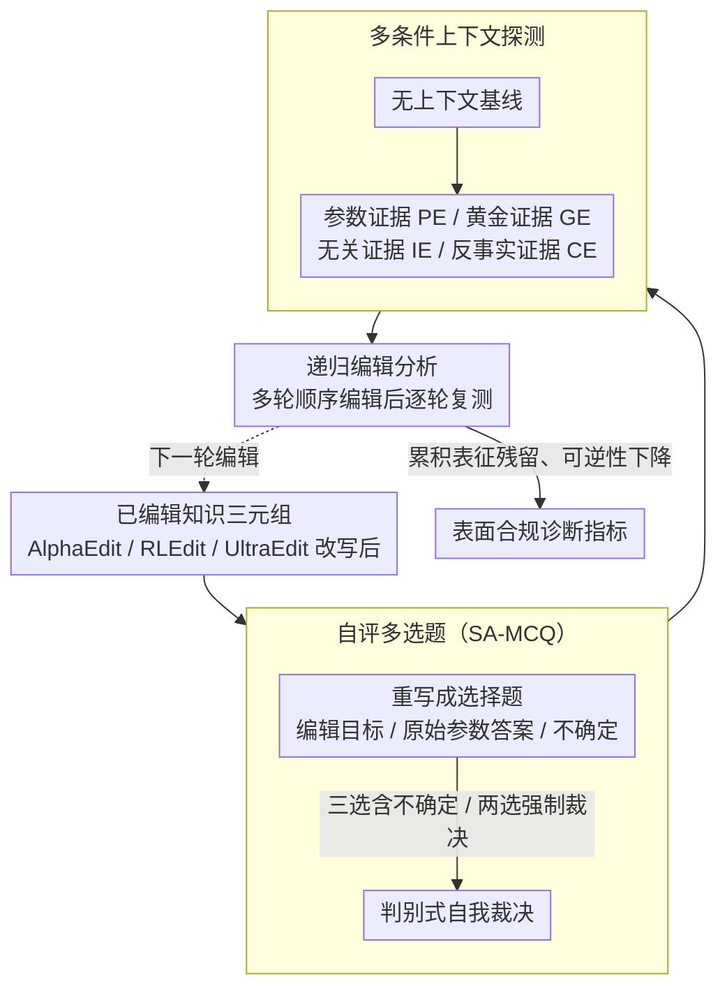

# The Model Agreed, But Didn't Learn: Diagnosing Surface Compliance in Large Language Models

**会议**: ACL 2026 Findings  
**arXiv**: [2604.05995](https://arxiv.org/abs/2604.05995)  
**代码**: [XiaojieGu/SA-MCQ](https://github.com/XiaojieGu/SA-MCQ)  
**领域**: LLM可信度 / 知识编辑  
**关键词**: 知识编辑, 表面合规, 自我评估, 参数记忆, 上下文学习

## 一句话总结

提出 SA-MCQ 诊断框架揭示知识编辑中的"表面合规"现象——编辑器在标准基准上达到高分但并未真正覆写内部信念，模型在判别式自评中会回退到原始参数记忆，递归编辑还会累积表征残留导致认知不稳定。

## 研究背景与动机

**领域现状**：LLM 将世界知识编码在参数中作为参数记忆，但不可避免地继承了训练语料的陈旧和错误。知识编辑技术旨在无需重新训练的情况下精确修改特定内部记忆状态，近期编辑器在标准基准上展示了很高的成功率。

**现有痛点**：现有评估框架主要依赖 Exact Match（精确匹配）来评估编辑成功率，仅检查模型是否能在特定提示下复现目标 token。但这种表面文本一致性是否真正反映了内部记忆的重新配置？Teacher forcing 评估进一步膨胀了成功率，因为它通过提供正确 token 前缀引导输出。

**核心矛盾**：高基准分数可能只是"表面合规"——编辑器通过模仿目标输出获得高分，但模型的内部信念并未被结构性地覆写。当评估方式从生成式变为判别式（强迫模型在选项间做选择），修改后的记忆可能完全失效。

**本文目标**：设计一个能区分"真正记忆修改"和"表面合规"的诊断框架，揭示知识编辑的真实效力。

**切入角度**：让编辑后的模型做选择题（MCQ）而非开放生成——选择题迫使模型在竞争选项间主动裁决，规避了生成式评估中的死记硬背偏差。

**核心 idea**：通过自评多选题（SA-MCQ）迫使模型进行判别式自我评估，在上下文学习设置下系统检测编辑记忆的真实性和鲁棒性。

## 方法详解

### 整体框架

SA-MCQ 是一个纯诊断框架，目标是把"编辑器在标准基准上的高分"和"模型内部信念是否真被覆写"区分开。它的输入是一条已经被编辑器（AlphaEdit、RLEdit、UltraEdit 三种主流范式）改写过的知识三元组，中间把这条三元组重写成一道自评多选题（SA-MCQ），逼模型在编辑目标答案、原始参数答案和"不确定"之间主动裁决；接着把同一道题放进多种上下文条件下反复探测稳定性；最后再做多轮递归编辑、逐轮复测可逆性，输出则是一组揭示"表面合规"程度的判别式指标。整个流程在 CounterFact 和 zsRE 上运行，不涉及任何训练或参数更新。

### 关键设计

**1. 自评多选题（SA-MCQ）：把开放生成换成判别式裁决**

开放生成式评估有个根本漏洞——模型可以从提示和上下文线索里"猜"出目标 token，哪怕内部信念根本没变，Teacher forcing 还会用正确前缀进一步把成功率撑高。SA-MCQ 把编辑三元组重写成一道选择题，候选项同时摆上编辑后的目标答案、编辑前的原始答案和"不确定"，并在系统提示里明确要求模型"基于自身记忆"作答以屏蔽上下文引导。它还分两种模式互补：三选模式（含"不确定"选项）观察模型如何在两个竞争答案间犹豫，两选模式（去掉"不确定"）逼模型强制表态、暴露其真实的主导偏好。这样一来，真正学到新知识的模型会稳定选目标答案，而只是表面合规的模型会在被迫对比时回退到原始参数记忆——判别式裁决比死记硬背式的生成复现严格得多，把"做对题"和"学到知识"的差距直接暴露出来。

**2. 多条件上下文探测（Context Probing）：在多种语境下验记忆稳定性**

真实部署里模型几乎总是带着上下文工作（ICL、RAG），所以一条编辑记忆只有在各种语境下都站得住才算真正有效。除了无上下文的纯参数基线，本文还构造四类外部证据逐一施压：参数证据（Parametric Evidence, PE，复述模型自己的原始信念）、黄金证据（Golden Evidence, GE，支持编辑目标的正确依据）、无关证据（Irrelevant Evidence, IE，语义无关的噪声）、反事实证据（Counter Evidence, CE，与编辑直接矛盾的信息）——这些证据都先过 NLI 蕴含校验保证质量。把同一条编辑放进这几种语境对照，就能看清它到底是写进了参数，还是只建立了一种脆弱的、随上下文摇摆的临时依赖：支持性证据能把它"救"回来、反事实证据却能轻易"压"下去，正说明记忆并未真正内化。

**3. 递归编辑分析（Sequential Editing Analysis）：测多轮编辑的可逆性**

实际应用中知识需要被反复更新，因此一个关键问题是每次编辑会不会留下擦不掉的痕迹。本文执行多轮顺序编辑，每一轮后都用 SA-MCQ 复测，专门检测表征残留是否在累积——即便事后撤销某条编辑，先前注入的参数扰动是否已经永久损害了模型回到原始状态的能力。如果可逆性随编辑轮数单调下降，就说明编辑并非干净的局部改写，而是在持续侵蚀模型的认知稳定性。

## 实验关键数据

### 主实验

| 编辑器 | 传统 Efficacy (TF) | SA-MCQ Efficacy | 差距 |
|--------|------|------|----------|
| AlphaEdit | ~99% | 显著下降 | 表面合规严重 |
| RLEdit | ~99% | 显著下降 | 表面合规严重 |
| UltraEdit | ~99% | 显著下降 | 表面合规严重 |
| Vanilla (未编辑) | - | 原始答案 | 参考基线 |

### 消融实验

| 上下文条件 | 现象 | 说明 |
|------|---------|------|
| 无上下文 | 回退到原始答案 | 参数记忆未被覆写 |
| 支持性证据 | 部分恢复目标答案 | 依赖上下文提示而非真正记忆 |
| 反事实冲突 | 陷入"认知死锁" | 外部反事实轻易抑制编辑效果 |
| 递归编辑 | 可逆性永久降低 | 表征残留累积导致认知不稳定 |

### 关键发现

- **表面合规是普遍现象**：所有三种主流编辑范式都存在——传统评估下近乎完美的编辑成功率在 SA-MCQ 下大幅下降
- 编辑记忆对上下文极度超敏感：支持性上下文可以"拯救"编辑效果，但反事实上下文可以轻易"压制"它，说明编辑并未修改参数记忆而是创造了一种脆弱的上下文依赖
- 递归编辑不可逆：连续编辑累积表征残留，即使撤销编辑也无法恢复原始记忆状态，模型进入永久性的认知不稳定
- Teacher forcing 评估严重高估编辑效果：通过前缀引导产生虚假的高成功率

## 亮点与洞察

- **"表面合规"概念的提出**：精确命名了知识编辑领域一个长期存在但未被充分认识的问题——编辑器在"做对了题"但没有"学到了知识"。这个概念对整个知识编辑社区具有警示意义
- **评估方式的范式转变**：从生成式评估（能否说出正确答案）转向判别式评估（能否在选项间正确判断），是一个简单但深刻的洞察——后者更接近"真正理解"的测试
- **递归编辑的不可逆性**是一个重要的负面发现，对"可持续知识更新"的愿景提出了根本性挑战

## 局限与展望

- SA-MCQ 的"不确定"选项可能引入选择偏差——模型可能倾向于选择"不确定"作为安全选项
- 仅测试了三种编辑器和两个数据集，更广泛的编辑方法和知识类型覆盖有待验证
- 未提出解决表面合规的方案，只停留在诊断层面
- 可探索：设计结合判别式评估的训练目标来改进编辑器、研究表征残留的清除方法

## 相关工作与启发

- **vs 传统评估（Exact Match + TF）**：传统方法在特定提示下评估生成一致性，SA-MCQ 测试判别式信念——两者差异暴露了表面合规问题
- **vs 记忆增强方法（SERAC 等）**：记忆增强方法将编辑存储在外部而非修改参数，不在本文分析范围内，但可能天然避免表面合规问题

## 评分

- 新颖性: ⭐⭐⭐⭐⭐ "表面合规"概念新颖且重要，SA-MCQ 评估范式转变值得推广
- 实验充分度: ⭐⭐⭐⭐ 三种编辑器、四种上下文条件、递归编辑分析全面
- 写作质量: ⭐⭐⭐⭐ 问题定义清晰，实验发现有说服力
- 价值: ⭐⭐⭐⭐⭐ 对知识编辑领域有重要警示，推动更严格的评估标准

<!-- RELATED:START -->

## 相关论文

- [\[ICML 2026\] Reverse-Engineering Model Editing on Language Models](../../ICML2026/knowledge_editing/reverse-engineering_model_editing_on_language_models.md)
- [\[ACL 2025\] Neuron-Level Sequential Editing for Large Language Models](../../ACL2025/knowledge_editing/neuron-level_sequential_editing_for_large_language_models.md)
- [\[ICML 2026\] The Labyrinth and the Thread: Rethinking Regularizations in Sequential Knowledge Editing for Large Language Models](../../ICML2026/knowledge_editing/the_labyrinth_and_the_thread_rethinking_regularizations_in_sequential_knowledge_.md)
- [\[ICML 2026\] Revisiting Parameter-Based Knowledge Editing in Large Language Models: Theoretical Limits and Empirical Evidence](../../ICML2026/knowledge_editing/revisiting_parameter-based_knowledge_editing_in_large_language_models_theoretica.md)
- [\[ACL 2025\] Structure-aware Domain Knowledge Injection for Large Language Models](../../ACL2025/knowledge_editing/structure-aware_domain_knowledge_injection_for_large_language_models.md)

<!-- RELATED:END -->
