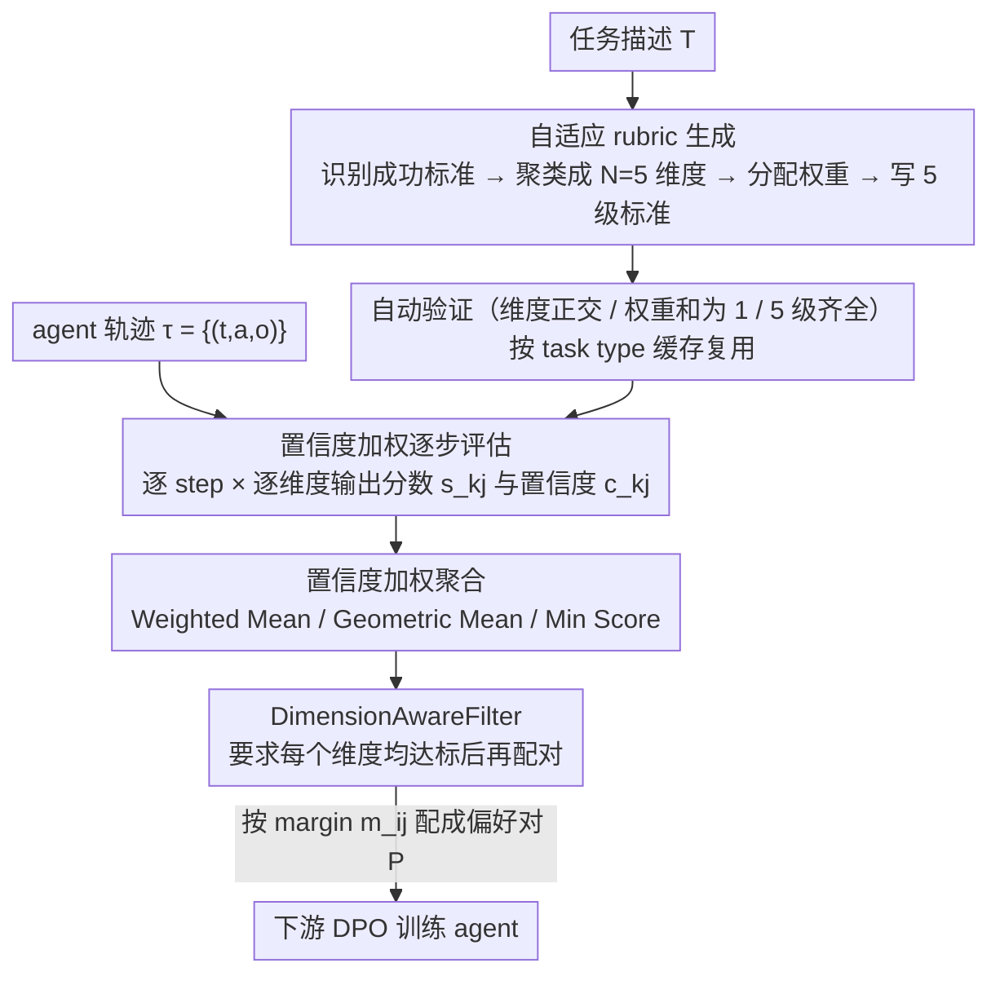

# AdaRubric: Task-Adaptive Rubrics for Reliable LLM Agent Evaluation and Reward Learning

**会议**: ACL 2026  
**arXiv**: [2603.21362](https://arxiv.org/abs/2603.21362)  
**代码**: https://github.com/alphadl/AdaRubrics  
**领域**: LLM Agent / Evaluation / 强化学习  
**关键词**: LLM-as-Judge, Agent 轨迹评估, 自适应 rubric, DPO 偏好对, 过程奖励

## 一句话总结
本文指出 "LLM-as-Judge + 固定 rubric"（Helpfulness/Safety/Fluency）对评估目标导向的 agent 轨迹严重不匹配，提出 AdaRubric——由 LLM 根据任务描述自动生成任务专属的 N 维评估 rubric，再用置信度加权的逐步评估产出密集 reward 信号；并设计 DimensionAwareFilter 在 DPO 数据构建中防止"维度掩盖"，在 WebArena/ToolBench/AgentBench 上 Pearson r=0.79，DPO 训练带来 +6.8~+8.5% 任务成功率提升。

## 研究背景与动机

**领域现状**：LLM agent 在 web 自动化、API 调用、代码修复、多模态任务上的应用激增，但如何可靠评估"多步 agent 轨迹"成了瓶颈。当前两大范式都不靠谱——reference-based 指标（ROUGE/BERTScore）只看表面词重叠，对目标导向推理盲；LLM-as-Judge（MT-Bench、G-Eval、Prometheus）用一套固定 dimensions（Helpfulness、Fluency、Safety）打所有任务。

**现有痛点**：(1) Helpfulness/Fluency/Safety 是为聊天助手设计的，跟 ToolBench 的"API 选择正确率"、SWE-bench 的"补丁正确性"几乎没关系；(2) 用错维度直接系统性偏置——agent 正确调了 API 但输出紧凑机器可读，会被 Fluency 维度扣分；(3) 单一标量得分掩盖单个维度的灾难性失败（一个 dim 拿 1 分仍然能通过总分阈值），导致用这种 reward 训出来的 DPO 模型学到"风格化但功能错误"的策略。

**核心矛盾**：评估 dimensions 应该是 task 的函数，而不是 evaluator 的固定属性。但现有 paradigm 把 rubric 写死在 prompt 里，与 task 解耦。

**本文目标**：(1) 让 LLM 根据任务描述**自适应生成** task-specific 评估 rubric；(2) 产生**逐步骤、逐维度、含置信度**的密集 reward；(3) 把这种结构化 reward 转化为高质量 DPO 偏好对去训练 agent。

**切入角度**：LLM 本身就具备关于"什么算这个任务做得好"的 parametric knowledge，与其让它用 generic prompt 直接打分，不如先 prompt 它**externalize**这种知识为显式 rubric，再用这个显式 rubric 评估。两步分解比一步直觉打分更可靠。

**核心 idea**：用一个 LLM 调用从 task description 生成 $\mathcal{R}(T)=\{(d_j, w_j, \Gamma_j)\}_{j=1}^N$（维度 + 权重 + 5 级 verbalized 标准），再用置信度加权的逐步打分聚合成 trajectory score，最后用 DimensionAwareFilter 构建 DPO 对。

## 方法详解

### 整体框架

AdaRubric 把"评估一条 agent 轨迹"拆成三个阶段，核心思想是先让 LLM 把"什么算这个任务做得好"显式写成结构化 rubric，再用这个 rubric 去逐步打分，最后把打分结果蒸成 DPO 偏好对。给定任务描述 $T$，第一阶段生成一份含 $N=5$ 个正交维度、各带权重 $w_j$ 和 5 级评分标准 $\Gamma_j$ 的 rubric $\mathcal{R}(T)=\{(d_j, w_j, \Gamma_j)\}_{j=1}^N$，并按 task type 缓存复用；第二阶段对轨迹 $\tau=\{(t_k,a_k,o_k)\}_{k=1}^K$ 的每个 step、每个维度输出分数 $s_{k,j}$ 和置信度 $c_{k,j}$，置信度加权聚合成轨迹分数；第三阶段用可组合的 filter 筛出高质量轨迹、配成偏好对 $\mathcal{P}=\{(\tau_i^+,\tau_j^-, m_{ij})\}$ 去训练 agent。整条管线本身免训练，只在 inference 时跑 LLM 评估，再把产出的密集 reward 喂给下游 DPO。

### 关键设计

**1. 自适应 rubric 生成（Adaptive Rubric Generation）：把"评估什么"从写死的 prompt 升级成随任务生成的 rubric**

固定的 generic rubric（Helpfulness/Fluency/Safety）是为聊天助手设计的，套到 ToolBench 的 API 选择、SWE-bench 的补丁正确性上会系统性偏置——agent 正确调了 API 但输出紧凑机器可读，反而会被 Fluency 维度扣分。AdaRubric 不直接打分，而是先 prompt LLM 完成四步知识外化：从任务描述识别 task-critical 成功标准、聚类成 $N=5$ 个正交维度、分配满足 $\sum w_j=1$ 的权重、再为每个维度写出 5 级 verbalized 标准（$\gamma_3$="acceptable"、$\gamma_1$="broken"、$\gamma_5$="exemplary"）并附具体行为示例，输出用 JSON schema 强制结构化。生成后自动验证维度名两两余弦距离 $>0.3$ 防重叠、权重和为 1（误差 $<1\%$）、5 级都有内容，不达标重试一次。之所以多绕这一步"先想标准再打分"，是因为它把隐式的 task 理解转成显式可审计的准则，也分解了 cognitive load；而 rubric 按 task type 缓存、同一 task family 内复用，把生成成本摊薄 $>95\%$，是这套方案能实用化的关键工程优化。

**2. 置信度加权逐步评估（Confidence-Weighted Per-Step Evaluation）：逐 step × 逐维度打分，再按 BLUE 最优方式聚合**

固定 rubric 的 LLM-as-Judge 只吐一个标量，既看不出"哪一步、哪个维度失败"，也无法给 DPO 提供过程级信号。AdaRubric 让 evaluator 看着 $(t_k, a_k, o_k, d_j, \Gamma_j)$ 输出分数 $s_{k,j}\in\{1,\ldots,5\}$ 和置信度 $c_{k,j}\in[0,1]$，置信度低就表示这一步与该维度无关（如纯推理 step 对 Tool Accuracy 的相关性低），从而自动 down-weight 掉无关 step 引入的噪声。聚合提供三种策略：默认的 Weighted Mean 带 recency-decay 权重 $w_k=e^{\lambda k/(K-1)}$（$\lambda=0.5$），Geometric Mean 强调全程稳定，Min Score 服务安全关键场景。理论上，在 $s_{k,j}=s^*_{k,j}+\varepsilon$、$\varepsilon\sim\mathcal{N}(0,\sigma^2/c_{k,j})$ 的假设下，置信度加权恰好是 Gauss-Markov 意义下的 BLUE，方差严格低于均匀平均——给经验做法配了一个干净的最优性解释。

**3. DimensionAwareFilter（防止维度掩盖的偏好对过滤）：要求"好"轨迹每个维度都达标**

标量 reward 在多维评估下天然有"维度掩盖"问题——某些维度高分能把另一些维度的灾难性失败掩盖过去，DPO 学到的就会是"风格化但功能错误"的策略。本文用 Proposition 3.1（masking-prevention）把这个漏洞形式化：对任何标量阈值 $\theta'$，总存在轨迹 $\tau^*$ 让某维度 $j^*$ 上 $\bar{s}_{j^*}=\epsilon$（接近 0）却仍以加权总分 $\geq\theta'$ 通过 AbsoluteThreshold。DimensionAwareFilter 直接堵上它，要求 $\bar{s}_j\geq\theta_j\ \forall j$ 逐维度达标；通过过滤后的轨迹按 margin $m_{ij}=S(\tau_i)-S(\tau_j)\geq\delta_{\min}$ 配成偏好对 $\mathcal{P}=\{(\tau_i^+,\tau_j^-,m_{ij})\}$，margin 还能用来调制 DPO loss 权重。它用更严格的 per-dim 约束牺牲一点通过率（保留 61.5% vs Absolute 的 72.3%），换来的偏好对质量更真，下游 SR% 反而最高（27.8% vs 24.0%）；4 个 filter 原语（Absolute/Percentile/DimAware/Composite）可自由组合。

### 损失函数 / 训练策略

整条评估管线免训练，纯 inference-time pipeline；评估用 GPT-4o（消融换 Llama-70B、Llama-8B 也 work）。DPO 训练用 Qwen2.5-7B-Instruct + LoRA（rank 16, $\alpha=32$）。默认超参为 $N=5$ 维度、$\lambda=0.5$ recency decay、$\delta_{\min}=0.5$ margin、DimAware threshold $\theta_j=2.5$、percentile filter $p=80$。每条轨迹的评估开销是 $K\times N$ 次 LLM 调用（WebArena 约 40 次），比 GPT-4 Direct 多 3–5× wall-clock，rubric 缓存把生成成本摊薄。

## 实验关键数据

### 主实验
3 个 benchmark：WebArena（WA，812 web 自动化任务）、ToolBench（TB，500 API 调用）、AgentBench（AB，365 代码/OS/DB）。各 300 trajectory pair 由 3 名专家标注，inter-annotator $\kappa>0.82$。

| 评估方法 | WA r | TB r | AB r | Avg r | Δ vs GPT-4 Direct |
|---------|------|------|------|-------|------------------|
| ROUGE-L | 0.31 | 0.26 | 0.29 | 0.29 | -0.35 |
| BERTScore | 0.43 | 0.39 | 0.41 | 0.41 | -0.23 |
| G-Eval | 0.54 | 0.49 | 0.52 | 0.52 | -0.12 |
| Prometheus | 0.61 | 0.57 | 0.59 | 0.59 | -0.05 |
| GPT-4 Direct | 0.64 | 0.60 | 0.62 | 0.62 | – |
| GPT-4 CoT-Decomposed（同 compute）| - | - | - | 0.68* | +0.06 |
| AdaRubric-WM | 0.74 | 0.70 | 0.72 | 0.72 | +0.10 |
| AdaRubric-GM | 0.76 | 0.71 | 0.74 | 0.74 | +0.12 |
| **AdaRubric-DA** | **0.79** | **0.74** | **0.77** | **0.77** | **+0.15** |

DPO 训练（Qwen2.5-7B backbone）：

| 方法 | WA SR% | TB TCR% | AB SR% |
|------|--------|---------|--------|
| Base（zero-shot）| 12.3 | 18.4 | 15.2 |
| SFT (success only) | 16.7 | 23.1 | 20.1 |
| DPO + G-Eval | 20.1 | 27.6 | 24.5 |
| DPO + Prometheus | 21.0 | 29.3 | 26.4 |
| DPO + **AdaRubric-DA** | **27.8** | **37.8** | **34.1** |
| Δ vs Prometheus | **+6.8** | **+8.5** | **+7.7** |

### 消融实验（WebArena）

| 配置 | Pearson r | DPO SR% |
|------|-----------|---------|
| Fixed (generic Help/Safety/Flu) | 0.51 | 19.1 |
| Fixed (domain template) | 0.65 | 22.4 |
| Adaptive, no confidence weighting | 0.72 | 24.0 |
| Adaptive, no DimAware filter | 0.75 | 25.2 |
| **AdaRubric-DA (full)** | **0.79** | **27.8** |

### 关键发现
- **task-adaptive rubric 是最大贡献者**：固定 generic → 域模板 (+0.14)、域模板 → adaptive (+0.07)，结构化生成超过单纯加 evaluator 能力（GPT-4 → Llama-8B 只掉 0.11，但 fixed → adaptive 涨 0.15），说明"知识 externalization"比"模型规模"对评估更重要。
- **DimensionAwareFilter 显著有效**：相比 AbsoluteThreshold 在 r 和 SR% 上都更优（+0.04 / +3.8），印证了维度掩盖问题在实际 DPO 训练中确实严重。
- **跨域迁移强**：在 WA 上生成的 DPO 对训练，在 TB 上达到 31.2%（甚至超过 Prometheus 在 TB 的 in-domain 29.3%），说明 adaptive rubric 学到的是 generalizable quality concepts。
- **可靠性达标**：Krippendorff's $\alpha\geq 0.82$（部署阈值 0.80），G-Eval 0.63、Prometheus 0.70 都不够。
- **小 backbone 用 AdaRubric 仍优于大 backbone 用静态评估**：Llama-8B+AdaRubric (r=0.68) > GPT-4 Direct (r=0.64)，证明结构化 prompting 能补偿模型规模。
- **PPO 训练加速明显**：用 AdaRubric-DA 做 reward 的 PPO 在 1K rollout 就达 20.1% SR（vs Prometheus 15.8%），密集 per-dim reward 加速 RL 收敛。

## 亮点与洞察
- **"评估前先 externalize 评估标准"是个通用的可迁移思路**：把 evaluator 的隐式 task understanding 强制生成为显式 rubric，再用 rubric 评估，比直接打分准且可审计。这种"知识外化"思路可迁移到对齐、自动评估、reward modeling 等任何用 LLM 做 judge 的场景。
- **Masking-Prevention 定理给出了 reward 设计的硬约束**：Prop 3.1 形式化证明了"任何标量阈值都存在轨迹反例"，意味着多维 reward 系统**必须**有 per-dim filter 才能避免局部灾难——这是个通用结论，对所有 reward model 设计有启示。
- **置信度评估的 BLUE 解读很优雅**：把 confidence 当 inverse noise variance 用 Gauss-Markov 解释加权聚合，给经验做法一个理论 sanity check（虽然作者也诚实承认 Gaussian tail 假设不严格）。
- **Rubric 缓存是工程关键**：rubric 按 task type 缓存把生成成本摊薄 95%，否则每个 instance 都生成一遍 rubric 几乎不可用。这种"昂贵步骤按粒度缓存"的思路对所有 multi-step LLM pipeline 都适用。

## 局限与展望
- $K\times N$ 次 evaluator 调用代价不小（WebArena 约 40 次/trajectory），wall-clock 3-5× GPT-4 Direct；对实时评估场景不适用。
- Rubric 质量依赖 LLM 的 parametric knowledge——specialized criteria 如 CAPTCHA Handling、Rate-Limit Awareness 这类 long-tail 维度，自动生成会漏掉（作者人工 study 显示比 expert rubric 低 0.2~0.4 Likert）。
- Adversarial task description 可让 rubric 偏置（30 个扰动 description 使 r 降 0.04~0.06），需要 description-robust 的 rubric 生成方法。
- 置信度由 LLM 自报告，校准性未深入验证，OOD 任务可能需要 post-hoc recalibration。
- Rubric 是 task-type 级而非 instance 级，与并行工作 DR Tulu 的 instance-specific evolving rubrics 是互补的，可结合做"AdaRubric 初始化 + 在线 evolve"。

## 相关工作与启发
- **vs G-Eval / Prometheus**：他们用固定 dimensions 或 fine-tune 13B judge，AdaRubric 不微调、按 task 生成 rubric，可靠性更高（α 0.83 vs 0.63/0.70）且 zero-shot 迁移。
- **vs DR Tulu**（Shao et al. 2025）：DR Tulu 在 RL 训练中 instance-by-instance 在线 evolve search-grounded rubric，更细但需要 retrieval 设施；AdaRubric 在训练前生成 task-level rubric，更省。两者可叠加。
- **vs LLM-as-Judge 通用范式**（MT-Bench, Chatbot Arena）：经典工作适合 chat assistant，agent trajectory 评估需要 task-specific 维度，AdaRubric 是这条 paradigm 的自然延伸。
- **vs RewardBench**：RewardBench 是 reward model 评测基准，AdaRubric 是反过来——用 LLM-as-Judge 产 reward signal 训 policy，可用 RewardBench 反向验证 AdaRubric 的 reward 质量。

## 评分
- 新颖性: ⭐⭐⭐⭐ "task-adaptive rubric generation" 是个干净的 paradigm shift，Masking-Prevention Prop 也是较少见的形式化贡献。
- 实验充分度: ⭐⭐⭐⭐ 3 benchmark + 5 baseline + 详细消融 + 跨域迁移 + SWE-bench zero-shot + 多模态延伸 + PPO 集成 + 人工 study，覆盖面非常广。
- 写作质量: ⭐⭐⭐⭐ 动机讲得很清楚，Prop 3.1 形式化精炼，limitations 章节诚实细致。
- 价值: ⭐⭐⭐⭐⭐ 直接解决了 agent evaluation 这个 RLHF/DPO 的痛点，rubric 缓存设计实用，对工业级 agent 训练有真实指导意义。

<!-- RELATED:START -->

## 相关论文

- [\[ACL 2025\] Agentic Reward Modeling: Integrating Human Preferences with Verifiable Correctness Signals for Reliable Reward Systems](../../ACL2025/llm_agent/agentic_reward_modeling_integrating_human_preferences_with_verifiable_correctnes.md)
- [\[ACL 2026\] BAPO: Boundary-Aware Policy Optimization for Reliable Agentic Search](bapo_boundary-aware_policy_optimization_for_reliable_agentic_search.md)
- [\[ACL 2026\] HAG: Hierarchical Demographic Tree-based Agent Generation for Topic-Adaptive Simulation](hag_hierarchical_demographic_tree-based_agent_generation_for_topic-adaptive_simu.md)
- [\[ACL 2026\] HeLa-Mem: Hebbian Learning and Associative Memory for LLM Agents](hela-mem_hebbian_learning_and_associative_memory_for_llm_agents.md)
- [\[ACL 2026\] YIELD: A Large-Scale Dataset and Evaluation Framework for Information Elicitation Agents](yield_a_large-scale_dataset_and_evaluation_framework_for_information_elicitation.md)

<!-- RELATED:END -->
