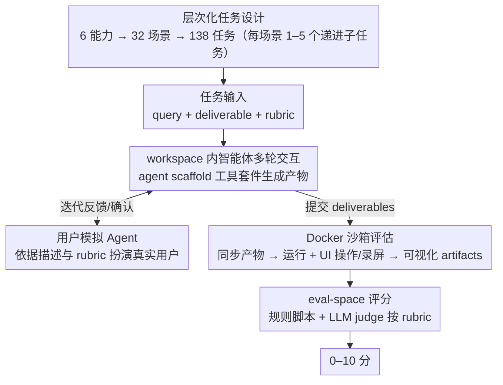

# AgencyBench: Benchmarking the Frontiers of Autonomous Agents in 1M-Token Real-World Contexts

**会议**: ACL 2026  
**arXiv**: [2601.11044](https://arxiv.org/abs/2601.11044)  
**代码**: [GitHub](https://github.com/GAIR-NLP/AgencyBench)  
**领域**: LLM Agent / Benchmark  
**关键词**: 自主智能体, 长程任务, 真实世界基准, 用户模拟, Docker沙箱评估

## 一句话总结

提出AgencyBench——一个包含138个真实世界任务的综合基准，评估6种核心智能体能力，每个场景平均需90次工具调用和100万token，通过用户模拟agent和Docker沙箱实现全自动化评估。

## 研究背景与动机

**领域现状**：LLM-based自主智能体正在渗透软件开发、科学研究、日常使用等多个领域，但评估基准严重滞后于智能体能力的发展。

**现有痛点**：(1) 现有基准聚焦单一能力（如工具使用或软件工程），无法捕捉真实世界任务的多维性和长程性；(2) 真实任务评估依赖human-in-the-loop反馈，成为自动化评估的瓶颈；(3) 任务复杂度不够——大多数基准仅需数十次工具调用。

**核心矛盾**：前沿智能体的能力已远超现有基准的测试范围，亟需更具挑战性的评测。

**本文目标**：构建高复杂度、多维度、全自动化评估的真实世界智能体基准。

**切入角度**：由20位人类专家（AI研究者、开发者）收集真实工作场景中的任务，构建层次化的能力-场景-任务体系。

**核心 idea**：通过用户模拟agent替代人类反馈、Docker沙箱执行可视化评估，实现长程复杂任务的全自动化rollout收集和评分。

## 方法详解

### 整体框架

AgencyBench 是一个面向长程真实任务的智能体基准，用一套"能力—场景—任务"的层次化体系把评测组织起来：6 种核心能力（游戏开发、前端、后端、代码生成、研究、MCP 工具）下挂 32 个真实场景、再细分成 138 个具体任务，每个场景由 1–5 个难度递增、前序结果影响后续的顺序任务串成。一条评测的输入是智能体在某场景上的多轮交互，中间靠用户模拟 agent 替代人类反馈、靠 workspace–sandbox–evalspace 三空间分离保证隔离，把智能体产出的代码/文件搬进 Docker 沙箱实际运行并录屏，输出则是结合规则脚本与 LLM judge、依据 rubric 给出的 0–10 分。任务入库走全一致同意策略——4 位专家全部同意才纳入，以此保证数据质量。下面按"任务体系 → workspace 内交互 → 沙箱评估 → 评分"的流向把整条流水线串起来：

### 关键设计

**1. 层次化任务设计：用渐进式复杂度逼出长程规划能力**

真实世界的工作从不是一步到位的，所以单点任务测不出智能体的持续作业能力。AgencyBench 把评测组织成"能力—场景—任务"三层：6 种核心能力（游戏开发、前端、后端、代码生成、研究、MCP 工具）下挂 32 个真实场景，每个场景再细分成 1–5 个难度递增的顺序任务，且前序完成的结果会成为后续任务的上下文——例如"五子棋游戏"场景从搭基础棋盘，一路加到 AI 对手、回退功能、主题切换。这种链式递进迫使智能体在长跨度里保持上下文、规划多步，正是平均 90 次工具调用、100 万 token 这种复杂度的来源。

**2. 用户模拟 Agent：用模型扮演用户，打掉 human-in-the-loop 瓶颈**

真实任务的评估往往要靠人在多轮里给反馈，可一条 rollout 长达数小时，靠人盯着根本无法规模化。AgencyBench 让智能体在隔离的 workspace 里用一套工具脚手架（agent scaffold，含文件操作、命令行、网页搜索、上下文管理等）多轮交互生成产物；同时一个模拟 agent 扮演真实用户：当智能体提交中间结果时，模拟 agent 依据任务描述和 rubric 给出修改建议或确认，把原本需要人参与的迭代闭环自动接上。这样长程交互可以全自动完成，代价是评估可靠性的上限被模拟 agent 的质量锁住。

**3. Docker 沙箱评估：把产物真跑起来再做可视化判分**

游戏、网页这类任务的产物没法只看文本判好坏，必须实际运行、看效果。本文把智能体的 deliverables 同步进 Docker 容器，模拟人机操作——UI 渲染、鼠标点击、屏幕录制——生成可视化 artifacts；这些 artifacts 与原始产物再被搬到独立的 eval-space，交给规则脚本和 LLM judge 按 rubric 打 0–10 分。workspace（生成）、sandbox（运行）、eval-space（评分）三空间分离既保证了隔离与可复现，也让评估器看到"程序跑起来到底长什么样"，从而对功能性和视觉效果做出贴近人类的判断。

## 实验关键数据

### 主实验

| 模型类型 | 平均分 | 最高 | 最低 |
|---------|--------|------|------|
| 闭源模型 | 48.4% | GPT-5.2 (56.5%) | Grok-4.1-Fast (44.3%) |
| 开源模型 | 32.1% | GLM-4.6 (38.6%) | Qwen-3-235B (27.0%) |

### 关键行为差异

| 模型 | 特点 | 说明 |
|------|------|------|
| GPT-5.2 | 反馈自校正强 | 最善于利用用户反馈改进 |
| Grok-4.1-Fast | Token效率高 | 用更少token完成任务 |
| Claude-4.5-Opus | 偏好Shell工具 | 更多使用命令行操作 |
| Gemini-3-Pro | 偏好文件管理 | 更多使用文件和记忆管理工具 |

### 关键发现
- 闭源模型显著优于开源模型（48.4% vs 32.1%），差距比短任务基准上更大
- "主场优势"效应明显——模型在原生框架（如Claude+Claude-Agent-SDK）中表现最佳
- 当前最强模型也仅达56.5%，说明长程真实世界任务仍是巨大挑战
- 不同模型有明显的工具使用偏好差异，暗示架构和训练数据的影响

## 亮点与洞察
- 任务复杂度远超现有基准——平均90次工具调用和100万token是质的飞跃
- 用户模拟agent和Docker沙箱的组合解决了长程任务自动评估的核心难题
- "主场优势"发现对智能体框架设计有重要启示——通用框架可能不如专用框架

## 局限与展望
- 138个任务可能仍不足以全面覆盖真实世界场景
- 用户模拟agent的质量是评估可靠性的上限
- Docker沙箱的环境配置复杂，可能限制社区采用
- 未来可扩展到更多领域（如数据分析、设计、写作）

## 相关工作与启发
- **vs SWE-bench**: SWE-bench聚焦软件工程单一能力，AgencyBench覆盖6种能力
- **vs GAIA**: GAIA平均仅10K token，AgencyBench是100倍复杂度
- **vs ToolLLM**: ToolLLM关注工具调用正确性，AgencyBench关注端到端任务完成

## 评分
- 新颖性: ⭐⭐⭐⭐⭐ 在规模和真实性上显著超越现有基准
- 实验充分度: ⭐⭐⭐⭐ 多模型对比、行为分析、框架对比
- 写作质量: ⭐⭐⭐⭐ 结构清晰，案例丰富
- 价值: ⭐⭐⭐⭐⭐ 为下一代智能体评估设立新标杆

<!-- RELATED:START -->

## 相关论文

- [\[ACL 2026\] MCP-Flow: Facilitating LLM Agents to Master Real-World, Diverse and Scaling MCP Tools](mcp-flow_facilitating_llm_agents_to_master_real-world_diverse_and_scaling_mcp_to.md)
- [\[AAAI 2026\] D-GARA: A Dynamic Benchmarking Framework for GUI Agent Robustness in Real-World Anomalies](../../AAAI2026/llm_agent/d-gara_a_dynamic_benchmarking_framework_for_gui_agent_robust.md)
- [\[ACL 2026\] Shopping Companion: A Memory-Augmented LLM Agent for Real-World E-Commerce Tasks](shopping_companion_a_memory-augmented_llm_agent_for_real-world_e-commerce_tasks.md)
- [\[ICLR 2026\] OpenAgentSafety: A Comprehensive Framework for Evaluating Real-World AI Agent Safety](../../ICLR2026/llm_agent/openagentsafety_a_comprehensive_framework_for_evaluating_real-world_ai_agent_saf.md)
- [\[CVPR 2026\] WebChain: A Large-Scale Human-Annotated Dataset of Real-World Web Interaction Traces](../../CVPR2026/llm_agent/webchain_a_large-scale_human-annotated_dataset_of_real-world_web_interaction_tra.md)

<!-- RELATED:END -->
