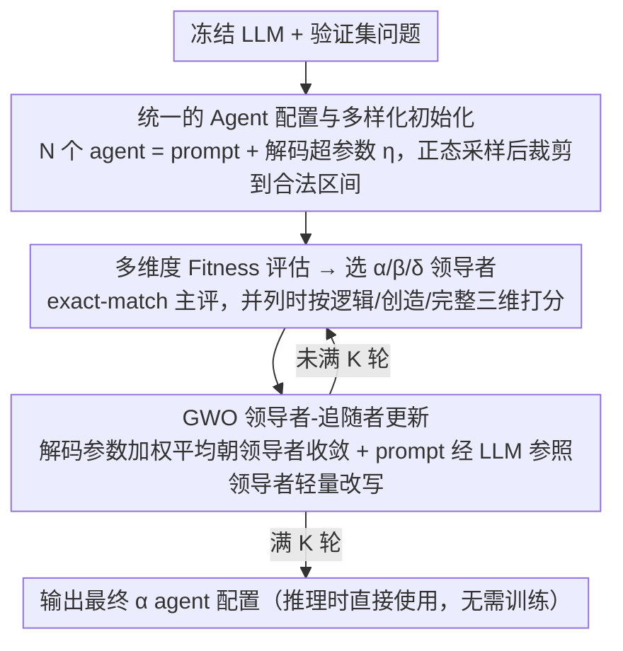

# Agent-GWO: Collaborative Agents for Dynamic Prompt Optimization in Large Language Models

**会议**: ACL 2026  
**arXiv**: [2604.18612](https://arxiv.org/abs/2604.18612)  
**代码**: 即将公开  
**领域**: LLM Agent  
**关键词**: 提示优化, 灰狼优化器, 多智能体, 推理增强, 解码超参数

## 一句话总结

本文提出 Agent-GWO，将灰狼优化器的领导者-追随者机制引入多智能体框架，联合优化 prompt 模板和解码超参数（温度、top-p 等），在 11 个数学和混合推理基准上持续超越现有提示优化方法。

## 研究背景与动机

**领域现状**：Chain-of-Thought（CoT）等提示策略显著提升了 LLM 在复杂推理任务上的表现，但高质量推理仍严重依赖人工设计的静态 prompt。ToT、GoT、AoT 等方法在固定 prompt 下改进推理轨迹，但 prompt 本身的脆弱性问题未解决。

**现有痛点**：(1) 推理性能对 prompt 措辞、示例顺序、上下文扰动高度敏感，微小改动即可导致大幅性能波动；(2) 现有自动提示优化方法通常采用单智能体局部搜索，无法同时优化 prompt 和解码超参数；(3) prompt 与解码配置（温度、top-p、重复惩罚等）的联合空间巨大，人工试错效率极低。

**核心矛盾**：推理质量同时受 prompt 模板和解码配置两个因素控制，但现有方法要么只优化 prompt（忽略解码配置），要么依赖固定 prompt（只调解码参数），缺乏统一优化框架。

**本文目标**：在推理时（inference-time）自动发现更稳定、更适配任务的 prompt-解码配置对，无需额外训练。

**切入角度**：将每个 agent 定义为 prompt 模板 + 解码超参数的组合，把提示优化问题转化为群体智能优化问题。灰狼优化器（GWO）天然具有领导者-追随者层级结构，适合引导群体协作搜索。

**核心 idea**：用 GWO 的 α/β/δ 领导者机制，在多个 agent（每个 agent = prompt + 解码参数）组成的种群中迭代优化，让表现最好的三个 agent 引导其余 agent 的更新，最终收敛到稳健的最优推理配置。

## 方法详解

### 整体框架

Agent-GWO 把「找一个好 prompt」重新表述成「在 prompt 与解码参数的联合空间里做群体智能搜索」。它维护一个由 N 个 agent 组成的种群，每个 agent 共享同一个冻结 LLM，但各自带一套独立的 prompt 模板和一组解码超参数（温度、top-p、频率惩罚、存在惩罚、最大长度）。每一轮迭代里，所有 agent 并行解验证集问题并打分，挑出表现最好的三个作为 α/β/δ 领导者，其余 agent 随后把自己的解码参数向这三个领导者靠拢、把 prompt 交给 LLM 参照领导者做轻量改写；如此重复 K 轮后，直接取最终的 α agent 配置作为推理时的最优解，整个过程无需训练模型权重。

### 关键设计

**1. 统一的 Agent 配置与多样化初始化：把 prompt 和解码参数捏成一个可演化的个体**

现有方法要么只调 prompt、要么只调解码参数，根因在于二者属于异质空间、难以放进同一套搜索里。Agent-GWO 的破题方式是把每个 agent 定义成 $Agent_j = (\eta_j, prompt_j)$，其中解码部分 $\eta_j = \{T_j, p_j, F_j, E_j, M_j\}$ 对应温度、top-p、频率惩罚、存在惩罚和最大长度。这样一来，prompt（离散）和解码配置（连续）被封装为同一个可继承、可评估的个体，群体优化才能同时作用在两者上。

为了让搜索有足够的探索半径，初始种群从正态分布采样再裁剪到合法区间，例如温度 $T_j \sim \mathcal{N}(\mu_t, \sigma_t^2)$ 后 clip 到 $[a_t, b_t]$，其余超参同理。这种带约束的随机初始化既保证了种群多样性，又避免一开始就落进非法或极端的配置。

**2. 多维度 Fitness 评估：在准确率并列时再看推理质量**

每一轮迭代都要先评估全体 agent、再据此选出 α/β/δ 领导者，领导者选得稳不稳直接决定整个种群往哪个方向走。Agent-GWO 主评估用验证集 exact-match 准确率，但在小批量上准确率经常出现并列，单凭它选领导者容易抖动。为此当准确率相同时引入 LLM-judge 二级排序，从逻辑一致性 $s_{logic}$、创造性 $s_{creativity}$、完整性 $s_{complete}$ 三个维度打分，权重 $(0.5, 0.2, 0.3)$ 在 200 个人工标注样本上标定。这套辅助评分把「答对但推理更扎实」的 agent 顶上来，让 α/β/δ 的选择在迭代中更稳定。

**3. GWO 领导者-追随者更新：用层级引导平衡探索与利用**

选出领导者后，剩下的 agent 要据此更新——prompt 优化最怕的是局部搜索陷在某个措辞附近出不来。Agent-GWO 借用灰狼优化器天然的层级结构来缓解：非精英 agent 的解码参数通过加权平均朝 α/β/δ 收敛，$\eta_j^{(k)} = w_\alpha X_\alpha + w_\beta X_\beta + w_\delta X_\delta$，权重满足 $w_\alpha > w_\beta > w_\delta$，让当前最优个体影响力最大、同时仍保留次优解的引导，避免过早收敛。

对离散的 prompt，则改用 PromptAdaptation 函数：以固定系统指令让 LLM 参考三个领导者的 prompt，对当前 prompt 做步骤重排、语义等价改写、格式微调等轻量编辑。连续参数走加权平均、离散 prompt 走 LLM 编辑，两条更新路径在同一层级框架下并行推进，兼顾了搜索的方向性与多样性；更新后回到下一轮评估，直至跑满 K 轮。

## 实验关键数据

### 主实验

| Backbone | 方法 | GSM8K | MATH | SVAMP | MultiArith | 11任务Avg |
|----------|------|-------|------|-------|------------|-----------|
| GPT-4o-mini | CoT | 85.4% | 74.8% | 84.7% | 89.5% | 74.6% |
| GPT-4o-mini | AoT | 95.0% | 83.6% | 91.5% | 92.6% | 83.3% |
| GPT-4o-mini | **Agent-GWO** | **95.9%** | **80.2%** | **92.3%** | **95.3%** | **84.0%** |
| Qwen-7B | CoT | 77.5% | 65.8% | 82.7% | 84.6% | 62.2% |
| Qwen-7B | **Agent-GWO** | **89.1%** | **74.1%** | **90.1%** | **93.3%** | **69.9%** |
| Gemma-12B | CoT | 83.5% | 72.8% | 79.3% | 82.7% | 74.0% |
| Gemma-12B | **Agent-GWO** | **92.8%** | **82.1%** | **90.9%** | **95.9%** | **82.4%** |

### 消融实验

| 配置 | Avg 准确率 | 说明 |
|------|-----------|------|
| Agent-GWO (n=5, K=10) | 84.0% | 完整模型 |
| 仅优化 prompt (固定解码参数) | 下降 | 解码参数优化有贡献 |
| 仅优化解码参数 (固定 prompt) | 下降 | prompt 优化有贡献 |
| 随机搜索替代 GWO | 下降 | GWO 引导优于随机 |
| n=3 agents | 略降 | agent 数量影响搜索充分性 |

### 关键发现

- Agent-GWO 在所有三个 backbone 上均取得最高平均准确率，且在大多数单项任务上为最优或次优
- 相比 CoT，小模型（Qwen-7B）上提升更大（+7.7pp），说明优化对弱模型帮助更大
- 联合优化 prompt+解码参数比单独优化任一项效果更好，验证了统一框架的必要性
- 默认配置 n=5, K=10 在计算预算和性能之间取得了好的平衡

## 亮点与洞察

- **将 prompt 优化视为群体智能搜索**：把 prompt 模板和解码超参数统一为 agent 配置，用种群优化的方式系统地搜索联合空间，比人工试错和单智能体搜索更高效
- **GWO 层级机制的自然对应**：α/β/δ leader 自然对应"当前最优/次优/第三"的配置，追随者通过加权更新向 leader 收敛但保持多样性，设计优雅
- **推理时适配无需训练**：整个过程在冻结模型上完成，优化后的配置可直接用于推理，非常实用

## 局限与展望

- 优化过程需要在验证集上多次评估所有 agent，计算成本与 n × K 成正比
- prompt 的 LLM 驱动编辑质量依赖于系统指令的设计，编辑空间受限于"轻量编辑"
- 仅在推理类任务（数学/逻辑）上验证，开放式生成任务的 fitness 定义更困难
- 5 个 agent 和 10 轮迭代的默认配置可能并非所有场景最优，自适应调整策略有待探索

## 相关工作与启发

- **vs AFlow**: AFlow 也做自动工作流优化，但搜索空间限于工作流结构。Agent-GWO 同时搜索 prompt 和解码参数，搜索空间更大
- **vs CoT-SC**: 自一致性通过多次采样投票提升鲁棒性，但不优化 prompt 本身。Agent-GWO 直接优化生成配置，更根本地提升推理质量
- **vs AoT (Atom-of-Thought)**: AoT 是 Agent-GWO 最强竞争者，通过原子化推理提升性能。Agent-GWO 在多数任务上略胜，且两者正交可结合

## 评分

- 新颖性: ⭐⭐⭐⭐ 将 GWO 引入 prompt 优化是新颖的跨领域结合，但元启发式优化+LLM 的组合已有先例
- 实验充分度: ⭐⭐⭐⭐⭐ 11个基准、3个backbone、7个baseline，实验非常全面
- 写作质量: ⭐⭐⭐⭐ 框架描述清晰，但理论分析可以更深入
- 价值: ⭐⭐⭐⭐ 提供了实用的推理时优化方案，在资源受限场景下特别有价值

<!-- RELATED:START -->

## 相关论文

- [\[ICLR 2026\] ToolWeaver: Weaving Collaborative Semantics for Scalable Tool Use in Large Language Models](../../ICLR2026/llm_agent/toolweaver_weaving_collaborative_semantics_for_scalable_tool_use_in_large_langua.md)
- [\[ACL 2026\] ImplicitMemBench: Measuring Unconscious Behavioral Adaptation in Large Language Models](implicitmembench_measuring_unconscious_behavioral_adaptation_in_large_language_m.md)
- [\[ACL 2026\] Feedback-Driven Tool-Use Improvements in Large Language Models via Automated Build Environments](feedback-driven_tool-use_improvements_in_large_language_models_via_automated_bui.md)
- [\[CVPR 2026\] ModularAgent: A Task-Aware Modular Framework for Joint Optimization of Multimodal Large Language Models and World Models](../../CVPR2026/llm_agent/modularagent_a_task-aware_modular_framework_for_joint_optimization_of_multimodal.md)
- [\[ACL 2026\] Lightweight LLM Agent Memory with Small Language Models](lightweight_llm_agent_memory_with_small_language_models.md)

<!-- RELATED:END -->
