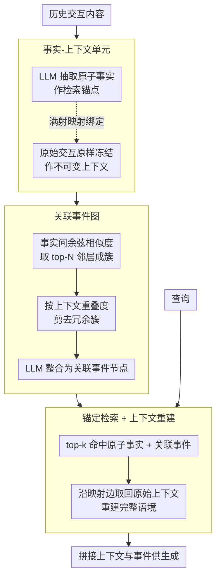

# AnchorMem: Anchored Facts with Associative Contexts for Building Memory in Large Language Models

**会议**: ACL 2026  
**arXiv**: [2604.17377](https://arxiv.org/abs/2604.17377)  
**代码**: [https://github.com/RayNeo-AI-2025/AnchorMem](https://github.com/RayNeo-AI-2025/AnchorMem)  
**领域**: LLM评测  
**关键词**: LLM记忆, 原子事实, 关联事件图, 检索增强, 长期对话

## 一句话总结

提出AnchorMem记忆框架，受普鲁斯特现象启发，将检索单元（原子事实）与生成上下文（原始交互）解耦，通过关联事件图连接碎片化记忆，在LoCoMo基准上大幅超越A-Mem、Mem0等现有记忆系统。

## 研究背景与动机

**领域现状**：LLM在长期多轮交互中需要记忆系统来利用历史经验，现有方法主要分为两类：生成式记忆系统（A-Mem、Mem0）通过频繁改写来整合新信息，图索引方法（GraphRAG、HippoRAG 2）通过实体关系图来结构化知识。

**现有痛点**：生成式记忆系统存在"上下文模糊"问题——频繁改写导致原始交互的细微语境被稀释或丢失。图索引方法则存在"虚假连接"问题——高频但语义泛化的实体（如"油"）会建立误导性的桥梁，导致检索路径错误地混淆不相关事件。

**核心矛盾**：细粒度检索（需要精确的检索单元）与上下文完整性（需要保留原始交互语境）之间存在根本张力。现有方法要么牺牲语境精度换取检索效率，要么因过度结构化引入噪声连接。

**本文目标**：设计一个既能实现精确原子级检索、又能保持原始上下文完整性的记忆框架。

**切入角度**：受认知科学中"普鲁斯特现象"（一个具体感官线索触发完整的情景回忆）启发，将检索锚点与生成上下文显式解耦。

**核心 idea**：提取原子事实作为检索锚点，保留原始交互作为不可变上下文，通过关联事件图建立跨记忆的逻辑连接。

## 方法详解

### 整体框架

AnchorMem 的核心是把「检索用什么」和「生成用什么」彻底拆开：检索单元用精炼的原子事实，生成上下文则保留原封不动的原始交互。它把记忆组织成一张异构图 $\mathcal{G}=(\mathcal{V}, \mathcal{E})$，三类节点分别是交互上下文 $\mathcal{V}_C$、原子事实 $\mathcal{V}_F$ 和关联事件 $\mathcal{V}_E$，边则分为「事实→上下文」的满射映射边和「事实↔事实」的语义关联边。一次完整记忆从写入到读出走三步：先把每段交互拆成原子事实并锚回原始上下文，再把语义相关的事实聚合成关联事件织成图，最后查询时用事实/事件精确定位、用原始上下文还原生成。

### 关键设计

**1. 事实-上下文单元：检索靠原子事实，语境靠不可变原文**

生成式记忆系统的通病是反复改写，把原始交互里的细微语境一点点稀释掉。AnchorMem 的对策是对每段交互 $C_i$ 用 LLM 抽出一组原子事实 $\mathcal{F}_i = \{f_{i,1}, ..., f_{i,n}\}$，每条都是一句简洁、自洽的独立陈述，专门承担「被检索」的职责；与此同时，原始交互内容原样冻结、绝不改写或压缩。

两者通过满射映射 $\mathcal{M}(f) = C_i$ 绑定，于是任何一条被命中的事实都能立刻反查回它所属的完整原文。这样检索拿到的是高精度的原子锚点，生成拿到的是零损耗的原始语境，从机制上规避了「改写导致上下文模糊」这一根本痛点。

**2. 关联事件图：用事件而非实体当跨记忆桥梁**

传统图索引靠实体连接记忆，但「油」「水」这类高频却语义泛化的实体会牵出大量误导性的桥，把本不相关的事件混在一起检索。AnchorMem 改成把语义相关的原子事实聚合成「关联事件」节点，用高阶事件链接把一簇事实绑成共享的事件表示，而不是让它们各自挂到某个通用实体上。

这样既保留了图索引整合碎片信息的能力，又把连接的粒度从「实体级」抬到「事件级」，跨记忆的逻辑桥更精确、更可靠，避开了高频实体带来的虚假连接。

**3. 锚定检索 + 上下文重建：检索求精度，生成求完整**

检索和生成对记忆的诉求其实相反——检索要的是「准」，生成要的是「全」。AnchorMem 让这两者各取所需：查询阶段把问题锚定到具体的原子事实和关联事件上来定位相关记忆，精度来自事实的精确匹配；生成阶段则顺着映射关系取回关联的原始交互片段和事件，重建出完整语境，质量来自原文的无损保留。两个阶段经由满射映射无缝衔接，避免了端到端压缩里精度与完整性的相互妥协。

### 损失函数 / 训练策略

AnchorMem 是 training-free 框架，事实提取与事件构建全部通过 LLM 提示工程完成，无需任何额外训练。

## 实验关键数据

### 主实验

在LoCoMo基准上，使用GPT-4o-mini评估：

| 方法 | Avg F1 | Avg BLEU | Avg ACC |
|------|--------|----------|--------|
| NaiveRAG | 33.06 | 25.90 | 47.92 |
| HippoRAG 2 | 43.11 | 30.52 | 61.82 |
| Mem0 | 29.07 | 23.34 | 39.31 |
| A-Mem | 32.39 | 26.57 | 51.35 |
| LightMem | 41.71 | 32.14 | 61.95 |
| **AnchorMem** | **49.87** | **38.85** | **70.52** |
| **AnchorMem†** | **51.91** | **40.25** | **73.83** |

### 消融实验

| 配置 | 关键优势 | 说明 |
|------|---------|------|
| vs Mem0 | +22.80 F1 | 避免频繁改写的上下文损失 |
| vs HippoRAG 2 | +6.76 F1 | 避免实体级虚假连接 |
| vs LightMem | +8.16 F1 | 原子事实+事件图优于主题摘要 |
| AnchorMem† (增强版) | +2.04 F1 | 进一步优化检索策略 |

### 关键发现

- AnchorMem在所有四类问题（单跳、多跳、开放域、时序）上均优于基线，特别是在单跳问题上F1达到55.84，领先LightMem超过11个百分点
- 在Qwen2.5-32B等开源模型上也展现出一致的优势，证明方法的模型无关性
- AnchorMem因避免频繁改写，实现了所有方法中最快的记忆构建速度

## 亮点与洞察

- 普鲁斯特现象的类比非常精妙：就像一块玛德莲蛋糕的味道能唤起完整的童年记忆，原子事实作为"锚点"触发对完整交互场景的回忆。这一认知科学启发直接转化为了有效的技术设计。
- 检索单元与生成上下文的解耦是核心创新：让检索做检索该做的事（精确匹配），让生成做生成该做的事（完整上下文），两者通过映射关系连接，比端到端压缩更加灵活。
- 关联事件图用"事件"而非"实体"作为跨记忆桥梁，有效避免了通用实体（如人名、常见名词）导致的虚假关联，这个设计可以迁移到其他RAG场景。

## 局限与展望

- 原子事实提取的质量依赖LLM的提示工程，不同LLM可能产生不同质量的事实
- 随着交互历史增长，原子事实和事件节点数量会线性增长，需要考虑长期维护策略
- 目前仅在LoCoMo一个基准上评估，缺少在真实应用场景（如个人助手、客服）中的验证
- 关联事件的构建策略（如何判断哪些事实属于同一事件）值得进一步探索

## 相关工作与启发

- **vs A-Mem**: A-Mem通过检索驱动笔记链接和演化，但频繁改写损失上下文；AnchorMem保持原始上下文不可变
- **vs Mem0**: Mem0做细粒度提取和状态更新，但更新过程中信息损失严重；AnchorMem的F1高出22.8个点
- **vs HippoRAG 2**: 使用实体图作为关联信号重排，但实体级连接不够可靠；AnchorMem用事件级连接更精确

## 评分
- 新颖性: ⭐⭐⭐⭐ 解耦检索-生成+认知科学启发的设计思路新颖
- 实验充分度: ⭐⭐⭐⭐ 多模型、多问题类型的全面对比
- 写作质量: ⭐⭐⭐⭐⭐ 认知科学动机清晰，形式化定义规范
- 价值: ⭐⭐⭐⭐ 为LLM长期记忆系统提供了实用且有效的新范式

<!-- RELATED:START -->

## 相关论文

- [\[ACL 2026\] Lightweight LLM Agent Memory with Small Language Models](lightweight_llm_agent_memory_with_small_language_models.md)
- [\[ACL 2026\] HeLa-Mem: Hebbian Learning and Associative Memory for LLM Agents](hela-mem_hebbian_learning_and_associative_memory_for_llm_agents.md)
- [\[ACL 2026\] ImplicitMemBench: Measuring Unconscious Behavioral Adaptation in Large Language Models](implicitmembench_measuring_unconscious_behavioral_adaptation_in_large_language_m.md)
- [\[ACL 2026\] Agent-GWO: Collaborative Agents for Dynamic Prompt Optimization in Large Language Models](agent-gwo_collaborative_agents_for_dynamic_prompt_optimization_in_large_language.md)
- [\[ACL 2026\] Feedback-Driven Tool-Use Improvements in Large Language Models via Automated Build Environments](feedback-driven_tool-use_improvements_in_large_language_models_via_automated_bui.md)

<!-- RELATED:END -->
