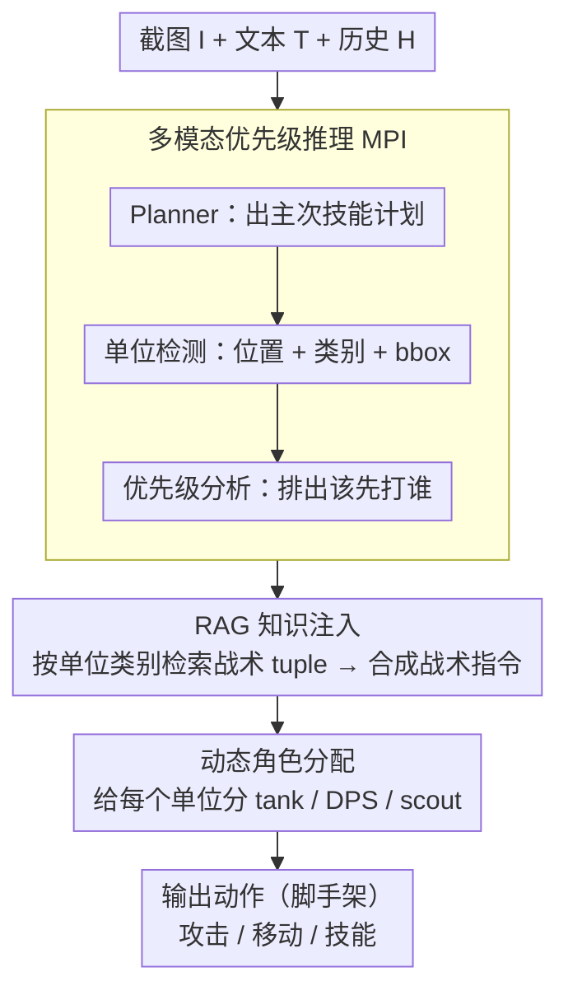

# AVA: Attentive VLM Agent for Mastering StarCraft II

**会议**: ACL 2026  
**arXiv**: [2503.05383](https://arxiv.org/abs/2503.05383)  
**代码**: https://github.com/camel-ai/VLM-Play-StarCraft2  
**领域**: LLM Agent / 多模态游戏 / VLM 决策  
**关键词**: 星际争霸 II, 多模态 RL, 零样本 VLM, 跨范式 benchmark, 优先级推理

## 一句话总结
本文提出 AVACraft——首个同时支持 MARL 和 VLM 两种决策范式的星际争霸 II 多模态基准（21 场景 / RGB+文本+结构化状态），并给出 VLM 基线 AVA（多模态优先级推理 + RAG + 动态角色分配），实验显示在基础 3m 场景 MARL 训练 5M 步只能到 19–27% 胜率，而 VLM 零样本就能拿到 75–90%。

## 研究背景与动机
**领域现状**：StarCraft II 是多智能体决策的金标准 benchmark，SMAC/SMACv2 推动了 MARL 算法（QMIX、MAPPO 等）多年发展。同期 VLM（GPT-4V、Qwen-VL）在零样本视觉推理上崛起，开始被尝试用于复杂游戏决策（LLM-PySC2、VS-Bench 等）。

**现有痛点**：(1) SMAC 系列只支持**抽象特征向量**，丢掉了 RGB 视觉信息，导致 VLM 根本没法接入，造成「VLM 想试 SC2 / MARL 想公平比较」两边都没台子；(2) SMAC 简化了 unit ability，丢了战术深度；(3) 现有 LLM 游戏 benchmark 要么只测 macro-strategy（LLM-PySC2），要么用抽象多智能体设定（VS-Bench），没人专门测**细粒度战术 micromanagement** 上的跨范式对比。

**核心矛盾**：MARL 训练贵但精细可控，VLM 零样本快但能否处理高频微操未知；之前没人能在**同一观测空间**下公平比较。如果不把这两类范式放进同一个评测框架，「VLM 能不能玩 SC2」始终是悬而未决的问题。

**本文目标**：(i) 搭一个原生同时支持 MARL（RGB / scalar / hybrid）和 VLM（RGB + 自然语言 + 结构化 metadata）的 SC2 环境；(ii) 在 21 个微操/协调/战略场景上跑两类范式的完整基线；(iii) 提供一个像样的 VLM agent 基线 AVA，验证「VLM 不仅能玩、还能解释得很像人」。

**切入角度**：把 SC2 的 POMDP 包装成 4 种 observation mode 共存——MARL 拿 RGB / scalar / hybrid，VLM 拿 RGB + 自然语言文本 + 结构化 unit 信息 $\mathcal{U}_t = \{u_i = (\text{id}_i, \text{type}_i, \text{pos}_i, \text{hp}_i, \text{status}_i)\}$，所有模式共用同一套动作空间和奖励，公平可比。

**核心 idea**：通过**多模态统一观测 + 完整 unit ability + 自适应 enemy AI** 的环境设计，把 MARL 与 VLM 抬到同一张评测台上，再用一个轻量 VLM 基线 AVA 证明零样本 VLM 在战术微操上能跑赢长时间训练的 MARL。

## 方法详解

### 整体框架
AVACraft 把 SC2 形式化为一个 POMDP $\langle \mathcal{S}, \mathcal{A}, \mathcal{O}, P, R, \gamma \rangle$，严格遵守 Fog of War（agent 只看到 sight range 内的信息），其设计目标是让 MARL 与 VLM 两类范式在同一观测/动作/奖励空间下公平对决。它的关键在于观测空间 $\mathcal{O}$ 同时提供四种 mode——RGB（screen 160×120 + minimap 32×32）、SMAC 兼容 scalar、Hybrid、以及 VLM-Optimized（RGB + 自然语言描述 + 结构化 unit 列表），而动作空间 $\mathcal{A} = \mathcal{A}_{\text{atk}} \cup \mathcal{A}_{\text{mov}} \cup \mathcal{A}_{\text{abl}}$（攻击/移动/技能）和稀疏奖励 $R \in \{-1, 0, 1\}$ 对所有范式共享。21 个场景覆盖低/中/高/极高四档难度，每个场景都配 1 个 built-in AI（VeryHard）+ 3 个 LLM 合成脚本策略并随机选取，防止单一策略被穷举利用。在这个统一台子上，MARL 侧跑 IQL / QMIX / QTRAN / VDN / MAPPO / IPPO 六种算法（统一 Swin-Tiny 27.5M 视觉骨干、最多 5M 步、可选拼 GTE-Base 文本 embedding），VLM 侧则跑零样本的 AVA agent（GPT-4o / GPT-4-Turbo / GPT-4o-mini / Qwen-VL-Plus / Qwen3-VL-30B / Qwen3-VL-8B），AVA 内部由下述三个组件串成一次决策。

### 关键设计

**1. 多模态优先级推理（MPI）：先想做什么、再看清有谁、最后排该打谁**

SC2 微操的胜负手是 focus fire on the right target——一个 step 选错优先级整波团战就崩，但让 VLM 一口气直接吐动作很容易看错单位、忘了目标。MPI 的破法是把决策拆成三段链式 VLM 调用：先由 Planner 出主次技能计划 $S = \text{VLM}_{\text{plan}}(I, T, H) = \{s_{\text{primary}}, s_{\text{secondary}}\}$，再做单位检测 $A = \text{VLM}_{\text{detect}}(I) = \{a_i = (p_i, c_i, b_i)\}$（位置 + 类别 + bbox），最后用 skill-aware prompt 排出优先级 $U_{\text{priority}} = \text{VLM}_{\text{analyze}}(I, T, H, A, Q, S)$。

每一步都只调用 VLM 原生的视觉 + 语言能力、无需任何微调，而把「优先级」单独抽成一个子调用的好处，是让模型在每个 step 都把注意力压在最关键的 sub-task 上，而不是被全场信息淹没——这也解释了后面 ablation 里 MPI 是掉点最多的组件。

**2. RAG 知识注入：把 SC2 战术常识硬 ground 进 prompt**

VLM 的零样本游戏理解很大程度上是世界知识 + 视觉的合成，但 SC2 战术依赖大量易踩坑的常识（Stalker 怕 Marauder 的慢护甲、Hydralisk 怕 Colossus 的 AOE 等），这些知识虽在预训练里却调用得很不稳定。RAG 组件对 MPI 选出的每个 priority unit $u$ 按其类别 $c_u$ 检索一条知识 tuple $K(u) = \{s_u, m_u, t_u\}$（unit 规格、matchup 数据、战术建议），再由 $D = \text{VLM}_{\text{synthesize}}(I, T, H, U_{\text{priority}}, \{K(u)\})$ 把它们整合成最终战术指令。

用一个外挂 SC2 知识库做硬注入，比让 VLM「凭记忆」更可靠，确保它不会在对位常识上犯低级错误；ablation 也确认 RAG 单独贡献明显，与 MPI 组合后协同效果最强。

**3. 动态角色分配：在出手前先给每个单位分好工**

SC2 团战常要分工——几个 Stalker 拉怪 kite、另几个集火 boss，要是全体单位套同一套策略，协调就会崩。AVA 把角色分配显式建模：从角色集合 $\mathcal{Z}$ 出发定义映射 $\phi: \mathcal{N} \to \mathcal{Z}$，以效用函数 $U(\phi, s)$ 评估当前状态下的角色配置，具体实现为一次独立 VLM 调用 $z_i = \text{VLM}_{\text{role}}(I, T, C)$，看图像 + 文本 + 上下文给每个 unit 分配 tank / DPS / scout 等角色。

在低层动作之前先「分工」，相当于给后续动作生成注入了一个 skill prior，有效降低了动作空间的实际维度；ablation 显示去掉 Role 后胜率从 87% 掉到 70%，说明在这套环境里「协调」比「看图」更稀缺。

### 损失函数 / 训练策略
VLM 端全程零样本、无任何训练。MARL 端则按 SMAC 标准训练 5M 步，2Hz 决策频率，dual A100 40GB，episode 在全灭 / 全死 / 300s 超时三条件下终止，奖励保持稀疏以避免引入偏置。

## 实验关键数据

### 主实验（3m 基础场景）

| 范式 | 方法 | 输入模式 | 训练步数 | 胜率 (%) |
|---|---|---|---|---|
| MARL | MAPPO | Vision+Text | 5M | 19.3 ± 3.2 |
| MARL | IPPO | Vision Only | 5M | 18.2 ± 2.8 |
| MARL | QMIX | Vision Only | 5M | **27.1 ± 4.1** |
| MARL | QTRAN | Vision Only | 5M | 2.0 ± 1.4 |
| MARL | IQL / VDN | Vision Only | 5M | 0.0 |
| VLM (闭源) | GPT-4o | VLM-Optimized | 0 | **81 ± 3.9** |
| VLM (闭源) | GPT-4-Turbo | VLM-Optimized | 0 | 79 ± 4.1 |
| VLM (闭源) | Qwen-VL-Plus | VLM-Optimized | 0 | 75 ± 4.3 |
| VLM (开源) | Qwen3-VL-30B | VLM-Optimized | 0 | 50 ± 5.0 |
| VLM (开源) | Qwen3-VL-8B | VLM-Optimized | 0 | 40 ± 4.9 |

VLM 范式胜率比训练 5M 步的 MARL 高一大截。值得注意：IPPO 加文本反而比纯视觉略掉（16.6 vs 18.2），说明 from-scratch MARL 难有效融合预训文本 embedding，而 VLM 因为预训对齐自然受益于自然语言通道。

### 消融实验（AVA on mixed_units，GPT-4-Turbo）

| Role | MPI | RAG | 胜率 (%) | 含义 |
|---|---|---|---|---|
| ✓ | ✓ | ✓ | **87 ± 3.4** | 完整 AVA |
| ✓ | ✓ | – | 71 ± 4.5 | 去 RAG，掉 16 点 |
| ✓ | – | ✓ | 65 ± 4.8 | 去 MPI，掉 22 点 |
| – | ✓ | ✓ | 70 ± 4.6 | 去 Role，掉 17 点 |
| ✓ | – | – | 24 ± 4.3 | 只 Role，几乎没用 |
| – | ✓ | – | 50 ± 5.0 | 只 MPI |
| – | – | – | 20 ± 4.0 | 裸 VLM |

### 关键发现
- **MPI 是 AVA 最重要的组件**：去掉 MPI 比去 Role / RAG 掉得都多（87→65），说明「先看清要打谁」比「先分好角色」更关键。
- **VLM 在高复杂度场景仍有上限**：2c_vs_64zg、6r_vs_8z 上**所有 VLM 都 0% 胜率**，包括在简单场景能拿 90% 的 Qwen3-VL-30B；这暴露了 VLM 在「连续 kiting、高频精密微操」上的能力天花板。
- **跨模态对齐能力差异显著**：MARL 加文本掉点，VLM 加文本飞起，验证了 VLM 预训对齐带来的 cross-modal grounding 优势。
- **训练效率反差极大**：MARL 5M 步 ≈ 19% vs VLM 0 步 ≈ 81%；但 MARL 一旦训好推理可控、便宜，长期部署成本仍优于反复调 VLM API。

## 亮点与洞察
- **「同一观测空间内对决」是 fair benchmark 的关键**：以前 MARL 用 scalar、LLM 用 string，结论很难复用；本文统一到 POMDP + 多 mode 观测，结果可以直接互比。
- **VLM 的「人类对齐」可被量化**：作者请专业 SC2 玩家做盲评，证明 VLM 决策的可解释性显著高于 MARL（statistical significance），这一点对未来「AI 决策需要被人理解」的场景非常关键。
- **失败案例画出 VLM 能力边界**：极高复杂度场景全部 0% 不是工程 bug，而是真实的「VLM 对密集空间推理 + 高频时序一致性」天花板，给后续研究指了一个明确的 frontier。
- **AVA 三组件分工的可迁移性**：MPI（先看清谁是关键目标）+ Role（分工）+ RAG（注入领域知识）这套组合可以套到任何「实时多智能体 + VLM」场景（自动驾驶车队、机器人协作），是个可复用的 agent recipe。

## 局限与展望
- 主要对比集中在 3m 基础场景上的 5M 步训练，更长训练 / 更新 MARL 算法（如 GRF、HASAC）可能缩短差距，本文未充分覆盖。
- VLM 调用成本与延迟未列详细数字，2Hz 决策对 VLM 已是上限，更高频微操（kiting）就是 0%；real-time 部署可行性有限。
- AVA 是 proof-of-concept，作者自己说不是 architectural contribution，新颖性主要在 benchmark 而非 agent。
- 评测只用 PvE + 少量 PvP，没系统跑 ladder-level VS-human 测试，胜率的「绝对意义」还需更强对手验证。

## 相关工作与启发
- **vs SMAC / SMACv2**: 一直被诟病抽象特征 + 简化能力，本文给了 RGB + 完整能力 + 多 mode 观测的升级版，且开放 VLM 接口。
- **vs LLM-PySC2**: 主要做 macro-strategy（建造、扩张），本文聚焦 micro-management（focus fire、ability timing），互补。
- **vs VS-Bench**: 测多种游戏的策略推理，但抽象多智能体设定；AVACraft 给 SC2 这个金标准提供更细粒度评测。
- **vs Voyager / LLM-Agent for Minecraft**: 都用 VLM/LLM 玩游戏，本文是首个在 SC2 这种实时高频对抗环境下做系统跨范式评测的工作。

## 评分
- 新颖性: ⭐⭐⭐⭐ benchmark 设计原创性强，AVA agent 本身是工程性组合
- 实验充分度: ⭐⭐⭐⭐ 6 MARL × 6 VLM × 21 场景 + 组件 ablation + 人评，覆盖度好
- 写作质量: ⭐⭐⭐⭐ 环境形式化清晰，跨模态 ablation 讲得很直观
- 价值: ⭐⭐⭐⭐⭐ 给 MARL ↔ VLM 对话提供了首个标准化竞技场，社区急需

<!-- RELATED:START -->

## 相关论文

- [\[AAAI 2026\] PerTouch: VLM-Driven Agent for Personalized and Semantic Image Retouching](../../AAAI2026/llm_agent/pertouch_vlm-driven_agent_for_personalized_and_semantic_image_retouching.md)
- [\[ICCV 2025\] GTR: Guided Thought Reinforcement Prevents Thought Collapse in RL-based VLM Agent Training](../../ICCV2025/llm_agent/gtr_guided_thought_reinforcement_prevents_thought_collapse_i.md)
- [\[ACL 2026\] Grounding Agent Memory in Contextual Intent](grounding_agent_memory_in_contextual_intent.md)
- [\[ACL 2026\] Mem^p: Exploring Agent Procedural Memory](memp_exploring_agent_procedural_memory.md)
- [\[ACL 2026\] GOAT: A Training Framework for Goal-Oriented Agent with Tools](goat_a_training_framework_for_goal-oriented_agent_with_tools.md)

<!-- RELATED:END -->
