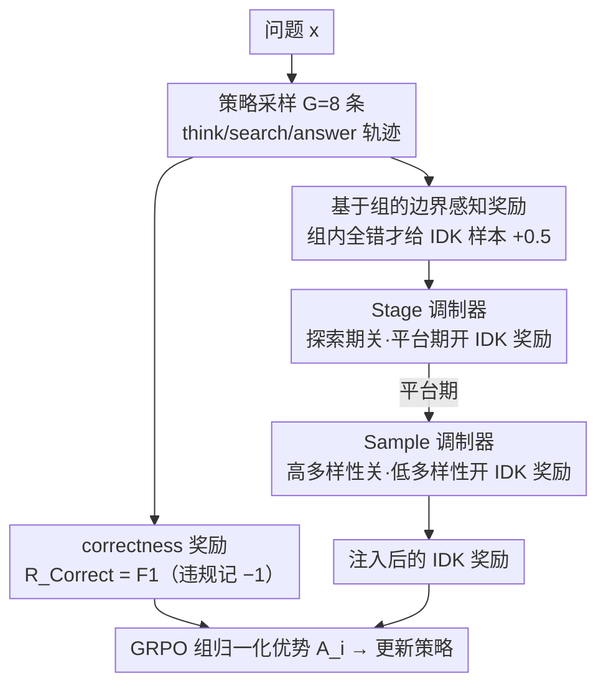

# BAPO: Boundary-Aware Policy Optimization for Reliable Agentic Search

**会议**: ACL 2026  
**arXiv**: [2601.11037](https://arxiv.org/abs/2601.11037)  
**代码**: https://github.com/Liushiyu-0709/BAPO-Reliable-Search (有)  
**领域**: LLM Agent / 强化学习  
**关键词**: agentic search, 边界感知, GRPO, IDK 拒答, 可靠性

## 一句话总结
针对 RL 训练后的 agentic search 模型几乎从不说"I DON'T KNOW"导致编造答案的可靠性问题，BAPO 在 GRPO 之上加入"基于组的边界感知奖励 + 自适应奖励调制器"，让模型只在真正越界时才拒答，相对 GRPO 在四个多跳 QA 上把 reliability 平均提升约 9.7%，且仅用 5k 训练样本就超过 90k 样本训练的 Search-R1。

## 研究背景与动机
**领域现状**：基于 RL（GRPO）训练的 agentic search 模型（Search-R1、ReSearch、R1-Searcher、Tool-Star 等）通过 ReAct 式的 `<think>/<search>/<answer>` 交互显著提升了多跳 QA 准确率，已成为知识密集型 LLM 应用的主流路线之一。

**现有痛点**：这些 RL 模型几乎从不承认"不知道"。Qwen2.5-7B-Instruct 在 RL 之前还有 18.75% 的 IDK 率、精度 50.76（远高于准确率 41.25），但被 GRPO 训成 ReSearch-7B 后 IDK 率骤降到 3.65%，精度只剩 53.24——模型被奖励"逼着"对所有问题强行给答案，于是大量编造看似合理但错误的答案，用户又无法在冗长的多轮搜索链里验证，可靠性严重退化。

**核心矛盾**：标准 correctness 奖励同时鼓励"穷尽探索去答对"和"惩罚一切不确定表达"，二者在难题上互斥。一种朴素修补——对 IDK 给 +0.5 固定奖励——立刻被模型当作偷懒捷径（IDK 率飙到 53.1%），换皮成 reward hacking，准确率反而下滑。

**本文目标**：(i) 如何为 agentic search 这种动态、与检索强耦合的"推理边界"构造可靠的学习信号；(ii) 如何把这个信号融进 RL 而不引发新的 reward hacking。

**切入角度**：把"边界"定义为可被组采样验证的属性——如果一组 G 条 rollout 没有一条答对，则该问题超出了当前策略的边界；同时观察到训练有明显的"探索-平台"两阶段，于是奖励应当阶段性、样本级地自适应开启。

**核心 idea**：用"只有当组内全军覆没时才给 IDK 奖励"的边界感知奖励，外加"探索期关 / 平台期开 + 高多样性样本关 / 低多样性样本开"的自适应调制器，把诚实拒答的能力训进 agentic search 模型，同时保住深度探索。

## 方法详解

### 整体框架
BAPO 把"敢于拒答"训进 agentic search 模型，整条流水线只动 GRPO 的奖励层，不改策略架构、也不需要冷启动 SFT。对每个问题 $x$，策略先采样 $G=8$ 条交错 `<think>/<search>/<result>/<answer>` 的轨迹 $\{\tau_i\}_{i=1}^{G}$；每条轨迹同时算两项奖励——衡量答对的 correctness reward 和只在整组全错时才奖励 IDK 的 boundary-aware reward，二者相加后送进 GRPO 的组归一化优势 $A_i$。一个自适应调制器再按训练阶段与样本多样性决定是否真正注入 IDK 奖励，从而在"先学会解题、再学会认怂"之间取得平衡。

### 关键设计

**1. 基于组的边界感知奖励：用一组 rollout 的"全军覆没"当越界证据**

朴素做法是对任何 IDK 响应都给固定奖励，但这会被模型当成偷懒捷径——简单题也直接拒答，reward hacking 立刻把 IDK 率推到 53%。BAPO 的关键洞察是把"边界"从静态的参数化知识改写成一个可被组采样验证的事件：对组 $\{\tau_i\}$，correctness reward 取 $\mathcal{R}^{\textit{Correct}}=\text{F1}$（格式不合法则记 $-1$），只有当 $\forall i,\ \mathcal{R}^{\textit{Correct}}(\tau_i)\le 0$、即一组里没有一条答对时，才判定该问题超出当前策略的边界，此时对 IDK 样本给 $\mathcal{R}^{\textit{IDK}}=0.5\cdot\mathbb{I}(y_i=\text{IDK})$；只要组内存在任一正确答案，这一项立即归零。这样 IDK 奖励就和"题目本身可不可解"解耦了——可解的题拿不到拒答奖励，逼模型继续探索；真正越界的题才用诚实拒答换分。由于信号天然以组为单位，它能被 GRPO 的优势归一化无缝吸收，无需任何外部标注或置信度模型。

**2. Stage-level 调制器：探索期关、平台期开，并对难题加采样**

preliminary 实验暴露出一个陷阱：如果一开始就放开 IDK 奖励，模型会在还没学会解题前先学会偷懒。BAPO 因此把奖励 schedule 与学习曲线绑定。训练前期是"探索阶段"，默认禁用 $\mathcal{R}^{\textit{IDK}}$，仅当组内 IDK 比例 $\rho_{\text{IDK}}<\alpha=5\%$ 时才短暂放行，防止拒答抢走探索机会；当验证集分数连续 5 步停滞，就切到"平台阶段"全量启用 $\mathcal{R}^{\textit{IDK}}$。平台期还对组内全错的难题最多重采 $k=2$ 次（等效 pass@24），直到出现 IDK 或正确答案才结算，让"是否越界"判得更准。这套阶段感知的设计揭示了一个常被忽视的事实——同一个奖励在探索期是毒药、在平台期才是良药。

**3. Sample-level 调制器：用 rollout 多样性当隐式置信度**

进入平台期后，BAPO 还在单个样本粒度上决定是否启用 IDK 奖励，依据是这一组 rollout 的输出多样性。以 $|\{y_{1..G}\}|\ge G/2$ 作为"高多样性"判据——说明模型仍在主动探索解空间，此时关闭 $\mathcal{R}^{\textit{IDK}}$ 以免过早收敛到拒答；反之多样性低意味着模型已经稳定倾向于某个固定输出，再探索也难有突破，于是开启 $\mathcal{R}^{\textit{IDK}}$ 强化边界感知。这里把 rollout 一致性当作置信度的廉价代理，免去显式不确定性估计或额外采样，让奖励精准地落在"该探索的地方继续探索、该认怂的地方学会认怂"。

### 损失函数 / 训练策略
策略目标仍是带 clip 的 GRPO（$\epsilon=0.1$），KL 系数 0.001，rollout 数 $G=8$，温度 1.0，max tokens 8192，最多 3 次工具调用；优势 $A_i$ 在组内做 z-score 归一化。检索环境基于 FlashRAG + E5-base-v2 + 2018 Wikipedia，top-5 文档；训练集仅 5k 条（来自 HotpotQA / 2WikiMultiHopQA），2 个 epoch，batch=64。

## 实验关键数据

### 主实验
Qwen2.5-7B-Instruct 上四个多跳 QA 的 Acc / Precision / Reliability（Rel.=$(1-\rho_{\text{IDK}})\cdot\text{prec}+\rho_{\text{IDK}}\cdot\text{acc}$）：

| 方法 | HotpotQA Rel. | MuSiQue Rel. | 2Wiki. Rel. | Bamboogle Rel. | 平均 |
|------|---------------|--------------|-------------|----------------|------|
| Search-R1 (90k 样本) | 49.0 | 22.5 | 39.0 | 52.0 | 40.6 |
| ReSearch (19k 样本) | 61.5 | 31.0 | 54.2 | 54.4 | 50.3 |
| GRPO (5k 样本) | 60.0 | 29.5 | 59.5 | 57.6 | 51.7 |
| Reliable RFT | 40.2 | 18.5 | 23.9 | 49.4 | 33.0 |
| Reliable TIR Prompt | 60.6 | 27.2 | 43.3 | 50.5 | 45.4 |
| **BAPO (5k 样本)** | **65.5** | **36.6** | **63.3** | **61.2** | **56.7** |

BAPO 在仅 5k 样本下 reliability 平均比 GRPO 高 5.0（+9.7% 相对），且超过用 18×/4× 数据训练的 Search-R1/ReSearch；其策略是"略降准确率（-2.2）换大幅精度提升（+11.8）"。

### 消融实验
Qwen2.5-3B-Instruct，四数据集平均：

| 配置 | Acc | Prec | $\rho_{\text{IDK}}$ | Reliability |
|------|-----|------|---------------------|-------------|
| **BAPO 完整版** | **44.8** | 52.8 | 16.8% | **51.3** |
| w/o 边界感知奖励（换成固定 +0.5） | 30.6 | 62.4 | 53.1% | 44.8 |
| w/o Sample 调制器 | 43.3 | 52.0 | 20.4% | 50.1 |
| w/o Sample + Stage 调制器 | 37.8 | 56.0 | 35.2% | 49.0 |

### 关键发现
- 把"组级触发"换成"固定 IDK 奖励"后 $\rho_{\text{IDK}}$ 飙到 53.1%、Acc 跌 14 个点——验证了 reward hacking 的存在与组级触发的必要性。
- Stage 调制器最关键：去掉两个调制器后 $\rho_{\text{IDK}}$ 从 16.8% 翻倍到 35.2%、Acc 跌 7 个点，说明探索期必须屏蔽 IDK 奖励。
- 超参 $\alpha$ 敏感性：$\alpha=0$ 时 $\rho_{\text{IDK}}=0$（模型早期完全没机会学拒答，平台期也学不会），$\alpha=0.05$ 取得最佳，$\alpha\ge 0.2$ 又过分鼓励拒答；重采样 $k$ 从 1→2 显著提升，$k=3$ 几乎饱和。
- 在 7B / 14B 上 BAPO 拒答时 GRPO 模型的错误率分别为 76.7% / 76.7%——拒答主要落在 GRPO 也答不对的题上，证明拒答是"理性"的而非乱拒。
- 14B 训练曲线：探索期前 60 步 $R^{\textit{Correct}}$ 0.3→0.5、$\rho_{\text{IDK}}$ 20%→5%；切到平台期后 $R^{\textit{IDK}}$ 升至 0.25–0.30，$\rho_{\text{IDK}}$ 回升到 25%+。

## 亮点与洞察
- **把"边界"操作化为组级事件**：不用外部知识库、不用置信度建模，就用 GRPO 现成的 G 条 rollout 一致失败作为越界证据，几乎零额外成本地嵌进 GRPO 流水线，是非常优雅的工程取舍。
- **训练阶段感知的奖励 schedule**：揭示了一个被忽视的事实——同一个奖励在探索期是毒药、在平台期是良药，"什么时候给奖励"和"给什么奖励"同样重要，这一思路可迁移到任何多目标 RLHF 场景（如安全 vs 有用）。
- **rollout 多样性 = 隐式置信度**：用 $|\{y_{1..G}\}|\ge G/2$ 判断模型是否还在探索，免去显式置信度估计或额外采样，启发把"采样一致性"当作样本级别 RL 调度的便宜信号。
- **5k 样本打过 90k 样本**：说明 agentic search 的瓶颈早已不在数据规模，而在 reward shaping；reliability-first 的训练范式可能比堆数据更经济。

## 局限与展望
- 仅在 Wikipedia local RAG 上评测，没有覆盖真实 web search 的噪声、动态性和延迟，工程落地时 IDK 触发逻辑可能需要重新校准；
- 评测仅覆盖知识密集型 QA，对数学、代码、agentic web 任务等"非检索可解"问题，"组内全错"是否仍是可靠的越界代理尚未验证；
- 实验最大 14B，未在 70B+ 验证；大模型 base reliability 本身更强，BAPO 的边际收益可能被压缩；
- $\rho_{\text{IDK}}$、$\alpha$、$k$ 等超参对训练动力学敏感，跨任务跨模型调参成本不容忽视；
- 可延伸：把 stage-level 调制器变成验证集驱动的自动课程；把组级触发推广到工具调用失败、安全违规等其他"越界"信号。

## 相关工作与启发
- **vs Search-R1 / ReSearch / R1-Searcher**: 它们只用 correctness reward 追准确率，BAPO 在保留它们 RL 架构的同时新增边界感知信号；BAPO 用 5k 样本就拿到更高 reliability。
- **vs BARREL (Yang et al., 2025a)**: BARREL 给 IDK 一个静态中等奖励 + 蒸馏推理轨迹，本文的消融恰恰证明静态 IDK 奖励等价于偷懒陷阱（$\rho_{\text{IDK}}=53.1\%$），BAPO 用动态组级触发解决了这一点。
- **vs Reliable RFT (拒绝采样 SFT)**: RFT 把 IDK 当样本灌进去导致严重过保守（Acc 大跌 27 点），BAPO 用 RL 在线建模边界、不破坏探索。
- **vs Knowledge / Capability Boundary (Zheng 2025, Zhang 2025c)**: 它们在静态参数知识或数学能力上定义边界，BAPO 处理的是 plan+检索+推理动态合成的"涌现边界"，更贴合 agentic 场景。
- **vs 不确定性估计方法 (semantic entropy, P(True), verbalized confidence)**: 这些是事后检测，BAPO 是把"何时拒答"训进策略本身，二者正交可叠加。

## 评分
- 新颖性: ⭐⭐⭐⭐ 组级边界触发 + 阶段/样本双调制器是新颖且简洁的奖励设计。
- 实验充分度: ⭐⭐⭐⭐ 4 数据集 × 3 模型规模 × 消融 + 超参敏感性 + EM/LLM-judge 双指标 + 案例研究。
- 写作质量: ⭐⭐⭐⭐ preliminary study 把动机讲得很清楚，框架图和阶段动力学图直观。
- 价值: ⭐⭐⭐⭐ 让 agentic search 落地从"看起来很准"走向"敢于认怂"，对生产环境有真实价值。

<!-- RELATED:START -->

## 相关论文

- [\[ACL 2026\] SEARL: Joint Optimization of Policy and Tool Graph Memory for Self-Evolving Agents](searl_joint_optimization_of_policy_and_tool_graph_memory_for_self-evolving_agent.md)
- [\[NeurIPS 2025\] Group-in-Group Policy Optimization for LLM Agent Training](../../NeurIPS2025/llm_agent/groupingroup_policy_optimization_for_llm_agent_training.md)
- [\[ICLR 2026\] Exploratory Memory-Augmented LLM Agent via Hybrid On- and Off-Policy Optimization](../../ICLR2026/llm_agent/exploratory_memory-augmented_llm_agent_via_hybrid_on-_and_off-policy_optimizatio.md)
- [\[ACL 2026\] Rethinking Reasoning-Intensive Retrieval: Evaluating and Advancing Retrievers in Agentic Search Systems](rethinking_reasoning-intensive_retrieval_evaluating_and_advancing_retrievers_in_.md)
- [\[ICLR 2026\] MC-Search: Evaluating and Enhancing Multimodal Agentic Search with Structured Long Reasoning Chains](../../ICLR2026/llm_agent/mc-search_evaluating_and_enhancing_multimodal_agentic_search_with_structured_lon.md)

<!-- RELATED:END -->
