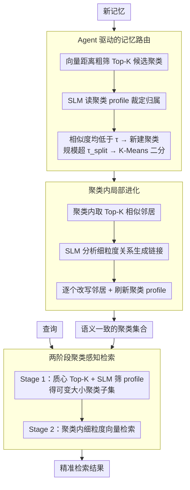

# CLAG: Adaptive Memory Organization via Agent-Driven Clustering for Small Language Model Agents

**会议**: ACL 2026  
**arXiv**: [2603.15421](https://arxiv.org/abs/2603.15421)  
**代码**: [https://github.com/dmis-lab/CLAG](https://github.com/dmis-lab/CLAG)  
**领域**: 模型压缩  
**关键词**: 小语言模型、聚类记忆、Agent记忆管理、局部进化、两阶段检索

## 一句话总结
本文提出 CLAG，一种基于聚类的 Agent 记忆框架，通过 SLM 驱动的路由将记忆组织到语义一致的聚类中，在聚类内部进行局部进化更新，并通过两阶段检索过滤噪声，在多个 QA 数据集上显著优于全局记忆池基线。

## 研究背景与动机

**领域现状**：LLM Agent 越来越多地依赖外部记忆系统来支持知识复用和复杂推理。现有的 Agent 记忆系统从静态 RAG（仅追加、全局检索）发展到了支持主动进化的框架（如 A-mem、MemoryOS、GAM），可以进行反思、压缩和重写。

**现有痛点**：这些进化记忆系统仍然在单一全局记忆池中操作。随着记忆增长，全局检索面临两个耦合问题：(1) 搜索空间扩大，检索到语义相近但任务无关的记忆的概率增加；(2) 记忆进化机制暴露于主题混合的邻域中，可能误导更新并逐渐降低记忆质量。

**核心矛盾**：这些问题对小语言模型（SLMs）尤其严重，因为 SLMs 对无关上下文极其敏感。全局记忆池中的跨主题干扰会显著影响 SLM 的回答质量。

**本文目标**：为 SLM Agent 设计一种轻量级结构化记忆系统，在保持自进化能力的同时减少跨主题干扰。

**切入角度**：借鉴认知科学中"新信息应细化相关模式而不扰动无关记忆结构"的原则，将聚类作为 Agent 主动控制的操作而非静态预处理步骤。

**核心 idea**：用 SLM Agent 驱动的在线聚类将记忆组织到语义一致的邻域中，将进化和检索限制在局部聚类内部，从根本上减少跨主题干扰。

## 方法详解

### 整体框架
CLAG 是一个推理时运行、无需训练的结构化记忆框架，目标是让小语言模型 Agent 在保持自进化能力的同时摆脱全局记忆池的跨主题干扰。它的输入是源源不断写入的新记忆和查询，中间把记忆组织进一组语义一致的聚类，输出则是经过聚类过滤后的精准检索结果。整条流水线由三个环节串起来：Agent 路由把每条新记忆送进最相关的聚类，局部进化只在该聚类内部更新和整合相关记忆，两阶段检索则先筛聚类再在聚类内细粒度匹配。值得注意的是，路由、进化、选择这三类决策全部由同一个 SLM 主干承担，只是换上不同角色的 prompt。

### 关键设计

**1. Agent 驱动的记忆路由：让 SLM 而非纯向量决定记忆归属**

记忆该放进哪个聚类，单靠向量距离往往分不清细微的语义差异。CLAG 因此设计了两阶段路由：系统先经历冷启动阶段，在已处理记忆数小于 $n$ 时把记忆缓冲起来，积累足够数据后由 InitializeClusters 建立初始聚类；此后对每条新记忆，先用向量距离粗筛出 Top-K 候选聚类，再交给 SLM Agent 阅读各候选聚类的语义 profile 做最终裁定。若与所有聚类的余弦相似度都低于阈值 $\tau$，就新建一个聚类容纳它；而当某个聚类规模超过 $\tau_{split}$，则用 K-Means 自动二分，避免聚类膨胀导致语义漂移。粗筛保证效率、SLM 复核保证精度、自适应分裂保证聚类边界长期清晰，三者共同维持了聚类的语义一致性。

**2. 聚类内局部进化：把记忆更新关在语义一致的邻域里**

记忆进化最容易出问题的地方，是在主题混杂的全局池里更新，相近但无关的记忆会误导改写、逐步拉低质量。CLAG 借鉴人脑"新经验主要重塑相关概念、而非扰动无关知识"的认知原则，把进化严格限制在聚类内部。新记忆 $m_{new}$ 被路由到某聚类后，只在该聚类里找 Top-K 最相似的邻居 $\mathcal{M}_{local}$；SLM Agent 先分析它们之间的细粒度关系（因果、时序等）生成链接 $L_{new}$，再逐个判断邻居是否需要改写以反映新信息：$m_j^* \leftarrow \text{SLM}(m_{new} \| \mathcal{M}_{local} \setminus \{m_j\} \| m_j)$。进化后的记忆替换原记忆，聚类 profile 同步刷新。这样每个聚类都成了一个自包含、自优化的模块，局部更新不会污染其它主题。

**3. 两阶段聚类感知检索：先做高层语义过滤再细粒度匹配**

全局检索的主要噪声来自语义相似但主题不同的记忆，这对脆弱的 SLM 尤其致命。CLAG 把检索拆成两段：Stage 1 先把查询嵌入后计算它与各聚类质心的距离，取 Top-K 候选聚类，再由 SLM Agent 评估每个候选聚类的 profile 与查询的匹配度，返回一个大小可变的聚类子集；Stage 2 才在选中聚类的成员里做细粒度向量检索。先用聚类 profile 完成一轮高层语义过滤、大幅缩小搜索空间，再让 SLM 处理范围已经收窄的候选，正好规避了小模型对无关上下文的敏感性。

### 损失函数 / 训练策略
无需训练，框架在推理时运行。路由、进化和检索决策均通过 SLM 的 prompt 调用完成。

## 实验关键数据

### 主实验（三个 SLM 主干 × 三个数据集）

| 模型 | 方法 | LoCoMo F1 | HotpotQA F1 | BioASQ F1 |
|------|------|-----------|-------------|-----------|
| Qwen3-0.6B | RAG | 12.90 | 11.75 | 2.40 |
| Qwen3-0.6B | A-mem | 14.29 | 12.04 | 3.61 |
| Qwen3-0.6B | GAM | 16.05 | 7.81 | 3.40 |
| Qwen3-0.6B | **CLAG** | **20.99** | **15.50** | **22.01** |
| Llama3.2-1B | GAM | 22.63 | 13.85 | 6.52 |
| Llama3.2-1B | **CLAG** | **21.05** | **14.20** | **10.16** |

### 延迟比较（Qwen3-0.6B）

| 方法 | 检索延迟(ms) | 端到端延迟(ms) |
|------|-------------|---------------|
| RAG | 17.80 | 289.60 |
| GAM | 8303.41 | 17934.32 |
| CLAG | 142.43 | 514.14 |

### 关键发现
- CLAG 在 BioASQ 上提升最显著（Qwen3-0.6B: 2.40→22.01），因为生物医学问答的主题差异性大，聚类过滤效果最明显
- 延迟方面 CLAG 远优于 GAM（514ms vs 17934ms），因为避免了全局进化操作
- 在 LoCoMo 的对抗性问题子集上，CLAG 优势尤为突出（50.34 vs GAM 41.25），说明聚类有效抑制了干扰记忆
- MemoryOS 在小模型上表现异常差（大幅低于 RAG 基线），暗示其设计不适合 SLM

## 亮点与洞察
- **聚类即 Agent 操作**：将聚类从静态预处理提升为 Agent 主动控制的在线操作，聚类质量随交互积累持续改善。这种"结构化即智能"的思路可推广到其他长期记忆场景。
- **局部进化避免全局污染**：将进化操作限制在聚类内部，每个聚类成为自包含的优化单元。这类似于模块化神经网络的设计思想——局部更新不影响全局。
- **SLM 友好设计**：两阶段检索将搜索空间大幅缩减后再让 SLM 处理，有效规避了小模型对无关上下文的脆弱性。

## 局限与展望
- 聚类初始化需要积累一定量的记忆（冷启动问题），初始阶段无法享受聚类收益
- SLM 作为路由器的质量上限受限于模型能力，对于语义边界模糊的主题可能路由不准
- 缺少在大语言模型上的实验，无法确认聚类对大模型是否同样有效
- 聚类数量的自动管理（分裂阈值）需要根据领域调参

## 相关工作与启发
- **vs A-mem**：A-mem 在全局池中进化，跨主题干扰严重。CLAG 将进化限制在聚类内，F1 在 Qwen3-0.6B 上从 14.29 提升到 20.99
- **vs GAM**：GAM 全局进化导致极高延迟（17934ms）。CLAG 聚类内局部进化仅 514ms，快 35 倍
- **vs MemoryOS**：MemoryOS 在 SLM 上性能崩塌（低于 RAG 基线），说明其设计假设了较强的模型能力。CLAG 专为 SLM 优化

## 评分
- 新颖性: ⭐⭐⭐⭐ Agent 驱动的在线聚类和局部进化是有意义的新组合
- 实验充分度: ⭐⭐⭐⭐ 三个数据集三个模型，延迟分析充分
- 写作质量: ⭐⭐⭐⭐ 概念图清晰，与认知科学的类比恰当
- 价值: ⭐⭐⭐⭐ 对 SLM Agent 记忆问题提供了实用解决方案

<!-- RELATED:START -->

## 相关论文

- [\[ACL 2026\] Lightweight LLM Agent Memory with Small Language Models](lightweight_llm_agent_memory_with_small_language_models.md)
- [\[ACL 2026\] Context-Value-Action Architecture for Value-Driven Large Language Model Agents](context-value-action_architecture_for_value-driven_large_language_model_agents.md)
- [\[ACL 2026\] Don't Adapt Small Language Models for Tools; Adapt Tool Schemas to the Models](don39t_adapt_small_language_models_for_tools_adapt_tool_schemas_to_the_models.md)
- [\[ACL 2026\] Meta-Tool: Efficient Few-Shot Tool Adaptation for Small Language Models](meta-tool_efficient_few-shot_tool_adaptation_for_small_language_models.md)
- [\[ACL 2026\] Polaris: A Gödel Agent Framework for Small Language Models through Experience-Abstracted Policy Repair](polaris_a_gödel_agent_framework_for_small_language_models_through_experience-abs.md)

<!-- RELATED:END -->
