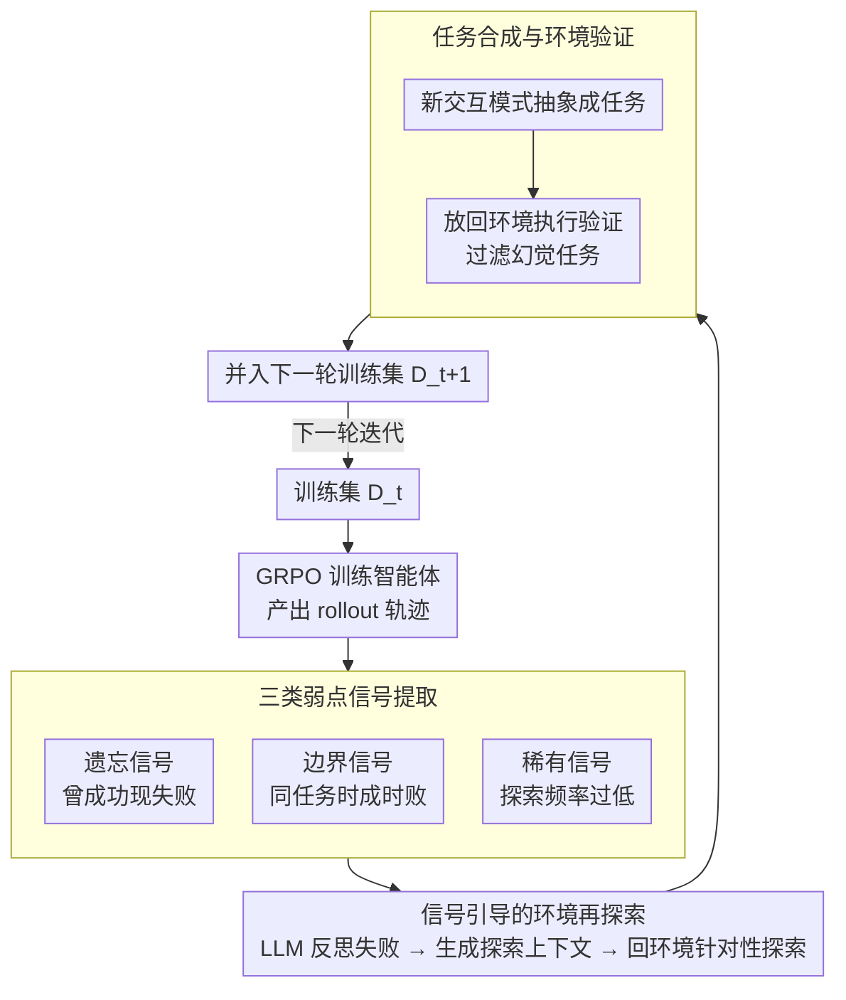

# CoEvolve: Training LLM Agents via Agent-Data Mutual Evolution

**会议**: ACL 2026  
**arXiv**: [2604.15840](https://arxiv.org/abs/2604.15840)  
**代码**: [https://github.com/AMAP-ML/CoEvolve](https://github.com/AMAP-ML/CoEvolve)  
**领域**: LLM Agent  
**关键词**: 智能体训练、数据合成、共进化、遗忘信号、强化学习

## 一句话总结
CoEvolve 提出**智能体-数据共进化框架**，通过从训练轨迹中提取遗忘/边界/稀有三类弱点信号，引导 LLM 做针对性环境再探索和任务合成，使训练数据分布随智能体能力动态适应，在 AppWorld 和 BFCL 上分别带来 19-23% 的绝对提升。

## 研究背景与动机

**领域现状**：LLM Agent 通常通过 RL 在交互环境中训练，但训练数据来源是核心瓶颈——要么依赖人工专家轨迹（昂贵、覆盖有限），要么用 LLM 合成静态数据（无反馈、无法适应智能体演化）。

**现有痛点**：(1) 人工专家轨迹是"静态快照"，无法覆盖真实世界的长尾变体（如按钮标签从"Book Now"变为"Reserve Now"就会失败）；(2) LLM 合成数据虽减少了人工依赖，但基于随机探索，环境覆盖浅且不完整；(3) 更关键的是，合成数据是静态的，无法随智能体能力演化而调整——智能体已掌握的技能被过度训练，而弱点被忽视。

**核心矛盾**：智能体的能力在持续变化，但训练数据分布是固定的——缺乏闭环反馈使得训练效率低下且无法持续改进。

**本文目标**：设计一个无需人工监督的框架，让训练数据分布随智能体的演化弱点动态调整，实现"智能体改进→发现新弱点→合成针对性数据→智能体再改进"的闭环。

**切入角度**：利用训练过程中的轨迹回放信号（遗忘、边界、稀有模式）来识别智能体的具体弱点，以此为条件引导 LLM 做定向环境探索。

**核心 idea**：从 RL 训练的 rollout 轨迹中提取弱点信号，条件化地引导 LLM 在环境中再探索，合成针对弱点的新任务，更新训练分布，形成智能体-数据共进化闭环。

## 方法详解

### 整体框架
CoEvolve 要解决的是"训练数据静态、智能体能力动态"的错配，做法是把数据合成挂到智能体当前的弱点上去。一轮迭代里，智能体先用 GRPO 在环境中训练并产出 rollout 轨迹，系统从这批轨迹里抽取遗忘、边界、稀有三类弱点信号；信号连同对应失败轨迹被喂给一个 LLM 去反思并生成结构化探索上下文，引导它回到环境里针对弱点区域再探索；新发现的交互模式被抽象成任务、经环境验证后并入下一轮训练集。如此"训练→发现弱点→合成针对性数据→再训练"循环往复，让数据分布随智能体能力一起演化。

### 关键设计

**1. 三类弱点信号提取：从轨迹里定位智能体的具体短板**

随机合成数据的问题在于它不知道智能体哪里弱，于是把算力浪费在已经掌握的技能上。CoEvolve 从 rollout 轨迹里抽三类互补信号来精确定位短板。遗忘信号用滑动窗口检测能力退化：若最近 $W$ 次尝试中存在成功（$\exists s_i \geq 0.5$）但当前这次失败（$s_{\text{now}} < 0.5$），说明智能体"忘"掉了曾经学会的能力。边界信号捕捉行为不稳定：同一任务在单次训练中采样的 $K$ 条轨迹里同时出现成功与失败，意味着智能体正卡在该任务的决策边界上。稀有信号识别探索不足：某个动作模式的出现频率虽大于零但低于阈值（$c_p/N < \theta/100$），说明环境中存在被系统性忽略、没充分探索的交互。三者分别对应能力退化、不稳定、探索盲区，合起来给出一张完整的弱点地图，比无差别采样高效得多。

**2. 信号引导的环境再探索：让 LLM 带着失败画面去补课**

光知道哪里弱还不够，得把弱点转成可探索的方向。CoEvolve 把信号标注的失败轨迹（任务描述、动作序列、环境反馈）整体交给 LLM，要求它先反思失败原因，再生成结构化的探索上下文——明确写出在环境的哪个位置、以何种方式失败或不稳定。随后用这份上下文去条件化 LLM，让它带着这个"靶子"回到真实环境里交互，发现与弱点相关的新交互模式和任务变体。与漫无目的的随机探索相比，这种信号条件化的探索始终聚焦在智能体当下最薄弱的区域，把探索预算花在刀刃上。

**3. 任务合成与环境验证：把新交互固化成可复用、可执行的训练任务**

再探索发现的交互如果不加约束直接当训练数据，很容易混入 LLM 幻觉出来的"假任务"。CoEvolve 先把这些新交互模式抽象成任务描述（保证可复用），再放回环境中实际执行做验证，只有真正可执行、能产生有效反馈的任务才并入下一轮训练集 $\mathcal{D}_{t+1}$。整条链路——探索、合成、验证——全程无需人工介入，环境本身充当了过滤幻觉任务的客观裁判，这也是消融里去掉环境验证后性能显著下滑的原因。

### 损失函数 / 训练策略
智能体用 GRPO 训练：对每个任务采样 $K$ 条轨迹，按组内相对优势计算策略梯度，并用 KL 正则化约束策略不偏离参考模型太远。信号提取、信号引导再探索、任务合成与验证则在每个训练迭代结束后执行一次，更新出下一轮的数据分布。

## 实验关键数据

### 主实验

| 模型 | AppWorld-TestN TGC | AppWorld-TestC TGC | BFCL Multi-turn | 平均提升 |
|--------|------|------|------|------|
| Qwen2.5-7B + CoEvolve | 27.98 (+26.79) | 8.39 (+7.67) | 61.50 (+48.00) | **+19.43%** |
| Qwen3-4B + CoEvolve | 35.71 (+19.04) | 17.03 (+9.12) | 63.00 (+36.50) | **+15.58%** |
| Qwen3-30B-A3B + CoEvolve | 54.76 (+23.21) | 31.65 (+11.75) | 63.00 (+19.50) | **+18.14%** |

### 消融实验

| 配置 | 关键指标 | 说明 |
|------|---------|------|
| 仅遗忘信号 | 有效但不完整 | 只捕获能力退化 |
| 仅边界信号 | 有效但不完整 | 只捕获不稳定行为 |
| 仅稀有信号 | 有效但不完整 | 只捕获探索不足 |
| 三类信号联合 | **最佳** | 互补弱点全面覆盖 |
| 无环境验证 | 显著下降 | 幻觉任务引入噪声 |

### 关键发现
- CoEvolve 使 Qwen2.5-7B 从几乎不可用（1.19%）变为中等水平（27.98%），提升幅度惊人
- 在 BFCL 上 Qwen2.5-7B+CoEvolve 达 61.50%，甚至超越 GPT-4（54.00%），说明数据质量可以弥补模型规模差距
- Qwen3-30B-A3B+CoEvolve 在 AppWorld-TestN 上达 54.76%，接近 Claude-Sonnet-4.5（73.81%）
- 三类信号互补——单独使用任何一类都不如联合使用

## 亮点与洞察
- **"遗忘信号"作为数据选择标准**是本文最巧妙的设计：借鉴课程学习中的遗忘事件概念，将其用于引导数据合成而非数据选择。这个思路可迁移到任何需要动态数据分布调整的训练场景
- **闭环设计**（训练→发现弱点→合成数据→再训练）比单纯的数据增强更本质——它让训练分布和模型能力共同演化，是一种自适应课程学习
- 在 BFCL 上 7B 模型超越 GPT-4 的结果极为亮眼，有力证明了"针对性数据"比"大量随机数据"更有价值

## 局限与展望
- 需要真实环境交互做验证，限于有可执行环境的场景（如 API 调用、Web 导航），难以推广到开放域任务
- 信号提取的超参数（滑动窗口大小 W、稀有阈值 θ）可能需要针对不同环境调整
- 再探索阶段依赖强 LLM（用于反思和探索），这本身引入额外计算成本
- 未与其他自适应课程学习方法做直接对比

## 相关工作与启发
- **vs 静态合成数据 (Ye et al., 2024; Ding et al., 2024)**: 后者一次性离线生成数据，CoEvolve 通过闭环反馈持续演化数据分布
- **vs Self-Play/Self-Improve**: 后者通常在固定查询集上做轨迹优化，CoEvolve 发现全新的任务和环境状态，不限于改写已有数据

## 评分
- 新颖性: ⭐⭐⭐⭐ 智能体-数据共进化的闭环框架是新颖的范式，遗忘信号用于数据合成的想法巧妙
- 实验充分度: ⭐⭐⭐⭐ 多模型（7B/4B/30B）、多基准（AppWorld/BFCL）、详细消融、与闭源模型对比
- 写作质量: ⭐⭐⭐⭐ 动机阐述清晰，方法流程图直观，但信号提取公式可精简

<!-- RELATED:START -->

## 相关论文

- [\[ACL 2026\] From Storage to Experience: A Survey on the Evolution of LLM Agent Memory Mechanisms](from_storage_to_experience_a_survey_on_the_evolution_of_llm_agent_memory_mechani.md)
- [\[ACL 2026\] ZARA: Training-Free Motion Time-Series Reasoning via Evidence-Grounded LLM Agents](zara_training-free_motion_time-series_reasoning_via_evidence-grounded_llm_agents.md)
- [\[ACL 2026\] WebClipper: Efficient Evolution of Web Agents with Graph-based Trajectory Pruning](webclipper_efficient_evolution_of_web_agents_with_graph-based_trajectory_pruning.md)
- [\[ACL 2026\] GOAT: A Training Framework for Goal-Oriented Agent with Tools](goat_a_training_framework_for_goal-oriented_agent_with_tools.md)
- [\[AAAI 2026\] Structured Personalization: Modeling Constraints as Matroids for Data-Minimal LLM Agents](../../AAAI2026/llm_agent/structured_personalization_modeling_constraints_as_matroids_for_data-minimal_llm.md)

<!-- RELATED:END -->
