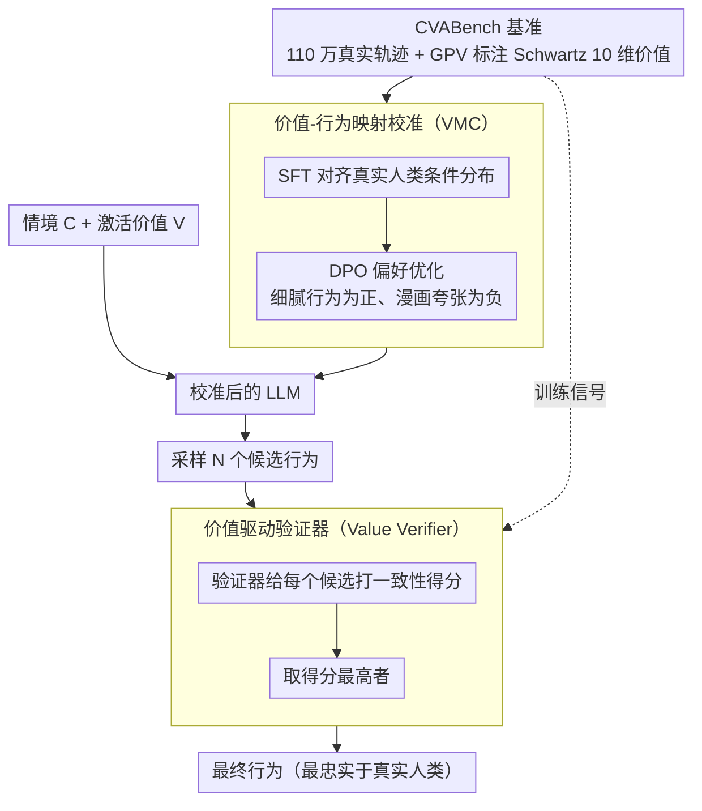

# Context-Value-Action Architecture for Value-Driven Large Language Model Agents

**会议**: ACL 2026 (Findings)  
**arXiv**: [2604.05939](https://arxiv.org/abs/2604.05939)  
**代码**: 无  
**领域**: LLM Agent / 可解释性  
**关键词**: 价值驱动智能体, 行为模拟, Schwartz价值理论, 行为极化, 验证器

## 一句话总结
提出 CVA（Context-Value-Action）架构，基于 S-O-R 心理学模型和 Schwartz 价值理论，通过训练在真实人类数据上的 Value Verifier 解耦行为生成与认知推理，有效缓解 LLM 智能体的行为极化问题，在超过 110 万真实交互轨迹的 CVABench 上显著优于基线。

## 研究背景与动机

**领域现状**：基于 LLM 的类人智能体（游戏 NPC、社交模拟体、任务助手等）需要忠实捕捉人类行为的复杂性、多样性和随机性。现有方法主要依赖心理提示（如角色扮演、CoT 推理）来模拟人类认知过程。

**现有痛点**：现有 LLM 智能体频繁表现出行为僵化和刻板印象。更关键的是，这个问题被当前评估方式掩盖了——"LLM-as-a-judge"评估存在自参照偏差：评判模型与被评智能体共享预训练偏见，倾向于认可极化行为而非惩罚其缺乏真实感。

**核心矛盾**：增加提示驱动推理的强度不会提升行为忠实度，反而加剧价值极化——LLM 将微妙的价值维度简化为"漫画式"原型（如将"易怒"人格极端化为始终攻击性回应），导致群体多样性坍缩。

**本文目标**：构建能忠实再现人类行为多样性的智能体，以真实人类数据为评估标准而非 LLM 自评。

**切入角度**：借鉴心理学的 S-O-R（刺激-有机体-反应）模型和 Schwartz 基本人类价值理论——人的行为不是人格的静态输出，而是情境激活特定价值维度的动态过程。

**核心 idea**：用外部 Value Verifier（在真实人类数据上训练）替代 LLM 自身的价值判断，解耦行为生成与认知推理，避免自参照偏差导致的极化。

## 方法详解

### 整体框架
CVA 把"人怎样行动"拆成 S-O-R 的三段：情境（Context）作为刺激、被激活的价值维度（Value）作为有机体内部状态、行为（Action）作为反应，目标是让智能体在给定情境与激活价值下产出忠实于真实人类的行为，而不是把价值压成漫画式原型。整条流程走"生成-验证"两步：先在 CVABench 真实轨迹上用 SFT+DPO 校准基础 LLM 的价值-行为映射（VMC 阶段），把它的输出分布拉回真实条件分布；推理时让校准后的模型对当前情境采样多个候选行为，再交由一个独立训练的 Value Verifier 打分挑选最符合激活价值的那个（VDR 阶段）。关键在于把"判断哪个行为更真实"这件事从 LLM 自己手里拿走，交给在真实人类数据上训练的外部验证器，从而切断自参照偏差导致的价值极化。

### 关键设计

**1. 价值-行为映射校准（VMC）：先把 LLM 内在的价值扭曲掰回来**

LLM 倾向把细腻的价值维度 $V$ 简化成漫画原型 $V'$（比如把"易怒"演成永远攻击性回应），根源是它的输出分布偏离了真实人类的条件分布。VMC 用两步纠偏：先在 CVABench 的真实轨迹上做 SFT，把模型的概率空间对齐到真实条件分布 $P(A \mid C, V)$；再用 DPO 引入偏好对——细腻一致的行为为正例、漫画夸张的为负例——进一步强化真实的价值-行为关联，压低那些通往极化的扭曲推理路径。直接从真实数据学映射，而非靠提示去"提醒"模型别极化，是这一步比心理提示更稳的原因。

**2. 价值驱动验证器（Value Verifier）：用独立判别器打破自参照循环**

让 LLM 自己评判自己生成的行为是否真实，会形成一个放大偏见的自参照循环——评判模型和被评模型共享同一套预训练偏见，反而会奖励极化。CVA 改用一个在真实 $(C, V, A)$ 三元组上单独训练的验证器来做裁判。推理时采用"生成-选择"协议：校准后的模型先采样 $N$ 个候选行为 $a_i$，验证器对每个算一致性得分 $s_i = f_{ver}(a_i, C, V)$，取得分最高者作为最终输出。验证器与生成器彼此独立，使"行为是否忠实"的判断锚定在真实人类数据上，而不是被生成模型的偏见牵着走。

**3. CVABench 基准：以真实人类行为为锚的训练与评估底座**

要摆脱"LLM-as-a-judge"的自评偏差，就得有一个真实人类行为的标尺。CVABench 聚合三个领域共一百一十多万条真实交互轨迹——Yelp 评论 54K、Reddit 对话 155K、Foursquare 移动 871K，覆盖 15,571 个用户。它用 GPV（General Psychometric Verification）把每个用户的行为映射到 Schwartz 的 10 维价值空间，从而为每条轨迹标注出对应的激活价值，既给 VMC 和验证器提供训练信号，又作为客观评估行为忠实度的基准，替代会与被评模型共享偏见的 LLM 自评。

### 损失函数 / 训练策略
SFT 用标准自回归损失在真实轨迹上微调；DPO 做偏好优化，优选细腻一致的行为、抑制极化夸张的行为；验证器则在真实 $(C, V, A)$ 三元组上训练为判别模型。

## 实验关键数据

### 主实验

| 方法 | 行为忠实度 | 多样性保持 | 价值极化程度 |
|------|----------|----------|------------|
| Raw LLM | 低 | 低 | 高 |
| Role Play Agent | 低 | 低 | 高 |
| Prompt-Reasoning Agent | 更低 | 更低 | **更高** |
| CVA (VMC) | 中 | 中 | 中 |
| CVA (VMC + VDR) | **最高** | **最高** | **最低** |

### 关键发现

| 发现 | 说明 |
|------|------|
| 推理强度 vs 极化 | 增强提示推理反而加剧极化，与直觉相反 |
| 验证器峰值现象 | 行为忠实度不随候选数 N 单调递增，存在最优峰值 |
| 可解释性 | 验证器注意力可透明展示哪些价值维度决定了选择 |

### 关键发现
- 增加推理强度（更多 CoT 步骤）不仅未提升忠实度，反而加剧价值极化并坍缩群体多样性
- 行为忠实度存在最优候选数峰值，模拟了人类认知约束中有限评估范围的现象
- CVA 在所有三个领域（评论/对话/移动）上均显著优于基线

## 亮点与洞察
- **"推理越多极化越严重"的发现**非常重要——直接挑战了"更多思考=更好表现"的直觉，揭示了 LLM 在人类模拟任务中的核心缺陷
- **验证器峰值效应**巧妙地映射了认知科学中"有限理性"的概念
- **评估范式的纠正**：从"LLM-as-a-judge"转向"真实数据为基准"，为智能体评估树立了新标准

## 局限与展望
- CVABench 的三个数据源（Yelp/Reddit/Foursquare）可能不代表所有人类行为模式
- Schwartz 10 维价值模型虽然经典但可能不够精细——某些行为可能受未建模的因素影响
- 验证器训练依赖大量真实数据，在数据稀缺场景下的效果未知

## 相关工作与启发
- **vs Park et al. (Generative Agents)**：依赖角色提示模拟，会产生行为僵化；CVA 用真实数据训练的验证器替代
- **vs VLA 系统**：VLA 关注具身任务执行，CVA 关注社会心理行为忠实度

## 评分
- 新颖性: ⭐⭐⭐⭐⭐ 将心理学价值理论与 LLM 智能体深度融合，解耦验证思路新颖
- 实验充分度: ⭐⭐⭐⭐⭐ 110 万条真实数据，多范式对比深入
- 写作质量: ⭐⭐⭐⭐ 理论基础扎实，发现有深度
- 价值: ⭐⭐⭐⭐⭐ 对 LLM 人类模拟和智能体评估有根本性贡献

<!-- RELATED:START -->

## 相关论文

- [\[ACL 2026\] CLAG: Adaptive Memory Organization via Agent-Driven Clustering for Small Language Model Agents](clag_adaptive_memory_organization_via_agent-driven_clustering_for_small_language.md)
- [\[AAAI 2026\] AgentSwift: Efficient LLM Agent Design via Value-guided Hierarchical Search](../../AAAI2026/llm_agent/agentswift_efficient_llm_agent_design_via_value-guided_hierarchical_search.md)
- [\[AAAI 2026\] AutoTool: Efficient Tool Selection for Large Language Model Agents](../../AAAI2026/llm_agent/autotool_efficient_tool_selection_for_large_language_model_agents.md)
- [\[ACL 2026\] Feedback-Driven Tool-Use Improvements in Large Language Models via Automated Build Environments](feedback-driven_tool-use_improvements_in_large_language_models_via_automated_bui.md)
- [\[AAAI 2026\] Time, Identity and Consciousness in Language Model Agents](../../AAAI2026/llm_agent/time_identity_and_consciousness_in_language_model_agents.md)

<!-- RELATED:END -->
