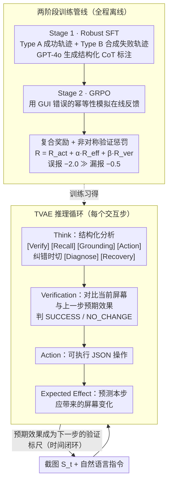

# Don't Act Blindly: Robust GUI Automation via Action-Effect Verification and Self-Correction

**会议**: ACL 2026  
**arXiv**: [2604.05477](https://arxiv.org/abs/2604.05477)  
**代码**: 无  
**领域**: 多模态VLM / LLM Agent  
**关键词**: GUI自动化、动作验证、自我纠正、GRPO强化学习、鲁棒性

## 一句话总结
本文提出VeriGUI框架，通过Thinking-Verification-Action-Expectation（TVAE）闭环推理机制和两阶段训练管线（Robust SFT + GRPO），让GUI Agent能够验证每步操作是否成功并在失败时自我纠正，在3B和7B规模上均显著优于基线。

## 研究背景与动机

**领域现状**：基于VLM的GUI Agent已能够解释截图、理解自然语言指令并执行多步任务。CogAgent、SeeClick、UI-TARS等模型在多个基准上取得了快速进展。然而，这些Agent隐式假设每一步操作都会按预期执行。

**现有痛点**：在实际部署中，网络延迟、渲染延迟和系统中断会导致操作失败。当失败发生时，当前Agent继续假设操作成功，在未变化的屏幕上生成下一步操作。更糟糕的是，由于训练时很少遇到失败场景，Agent倾向于重复完全相同的无效操作，形成无限执行循环。经验数据显示，因重复无效操作导致的执行超时占所有失败的72.3%。

**核心矛盾**：人类用户会自然地在每次交互后验证预期变化是否发生（按钮是否高亮、页面是否导航），但这种验证-诊断-纠正循环在当前GUI Agent中完全缺失。在线RL训练面临高交互延迟和基础设施成本（需64个并行Android模拟器），离线数据集又缺少失败信号。

**本文目标**：(1) 设计显式建模动作结果验证和恢复机制的推理框架；(2) 开发无需在线交互即可学习自我纠正行为的训练方法。

**切入角度**：利用GUI错误的幂等性（idempotency）——错误操作通常不改变屏幕状态。这一特性使得可以从离线数据中模拟在线反馈：如果屏幕没变化，就意味着操作失败了。

**核心 idea**：在推理框架中加入验证和预期效果预测环节，训练时通过合成失败轨迹和利用幂等性模拟在线反馈来学习"诚实的"自我监控。

## 方法详解

### 整体框架
VeriGUI要解决的是GUI Agent"盲目执行"的问题：操作失败时不自知，继续在没变化的屏幕上往下走，最终陷入无限循环。它的做法是把"验证"显式写进每一步推理。给定截图和指令，Agent在每个交互步不只是输出一个动作，而是输出一组结构化结果——先思考（Think）、再对照上一步的预测验证当前屏幕是否如愿改变（Verification），然后给出动作（Action），最后预测这次动作应该带来的屏幕变化（Expected Effect），这个预测又成为下一步的验证标尺，形成时间上前后咬合的闭环。这套TVAE推理循环靠两阶段训练学会：Stage 1用Robust SFT在混合成功/失败轨迹上建立基本的验证行为，Stage 2用GRPO配合非对称奖励把"诚实的自我监控"精炼出来——整个过程不需要任何在线交互。

### 关键设计

**1. TVAE推理循环：把人类"做完一步看一眼"的习惯写进每一步推理**

针对的痛点是当前Agent默认每步都成功、失败后还在原屏幕上盲目生成下一步。VeriGUI让每一步 $t$ 都产出四个绑定输出：Think $T_t$ 是带 [Verify]、[Recall]、[Grounding]、[Action] 标签的结构化分析，进入纠错模式时切换为 [Diagnose] 和 [Recovery]；Verification $V_t$ 是 SUCCESS / NO_CHANGE 的二值判断，由当前屏幕 $S_t$ 与上一步的预期效果 $E_{t-1}$ 对比得出；Action $A_t$ 是可执行的 JSON 操作；Expected Effect $E_t$ 则预测本次操作后屏幕应有的变化。关键在于这不是一条线性链，而是时间链接的循环——$t$ 步预测的 $E_t$ 变成 $t+1$ 步的验证假设。这样做的好处是双重的：预期效果预测逼着Agent在动手前先想清楚后果，既提升了动作质量，又给下一步提供了明确的对照基准，让"失败"第一时间被察觉而不是被累积。

**2. 两阶段训练管线：先教会"失败长什么样"，再强化"诚实地承认失败"**

直接SFT的隐患是模型会过拟合到"所有操作都成功"的乐观假设，因为离线数据里几乎没有失败信号。VeriGUI先在Stage 1（Robust SFT）构建混合数据集：Type A是正常成功轨迹，Type B是合成失败轨迹——把未变化的屏幕 $S_{t-1}$ 与一段"声称执行了 $A_{t-1}$"的历史配对，制造出"动作没生效"的场景，再用GPT-4o生成结构化CoT标注。这一步建立起验证行为的先验。Stage 2（GRPO）则利用GUI错误的幂等性来模拟在线反馈：错误操作通常不改变屏幕，于是对Type A输入设 $V_{\text{target}}=\text{SUCCESS}$、对Type B设 $V_{\text{target}}=\text{NO\_CHANGE}$，只有当模型的验证判断与这个客观现实一致时才给奖励。先建先验再用RL精炼，避免了一步到位训练时模型只学会"假装成功"。

**3. 复合奖励函数与非对称验证惩罚：让"谎报成功"的代价远高于"谨慎漏报"**

为了同时优化动作正确性、效果预测和验证诚实性，总奖励写成 $R_t = R_{\text{act}} + \alpha \cdot R_{\text{eff}} + \beta \cdot R_{\text{ver}}$：动作奖励 $R_{\text{act}}$ 基于与真实操作的IoU匹配，效果奖励 $R_{\text{eff}}$ 在动作正确时用BERTScore衡量效果描述质量，验证奖励 $R_{\text{ver}}$ 是整套设计的核心——它故意不对称：判断正确 +1.0，漏报（False Negative，把成功误判为失败）-0.5，误报（False Positive / Hallucination，把失败谎报为成功）则是 **-2.0**。之所以对幻觉施以四倍于漏报的惩罚，是因为误报会让错误悄悄累积、最终拖垮整条轨迹，而漏报顶多让Agent多谨慎一步。这个力度迫使模型在不确定时宁可报告 NO_CHANGE，也不假装成功，从而把内部信念牢牢钉在视觉现实上。

### 损失函数 / 训练策略
Stage 1用标准交叉熵损失，2个epoch，学习率 $1 \times 10^{-5}$。Stage 2用GRPO目标，15个epoch，学习率 $5 \times 10^{-6}$，group size $G=6$，并用KL正则化约束策略偏离参考模型，奖励权重 $\alpha=0.5$、$\beta=0.5$。训练在 $8 \times$ A100 GPU上完成。

## 实验关键数据

### 主实验（AndroidControl-High）

| 模型 | TM | GR | SR | Sim-TSR | ASO↓ |
|------|-----|-----|-----|---------|------|
| Qwen2.5-VL-3B | 68.7 | 28.3 | 20.2 | 0 | — |
| UI-R1-3B | 69.0 | 27.3 | 19.1 | 0 | — |
| VeriGUI-3B | **72.2** | 32.4 | 24.8 | **16.7** | 1.25 |
| UI-TARS-7B | 72.3 | 35.2 | 30.8 | 14.1 | — |
| VeriGUI-7B | **74.2** | **36.8** | **33.1** | **23.5** | **1.09** |
| GPT-5.1 | 70.1 | 30.0 | 23.1 | — | — |

### 消融实验（鲁棒性基准）

| 模型 | Loop Rate↓ | Recovery Success Rate↑ |
|------|-----------|----------------------|
| Qwen2.5-VL-3B | 高 | 低 |
| VeriGUI-3B | 显著降低 | **51.1%** |
| VeriGUI-7B | 最低 | **52.5%** |

### 关键发现
- 所有3B基线在伪在线条件下Sim-TSR为零（完全无法完成任务），VeriGUI-3B达到16.7%
- VeriGUI-3B在Type Match上超越多个7B基线，说明TVAE的结构化推理主动改善了操作类型选择
- TSR和Sim-TSR之间的差距直接量化了通过错误恢复完成的任务比例
- VeriGUI-7B的ASO仅1.09，意味着平均只需比最优路径多9%的步骤
- 在GUI Odyssey跨分布测试中，验证-恢复机制展现了良好的迁移性

## 亮点与洞察
- **利用幂等性模拟在线反馈**：GUI错误的幂等性（屏幕不变=操作失败）是一个精妙的观察，使得无需构建复杂在线环境即可训练自我纠正行为。这个思路可推广到其他具有类似"无变化=失败"特性的环境。
- **非对称验证惩罚**：对幻觉（误报成功）施加4倍于漏报的惩罚，从激励机制上保证了"诚实的"自我监控。这是RL reward设计的一个值得借鉴的模式。
- **预期效果预测的双重作用**：既作为验证的比较基准，又迫使Agent在执行前预判后果，间接提高了操作质量。

## 局限与展望
- TVAE框架增加了每步的生成量（Think+Verification+Expectation），推理延迟可能增加
- 幂等性假设不适用于所有GUI失败模式（如误操作导致不可逆变化）
- 合成失败轨迹可能无法覆盖所有真实失败类型（如部分加载、动画中断）
- 在线MiniWoB++和AndroidWorld的结果未详细报告

## 相关工作与启发
- **vs UI-TARS**：UI-TARS通过大规模预训练和统一建模提升准确率，但不具备验证和恢复能力。VeriGUI在较小规模上通过闭环验证达到可比性能
- **vs DigiRL / DistRL**：它们通过在线RL优化任务成功率，但需要大量模拟器基础设施。VeriGUI通过幂等性利用离线数据达到类似效果
- **vs LLM自我纠正**：Madaan et al.等的自我纠正工作假设外部反馈或oracle信息，VeriGUI的验证完全基于视觉证据的内部推理

## 评分
- 新颖性: ⭐⭐⭐⭐⭐ TVAE闭环验证+幂等性利用+非对称惩罚的组合非常精巧
- 实验充分度: ⭐⭐⭐⭐ 多个基准、鲁棒性测试、跨分布验证，但在线结果不够详细
- 写作质量: ⭐⭐⭐⭐ 动机清晰，方法描述详尽，但部分符号较多
- 价值: ⭐⭐⭐⭐⭐ 解决了GUI Agent的核心痛点——盲目执行和无限循环，实用价值极高

<!-- RELATED:START -->

## 相关论文

- [\[ICML 2026\] Think Twice Before You Act: Enhancing Agent Behavioral Safety with Thought Correction](../../ICML2026/llm_agent/think_twice_before_you_act_enhancing_agent_behavioral_safety_with_thought_correc.md)
- [\[ICML 2026\] AutoRPA: Efficient GUI Automation through LLM-Driven Code Synthesis from Interactions](../../ICML2026/llm_agent/autorpa_efficient_gui_automation_through_llm-driven_code_synthesis_from_interact.md)
- [\[ACL 2026\] Don't Click That: Teaching Web Agents to Resist Deceptive Interfaces](dont_click_that_teaching_web_agents_to_resist_deceptive_interfaces.md)
- [\[ACL 2026\] CodeStruct: Code Agents over Structured Action Spaces](codestruct_code_agents_over_structured_action_spaces.md)
- [\[ACL 2026\] Don't Adapt Small Language Models for Tools; Adapt Tool Schemas to the Models](don39t_adapt_small_language_models_for_tools_adapt_tool_schemas_to_the_models.md)

<!-- RELATED:END -->
