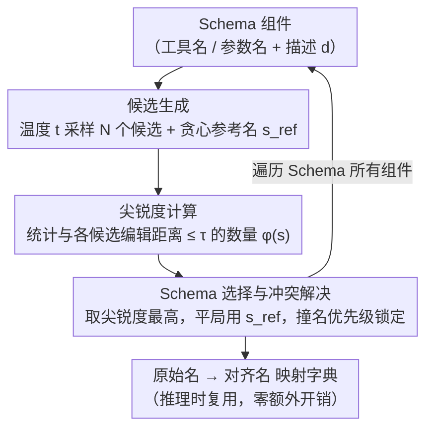

# Don't Adapt Small Language Models for Tools; Adapt Tool Schemas to the Models

**会议**: ACL 2026  
**arXiv**: [2510.07248](https://arxiv.org/abs/2510.07248)  
**代码**: [GitHub](https://github.com/holi-lab/PA-Tool)  
**领域**: LLM/NLP  
**关键词**: 小语言模型, 工具调用, Schema对齐, 预训练知识, 无训练优化

## 一句话总结

本文提出 PA-Tool，一种无训练的工具 Schema 优化方法，利用从数据污染检测中借鉴的"尖锐度"（peakedness）信号识别模型预训练中熟悉的命名模式，通过重命名工具组件来对齐小语言模型的内化知识，在 MetaTool 和 RoTBench 上实现最高 17% 的提升，Schema 不对齐错误减少 80%。

## 研究背景与动机

**领域现状**：工具增强的语言模型已成为现代 AI 系统的核心组件。随着多智能体架构的发展，越来越多的场景需要部署小语言模型（SLM，通常 ≤8B）来处理子任务，包括工具选择（识别正确 API）和参数识别（提供正确参数）。

**现有痛点**：SLM 在工具使用任务上表现远逊于大模型，一个常见的失败模式是"Schema 不对齐"（schema misalignment）：即使上下文中提供了正确的工具，模型仍会幻觉出看起来合理但不存在的工具名。这表明模型在面对不熟悉的 Schema 时会回退到预训练中内化的命名惯例。

**核心矛盾**：现有方法要么通过训练让模型适应任意 Schema（需要大量数据且可能导致灾难性遗忘），要么通过改进工具文档或交互历史来间接改善（未解决 Schema 层面的根本不匹配）。训练方法代价高且不可扩展，而免训练方法未触及命名不对齐的根源。

**本文目标**：提出一种无训练方法，通过调整工具 Schema 来匹配模型的预训练知识，而非反过来训练模型适应 Schema。

**切入角度**：从数据污染检测领域借鉴"尖锐度"（peakedness）概念——模型在预训练中频繁见过的模式会导致生成高度集中的输出分布。利用这一信号识别模型"熟悉"的命名模式。

**核心 idea**：与其训练小模型适应不熟悉的工具 Schema，不如调整 Schema 来对齐模型的预训练知识——通过生成多个候选名、计算尖锐度、选择最高尖锐度的候选来找到模型最熟悉的命名。

## 方法详解

### 整体框架

PA-Tool 解决的是小语言模型用工具时的"Schema 不对齐"——模型面对陌生的工具名/参数名时会幻觉出自己更熟悉的名字。它的思路是反过来：不训练模型去适应任意 Schema，而是把 Schema 改名成模型在预训练里"见惯了"的样子。具体做法是对工具 Schema 中的每个组件（工具名、参数名）走一遍三步重命名——先让 SLM 根据组件描述多次采样生成候选名，再用"尖锐度"信号衡量哪个候选最像模型熟记的模式，最后选尖锐度最高的候选替换原名。把这套流程对 Schema 里所有组件迭代一遍，就得到一张"原始名 → 预训练对齐名"的映射字典，整个过程不动模型一个参数。

### 关键设计

**1. 候选生成：用温度采样把模型脑子里多样的命名惯例都"问"出来**

如果只用贪心解码，每个组件只会得到唯一一个候选名，Schema 空间几乎没被探索（实验里 Greedy 有时甚至不如不改的 Base）。PA-Tool 因此给定组件描述 $d$，用温度 $t \in (0,1]$ 采样 $N$ 个候选名 $\mathcal{C} = \{s_1, s_2, \ldots, s_N\}$，让采样跳出单一路径、把模型学到的多种命名模式都暴露出来。同时再用贪心解码（$t=0$）生成一个参考名 $s_{\text{ref}}$，留作后面平局时的打破依据。

**2. 尖锐度计算：从数据污染检测借来的信号，量化模型对一个名字有多"眼熟"**

要识别模型预训练中反复见过的强记忆模式，PA-Tool 借用了 CDD 数据污染检测的观察——训练中频繁出现的模式，在多次采样里会产生高度集中（"尖锐"）的输出分布。于是对每个候选 $s_i$ 计算尖锐度 $\phi(s_i) = \sum_{j \neq i} \mathbb{I}(d_{\text{edit}}(s_i, s_j) \leq \tau)$，即统计有多少别的候选与它足够相似：$d_{\text{edit}}$ 是字符级编辑距离，阈值 $\tau = \alpha \cdot \ell_{\max}$ 取最大候选长度 $\ell_{\max}$ 的 $\alpha$ 倍。尖锐度越高，说明模型围绕这个命名生成的分布越集中、对它越熟。这里把阈值做成长度自适应，是为了让长短不一的名字有一致的相似性尺度，把污染检测里"检测被记住的内容"翻转成"利用被记住的命名惯例"。

**3. Schema 选择与冲突解决：挑出模型最内化的名字，并处理跨工具撞名**

最终选尖锐度最高的候选 $s^* = \arg\max_{s_i \in \mathcal{C}} \phi(s_i)$ 作为新名——它代表模型最深层内化的命名惯例。若多个候选尖锐度并列，就用第一步留下的参考名打破平局，选与 $s_{\text{ref}}$ 编辑距离最小的：$s^* = \arg\min_{s_i \in \mathcal{C}^*} d_{\text{edit}}(s_i, s_{\text{ref}})$。当不同工具因描述相近而被改成同一个名字时，用优先级锁定机制消解冲突。映射一次算好后即可重复使用，推理时无需再生成，因此几乎零额外开销。

### 损失函数 / 训练策略

PA-Tool 完全无训练，只需一次性的 Schema 映射：用 32 个候选、温度 0.4、$\alpha = 0.2$ 完成对齐，推理时则用温度 0 保证可复现。映射字典在工具集不变时可一直复用，既不改模型、不重训练，也就不存在灾难性遗忘的风险。

## 实验关键数据

### 主实验

**MetaTool 工具选择（准确率 %）**

| 模型 | 方法 | Similar | Scenario | Reliability | Multi-tool |
|------|------|------|------|------|------|
| Qwen2.5-7B | Base | 59.6 | 74.4 | 78.3 | 78.3 |
| Qwen2.5-7B | PA-Tool | 64.1 | 78.4 | **88.2** | 84.9 |
| Llama3.1-8B | Base | 61.5 | 73.9 | 53.5 | 78.7 |
| Llama3.1-8B | PA-Tool | **70.4** | **79.9** | 66.0 | **88.3** |
| Llama3.2-3B | Base | 55.0 | 58.6 | 43.6 | 79.1 |
| Llama3.2-3B | PA-Tool | 65.7 | 67.7 | 60.6 | 80.5 |

**RoTBench 工具选择与参数识别**

| 模型 | 方法 | 单轮工具选择 | 单轮参数识别 | 多轮工具选择 | 多轮参数识别 |
|------|------|------|------|------|------|
| Llama3.1-8B | Base | 58.1 | 17.1 | 42.8 | 34.3 |
| Llama3.1-8B | PA-Tool | **68.6** | 18.1 | **48.6** | **35.7** |

### 消融实验

| 配置 | 单轮工具选择 | 单轮参数识别 | 说明 |
|------|------|------|------|
| Base | 58.1 | 17.1 | 无对齐 |
| Tool-only | 62.9 | 14.3 | 仅工具名对齐 |
| Param-only | 56.2 | 17.1 | 仅参数名对齐 |
| Both (PA-Tool) | **68.6** | **18.1** | 联合对齐最佳 |

**错误类型分析（Llama3.1-8B, MetaTool）**

| 错误类型 | Base | PA-Tool | 减少 |
|------|------|------|------|
| Schema 不对齐错误 | — | — | **-80.0%** |
| 功能混淆错误 | — | — | -24.0% |
| 上下文理解错误 | — | — | -18.8% |

### 关键发现

- PA-Tool 在 Reliability 子任务上提升最大（最高 17%），该任务要求模型识别没有合适工具的情况
- Multi-tool 子任务提升达 9.6%（Llama3.1-8B: 78.7→88.3%），因为 Schema 不对齐在多工具组合选择时会累积
- PA-Tool 单独使用可在多个子任务上超越有监督微调模型，且两者结合时可进一步提升
- 尖锐度验证实验证实：随着训练轮次增加，模型的尖锐度一致上升（最高 +25.8%），支持其作为熟悉度信号的假设
- 在 API-Bank 和 τ-Bench 端到端基准上也展现了一致的改进

## 亮点与洞察

- 逆向思维极具启发性："不要让模型适应工具，而是让工具适应模型"——这一思路可推广到其他模型-接口交互场景
- 从数据污染检测到工具 Schema 优化的跨领域迁移：将 peakedness 从"检测污染"转化为"利用预训练知识"，化废为宝
- 一次性映射的设计使其部署成本极低，与微调、检索、约束解码等方法正交且可组合
- PA-Tool 使 Llama3.1-8B 在 Multi-tool 子任务上超越 Claude-Sonnet-4.5（88.3% vs 85.1%），证明 Schema 对齐可以缩小大小模型差距

## 局限与展望

- 依赖模型对组件描述的理解来生成候选名，描述质量差时可能影响效果
- 当前仅重命名工具名和参数名，未考虑 Schema 结构（如参数类型、嵌套结构）的对齐
- 在闭源模型上效果较小（因为大模型的 Schema 不对齐问题本身较轻）
- peakedness 信号在工具名非常短或非常长时可能不够稳定

## 相关工作与启发

- **vs 有监督微调 (SFT)**: SFT 需要训练数据且存在泛化问题（增加数据后 RoTBench 性能反而下降），PA-Tool 无训练且与 SFT 互补
- **vs EasyTool (描述增强)**: EasyTool 改进工具描述但不修改名称，PA-Tool 修改名称但不改描述，两者正交可组合
- **vs 约束解码**: 约束解码消除格式错误但不解决命名偏好不匹配，PA-Tool 从根源解决命名问题

## 评分

- 新颖性: ⭐⭐⭐⭐⭐ 逆向思维独特，跨领域迁移 peakedness 信号非常巧妙
- 实验充分度: ⭐⭐⭐⭐⭐ MetaTool + RoTBench + API-Bank + τ-Bench 四个基准，错误分析、尖锐度验证、组件消融、与 SFT/免训练方法组合实验极为全面
- 写作质量: ⭐⭐⭐⭐ 动机清晰，方法直观，分析深入
- 价值: ⭐⭐⭐⭐⭐ 提供了一种零成本提升 SLM 工具使用能力的实用方案，对多智能体系统部署有重要价值

<!-- RELATED:START -->

## 相关论文

- [\[ACL 2026\] Lightweight LLM Agent Memory with Small Language Models](lightweight_llm_agent_memory_with_small_language_models.md)
- [\[ACL 2026\] Meta-Tool: Efficient Few-Shot Tool Adaptation for Small Language Models](meta-tool_efficient_few-shot_tool_adaptation_for_small_language_models.md)
- [\[ACL 2026\] Feedback-Driven Tool-Use Improvements in Large Language Models via Automated Build Environments](feedback-driven_tool-use_improvements_in_large_language_models_via_automated_bui.md)
- [\[ACL 2026\] Polaris: A Gödel Agent Framework for Small Language Models through Experience-Abstracted Policy Repair](polaris_a_gödel_agent_framework_for_small_language_models_through_experience-abs.md)
- [\[ACL 2026\] ImplicitMemBench: Measuring Unconscious Behavioral Adaptation in Large Language Models](implicitmembench_measuring_unconscious_behavioral_adaptation_in_large_language_m.md)

<!-- RELATED:END -->
