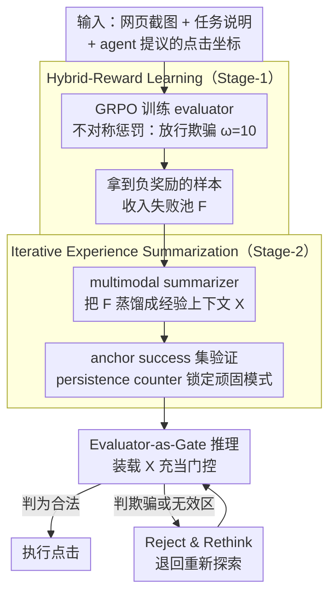

# Don't Click That: Teaching Web Agents to Resist Deceptive Interfaces

**会议**: ACL 2026  
**arXiv**: [2605.09497](https://arxiv.org/abs/2605.09497)  
**代码**: https://github.com/(DUDE 项目链接见论文)  
**领域**: LLM Agent / 安全 / Web Agent / GUI 鲁棒性  
**关键词**: Deceptive UI Defense, Hybrid-Reward RL, Experience Summarization, Dark Patterns, VLM Agent

## 一句话总结
作者首次把"对抗欺骗性 UI"形式化为 web agent 的独立防御问题，提出两阶段框架 **DUDE**（不对称惩罚的 hybrid-reward RL 学一个 evaluator + 用 experience summarization 把失败模式蒸馏成可迁移上下文），并发布含 1407 个真实/合成场景的 **RUC** 基准，在 3 个 VLM agent base 上把欺骗诱发失败率从 23.5% 降到 1.5%、任务成功率从 9.5% 推到 60.5%，且 Stage-2 优化的 prompt 能零样本迁移到闭源模型。

## 研究背景与动机

**领域现状**：基于 VLM 的 web agent（Qwen-VL / UI-TARS / Holo / Agent Q 等）在 WebArena / VisualWebArena / OSWorld 等基准上展示了自主 GUI 操作能力，但 SOTA agent 在 WebArena 上的成功率仅 14–16%，远低于人类的 78–89%。

**现有痛点**：实际网页里到处是欺骗性元素——伪装的下载按钮、冒充任务推进的弹窗、煽动紧迫感的文案、虚假折扣广告。Decepticon 等研究显示 agent 被欺骗率超过 70%，是人类（31%）的两倍多；TrickyArena 进一步发现"模型越强、越容易被诱骗"。现有防御要么只做 detection（UIGuard）没和 agent 决策耦合，要么只做攻击文档化（DPGuard）不出方案；还有就是简单"全部拒绝"，导致 over-conservation（合法按钮也不敢点）。

**核心矛盾**：calibration 矛盾——agent 必须既"敢点合法按钮"又"敢拒欺骗按钮"。检测器与 agent 解耦无法捕捉任务语义，简单拒绝把误报当好事，二者都不可接受。同时 deployment 阶段不能改参数（线上闭源模型 + 频繁更新的网页），需要 **不更新权重就能持续学习** 的机制。

**本文目标**：(P1) calibrated evaluator——分辨欺骗 vs 合法不偏不倚；(P2) parameter-free 经验积累——把失败模式抽成可迁移上下文，在部署时持续生效。

**切入角度**：人类对欺骗 UI 的"免疫力"来自反复被骗后的经验，作者用 **不对称惩罚的 RL** 模拟"被骗代价远大于谨慎代价"的人类直觉，再用 **iterative experience summarization** 把失败案例蒸馏成压缩的上下文 guidance。

**核心 idea**：把"防欺骗"从 detection-only 升级为 "evaluator-as-gate"——在 agent 的 click 行动和实际执行之间插一个被严格 calibrate 过的 evaluator，并让它在部署期通过经验摘要持续进化。

## 方法详解

### 整体框架
DUDE 要解决的是 web agent 面对欺骗性 UI 时的两难：既要敢点合法按钮，又要敢拒欺骗按钮，简单"全部拒绝"会陷入 over-conservation。它把这件事形式化为一个"点击前审核"问题——给定网页截图 $I$、任务说明 $P$ 和 agent 提议的点击坐标 $C=(x,y)$，训练一个 evaluator $\mathcal{E}:(I,P,C)\mapsto(\hat L, \gamma)$，输出三值标签 $\hat L \in \{-1, 0, 1\}$（-1 欺骗 / 0 无效区 / 1 合法）和置信度 $\gamma \in (0,1)$，ground truth 由点击是否落入标注的合法框 $\mathcal{B}_c$、欺骗框 $\mathcal{B}_d$ 还是 null 区域 $\mathcal{B}_0$ 决定。整条 pipeline 分两步走：Stage-1 用 hybrid-reward RL 训练 evaluator 的参数，并把拿到负奖励的样本收进 failure pool $\mathcal{F}$；Stage-2 不再动参数，而是用一个外部 multimodal summarizer 把 $\mathcal{F}$ 里的失败模式迭代蒸馏成压缩的 experience context $\mathcal{X}$，每轮还在 anchor success 集上验证以防退化。部署推理时，evaluator 装上 $\mathcal{X}$ 充当门控：只有判为 $\hat L=1$ 的点击才放行，否则让 agent 退回重新探索。

### 关键设计

**1. Hybrid-Reward Learning：把"放行欺骗远比误拒严重"的代价不对称直接写进 reward**

如果只优化准确率，evaluator 会均匀压低两类错误，但现实里"放行欺骗"是合规事故、"误拒合法按钮"只是体验问题，必须区别对待。DUDE 的 reward 形式为：判对（$\hat L = L$）时 $R=\gamma$，判错时 $R=-\alpha \cdot \omega(L, \hat L) \cdot \gamma$。其中 $\omega$ 编码了四种错误的不对称代价——C1 把合法误判为欺骗/无效，$\omega=1$（保守但不致命）；C2/C3 无效区误判，$\omega=1+\beta$；C4 **把欺骗放行（漏报），$\omega=10$**，灾难性，权重直接十倍。注意力标量 $\beta=S_{\hat L}/S_\mathcal{I}$ 用"预测区域占整图的比例"给惩罚加权，区域越大越显著、错判代价越高；置信度调整 $\alpha=\text{clip}(1/((d(C,\mathcal{B}_{\hat L})+\epsilon)\cdot(S_L/S_\mathcal{I})), \alpha_{\min}, \alpha_{\max})$ 则在点击离边界很近或 ground-truth 区域很小时主动降低惩罚，避免那些本就模糊的样本被狠罚。整个 evaluator 用 GRPO（Shao et al. 2024）训练。

**2. Iterative Experience Summarization：不改一个参数，靠经验摘要在部署期持续进化**

闭源模型无法 fine-tune、网页样式频繁更新、上线后也没有标注员盯着——所以 DUDE 把"持续学习"放到 prompt 层面。它维护一个 failure pool $\mathcal{F}$ 和 success pool $\mathcal{S}$，每个失败样本带一个 persistence counter $\kappa(x)$（初始为 1，每抗住一次修正就 +1）。每一轮 $t$ 采样 $\mathcal{B}_f\subset\mathcal{F}$ 加上 anchor $\mathcal{B}_s\subset\mathcal{S}$，summarizer 接收上一轮的 $\mathcal{X}^{(t-1)}$、结构化失败描述和截图，产出新的 $\mathcal{X}^{(t)}$；随后在 $\mathcal{B}_f\cup\mathcal{B}_s$ 上验证：通过的失败样本移入 $\mathcal{S}$，没通过的把 $\kappa$ +1 留在 $\mathcal{F}$，如此循环直到 $\mathcal{F}$ 清空或达到 $T$ 轮上限（Algorithm 1）。persistence counter 让 summarizer 把注意力集中在反复失败的顽固模式上；anchor success 集则是关键的正则化约束，防止新写入的规则在修一个 bug 的同时把原本判对的样本带歪。

**3. Evaluator-as-Gate 推理架构：把 calibrated evaluator 接进 agent 主循环做 Reject & Rethink**

检测器单独存在没有防御价值，必须直接接到 action loop 上才管用。DUDE 的推理闭环是：base agent 提议点击 $C$ → evaluator 用 $\mathcal{X}\oplus\mathcal{T}$（experience context 拼模板）做评判 → 只有 $\hat L=1$ 才执行，否则触发 "abandon-and-rethink"，让 agent 继续探索；episode 在成功完成任务或检测到欺骗时提前结束，最大步数 $T_{\max}=3$。一个意外收益是，evaluator 的反馈不只过滤欺骗，对占失败 86.5% 的 null-region 误点也给出纠正信号——于是这套 deception-aware 的门控同时改善了一般任务的定位能力，形成 dual benefit。

### 损失函数 / 训练策略
Stage-1 用 GRPO 配 hybrid reward，训练样本通过对每个 RUC 标注样本构造三类点击得到（合法框中心点 benign + 欺骗框中心 + $n$ 个 null 随机点）。Stage-2 用外部 multimodal summarizer（如 GPT-4V 或 UI-TARS）做迭代摘要，每轮 batch size $b$、anchor size $a$，最大轮数 $T$。

## 实验关键数据

### 主实验
**RUC 200 任务测试集（4 个域 × 50 任务），3 个 agent base × 2 个 evaluator（指标：SR ↑ / DFR ↓ / Steps ↓）**：

| Agent Base | 方法 | SR (%) | DFR (%) | Steps |
|------------|------|--------|---------|-------|
| Qwen3-VL-4B | Vanilla | 6.50 | 2.00 | 25.23 |
| Qwen3-VL-4B | +DUDE (Eval: Qwen-2B) | 33.50 | **0** | 5.86 |
| Qwen3-VL-4B | +DUDE (Eval: UI-TARS) | **63.50** | 0.50 | **3.85** |
| UI-TARS-1.5-7B | Vanilla | 43.50 | 23.50 | 16.06 |
| UI-TARS-1.5-7B | +DUDE (Eval: Qwen-2B) | 35.50 | **0** | 4.18 |
| UI-TARS-1.5-7B | +DUDE (Eval: UI-TARS) | **58.00** | 1.50 | **3.02** |
| GLM-4.6V-Flash | Vanilla | 9.50 | 4.00 | 28.67 |
| GLM-4.6V-Flash | +DUDE (Eval: Qwen-2B) | 36.50 | 2.50 | 6.49 |
| GLM-4.6V-Flash | +DUDE (Eval: UI-TARS) | **60.50** | 1.50 | **4.02** |

整体上 DUDE 把 DFR 从平均 9.83% 降到 1.17%（**−53.8% 相对**，论文摘要给出的总指标），SR 从 19.83% 提到 60.67%。同时 Steps 从 ~23 锐减到 ~4，说明 evaluator 不仅防欺骗还显著加速任务。

### 消融实验

**Stage-wise 消融（Qwen3-VL-4B base）**：

| 配置 | SR (%) | DFR (%) | Steps |
|------|--------|---------|-------|
| Vanilla Agent | 6.50 | 2.00 | 25.23 |
| + Stage-1 Only | 28.00 | 5.50 | 5.80 |
| + Stage-2 Only | 15.50 | 4.50 | 5.50 |
| + Stage-1 + Stage-2 | **33.50** | **0** | 5.86 |

**Reward 组件消融（measure Eval Pass 和 Fatal Error C4）**：

| Variant | Eval Pass (%) | Fatal Error (%) |
|---------|---------------|-----------------|
| Full Reward | **55.9** | **9.75** |
| w/o Attention Scalar | 55.0 | 13.07 |
| w/o Confidence Adj. | 53.0 | 17.25 |
| w/o Severity Weight | 51.4 | **27.53** |
| Only Confidence | 55.3 | 12.37 |

**Stage-2 prompt 策略对比**：

| Prompt 策略 | SR (%) | DFR (%) |
|------------|--------|---------|
| No System Prompt | 6.50 | 2.00 |
| Manual Prompt | 7.00 | 3.50 |
| **Mutated Prompt (Ours)** | **15.50** | 4.50 |

**闭源迁移（GPT-4o 级 agent base，Stage-2 prompt 零样本迁移）**：

| 配置 | SR (%) | DFR (%) | Steps |
|------|--------|---------|-------|
| Closed-source evaluator | 54.12 | 25.00 | 4.63 |
| + Stage-2 Prompt (Ours) | **62.50** | **19.38** | **3.19** |

### 关键发现
- **不对称惩罚是 reward 设计核心**：去掉 severity weight 让 C4 (放行欺骗) 错误率从 9.75% 飙到 27.53%，几乎三倍恶化，验证了"放行欺骗远比误拒严重"的工程直觉必须显式编码。
- **两阶段互补**：Stage-1 单独跑 DFR 反而上升到 5.5%（视觉分辨力强但近边界过度自信），Stage-2 单独跑 SR 只到 15.5%（缺视觉 grounding 无法落地抽象规则）；二者结合 DFR 归零、SR 翻倍。
- **Dual benefit**：失败模式分解（Table 3）发现 vanilla GLM-4.6V-Flash 的失败中 86.5% 是 null-region 误点而非被欺骗，DUDE 的 Reject & Rethink 反馈对这类一般性定位错误也起纠正作用——deception-aware evaluator **意外** 改善了一般任务接地能力。
- **强 evaluator > 强 agent**：UI-TARS evaluator 配 weak agent (Qwen-4B) 比 strong agent (UI-TARS-7B) vanilla 更好，说明评测/防御能力的边际效益比纯 agent 能力更高。
- **Mutated prompt 优于人工 prompt**：Stage-2 学出的 prompt 把 SR 从 7% 推到 15.5%，是手写 safety prompt 翻倍以上，说明"经验摘要"包含人工难写出的细节模式（如某类欺骗弹窗的视觉/文本特征）。
- **零样本闭源迁移可行**：Stage-2 prompt 在闭源模型上把 SR +8.38、DFR -5.62，证明 experience context 是 **真正学到了行为级 policy** 而非过拟合到 evaluator 的参数空间。
- **wall-clock 反而更快**：DUDE 单步 token 用量 +63%，但因步数从 17.65 锐减到 3.58，总时间从 217.62s 降到 48.47s，工业上是正收益。

## 亮点与洞察
- **形式化"deception-aware defense"为独立问题**：把过去散落在 dark-pattern detection、adversarial robustness、human-centered design 三个领域的工作整合到 agent-as-decision-maker 的视角，是该领域第一篇 systematic defense 论文。
- **不对称 reward 工程**：用 $\omega$ 把"代价不对称"显式写入 RL reward，外加 $\alpha / \beta$ 两个 calibration scalar 处理边界模糊和区域显著性，是非常工业实用的 reward shaping 范式，可直接迁移到任何"假阳假阴代价不对称"的安全任务（spam、内容审核、医疗判读）。
- **persistence counter + anchor success**：经验摘要框架的两个微小但关键的稳定化设计——前者让 summarizer 把算力花在反复失败的样本上，后者防止"修一个 bug 引入十个"。这套范式可直接复用到任意 LLM 自我改进 pipeline。
- **dual benefit 现象**：deception-aware evaluation 意外提升一般任务定位能力，这是个 **可推广的设计原则**——只要插入一个能拒绝错误 action 的 calibrated gate，就能同时改善安全与可用。
- **行为级 prompt 零样本迁移**：证明 experience context 抽象出的是行为政策而非参数依赖，是把 RL 学到的能力"瓶装"成 prompt 的极简方式，规避闭源模型 fine-tune 的合规问题。

## 局限与展望
- **RUC 测试只跑 200 task**：每域 50 task 偏小，统计噪声较大；且作者刻意选了 fixed-size 子集省成本，全 1407 样本的完整评测应作为后续工作。
- **欺骗类型偏静态**：4 类 dark pattern 大部分基于静态截图，未涵盖动态行为（如点击后才弹出的二次欺骗、JS 触发的钓鱼跳转），real-world 长尾未覆盖。
- **依赖 RUC 标注框**：实际网页没有 $\mathcal{B}_c, \mathcal{B}_d$ 标注，evaluator 在野外可能因缺少这类清晰边界而退化；论文未讨论部署期 OOD 表现。
- **$T_{\max}=3$ 偏短**：限制了 agent 在 reject 后多轮 re-plan 的能力，可能低估了 vanilla agent 的真实性能潜力。
- **GRPO + 外部 summarizer 都依赖大模型**：Stage-2 summarizer 用 GPT 级模型，整体方案成本不算低；若 summarizer 用小模型摘要质量可能崩坏，缺少消融。

## 相关工作与启发
- **vs UIGuard**: UIGuard 是 task-agnostic 检测器，与 agent 决策解耦；DUDE 把检测嵌入 agent action loop，从"看见"升级到"决策"。
- **vs DPGuard / Decepticon**: 这些工作做攻击文档化和 vulnerability 测量但没出方案；DUDE 是首个 systematic defense framework。
- **vs Prompt Adversarial Tuning (Mo et al. 2024)**: PAT 防 LLM jailbreak，DUDE 防 visual UI 欺骗；后者的 multimodal 维度和"task vs deception"二元 trade-off 更复杂。
- **vs Agent Q (MCTS)**: Agent Q 用 MCTS 做 self-improvement 但需要 action-space search，本质是 agent capability 增强；DUDE 是正交的 safety layer，可以叠加。
- **vs OS-Harm / RedTeamCUA**: 这些是 hybrid attack benchmark，本文 RUC 专注 deceptive UI 一类但标注更细（含 $\mathcal{B}_c + \mathcal{B}_d$ 双边界 + 任务说明），适合做精细 calibration 研究。

## 评分
- 新颖性: ⭐⭐⭐⭐ 首次系统化 deception-aware web agent defense；不对称 reward + experience summarization 的组合是该问题的合理且优雅的解法。
- 实验充分度: ⭐⭐⭐⭐ 3 agent base × 2 evaluator × 4 域 + stage-wise / reward-wise / prompt-wise 三套消融 + 闭源迁移 + 计算开销 + 训练动力学全覆盖；唯一缺憾是只跑 200 task 子集。
- 写作质量: ⭐⭐⭐⭐ 问题陈述清晰、动机递进自然、公式与算法符号规范，Figure 1 一图说明 over-conservation vs deception 的 trade-off 非常巧妙。
- 价值: ⭐⭐⭐⭐⭐ web agent 安全部署的 immediate concern，工业可直接 PoC；experience summarization 范式可迁移到任何闭源 LLM 持续学习场景；RUC 基准本身也是社区资源。

<!-- RELATED:START -->

## 相关论文

- [\[ACL 2026\] Don't Adapt Small Language Models for Tools; Adapt Tool Schemas to the Models](don39t_adapt_small_language_models_for_tools_adapt_tool_schemas_to_the_models.md)
- [\[ACL 2026\] SynthAgent: Adapting Web Agents with Synthetic Supervision](synthagent_adapting_web_agents_with_synthetic_supervision.md)
- [\[ACL 2026\] Don't Act Blindly: Robust GUI Automation via Action-Effect Verification and Self-Correction](don39t_act_blindly_robust_gui_automation_via_action-effect_verification_and_self.md)
- [\[AAAI 2026\] Cook and Clean Together: Teaching Embodied Agents for Parallel Task Execution](../../AAAI2026/llm_agent/cook_and_clean_together_teaching_embodied_agents_for_paralle.md)
- [\[ACL 2026\] ExpSeek: Self-Triggered Experience Seeking for Web Agents](expseek_self-triggered_experience_seeking_for_web_agents.md)

<!-- RELATED:END -->
