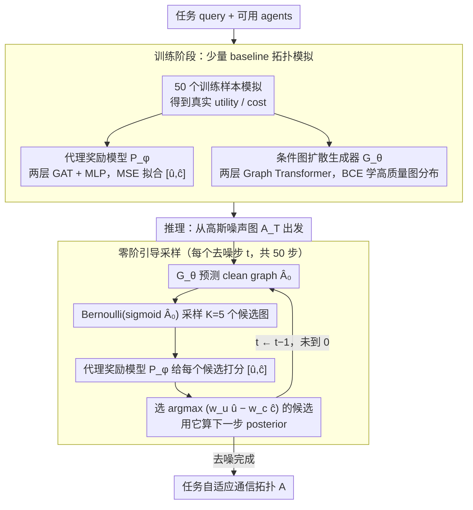

# Dynamic Generation of Multi-LLM Agents Communication Topologies with Graph Diffusion Models

**会议**: ACL 2026  
**arXiv**: [2510.07799](https://arxiv.org/abs/2510.07799)  
**代码**: 缓存未提供具体 URL（正文仅写明 code is available）  
**领域**: LLM Agent / 多智能体协作  
**关键词**: 多智能体系统、通信拓扑、图扩散、零阶优化、代理奖励模型

## 一句话总结
本文提出 Guided Topology Diffusion，将多 LLM agent 的通信拓扑生成建模为条件图扩散过程，并用代理奖励模型在每个去噪步骤做零阶引导，从而生成更稀疏、更省 token、更鲁棒的任务自适应协作网络。

## 研究背景与动机
**领域现状**：LLM 多智能体系统常通过结构化通信来解决数学推理、代码生成和知识问答等复杂任务。现有系统常用 chain、star、complete graph、layered workflow 或手工角色模板，也有一些方法开始用搜索、GNN 或自回归模型学习任务相关拓扑。

**现有痛点**：固定拓扑很难适配任务差异。简单问答可能只需要少量线性交互，而软件开发或复杂推理需要更丰富的协作结构。过密图会浪费 token，过稀图会形成瓶颈；只优化 accuracy 又容易忽视通信成本、稀疏性和失败鲁棒性。

**核心矛盾**：拓扑质量需要在 utility、cost、robustness、sparsity 之间权衡，但真实 reward 要执行完整 multi-agent simulation 才能得到，既昂贵又不可微。生成模型如果只学训练分布，无法在采样时逐步朝高 reward 区域调整。

**本文目标**：作者希望构建一个端到端拓扑生成框架，对每个新任务动态生成 agent communication graph，并在不频繁运行昂贵模拟的情况下，实时优化任务表现和通信成本。

**切入角度**：论文把拓扑合成视作条件离散图生成问题。扩散模型负责逐步构造图，轻量代理模型负责预测候选图的 utility 和 cost，零阶优化负责在每个采样步骤从多个候选中选择最优方向。

**核心 idea**：先用少量基准拓扑模拟训练一个代理 reward model，再在图扩散反向去噪时反复采样候选拓扑，并用 $w_u\hat{u}-w_c\hat{c}$ 选择当前最优候选，直接把多目标偏好注入生成轨迹。

## 方法详解

### 整体框架
GTD 要解决的问题是：给定一个任务 query 和一组可用 agents，如何生成一张既能把任务做对、又不浪费 token、还经得起单点失败的通信图 $A\in\{0,1\}^{N\times N}$。它把这件事拆成两个互补的模型——代理奖励模型 $\mathcal{P}_\phi$ 负责廉价地预测某张拓扑在当前任务下的 utility 和 cost，条件图扩散生成器 $\mathcal{G}_\theta$ 负责把高质量拓扑的分布学进网络。整条流水线在训练阶段先用少量 baseline topologies 的真实模拟结果同时喂饱这两个模型，推理阶段则让扩散从高斯噪声图出发、在 50 个去噪步里逐步成形，而每一步都不是闷头生成，而是先吐出多个候选图、再让代理模型挑出当下 reward 最高的那张来决定下一步往哪走，于是多目标偏好被一点点注入到整条采样轨迹里。

### 关键设计

**1. GAT 代理奖励模型：把昂贵的模拟换成一次前向**

真实 reward 必须跑完一整轮 multi-agent simulation 才能拿到，既贵又不可微，根本没法塞进扩散的每个时间步反复调用。GTD 的应对是训一个轻量代用品：$\mathcal{P}_\phi$ 吃进图 $A$ 和任务条件 $C$，先用两层 Graph Attention Network 算出节点表示，再 mean pooling 成图级表示，与任务向量拼接后过一个 MLP 直接输出 $[\hat{u},\hat{c}]$，训练目标就是让这对预测值逼近真实 simulation 的 performance vector，用 MSE 监督。关键在于这个代理模型并不需要精确还原 reward 的绝对值——它只要在一堆候选图之间有足够的 ranking fidelity，就足以支撑后续的候选筛选，于是用极少的模拟数据训练就能换来每步都能调用的速度。

**2. 条件图扩散生成器：用迭代 refinement 守住关键边**

通信图是离散结构，单条边的有无就可能决定信息是断流还是冗余广播，单步 VAE 或 Gumbel-Softmax 在这种空间里很容易一次性错过关键边。GTD 改用扩散：把二值邻接矩阵缩放到 $\{-1,1\}$，经一个方差保持的 forward process 加噪，再让两层 Graph Transformer 在 reverse process 里预测 clean graph。Graph Transformer 的全局注意力让每条边的预测都依赖其余节点和边，从而能学到 cycle、hierarchy 这类结构依赖；而扩散天然的逐步 refinement 又恰好给代理模型留出了在每一步介入、把图慢慢推向高 reward 区域的接口。

**3. 零阶 proxy-guided sampling：在不可微的图上做 reward 引导**

标准 classifier guidance 要靠梯度回传，但这里从连续预测到离散图的采样动作直接掐断了可微性，token cost、robustness 这些目标本身也是黑盒。GTD 因此走零阶路线：每个 timestep 先拿到未引导的 clean graph 预测 $\hat{A}_0^{(t)}$，从 $Bernoulli(\mathrm{sigmoid}(\hat{A}_0^{(t)}))$ 里采样 $K$ 个候选图，让代理模型分别给出 $[\hat{u}_k,\hat{c}_k]$，再挑出令 $w_u\hat{u}_k-w_c\hat{c}_k$ 最大的候选 $A_{0,best}^{(t)}$，用它来计算下一步的 posterior。整个选择过程不需要任何梯度，却能把效用与成本的多目标权衡直接作用在生成轨迹上。

### 损失函数 / 训练策略
代理模型用 MSE 训练，预测 simulation 得到的 utility 和 cost。扩散生成器在高性能图子集上训练，用 BCE 预测原始 clean adjacency matrix。主实验中所有 agents 使用 GPT-4o-mini backbone；数学任务用 4 个 MathSolver，HumanEval 用 4 个 CodeSolver，MMLU 用 3 个 KnowledgeableAcademic。代理模型是两层 GAT，hidden dimension 32，Adam 学习率 $1e^{-3}$，batch size 16，训练 10 epochs。扩散模型是两层 Graph Transformer、2 个 attention heads、学习率 $1e^{-4}$、50 diffusion timesteps。训练数据只用训练集 50 个样本评估 baseline topologies 构建；推理时每步评估 $K=5$ 个候选图。

## 实验关键数据

### 主实验
| Benchmark | GTD | 最强/典型对比 | 提升或说明 |
|--------|------|----------|------|
| GSM8K | 94.14 | MaAS: 92.30，G-Designer: 92.09，Vanilla: 87.45 | 数学推理最高 |
| MATH | 54.07 | MaAS: 51.82，AFlow: 51.28 | 较最强 baseline 高 2+ 点 |
| MultiArith | 98.88 | MaAS: 98.80，G-Designer: 97.78 | 接近饱和但仍最好 |
| HumanEval | 91.46 | G-Designer: 91.11，AFlow: 90.93 | 代码任务也有效 |
| MMLU | 84.58 | G-Designer: 84.50，GPTSwarm: 83.98 | 知识任务小幅领先 |
| SVAMP | 91.33 | G-Designer: 90.00，LLM-Debate: 89.00 | 稳定领先 |
| Avg. | 85.74 | MaAS: 84.49，G-Designer: 84.41，Vanilla: 81.75 | 平均提升 3.99 over Vanilla |

### 消融实验
| 配置 | GSM8K | HumanEval | 说明 |
|------|---------|------|------|
| GTD | 94.14 | 91.43 | 完整 proxy-guided diffusion |
| w/o Guidance | 88.42 | 87.19 | 去掉 guidance 后 GSM8K 下降近 6 点 |
| w/ Random | 89.65 | 88.32 | 随机候选选择只带来很小收益 |
| Direct GNN pred. | 91.23 | 缓存未提供 | 单步生成弱于扩散 |
| MCMC 100 steps | 92.87 | 缓存未提供 | 搜索式方法仍低于 GTD |
| GTD, $K=5$ | 94.14 / 7.9s | 缓存未提供 | 准确率和时间折中最佳 |
| GTD, $K=10$ | 94.31 / 18.1s | 缓存未提供 | 准确率只小幅增加，延迟翻倍以上 |

### 关键发现
- GTD 在 token cost 上也占优。GSM8K 上 GTD 用约 $4.8\times10^6$ tokens 达到 94%+ accuracy，G-Designer 为更低 accuracy 还需要多 15% tokens，LLM-Debate 使用超过 5 倍 tokens。
- MultiArith 上 GTD 以 $8.4\times10^4$ tokens 接近 99% accuracy；SVAMP 上用 $1.4\times10^5$ tokens 成为唯一超过 91% accuracy 且保持最低 token usage 的方法。
- 鲁棒性实验显示，GTD 在 GSM8K 单 agent failure 下只下降 0.3 个百分点；two-agent failure 下降 2.1%，noisy agent 50% error 下降 1.4%，均优于 MaAS 和 G-Designer。
- 代理模型 ranking fidelity 足够支撑引导：held-out Top-1 of 5 ranking accuracy 在 utility 上为 78.4%、cost 上为 85.2%；OOD GTD topology 上 Top-1 为 72.8%、Top-2 of 5 为 89.3%。

## 亮点与洞察
- 论文抓住了多 agent 系统的一个核心瓶颈：拓扑不是工程细节，而是性能、成本和鲁棒性的共同控制变量。
- 用扩散而不是一次性生成很有道理。通信图里单条错误边可能造成信息断流或冗余广播，逐步修正更适合这种离散结构优化。
- 代理模型不需要完美预测 reward，只要能在候选图中大致排序即可，这降低了使用昂贵 simulation 数据训练的门槛。
- token 成本和 failure robustness 的实验让论文不只是在 accuracy 上做微小提升，而是更接近真实 multi-agent deployment 的需求。

## 局限与展望
- GTD 需要预计算 baseline topologies 来训练代理模型。虽然作者声称 50 个样本已经足够有效，但新任务/新 agent 组合仍有 setup cost。
- 当前拓扑在任务开始前生成，执行过程中不会随着对话进展动态改变。如果任务中途需求变化，静态图可能不再最优。
- 当前 benchmark 中 4 个 agents 左右已经收益饱和，更大规模 swarm 虽然内存可扩展，但标准推理任务未必能体现其价值。
- 代理 reward 的设计主要覆盖 utility 和 cost；更复杂的安全、角色可靠性、工具调用失败、长期记忆一致性等目标还需要额外建模。

## 相关工作与启发
- **vs static topology**: chain、star、complete graph 简单可控，但不能按任务难度调节通信密度；GTD 直接生成任务自适应稀疏图。
- **vs GPTSwarm / G-Designer / MaAS**: 这些方法已经关注拓扑或协作优化，GTD 的区别是用扩散过程做逐步生成，并在每一步注入多目标 proxy guidance。
- **vs AFlow**: AFlow 更偏 workflow 搜索与优化，GTD 更偏通信图结构生成，适合把 agent 之间的消息传递建模为图。
- **对 Agent 系统的启发**: 未来 multi-agent 框架可以把“谁和谁通信”作为可学习控制变量，而不是固定写死在 prompt graph 或角色模板里。

## 评分
- 新颖性: ⭐⭐⭐⭐☆ 图扩散 + proxy-guided ZO 用于 LLM agent 拓扑生成很有新意，核心生成建模清晰。
- 实验充分度: ⭐⭐⭐⭐☆ 主任务、token、鲁棒性、消融、开源模型和 harder benchmark 都有，但真实复杂 agent workflow 仍有限。
- 写作质量: ⭐⭐⭐⭐☆ 方法解释和公式完整，部分结果图表在缓存文本中抽取略碎，但整体叙事清楚。
- 价值: ⭐⭐⭐⭐☆ 对降低多 agent 通信成本和提升鲁棒性有直接启发，适合后续与在线 topology adaptation 结合。

<!-- RELATED:START -->

## 相关论文

- [\[ACL 2026\] MAGMA: A Multi-Graph based Agentic Memory Architecture for AI Agents](magma_a_multi-graph_based_agentic_memory_architecture_for_ai_agents.md)
- [\[ACL 2026\] Agent-GWO: Collaborative Agents for Dynamic Prompt Optimization in Large Language Models](agent-gwo_collaborative_agents_for_dynamic_prompt_optimization_in_large_language.md)
- [\[CVPR 2026\] Towards GUI Agents: Vision-Language Diffusion Models for GUI Grounding](../../CVPR2026/llm_agent/towards_gui_agents_vision-language_diffusion_models_for_gui_grounding.md)
- [\[ACL 2026\] The Bitter Lesson of Diffusion Language Models for Agentic Workflows: A Comprehensive Reality Check](the_bitter_lesson_of_diffusion_language_models_for_agentic_workflows_a_comprehen.md)
- [\[ACL 2026\] Lightweight LLM Agent Memory with Small Language Models](lightweight_llm_agent_memory_with_small_language_models.md)

<!-- RELATED:END -->
