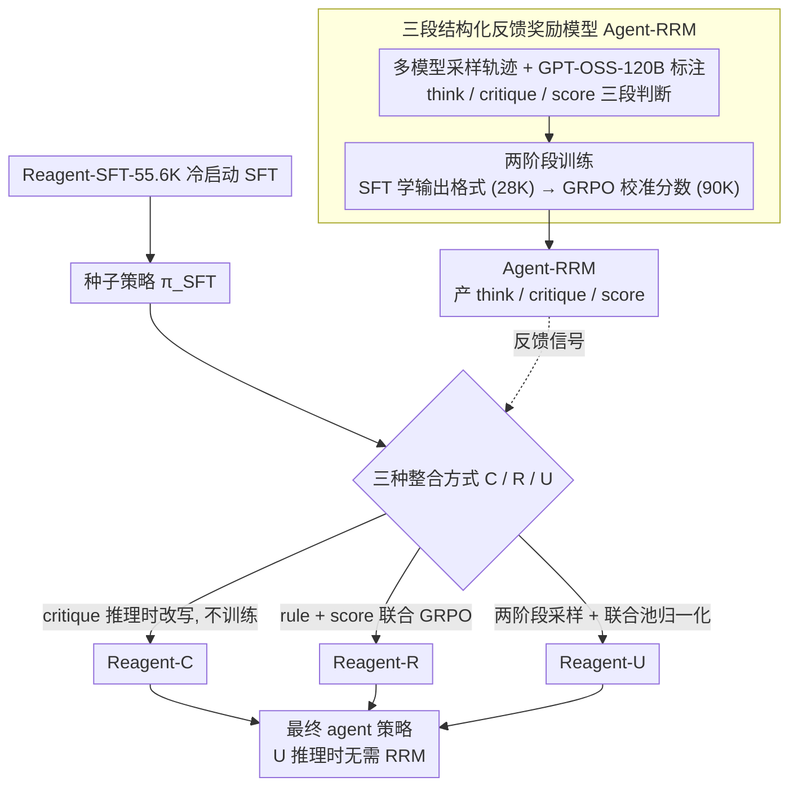

# Exploring Reasoning Reward Model for Agents

**会议**: ACL 2026  
**arXiv**: [2601.22154](https://arxiv.org/abs/2601.22154)  
**代码**: https://github.com/kxfan2002/Reagent  
**领域**: LLM 对齐 / 奖励模型 / Agentic RL  
**关键词**: agentic RL, reasoning reward model, GRPO, critique-guided refinement, 多模态反馈

## 一句话总结
作者发现现在 agentic RL 普遍用 sparse outcome reward（只看最终对错），导致中间多步推理质量信号被丢掉，于是提出 **Agent-RRM**——一个产生 `<think>/<critique>/<score>` 三段结构化反馈的 reasoning reward model，并系统对比三种整合方式（C：纯 critique refinement、R：scalar reward 增强、U：critique + score 联合 GRPO），最终 **Reagent-U** 在 12 个 benchmark 上把 Qwen3-8B 的 GAIA 拉到 43.7%、WebWalkerQA 拉到 46.2%，证明"语言级 critique + 数值 reward"联合监督比单一信号好得多。

## 研究背景与动机
**领域现状**：RLVR（带可验证奖励的 RL）已经在 DeepSeek-R1 等工作上证明可以大幅提升 LLM 推理能力；近期 Search-R1、WebSailor、Agent0 等把这套范式扩展到 agent（多轮工具调用 + 信息检索），获得明显增益。

**现有痛点**：(1) **outcome-based reward 太稀疏**——绝大多数 agentic RL 只看 final answer 对不对，一条"只在最后一步出错" 的轨迹和"全程胡说"的轨迹都被打 0 分，浪费掉中间高质量步骤；(2) **step-level reward 标注代价高**且容易 reward hacking；(3) **现有 reasoning reward model 都是 pair-wise preference**（哪条更好），无法表达"具体哪里错、该怎么改"这种 actionable guidance；(4) 几乎所有工作都只用 **scalar reward** 训练，自然语言 critique 这个潜在的"密集监督"信号被完全忽视。

**核心矛盾**：long-horizon agent 任务（如 GAIA Lv.3 要 10+ 步工具调用）需要 dense 信号才能学到 nuanced reasoning skills，但现有 reward 框架（outcome / step / preference）要么稀疏要么贵要么粗。

**本文目标**：(1) 设计一个能同时产生 reasoning trace + textual critique + scalar score 的多面 reward model；(2) 系统对比"如何把 critique 和 score 喂给 agentic RL"的三种 integration 策略；(3) 拿出一个能在 12 个 benchmark 上稳定打过 SOTA 的训练 recipe。

**切入角度**：作者借鉴 DeepSeek-R1 的 generative reasoning RM 思路（RM-R1, R1-Reward），把它从 single-turn QA 扩展到 multi-turn agentic trajectory，并第一次把 critique 文本本身作为训练信号（而非仅推理时 refinement 用）。

**核心 idea**：让 reward model 自己"reasoning before judging"——先产 `<think>` 分析轨迹一致性，再产 `<critique>` 指出具体缺陷，最后产 `<score>` 给整体分数；下游 agent 既能用 critique 做 in-context refinement、又能用 score 做 GRPO 优势归一化，二者在 Reagent-U 中联合 pool 后取得 1+1>2 的效果。

## 方法详解

### 整体框架
两阶段两 model：(a) **Agent-RRM 训练**——基于 GPT-OSS-120B 标注的 Reagent-RRM-SFT-28K（结构化三段判断）做 SFT 学会"<think>/<critique>/<score>"输出格式，再在 Reagent-RRM-RL-90K 上做 GRPO 校准 scalar score；(b) **Reagent agent 训练**——先用 Reagent-SFT-55.6K（DeepSeek-V3.1 生成的正确轨迹）做 SFT 得到 $\pi_{\theta_{SFT}}$，然后探索三个 RL variant：Reagent-C（推理时 critique refinement, 不训练）、Reagent-R（rule reward + 模型 score 联合 GRPO）、Reagent-U（critique-augmented 两阶段 sampling + 联合 pool GRPO）。Agent 配备 6 个工具：Search（Bing）、Web Browse、Python Interpreter、File Reader、Image Descriptor、Audio Converter。

### 关键设计

**1. Agent-RRM 的三段结构化输出：把 reward model 从打分器升级成"分析→批评→打分"**

单个 scalar 没法表达"算对了但走了弯路"和"答错但思路对了一半"之间的细颗粒度差异，long-horizon agent 任务恰恰最需要这种区分。Agent-RRM 因此让 reward model 在判断前先 reasoning：`<think>` 段写这条轨迹哪些步骤合理、哪些有逻辑漏洞，`<critique>` 段指出具体该改哪里，`<score>` 段才给出整体分 $s \in [0,1]$。训练数据特意从 Qwen3-8B/14B、Qwen3-ARPO-DeepSearch、Qwen2.5-WebDancer、DeepSeek-V3.1 等多种 agent 模型采样轨迹以最大化错误模式覆盖，再用 GPT-OSS-120B 自动标注三段判断，最后走两阶段训练：先在 Reagent-RRM-SFT-28K 上 SFT 学会输出格式，再在 Reagent-RRM-RL-90K 上 GRPO 校准 score。让 RM 显式 reasoning 还顺带压制了 reward hacking——模型必须能"自圆其说"才能给高分，单点投机会在 critique 里被自己暴露出来。

**2. 三个 integration variant（C / R / U）：拆开看 critique 和 score 各值多少**

为了厘清"语言 critique"和"数值 score"两类信号在 agentic RL 里各自及联合的价值，论文设计了三种喂法做对照。Reagent-C 完全 training-free，第一轮采样 $o^{(1)}_i \sim \pi_\theta(o|q)$，让 RRM 产出 critique $c_i$，第二轮 $o^{(2)}_i \sim \pi_\theta(o|q, o^{(1)}_i, c_i)$ 做 in-context refinement 后只评估 refined output，用来隔离 critique 的零样本价值。Reagent-R 把规则奖励和模型分加权成 $R_i = R_{\text{rule}}(q, o_i) + \lambda \cdot R_{\text{model}}(q, o_i)$ 当 GRPO 信号，用来隔离 score 的密集 reward 价值。Reagent-U 则两阶段都采样，把 $\mathcal{G}_{pool} = \{o^{(k)}_i\}$（$k \in \{1, 2\}$）合进一个 pool 联合算优势 $A^{(k)}_i = (R^{(k)}_i - \text{mean}(\mathbf{R}_{pool})) / \text{std}(\mathbf{R}_{pool})$，loss 为 $\mathcal{J}_U(\theta) = \mathbb{E}[\frac{1}{2G}\sum_{k=1}^2 \sum_{i=1}^G (\min(r^{(k)}_i A^{(k)}_i, \text{clip}_\epsilon) - \beta \mathbb{D}_{KL}^{(i,k)})]$。U 的妙处在于让模型在训练时同时学"如何照 critique 改"和"如何在不同质量轨迹间排序"，把 critique 能力**内化**进 policy——于是 inference 时不再需要 RRM，单 forward 即可，部署几乎零额外开销。

**3. Unified pool 联合优势归一化：让 initial 也能受益于 critique**

传统 GRPO 一个 batch 内 $G$ 条 sample 各自内部归一化，如果把 initial 和 refined 两阶段分开归一，两阶段 policy 就解耦了，模型只学会 refinement 技巧却不改善 initial generation。Reagent-U 把池子扩到 $2G$ 条、所有 sample 共享同一组 mean/std 来算 advantage：一旦 refined 普遍比 initial 好，initial 的 sample 会自动拿到负 advantage，梯度便把 policy 往"更接近 refined"的方向推。这一招把两阶段绑在同一个梯度信号下，让 critique 的隐式指导回流到 initial generation，从而做到 inference 时不调 RRM 也能逼近 refined 的质量。

### 损失函数 / 训练策略
基于 GRPO（Shao 2024）框架。Rule reward $R_{\text{rule}}$ 用 final answer 字符串匹配；model reward $R_{\text{model}}$ 取 Agent-RRM 的 `<score>` 值；$\lambda$ 是平衡因子（具体值未明示，应在附录）。Agent-RRM 训练用 RM-R1/R1-Reward 同款两阶段 SFT + GRPO。Agent base model 是 Qwen3-8B，先 SFT on Reagent-SFT-55.6K cold-start，再 RL。

## 实验关键数据

### 主实验
在 GAIA / WebWalkerQA / HLE / xbench 四个核心 agent benchmark 上（GAIA 分 Lv.1/2/3）：

| 模型 | Backbone | GAIA Avg | WebWalker Avg | HLE | xbench |
|------|----------|----------|---------------|-----|--------|
| WebThinker | Qwen3-8B | 22.3 | 13.0 | 6.6 | 13.0 |
| WebDancer | Qwen2.5-7B | 31.0 | 36.0 | – | – |
| VerlTool | Qwen3-8B | 34.0 | – | 8.4 | – |
| ARPO (≤8B) | Qwen3-8B | 38.8 | 30.5 | 8.8 | 25.0 |
| ARPO (≤32B) | Qwen3-14B | **43.7** | 36.0 | 10.0 | 32.0 |
| Search-o1 | QwQ-32B-Preview | 39.8 | 34.1 | 10.8 | 40.0 |
| DeepSeek-R1-671B | – | 25.2 | 10.0 | 8.6 | 32.0 |
| QwQ-32B | – | 18.9 | 3.8 | 6.4 | 10.0 |
| Proprietary OpenAI-o3 | – | 70.5 | 71.7 | 20.2 | 66.0 |
| Claude-4-Sonnet | – | 68.3 | 61.7 | 20.2 | 64.0 |
| OpenAI DeepResearch | – | 67.4 | – | **26.6** | – |
| **Reagent-U** (本文) | Qwen3-8B | **43.7** | **46.2** | – | – |

→ 用 Qwen3-8B 这个 8B 模型，Reagent-U 在 GAIA 和 ARPO 14B 持平、WebWalker 反超 +10.2 pp、相对于 8B baseline ARPO (38.8 / 30.5) 涨幅 +4.9 / +15.7 个绝对点，是非常明显的 RL 增益。

### 消融实验
三个 variant 自对比（推断自论文叙述）：

| 配置 | GAIA Avg | WebWalker Avg | 说明 |
|------|----------|---------------|------|
| Reagent-SFT only | < 38.8 | < 30.5 | 仅 cold-start，弱于 ARPO 8B baseline |
| Reagent-C (training-free critique refine) | 中等 | 中等 | 仅推理时用 critique 改写，不训练 policy |
| Reagent-R (rule + scalar score GRPO) | 较高 | 较高 | 用 RM scalar 当密集 reward 训练 |
| Reagent-U (critique + score 联合 GRPO) | **43.7** | **46.2** | 联合后 internalize critique，inference 无额外开销 |

(具体 ablation 数字论文未在 paper 缓存正文显式给出每个 variant 的全部数据，但叙述强调 Reagent-U 是"superior"且 "yields substantial performance leaps"。)

### 关键发现
- **Reagent-U 在 8B 上打平甚至超过 ARPO 14B**——同 backbone size 下 GRPO + Agent-RRM 比 GRPO + rule-only 高 4.9 (GAIA) / 15.7 (WebWalker) 个点；说明 reward 信号密度比模型 size 更关键。
- **WebWalker 上 +15.7 pp 远大于 GAIA 上的 +4.9 pp**——WebWalker 是多轮 web navigation 长 horizon 任务，更依赖中间步骤质量；GAIA 部分 Lv.1 任务只需单次搜索，dense reward 的边际收益小。这定量验证了"long horizon 越需要 dense critique"的核心 motivation。
- **critique 内化训练 vs 推理时使用**：Reagent-U 把 critique 当 training-time 信号后，inference 时无 RRM 也能保持高性能——这相比 Reagent-C（推理时双次 forward + RRM 调用）大幅降低部署成本，意味着 critique 的价值是"教会模型 reasoning style"而非"实时校对"。
- **联合 pool 的优势归一化是 U > R + C 的关键**——简单地把 R 和 C 加起来不会自动得到 U 的效果；只有把 initial 和 refined 放在同一个 advantage 分布下做归一化，initial generation 才能真正向 refined 靠拢。

## 亮点与洞察
- **三段结构化反馈把 reward model 升级成 "judge + teacher"**——`<think>` 给透明、`<critique>` 给可操作、`<score>` 给数值，把 reward signal 的所有维度一次性提供给下游训练；这种结构未来可以扩展到 multimodal、code、math 等几乎所有 RL 任务。
- **critique-as-training-signal 是新范式**：传统 critic feedback 只在推理时用（self-refine、reflection），本文证明把 critique 当 GRPO 训练材料能让 policy 把 critique 能力内化——这把"critique 模型"从"推理时插件"升级为"训练时教师"，是相对于 self-refine 范式的重要进步。
- **unified pool 联合 advantage 归一化**：这个 trick 看似简单但效果显著——它让 GRPO 框架自然支持"多阶段 trajectory"，未来可以推广到 N>2 阶段的 iterative refinement、tree search 等场景。
- **Inference-cost-neutral**：Reagent-U 在部署时不需要任何额外的 RRM 调用或两阶段 sampling，相比 Reagent-C 双 forward + RRM 调用，部署成本几乎降到 0；这对工业级 agent 系统极具吸引力。
- **4 个高质量数据集开源**（Reagent-SFT-55.6K / RL-709K / RRM-SFT-28K / RRM-RL-90K）——比单纯发模型对社区贡献更大，覆盖数学/多模态/web/工具四大场景，是后续工作的硬基础设施。

## 局限与展望
- **Agent-RRM 自身的可靠性 bottleneck**：所有 reward 信号来自 GPT-OSS-120B 标注训练的 RM，其 critique 质量天花板取决于 GPT-OSS-120B；如果 RM 自己就有 reasoning bug（如错误判断"工具调用顺序"），policy 会被错误信号带偏。
- **跟前沿 proprietary 模型差距巨大**：Reagent-U 43.7 vs OpenAI-o3 70.5（GAIA）、46.2 vs 71.7（WebWalker），开源 8B agent 离闭源 LLM 仍有 25+ 个点差距——说明 RM-based 信号对 base model 能力上限有约束。
- **三 variant 间的精细 ablation 不充分**——论文叙述说 Reagent-U > Reagent-R > Reagent-C，但缺乏在每个 benchmark 上 R/C/U 的对照表，难以判断"critique 贡献多少 / score 贡献多少"。
- **$\lambda$ 超参敏感性未公开**：rule + model reward 的平衡因子 $\lambda$ 直接决定 RM 信号比重，对训练稳定性影响巨大但论文正文未讨论。
- **trajectory 长度受限**：6 个工具组合下的 trajectory 仍是相对短的多步，对真正 long-horizon（50+ 步）的科学发现、deep research 任务能否 scale 未验证。
- **改进方向**：(1) 引入 self-improving RM（RM 也持续 RL）避免 GPT-OSS-120B 上限；(2) 把 critique 用在 process-level reward 而非 trajectory-level，给每个 step 分配 advantage；(3) 探索 Reagent-U 在 32B/72B 上是否能拉近与 o3 的差距；(4) 增加 critique 多样性（多 RM 集成）减少单 RM bias。

## 相关工作与启发
- **vs ARPO (Dong 2025)**：ARPO 是当前最强开源 agent RL baseline，使用 rule-based reward；Reagent-U 在同 8B backbone 上 GAIA 高 +4.9、WebWalker 高 +15.7，说明 reasoning RM 信号的密度优势在 long-horizon 任务尤为显著。
- **vs Atom-Searcher (Deng 2025) / PPR (Xu 2025)**：这两个工作也在 agent 上加 RM，但 Atom-Searcher 直接用 Qwen3-30B-A3B 无训练当 RM、PPR 用预定义 principle 做 process reward——都只输出 step-level scalar；Reagent 第一次同时产生 critique + score。
- **vs RM-R1 (Chen 2025d) / R1-Reward (Zhang 2025b)**：这两个是 reasoning RM 的代表，但聚焦 single-turn QA / 多模态；Reagent-RRM 把 reasoning RM 范式专门改造到 multi-turn agentic trajectory。
- **vs Self-Refine / Reflexion**：传统 self-refine 在推理时多次 sample + 自我批评，部署成本翻倍；Reagent-U 把这个能力内化进 policy，inference 单次 forward，工程上更友好。
- **对其他领域的启发**：三段结构化 RM + unified pool GRPO 这个 recipe 完全可以迁移到 code generation（critique 指出 bug + score 评估 quality）、数学推理（critique 标错误步骤 + score 给整体）、对话系统（critique 标 hallucination + score 评 helpfulness）等任意 multi-step 任务。

## 评分
- 新颖性: ⭐⭐⭐⭐ 把 reasoning RM 第一次系统应用到 multi-turn agentic RL，三 variant 的对比设计清晰；但单看 reasoning RM 范式继承自 RM-R1 / R1-Reward，主要创新在"如何把 critique 内化进 policy"。
- 实验充分度: ⭐⭐⭐⭐ 12 个 benchmark + 4 个数据集 + 三 variant 对比 + 主流开源/闭源 baseline 横评；但论文正文里 R/C/U 三 variant 的逐 benchmark 表格缺失，$\lambda$ 敏感性未公开。
- 写作质量: ⭐⭐⭐⭐ Figure 2 把三 variant 的 arrow 流向画得清晰，公式 5-9 把 unified pool 的优势归一化写得严谨；abstract 直接给出 43.7 / 46.2 两个数字加强可信度。
- 价值: ⭐⭐⭐⭐⭐ 开源 4 个高质量数据集 + 模型 + 代码，是 agentic RL 社区直接可复用的基础设施；Reagent-U 在 inference-time 无额外开销的特性对工业部署有直接价值；reasoning RM 范式可推广性强。

<!-- RELATED:START -->

## 相关论文

- [\[ICLR 2026\] WebArbiter: A Principle-Guided Reasoning Process Reward Model for Web Agents](../../ICLR2026/llm_agent/webarbiter_a_principle-guided_reasoning_process_reward_model_for_web_agents.md)
- [\[ACL 2026\] Mem^p: Exploring Agent Procedural Memory](memp_exploring_agent_procedural_memory.md)
- [\[ICML 2026\] Process Reward Agents for Steering Knowledge-Intensive Reasoning](../../ICML2026/llm_agent/process_reward_agents_for_steering_knowledge-intensive_reasoning.md)
- [\[ACL 2026\] AdaRubric: Task-Adaptive Rubrics for Reliable LLM Agent Evaluation and Reward Learning](adarubric_task-adaptive_rubrics_for_reliable_llm_agent_evaluation_and_reward_lea.md)
- [\[ACL 2026\] CLAG: Adaptive Memory Organization via Agent-Driven Clustering for Small Language Model Agents](clag_adaptive_memory_organization_via_agent-driven_clustering_for_small_language.md)

<!-- RELATED:END -->
