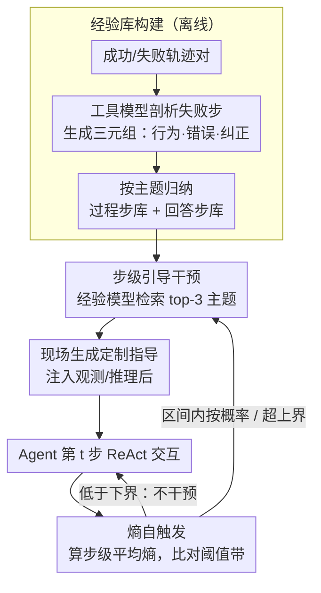

# ExpSeek: Self-Triggered Experience Seeking for Web Agents

**会议**: ACL 2026 Findings  
**arXiv**: [2601.08605](https://arxiv.org/abs/2601.08605)  
**代码**: [https://github.com/WYRipple/ExpSeek](https://github.com/WYRipple/ExpSeek)  
**领域**: LLM Agent  
**关键词**: Web Agent, 经验干预, 熵触发, 主动寻求指导, 多轮交互

## 一句话总结

ExpSeek 提出了一种基于步级熵自触发的经验主动寻求框架，让 Web Agent 在交互过程中根据自身信号判断何时需要指导、获取什么指导，在 Qwen3-8B/32B 上分别实现 9.3% 和 7.5% 的绝对提升。

## 研究背景与动机

**领域现状**：Web Agent 需要在开放网络中进行多轮交互获取信息并回答复杂查询。经验干预（experience intervention）已被证明是提升 agent 能力的有效范式，现有方法主要分为离线经验提炼和在线自演化两条路线。

**现有痛点**：现有经验注入方式是被动的——在任务开始前将经验作为全局上下文一次性注入系统提示。然而在 agent 与环境的多轮交互中，上下文观测持续变化，初始注入的静态经验难以适应动态场景，可能导致决策偏差。

**核心矛盾**：经验的有效性依赖于时机和内容的精准匹配：过于频繁的干预增加推理负担，过于稀疏则错失关键指导窗口；全局经验无法针对当前步骤的具体状态提供定制化指导。

**本文目标**：构建一种主动经验寻求框架，解决两个核心问题——(1) 何时寻求经验（when）：利用模型自身信号判断干预时机；(2) 寻求什么经验（what）：设计步级定制化经验内容。

**切入角度**：作者观察到 LLM 的步级熵（token entropy 均值）与推理质量存在统计相关性——错误步骤的熵显著高于正确步骤。这种内在信号可以作为 agent "困惑"程度的指示器，无需额外的奖励模型。

**核心 idea**：用模型自身的步级熵作为自触发信号判断干预时机，结合经验库和经验模型动态生成步级定制化指导，实现从被动全局注入到主动步级寻求的范式转变。

## 方法详解

### 整体框架

ExpSeek 包含三个阶段：(1) 经验库构建——从成功/失败轨迹对中提取结构化经验三元组并按主题组织；(2) 熵自触发机制——通过 logistic 回归和 bootstrap 重采样估计过程步和回答步的熵阈值区间；(3) 步级引导干预——当步级熵超过阈值时，经验模型基于当前上下文检索相关经验并生成定制化指导。经验库在离线阶段一次性构建，熵自触发与步级引导干预则在推理时随 ReAct 交互逐步循环执行。

### 关键设计

**1. 经验库构建：把失败轨迹蒸成可复用的三元组**

经验要能被复用，就不能是一堆原始日志，而要提炼成结构化、可检索的引导。ExpSeek 对训练集每个查询采样 $k$ 条轨迹，配成成功/失败对 $(\tau^+, \tau^-)$，再由工具模型逐步剖析失败轨迹，为每个出错步骤生成一个经验三元组：行为描述（Behavior）说当时做了什么、错误分析（Mistake）说错在哪、纠正方向（Guidance）只给方向不直接给答案。这套三元组刻意模仿人类从错误中学习的方式，让 agent 在遇到类似情形时知道"该往哪拐"而非被喂标准答案。最后通过迭代批处理为三元组归纳主题标签，按主题组织成过程步经验库 $\mathcal{E}_p$ 和回答步经验库 $\mathcal{E}_a$——分库是因为这两类步骤的熵分布特征本就不同，主题组织则让后续检索更高效。

**2. 熵自触发机制：用模型自己的"困惑"决定何时干预**

干预时机是这套框架的核心难题：太频繁增加推理负担，太稀疏又错过关键窗口，而外挂奖励模型既贵又笨重。ExpSeek 的洞察是 LLM 的步级熵本身就是现成的"困惑"指示器——它先算每步的平均 token 熵 $\bar{H}_t = \frac{1}{|R_t|} \sum_{x \in R_t} H(x)$，对过程步和回答步分别拟合 logistic 回归 $P(y_t=0|\bar{H}_t) = 1/(1+e^{-(w \cdot \bar{H}_t + b)})$，再用 1000 次 bootstrap 重采样估出 95% 置信区间 $[\theta_{lower}, \theta_{upper}]$ 当阈值带。推理时低于下界不干预、高于上界必干预、落在区间内按线性概率决定，这种概率化处理避开了硬阈值的脆弱。KS 检验佐证了这一信号确实可分：正确/错误步骤的熵分布在过程步上 KS=0.1998、回答步上 KS=0.3809，均 p<0.001。

**3. 步级引导干预：按当前语境现场生成定制指导**

被触发之后，关键是给出贴合当前状态的指导而非套用通用模板。当熵触发干预且上一步未干预时，经验模型 $\mathcal{M}_e$ 读入当前步的历史上下文 $h_t$，从对应经验库里挑出 3 个最相关主题，再基于这些主题下的三元组为眼前场景动态生成指导 $e_t$：过程步的指导追加在环境观测之后引导下一步探索，回答步的指导则让 agent 继续推理或修正答案。生成式指导明显优于检索式（实验里检索嵌入掉了很多），因为生成能把通用经验调适到具体语境上。而"上一步未干预才允许干预"的一步冷却期，则从机制上挡住了连续过度干预。

### 损失函数 / 训练策略

ExpSeek 为推理时框架，不涉及训练。经验库构建使用 Qwen3-235B-A22B-Instruct 作为工具模型。Agent 使用 Qwen3-8B/32B，采样温度 1.0，top-p 0.95，最大 30 步 ReAct 交互。

## 实验关键数据

### 主实验

**四个 Web Agent 基准上的准确率（%）**

| 方法 | WebWalkerQA | GAIA | Seal | xbench | Avg. |
|------|-------------|------|------|--------|------|
| **Qwen3-8B** | | | | | |
| No Experience | 38.47 | 29.13 | 23.23 | 25.60 | 32.23 |
| Training-Free GRPO | 40.62 | 29.32 | 25.59 | 26.00 | 33.79 |
| ReasoningBank+ | 40.78 | 32.04 | 26.38 | 28.00 | 34.80 |
| **ExpSeek** | **48.25** | **36.89** | **30.16** | **37.20** | **41.50** |
| **Qwen3-32B** | | | | | |
| No Experience | 45.01 | 36.50 | 27.80 | 27.40 | 37.79 |
| ReasoningBank+ | 45.60 | 33.01 | 29.84 | 36.33 | 39.33 |
| **ExpSeek** | **51.09** | **43.88** | **32.76** | **42.00** | **45.32** |

### 消融实验

| 变体 (8B) | GAIA | xbench |
|-----------|------|--------|
| 仅过程步指导 | 33.01 (+3.9) | 28.40 (+2.8) |
| 仅回答步指导 | 30.29 (+1.2) | 34.80 (+9.2) |
| 完整 ExpSeek | **36.89** (+7.8) | **37.20** (+11.6) |

**触发与指导方式对比 (8B, GAIA)**

| 触发方式 | 指导方式 | Acc. | 平均步数 | 平均时间 |
|----------|----------|------|----------|----------|
| 规则触发 | 经验模型 | 38.81 | 9.52 | 329.71s |
| Claude-4 | 经验模型 | 39.47 | 8.55 | 370.82s |
| **熵触发** | **经验模型** | **36.89** | **5.75** | **127.57s** |
| 熵触发 | 检索嵌入 | 30.92 | 5.54 | 110.61s |

### 关键发现

- 熵触发的效率优势显著：步数仅为规则触发的 60%，时间仅为 39%，同时保持相当的准确率
- 4B 经验模型即可有效指导 32B Agent（GAIA +5.2%, xbench +9.7%），验证了弱模型引导强模型的可行性
- 经验指导使过程步熵增加（促进探索），回答步熵降低（增强收敛），形成"发散-收敛"的行为模式
- 即使每个主题仅保留 1 条经验，性能仍然稳健，说明经验模型能从少量种子经验中泛化

## 亮点与洞察

- 将经验干预从被动的全局注入转变为主动的步级寻求，是范式层面的创新
- 利用模型自身的熵信号作为触发器，无需额外奖励模型，既优雅又实用
- "发散-收敛"的熵行为模式提供了对 ExpSeek 工作机制的直觉解释
- 跨任务泛化能力强：仅用 WebWalkerQA 25% 数据构建经验库，在三个 OOD 基准上仍显著有效

## 局限与展望

- 阈值估计依赖训练集和工具模型对步骤质量的评估，更精确的策略有待探索
- 尚未验证在非 Web 领域和更多工具集上的效果
- 可探索 ExpSeek 作为 Agentic RL 的 rollout 增强技术，提升收敛速度和采样质量

## 相关工作与启发

- 与 ReasoningBank 等离线/在线经验积累方法互补，ExpSeek 关注的是经验的利用方式（时机和内容）
- 熵作为推理质量指示器的成功应用，启发了在其他 agent 场景中利用模型不确定性信号的可能性
- 弱模型指导强模型的成功案例，为实际部署中降低指导成本提供了新思路

## 评分

- 新颖性: ⭐⭐⭐⭐⭐ 从被动注入到主动寻求的范式转换，熵自触发机制设计精巧
- 实验充分度: ⭐⭐⭐⭐⭐ 四个基准、两个模型规模、丰富的消融和分析（效率、缩放律、迁移性、内部机制）
- 写作质量: ⭐⭐⭐⭐ 结构清晰，动机充分，实验分析深入

<!-- RELATED:START -->

## 相关论文

- [\[ACL 2026\] Mem²Evolve: Towards Self-Evolving Agents via Co-Evolutionary Capability Expansion and Experience Distillation](mem2evolve_towards_self-evolving_agents_via_co-evolutionary_capability_expansion.md)
- [\[ICML 2026\] EvolveR: Self-Evolving LLM Agents through an Experience-Driven Lifecycle](../../ICML2026/llm_agent/evolver_self-evolving_llm_agents_through_an_experience-driven_lifecycle.md)
- [\[ACL 2026\] SynthAgent: Adapting Web Agents with Synthetic Supervision](synthagent_adapting_web_agents_with_synthetic_supervision.md)
- [\[ICLR 2026\] Web-CogReasoner: Towards Knowledge-Induced Cognitive Reasoning for Web Agents](../../ICLR2026/llm_agent/web-cogreasoner_towards_knowledge-induced_cognitive_reasoning_for_web_agents.md)
- [\[ACL 2026\] From Storage to Experience: A Survey on the Evolution of LLM Agent Memory Mechanisms](from_storage_to_experience_a_survey_on_the_evolution_of_llm_agent_memory_mechani.md)

<!-- RELATED:END -->
