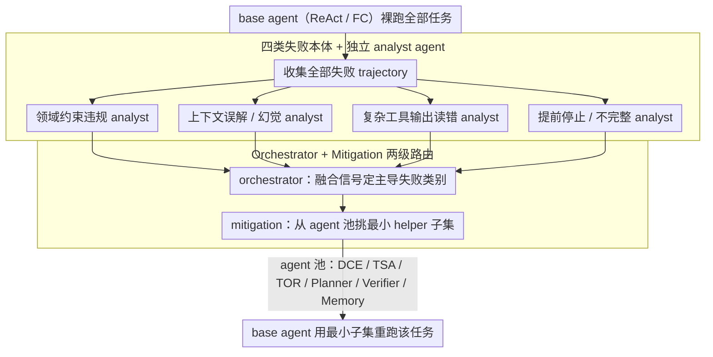

# FAMA: Failure-Aware Meta-Agentic Framework for Open-Source LLMs in Interactive Tool Use Environments

**会议**: ACL 2026 Findings  
**arXiv**: [2604.25135](https://arxiv.org/abs/2604.25135)  
**代码**: 无（论文未明确公开）  
**领域**: LLM Agent / 工具使用 / 多智能体编排  
**关键词**: 失败感知、Meta-Agent、Tool-use、τ-bench、开源 LLM

## 一句话总结
FAMA 先用一套独立"失败分析 agent + 编排 agent"自动诊断基线 tool-use agent 在 τ-bench 这类多轮交互上的主要失败模式，再让一个 mitigation agent 按需挑选最小子集 helper agent 注入到上下文，从而在 Qwen 系列开源模型上把任务成功率最高拉高 27%。

## 研究背景与动机
**领域现状**：以 τ-bench、τ-trait、ACEBench 为代表的多轮 tool-use 基准把 LLM 当作客服 agent，与模拟用户交互、调用 API、遵循领域规则。主流改良思路要么做 SFT/RL 训练，要么搭一个静态多 agent 框架（如 IRMA）把 Planner、Memory、Tool Reformulator 等模块全部串起来给 base agent 辅助。

**现有痛点**：1) 训练路线对多轮长 trajectory 来说数据采集和奖励传播都过于昂贵；2) 静态多 agent 框架把所有 helper agent 一股脑塞进上下文，对小开源模型反而是灾难——上下文窗口被 helper 输出占满（IRMA 平均 overhead 50-58%），有时还不如裸 ReAct，且不同模型的主导失败模式根本不一样，统一塞同一套 agent 必然 mismatch。

**核心矛盾**：模型规模越小、上下文越紧，越需要"精打细算"地决定哪个 helper agent 该上场；而现有静态框架既不知道这个 agent 失败在哪、也不知道当前 helper 是不是对症下药。

**本文目标**：构建一个 training-free 框架，能 (a) 自动定位 base agent 的主导失败模式，(b) 按失败模式动态选最小 helper 子集，(c) 在开源模型上拿到稳定 gain。

**切入角度**：先验上，作者把 tool-use 失败归到 4 大类（领域策略违规、复杂工具输出读错、上下文误解/幻觉、提前停止/不完整），并观察到不同开源模型在不同 benchmark 上的主导失败类别明显不同——这意味着 helper agent 的选择必须 model-aware + benchmark-aware。

**核心 idea**：用"agent 来诊断 agent"的 meta-agent 思路：让一组失败分析 agent + 一个 orchestrator + 一个 mitigation agent 看完 base agent 的真实失败 trajectory 后，再决定下一轮用哪些 helper 重跑。

## 方法详解

### 整体框架
FAMA 把"改进 tool-use agent"重新表述成一个两阶段的推理时编排问题：先让 base agent（ReAct/FC）在所有任务上裸跑一遍、收集全部失败 trajectory $\mathcal{F}$，再对每条失败 trajectory 依次走"诊断—编排—缓解"三步，最后用诊断出的最小 helper 子集把这条任务重跑一遍。整个过程不更新任何模型权重，只在推理时改变给 base agent 的上下文构造方式——输入是失败 trajectory，输出是一份 model-aware 且 benchmark-aware 的 helper 激活配置。

### 关键设计

**1. 四类失败本体 + 独立 analyst agent：分头诊断躲开类别互扰**

如果用一个大 prompt 同时判 4 类失败，类别之间会相互干扰、容易被 majority class 主导，因此 FAMA 把 tool-use 失败强分成领域约束违规（Domain Constraint Violation, DCV）、复杂工具输出读错（Incorrect Retrieval）、上下文误解/幻觉（Contextual Misinterpretation, CM）、提前停止/不完整（Incomplete Fulfillment, IFU）四类（$|\mathcal{E}|=4$），每一类配一个只盯这条失败因果链的独立 LLM analyst，各自给出"是否触发 + 自然语言 rationale"的二分类决策。

所有 analyst 的输出再拼成 $O_\tau = \text{Concat}(\{o_{\tau,e}\}_{e\in\mathcal{E}})$ 交给后面的 orchestrator 做最终归因。这种分头诊断之所以必要，是因为作者在统计里发现不同模型的主导失败类别差异极大——τ-bench 上 CM 和 DCV 最严重、τ-trait 上 IFU 突出、ACEBench 上 CM 一家独大——单 prompt 多分类根本压不住这种分布漂移。

**2. Orchestrator + Mitigation 两级路由：把诊断和开药解耦**

诊断和"该上哪几个 helper"是两件难度不同的事，FAMA 干脆拆成两个 agent：orchestrator 看完所有 analyst 信号 + 原 trajectory，融合出这条任务真正的主导错误类别 $\hat{\mathcal{E}}_\tau$；mitigation agent 再拿着 $\hat{\mathcal{E}}_\tau$ 和 agent 池 $\mathcal{A}$（DCE、TSA、TOR、Planner、Verifier、Memory）的自然语言功能描述，输出一个满足 $\bigcup_{e\in\hat{\mathcal{E}}_\tau}\text{cover}(e)$ 的最小子集 $\mathcal{A}^*_\tau \subseteq \mathcal{A}$。

这样一来 orchestrator 只需懂失败本体、mitigation 只需懂 helper 的功能边界，两者各自的任务都很窄，因此即便底座换成 GPT-4.1-mini 这类更小的 judgment 模型也能稳定输出。跨任务把这些 $\mathcal{A}^*_\tau$ 聚合起来，就得到某模型在某 benchmark 上的稳定推荐配置。

agent 池里的 helper 各司其职，以最常被选中的两个为例：Memory 模块保留最近 $k$ 轮 user query（$k$ 与领域相关，Airline 最佳 $k=2$、Retail 最佳 $k=6$），DCE 则在每轮决策前从 system prompt 抽出与当前状态相关的领域约束重新注入上下文。mitigation agent 要做的，就是从这池功能边界清晰的 helper 里按覆盖需求拼出 $\mathcal{A}^*_\tau$——既补上主导失败类别缺的能力，又不像 IRMA 那样把六个 helper 全塞进本就紧张的上下文。

### 一个完整示例
以 Qwen3-4B 在 τ-bench Airline 上的一条失败任务为例：base agent 裸跑时违反了"改签需先验证身份"的领域规则，这条 trajectory 进入 $\mathcal{F}$。四个 analyst 分别表态，其中 DCV analyst 判定触发、CM analyst 也报了一个上下文遗忘信号；orchestrator 融合后给出主导类别 $\hat{\mathcal{E}}_\tau=\{\text{DCV, CM}\}$；mitigation agent 据此选出最小子集 $\mathcal{A}^*_\tau=\{\text{DCE, Memory}\}$——DCE 负责把"先验证身份"这条约束重新注入、Memory 负责让早期 user query 不被挤掉。用这套配置重跑后该任务通过，而 IRMA 那种把六个 helper 全塞进去的做法反而因为上下文被占满而继续失败。

### 损失函数 / 训练策略
FAMA 是纯推理时框架，不更新任何参数。analyst / orchestrator / mitigation 这三类 judgment agent 用 GPT-4o（并以 GPT-4.1-mini 做鲁棒性对照）；base tool-use agent 用 Qwen3-4B/14B/32B 和 Qwen2.5-72B-Instruct，后者同时充当 user simulator。

## 实验关键数据

### 主实验
τ-bench 五次独立运行的 pass^k 平均值（k=1..5），对比 ReAct、FC、IRMA：

| 模型 | Domain | 指标 | ReAct | FC | IRMA | FAMA |
|------|--------|------|-------|-----|------|------|
| Qwen3-4B | Airline | pass^1 / pass^5 | 32.0 / 26.0 | 27.6 / 14.0 | 30.0 / 12.0 | **37.6 / 26.0** |
| Qwen3-4B | Retail | pass^1 / pass^5 | 17.2 / 8.7 | 24.9 / 9.0 | 28.9 / 9.6 | **34.6 / 13.9** |
| Qwen2.5-72B | Airline | pass^1 / pass^5 | 24.4 / 10.0 | 15.2 / 2.0 | 26.4 / 10.0 | **29.2 / 18.0** |
| Qwen2.5-72B | Retail | pass^1 / pass^5 | 43.5 / 20.9 | 19.7 / 4.3 | 38.8 / 19.1 | **44.2 / 27.0** |

聚合：FAMA 比 ReAct/FC/IRMA 在 Airline 平均高 4.63 / 11.57 / 5.27 个点；在 Retail 高 5.30 / 8.96 / 6.15。ACEBench end-to-end 准确率最高把 Qwen2.5-72B 从 23.3% 推到 50.0%（+26.7%）。

### 消融实验

| 配置 (Qwen3-14B, τ-bench Airline pass^1) | 准确率 | 说明 |
|------|--------|------|
| Full FAMA (mitigation 推荐 = DCE+Memory) | **36.8%** | 完整方案 |
| Memory+DCE+TOR (Exp 1，未被推荐) | 较 Full 低 | 多塞一个 TOR 反而掉点 |
| Memory+TOR (Exp 2) | 较 Full 低 | 漏掉 DCE 失去领域约束 |
| Memory+TOR+TSA (Exp 3) | 较 Full 低 | 配置越偏离推荐越差 |
| IRMA (全 agent) | 26.4% | 一股脑全塞，反而最低 |

效率方面（Qwen3-32B, 表 2）：IRMA overhead 50-58%、平均 latency 111-150s；FAMA overhead ~30%、latency 57-91s；ReAct-thinking 因为推理 token 爆炸经常 overflow 导致失败。

### 关键发现
- mitigation agent 推荐的组合一致优于其他随机组合，**少塞一些被推荐的 agent 有时甚至更好**（说明 helper 之间存在干扰，IRMA 全塞反而是反优化）。
- 把 mitigation 的推荐跨所有 Qwen 系列开源模型统计起来，Memory 和 DCE 几乎总是最常被推荐的两个 helper（Fig 5）——这与失败分析得出的"开源模型在长对话里遗忘 system prompt 领域规则、本质是 memory 瓶颈"互相印证，反过来说明前面的诊断没跑偏。
- 换用 GPT-4.1-mini 做 judgment，主导失败类别和 helper 推荐和 GPT-4o 高度一致（Fig 9/11），说明诊断对 judgment 模型不敏感。
- Reasoning/thinking 变体（Qwen3 thinking）经常因为内部 CoT 把 token budget 烧光而 overflow，FAMA-non-thinking 反而更稳——这是个针对开源 thinking 模型的反直觉发现。

## 亮点与洞察
- "Meta-Agent" 这个抽象很漂亮：FAMA 自己不在环境里直接动手，只通过推理别人的行为、诊断、重组上下文来间接改善决策。这把"agent 编排"从架构师拍脑袋升级成了数据驱动的自动化过程。
- 诊断 + 编排 + 缓解三角色解耦是个可复用模板：每个 agent 任务都很窄，因此即使 judgment 用 GPT-4.1-mini 这类小模型也稳；放到其他 agentic 场景（编程、科研 agent）也容易迁移。
- "全塞 helper 反而更差"的实证证据非常有用——它直接动摇了"多 agent 就一定更好"的默认信念，逼着大家想清楚每个 helper 的边际收益与上下文成本。

## 局限与展望
- agent 池是预定义的，FAMA 的天花板被池子覆盖度卡死，没法自动发现/合成新 helper（作者明确承认）。
- 只在结构化的客服 tool-use 上验证，对开放式 embodied / 多模态 agent 是否还能稳定诊断未知。
- 四类失败本体是经验定义的，对很冷门的领域（如数学证明 agent）可能不全；本体扩展机制论文没给。
- judgment agent 用 GPT-4o，对完全离线/隐私场景反而成了新的依赖；未来可以做"全开源诊断闭环"。

## 相关工作与启发
- **vs IRMA (Mishra 2025)**: 同样用模块化 helper agent，但 IRMA 静态全塞，FAMA 动态按失败模式裁剪——这正是 FAMA 在 IRMA 之上的关键差。
- **vs Self-Reflection / Reflexion**: 反思类方法是 trajectory 内部一边走一边自省；FAMA 是 trajectory 之间跨任务统计，颗粒度更粗但收敛信号更稳。
- **vs RL 微调（VeRLTool/MUA-RL）**: 训练路线被高昂的 trajectory 采集成本卡住；FAMA 完全 training-free，对小开源模型是更现实的方案。

## 评分
- 新颖性: ⭐⭐⭐⭐ "诊断 agent 的 agent" 思路相对清新，但失败本体和 helper 池都借自 IRMA 体系。
- 实验充分度: ⭐⭐⭐⭐ 三个 benchmark × 四个开源模型 × 五次重复 × pass^1..5，再加 token/latency/judgment 鲁棒性，几乎榨干了 τ-bench 系列。
- 写作质量: ⭐⭐⭐⭐ 算法 1 清晰、失败本体和 helper 边界讲得明白；个别 statistics 在 appendix 散得有点远。
- 价值: ⭐⭐⭐⭐ 对所有在开源小模型上搭 agent 框架的人都是马上能用的 recipe，且证伪了 "全 agent 更强" 的默认假设。

<!-- RELATED:START -->

## 相关论文

- [\[ACL 2026\] ToolOmni: Enabling Open-World Tool Use via Agentic Learning with Proactive Retrieval and Grounded Execution](toolomni_enabling_open-world_tool_use_via_agentic_learning_with_proactive_retrie.md)
- [\[ACL 2026\] Meta-Tool: Efficient Few-Shot Tool Adaptation for Small Language Models](meta-tool_efficient_few-shot_tool_adaptation_for_small_language_models.md)
- [\[ACL 2026\] Feedback-Driven Tool-Use Improvements in Large Language Models via Automated Build Environments](feedback-driven_tool-use_improvements_in_large_language_models_via_automated_bui.md)
- [\[ACL 2026\] How Adversarial Environments Mislead Agentic AI](how_adversarial_environments_mislead_agentic_ai.md)
- [\[ACL 2025\] Adaptive Tool Use in Large Language Models with Meta-Cognition Trigger](../../ACL2025/llm_agent/meco_metacognition_tool_use.md)

<!-- RELATED:END -->
