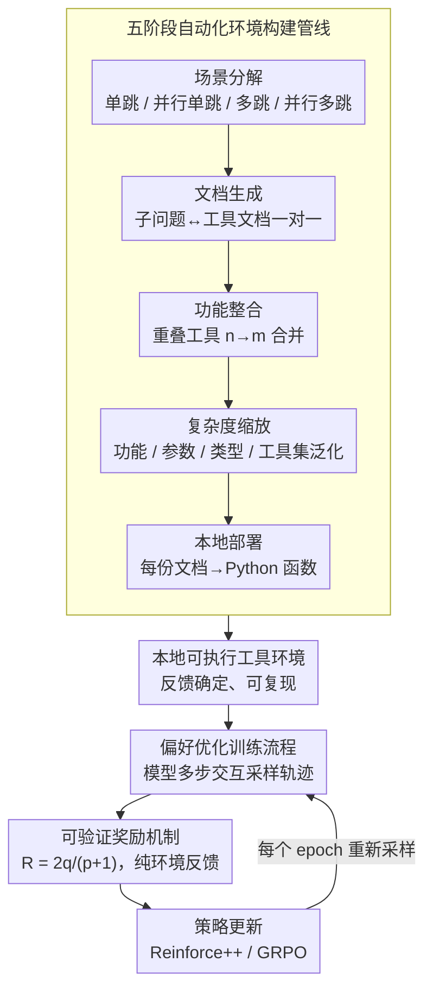

# Feedback-Driven Tool-Use Improvements in Large Language Models via Automated Build Environments

**会议**: ACL 2026  
**arXiv**: [2508.08791](https://arxiv.org/abs/2508.08791)  
**代码**: [https://github.com/bytedance/FTRL](https://github.com/bytedance/FTRL)  
**领域**: 强化学习 / 工具使用  
**关键词**: 工具调用, 强化学习, 自动化环境构建, 可验证奖励, LLM训练

## 一句话总结

本文提出 FTRL 框架，通过五阶段自动化管线构建稳定可控的工具使用训练环境，并设计结合工具调用精度和任务完成度的可验证奖励机制，与偏好优化 RL 算法结合后，在 7B-14B 模型上实现平均超 10% 的工具使用性能提升，甚至超越最强闭源模型。

## 研究背景与动机

**领域现状**：LLM 的工具使用能力是实现复杂现实任务的关键能力。当前提升工具使用能力的主要方法包括：在专有模型生成的交互轨迹上微调开源模型，以及通过 RL 方法让模型与环境交互来学习。

**现有痛点**：基于 RL 的工具使用训练框架面临两大核心限制：(1) 构建稳定训练环境困难——依赖大量在线工具的框架容易受 API 限速、服务中断等因素影响，标准化部署成本高；(2) 缺乏可验证的奖励信号——工具交互的复杂性和有效轨迹的多样性通常需要高级 LLM 评估，引入模型偏差并降低训练效率和算法稳定性。

**核心矛盾**：有效的工具使用 RL 训练需要同时满足"环境稳定可控"和"奖励信号可靠"两个条件，但现有方案无法同时解决这两个问题。

**本文目标**：(1) 自动化生成大量高质量工具使用训练环境；(2) 设计仅依赖环境反馈的可验证奖励机制；(3) 与标准 RL 算法无缝集成进行反馈驱动训练。

**切入角度**：将工具环境构建拆解为五个自动化阶段（场景分解→文档生成→功能整合→复杂度缩放→本地部署），所有工具以代码形式本地执行，避免外部依赖。

**核心 idea**：自动化构建本地可执行的工具环境 + 基于 F1 思想的精度-完成度平衡奖励 = 稳定、可验证的工具使用 RL 训练。

## 方法详解

### 整体框架

FTRL 想同时治好工具使用 RL 的两个老大难——环境不稳、奖励不可信——办法是把两者都"本地化、可计算化"。它由两大组件咬合：前端是一条五阶段自动化管线，把用户输入逐级拆成子问题、生成配套工具文档、再落成本地可执行的 Python 函数，从而批量造出稳定可控的训练环境；后端是反馈驱动的训练框架，让模型在这些环境里多步交互采样轨迹，用一套只依赖环境反馈的可验证奖励配合偏好优化 RL 算法迭代更新策略。

### 关键设计

**1. 五阶段自动化环境构建管线：把外部 API 依赖整条砍掉**

在线工具受 API 限速和服务中断折磨、标准化部署成本又高，FTRL 干脆把整个环境搬到本地生成：(a) 场景分解先按子问题的逻辑关系定义单跳、并行单跳、多跳、并行多跳四种工具使用场景；(b) 文档生成为每个子问题产出一份工具文档、建立一对一映射；(c) 功能整合把功能重叠的工具从 $n$ 个合并到 $m \leq n$ 个；(d) 复杂度缩放再通过功能泛化、参数扩展、类型泛化和工具集扩展把难度拉上去；(e) 本地部署最后把每份工具文档映射成一个 Python 函数。

这条链路里，场景分解保证了训练数据覆盖不同的子问题结构，复杂度缩放逼模型学会泛化到更复杂的工具，而最后的本地部署是关键一步——所有工具都在本地以代码形式执行，反馈确定且可复现，彻底摆脱了对外部服务可用性的依赖。

**2. 可验证奖励机制：用 F1 的思路在精度和完成度之间找平衡**

只奖励调用精度会让模型偷懒、任务做不完，只奖励完成度又会诱导工具滥用，FTRL 借 F1 分数的思想把两者捏进一个公式。记 $p$ 为调用次数、$q$ 为成功解决的子问题数、$t$ 为剩余未解决子问题数、$a$ 为正确答案，主奖励在 $p>0$ 时取 $R = \frac{2q}{p+1}$，对空输出和格式错误分别扣 $-0.5$、$-0.3$，答案正确时再补一份 $\frac{1}{t+1}$ 的奖励。

这个设计最大的好处是奖励完全由环境反馈算出、不掺任何 LLM-as-judge 的模型偏差，既稳定又便宜；消融也证实它比 $q/p$、$q$、$q^2/p$ 这些变体都更均衡——后几者要么单点偏科，要么因为离散奖励分布太碎而拖垮训练。

**3. 偏好优化训练流程：靠环境交互自己长出解题路径**

有了稳定环境和可信奖励，剩下的就是让模型在里面"试错进化"：模型 $\mathcal{M}$ 在构建的环境中多步交互采样轨迹，逐步记录每一步的工具调用、中间结果和最终答案，再把可验证奖励喂给 Reinforce++ 或 GRPO 这类偏好优化 RL 算法做策略更新。

为了不断扩大探索空间，每个 epoch 开始都用当前模型重新采样一批训练轨迹。整条流程不需要任何手工标注的解题路径，模型完全通过与环境交互自主发现有效的工具使用策略，这也是它能避开对专有模型蒸馏数据依赖的根本原因。

### 损失函数 / 训练策略

使用 VeRL 框架训练，学习率 $1\times10^{-6}$，batch size 512，mini-batch 32，每次更新 16 个 rollout。非推理模式最大响应长度 1024，推理模式 8192。训练 3 个 epoch，每个 epoch 开始时用当前模型重新采样轨迹。在 8 张 A100 GPU 上训练。

## 实验关键数据

### 主实验

**不同规模模型的工具使用性能（Solve-F1 / 各基准平均分）**

| 模型 | 基准 Avg | FTRL-Reinforce++ | FTRL-GRPO |
|------|---------|-----------------|-----------|
| Qwen2.5-7B | 26.52 | 37.09 (+10.57) | 37.80 (+11.28) |
| Qwen2.5-14B | 34.33 | 44.25 (+9.92) | 41.23 (+6.90) |
| Qwen3-8B (Non-Reasoning) | 31.01 | 42.41 (+11.40) | 45.43 (+14.42) |
| Qwen3-14B (Non-Reasoning) | 33.34 | 44.14 (+10.80) | 44.90 (+11.56) |
| GPT-4o | 42.79 | — | — |
| Claude-4.0-Sonnet | 42.71 | — | — |

### 消融实验

**不同奖励机制的 Solve-F1 对比（Qwen2.5-7B）**

| 奖励设计 | 效果 | 说明 |
|---------|------|------|
| $R_{\text{Solve-P}} = q/p$ | Solve-P 高但 Solve-R 低 | 仅优化精度，任务完成不充分 |
| $R_{\text{Solve-R}} = q$ | Solve-R 高但 Solve-P 低 | 仅优化完成度，工具滥用 |
| $R_{\text{Solve-PR}} = q^2/p$ | 不稳定 | 离散奖励分布阻碍训练 |
| **$R = 2q/(p+1)$** | **最优平衡** | 精度和完成度均衡提升 |

### 关键发现

- FTRL 训练的 7B-14B 开源模型在平均分上超越 GPT-4o（42.79）和 Claude-4.0-Sonnet（42.71）等最强闭源模型
- 参数级分析揭示性能提升主要源于底层 MLP 参数（第 0-2 层）的更新，表明方法增强的是模型对上下文信息的理解和表征能力，而非简单过拟合
- 推理模式在复杂场景（多跳、并行多跳）表现更好，但在简单场景（单跳）性能下降，说明当前推理机制尚未针对工具使用优化
- 训练后模型在 MMLU、BBH、GSM8K 等通用能力基准上无性能损失

## 亮点与洞察

- 五阶段环境构建管线设计精巧——从场景分解到本地部署形成闭环，既保证了环境多样性又确保了反馈稳定性，可迁移到其他需要稳定交互环境的 RL 训练场景
- F1 式奖励设计简洁高效——用一个公式同时约束精度和完成度，避免了多目标优化的复杂性
- "底层 MLP 驱动提升"的发现具有启发性——工具使用能力的改善根植于更好的上下文理解而非表面模式匹配

## 局限与展望

- 方法主要改善工具调用行为，未优化模型底层推理过程，当前开源模型的推理模式与工具使用任务之间存在对齐缺口
- 受资源限制仅在 7B-14B 模型上验证，更大规模模型的效果未知
- 环境构建依赖 GPT-4o 辅助生成，未来可探索完全自动化的生成方案
- 训练数据中缺乏多轮用户交互和噪声环境，但模型仍在 τ-bench 等多轮基准上有效，说明泛化能力较强

## 相关工作与启发

- **vs 基于 SFT 的方法（如 ToolLlama）**: SFT 方法依赖专有模型生成轨迹做监督微调，FTRL 通过 RL 与环境交互自主学习，避免了对专有模型的依赖
- **vs 现有 RL 工具使用方法**: 现有方法依赖在线 API 和 LLM-as-judge 奖励，FTRL 的本地环境和可验证奖励解决了稳定性和奖励可靠性问题
- **vs Ye et al. (2024)**: 他们的可控环境构建仅限于多跳场景和测试数据，FTRL 覆盖四种场景并支持训练

## 评分

- 新颖性: ⭐⭐⭐⭐ 五阶段环境构建和 F1 式奖励的结合是工程导向的系统创新
- 实验充分度: ⭐⭐⭐⭐⭐ 多模型家族、多 RL 算法、多基准、奖励消融、参数分析，非常全面
- 写作质量: ⭐⭐⭐⭐ 结构清晰，实验分析有深度，但环境构建的技术细节可更详细
- 价值: ⭐⭐⭐⭐⭐ 提供了完整可用的工具使用 RL 训练框架，7B 模型超越 GPT-4o 具有很强的实用价值

<!-- RELATED:START -->

## 相关论文

- [\[ACL 2026\] Robust Tool Use via Fission-GRPO: Learning to Recover from Execution Errors](robust_tool_use_via_fission-grpo_learning_to_recover_from_execution_errors.md)
- [\[ACL 2026\] Don't Adapt Small Language Models for Tools; Adapt Tool Schemas to the Models](don39t_adapt_small_language_models_for_tools_adapt_tool_schemas_to_the_models.md)
- [\[ICLR 2026\] ToolWeaver: Weaving Collaborative Semantics for Scalable Tool Use in Large Language Models](../../ICLR2026/llm_agent/toolweaver_weaving_collaborative_semantics_for_scalable_tool_use_in_large_langua.md)
- [\[ACL 2025\] ToolHop: A Query-Driven Benchmark for Evaluating Large Language Models in Multi-Hop Tool Use](../../ACL2025/llm_agent/toolhop_multi_hop_tool_use.md)
- [\[ACL 2026\] ImplicitMemBench: Measuring Unconscious Behavioral Adaptation in Large Language Models](implicitmembench_measuring_unconscious_behavioral_adaptation_in_large_language_m.md)

<!-- RELATED:END -->
