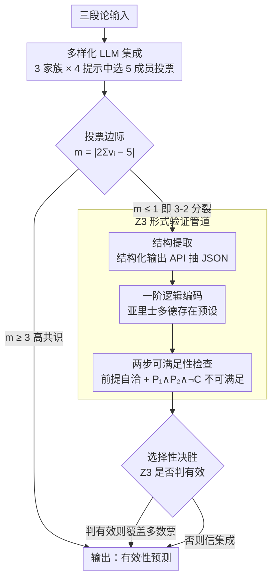

# FregeLogic at SemEval 2026 Task 11: A Hybrid Neuro-Symbolic Architecture for Content-Robust Syllogistic Validity Prediction

**会议**: ACL 2026  
**arXiv**: [2604.18328](https://arxiv.org/abs/2604.18328)  
**代码**: 无  
**领域**: LLM Agent / 神经符号推理  
**关键词**: 三段论推理, 内容效应, 神经符号, LLM集成, Z3求解器

## 一句话总结

提出 FregeLogic 混合神经符号系统，结合五成员 LLM 集成和 Z3 SMT 求解器作为决胜裁判，在三段论有效性判断中将内容效应降低16%的同时提升准确率0.9%。

## 研究背景与动机

**领域现状**：三段论推理是演绎推理的基本形式，SemEval-2026 Task 11 要求系统判断三段论的逻辑有效性，同时评估系统受内容可信度影响的程度（内容效应）。评分公式 $\text{Score} = \text{Accuracy} / (1 + \ln(1 + \text{CE}))$ 同时奖励高准确率和低内容效应。

**现有痛点**：LLM 表现出类人的内容效应——当三段论内容在现实中可信时更倾向判定为有效，反之亦然。机制分析表明 LLM 在预训练中发展的推理电路容易被世界知识污染。

**核心矛盾**：如何利用 LLM 的强大推理能力，同时克服其对内容可信度的系统性敏感？

**本文目标**：设计一个能在保持高准确率的同时最小化内容效应的推理系统。

**切入角度**：利用 LLM 集成投票的分歧程度来信号化内容偏见案例，然后将这些案例交给内容无关的形式逻辑求解器处理。

**核心 idea**：集成投票中的窄票差（3-2 分裂）不成比例地对应内容偏见错误——恰好是形式验证器能发挥价值的案例。

## 方法详解

### 整体框架

FregeLogic 要解决的核心问题是：在判断三段论有效性时，既保住 LLM 的高准确率，又压住它对内容可信度的系统性敏感（内容效应）。系统让一个五成员 LLM 集成先对每道题投票，把高置信案例直接交给多数票；只有当投票出现 3-2 窄分裂——经验上这恰好是内容偏见最强的一批案例——才把决策权移交给一条内容中立的 Z3 形式验证管道。输出是一个内容无关性被显著增强、准确率却没有牺牲的有效性预测。

### 关键设计

**1. 多样化 LLM 集成：用不相关错误堆出高准确率基线**

集成的价值完全依赖成员间错误的不相关性，因此作者在两个维度上同时拉开差异：架构上选三个不同家族的开源模型（MoE 的 Llama 4 Maverick / Llama 4 Scout、稠密的 Qwen3-32B），提示上配四种策略（零样本、少样本、少样本 CoT、简单 CoT），合计 12 种「模型×提示」组合。每折通过嵌套交叉验证从这 12 种里挑出 combined score 最高的 5 个作为该折的集成成员。架构多样（两个家族、MoE vs 稠密）加上提示多样，让不同成员在同一道题上犯错的方式尽量解耦，多数票因而比任何单一配置都稳。

**2. Z3 形式验证管道：把语义内容彻底剥离的逻辑裁判**

这条管道分三步走：先用 LLM 配合结构化输出 API 把三段论的逻辑结构抽成 JSON，再按一阶逻辑编码（采用亚里士多德存在预设），最后做两步可满足性检查——先验证两个前提是否自洽，再检验 $P_1 \wedge P_2 \wedge \neg C$ 是否不可满足，不可满足即判定该三段论有效。Z3 编码在构造上就把全部语义内容抹掉，所以它的判断与「内容是否在现实中可信」完全无关，正好补 LLM 的短板。这一步的工程关键在结构提取：换用结构化输出 API 后，提取失败率从约 22% 压到接近零，否则格式噪声会直接污染下游编码。

**3. 选择性决胜机制：只在该出手时才让形式逻辑介入**

决胜与否由投票边际 $m = |2 \sum v_i - 5|$ 决定：仅当 $m \leq 1$（即 3-2 分裂）且 Z3 判为有效时，才用 Z3 结果覆盖集成多数票，其余情况一律信集成。把权限卡得这么死是有实证依据的——3-2 分裂不成比例地对应内容偏见错误，而这正是形式验证最能纠偏的区间；一旦放宽到更高共识的案例，性能反而下降，因为 Z3 在有效三段论上准确率只有 48.6%，乱介入会把对的也改错。这种「用集成共识度当偏见探针、精准定位介入时机」的设计，是整套混合策略真正的巧思所在。

### 一个完整示例

以一道「无效但内容可信」的题为例：五个成员里三个被现实可信度带偏判成「有效」、两个判「无效」，形成 3-2 窄分裂，边际 $m=1$。系统不直接采纳「有效」的多数票，而是触发决胜——Z3 管道把这道题抽成 JSON、编码为一阶逻辑、做可满足性检查，发现 $P_1 \wedge P_2 \wedge \neg C$ 可满足，判为「无效」并覆盖多数票。这正是主实验里「无效-可信」子群准确率从 90.2% 跳到 94.5% 的来源。反过来，若某题五票一致或 4-1，边际 $m \geq 3$，系统跳过 Z3 直接走集成，避免 Z3 的有效偏见把高置信的正确答案改坏。

### 损失函数 / 训练策略

系统无参数训练。模型与提示选择、融合策略选择均通过嵌套 5 折交叉验证完成：每折在 200 样本的内部子集上评估全部 12 种组合，选出 top-5 配置作为该折集成。

## 实验关键数据

### 主实验（嵌套5折交叉验证，N=960）

| 策略 | 准确率 | 内容效应 | 综合得分 |
|------|--------|---------|---------|
| 纯集成 | 93.4% | 3.39 | 39.12 |
| **+ Z3 决胜** | **94.3%** | **2.85** | **41.88** |
| Z3 仅用 | 74.7% | 26.28 | 17.39 |
| 置信度 + Z3 | 91.7% | 6.15 | 31.77 |

### 子群准确率分析

| 策略 | 有效-可信 | 有效-不可信 | 无效-可信 | 无效-不可信 |
|------|---------|-----------|---------|-----------|
| 纯集成 | 95.9% | 96.0% | 90.2% | 91.9% |
| + Z3 决胜 | 95.6% | 93.8% | **94.5%** | 93.5% |

### 关键发现
- 决胜机制主要在"无效-可信"子群上获得收益（90.2% → 94.5%），这正是内容偏见最强的案例
- 3-2 分裂仅占7.9%的案例，但 Z3 在其中30次覆盖决策中净正确了8次
- Z3 存在显著的"无效偏见"——在无效三段论上准确率97.6%，有效三段论仅52.2%，根源在于结构提取错误
- 所有11次错误翻转都是同方向的：Z3 错误拒绝有效三段论，主要因双重否定、复合术语边界等提取错误
- Scout 模型在少数派联盟中出现概率最高（53.9%），说明其更易受内容偏见影响

## 亮点与洞察
- 精妙的系统设计：不是简单地用形式逻辑替代 LLM，而是通过集成共识度作为偏见信号，精准定位需要形式验证介入的案例
- 对 Z3 无效偏见的深入分析揭示了瓶颈在提取而非编码，且方向性不对称（有效→无效）
- 结构化输出 API 大幅降低提取失败率的工程洞察具有实践价值
- 亚里士多德存在预设的选择通过数据集中 Felapton 型三段论的标注得到验证

## 局限与展望
- 每个样本需要6次 LLM 调用 + 1次 Z3 求解，推理成本较高
- 模型和提示选择需要嵌套交叉验证，设置复杂度高
- Z3 管道依赖 LLM 进行结构提取，提取错误是系统的主要瓶颈
- 未与更大单体模型（70B+）对比，架构多样性是否优于单一大模型是开放问题
- 决胜阈值 $\tau=1$ 未做自适应调整的探索

## 相关工作与启发
- **vs 纯 LLM 方法**: FregeLogic 通过形式验证补偿 LLM 的内容偏见，而非依赖更好的提示
- **vs LINC 等纯形式方法**: FregeLogic 仅在低共识案例中使用形式验证，避免了提取错误对高置信案例的污染
- **vs 激活引导方法 (Valentino et al., 2025)**: FregeLogic 不需要访问模型内部状态，是黑盒方案
- **启发**: 集成分歧度作为偏见信号的思路可推广到其他推理任务

## 评分
- 新颖性: ⭐⭐⭐⭐ 集成分歧→形式验证介入的选择性混合策略设计巧妙
- 实验充分度: ⭐⭐⭐⭐ 嵌套交叉验证严谨，子群分析和错误归因分析深入
- 写作质量: ⭐⭐⭐⭐⭐ 系统描述清晰，分析透彻，每个设计选择都有充分justification
- 价值: ⭐⭐⭐ 共享任务系统论文，方法思路有启发但直接推广性有限

<!-- RELATED:START -->

## 相关论文

- [\[ICML 2026\] Lifting Traces to Logic: Programmatic Skill Induction with Neuro-Symbolic Learning for Long-Horizon Agentic Tasks](../../ICML2026/llm_agent/lifting_traces_to_logic_programmatic_skill_induction_with_neuro-symbolic_learnin.md)
- [\[ACL 2026\] MAGMA: A Multi-Graph based Agentic Memory Architecture for AI Agents](magma_a_multi-graph_based_agentic_memory_architecture_for_ai_agents.md)
- [\[ACL 2026\] Robust Tool Use via Fission-GRPO: Learning to Recover from Execution Errors](robust_tool_use_via_fission-grpo_learning_to_recover_from_execution_errors.md)
- [\[ACL 2026\] IntrAgent: An LLM Agent for Content-Grounded Information Retrieval through Literature Review](intragent_an_llm_agent_for_content-grounded_information_retrieval_through_litera.md)
- [\[ACL 2026\] Don't Act Blindly: Robust GUI Automation via Action-Effect Verification and Self-Correction](don39t_act_blindly_robust_gui_automation_via_action-effect_verification_and_self.md)

<!-- RELATED:END -->
