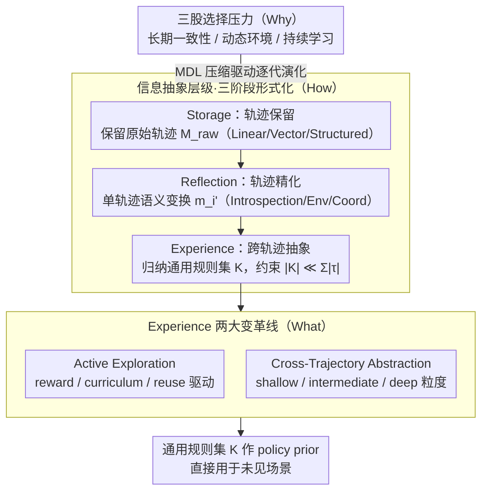

# From Storage to Experience: A Survey on the Evolution of LLM Agent Memory Mechanisms

**会议**: ACL 2026 Findings  
**arXiv**: [2605.06716](https://arxiv.org/abs/2605.06716)  
**代码**: https://github.com/FeishuLuo/Evolving-LLM-Agent-Memory-Survey  
**领域**: LLM Agent / 记忆机制 / 综述 / Continual Learning  
**关键词**: Agent Memory, Storage, Reflection, Experience, MDL, Cross-Trajectory Abstraction

## 一句话总结
本文用「Storage → Reflection → Experience」三阶段演化框架把 LLM Agent 记忆机制做系统综述，用形式化定义把三阶段对应为「轨迹保留 → 轨迹精化 → 跨轨迹抽象」三种 functional signature，并用"Why-How-What"三层 RQ 串起整个 storyline，重点展开 Experience 阶段的两大变革性机制 — Active Exploration 与 Cross-Trajectory Abstraction。

## 研究背景与动机

**领域现状**：LLM agent (ReAct、AutoGPT、AutoGen 等) 在过去两年成为 AI 主战场，但 LLM 本身是 stateless 的 — 多步推理时累积错误、persona 漂移、跨 session 记忆丢失，导致 agent 必须配一个"外置记忆模块"。社区已经堆出了大量 memory 方案（MemGPT、Reflexion、Generative Agents、Voyager、CLIN、Mem0…），但每篇都自己造概念，缺少一个统一视角。

**现有痛点**：作者识别出两个根本障碍 — (i) **范式分裂 (Paradigmatic Fragmentation)**：现有工作要么走"操作系统工程"路线（MemGPT 把 LLM context 当虚拟内存管），要么走"认知科学"路线（模仿人类海马体记忆巩固），两条线**几乎不互相引用**；(ii) **缺乏技术综合 (Absence of Technological Synthesis)**：已有综述（Zhang 2024、Hu 2025、Du 2025、Wu 2025 等）只做静态分类，没有揭示"为什么这一代会演化到下一代"的内在驱动力。

**核心矛盾**：现有综述本质上是"截面照片"（按功能分模块），无法回答"下一步该往哪去" — 因为它们不揭示**演化驱动力**。这导致后入场的研究者拿不到 actionable roadmap。

**本文目标**：用"演化论"视角组织文献，正式定义三个阶段，识别驱动每次跃迁的"selection pressure"，并把 frontier 的 Experience 阶段做深度展开。

**切入角度**：作者借用**信息抽象层级 (level of information abstraction)** 作为分类轴 — Storage 保留 raw 轨迹（保真度优先）、Reflection 在 intra-trajectory 内做语义变换（质量优先）、Experience 做 cross-trajectory 归纳（普适性优先）。这一轴和"操作系统 vs 认知科学"两条旧线都正交，能把两边统一。

**核心 idea**：把 LLM agent 记忆机制看作 **MDL (Minimum Description Length) 驱动的演化过程** — 从冗余存储 → 单条轨迹精炼 → 跨轨迹压缩为通用规则集 $\mathcal{K}$。

## 方法详解

> 注：本文是综述，没有新算法。「方法详解」梳理其框架与核心定义。

### 整体框架

作者把 LLM agent 记忆机制看作一个由 MDL（最小描述长度）驱动的演化过程，并用「Why-How-What」三层 RQ 把整条 storyline 串起来：RQ1（§3）追问是哪三股选择压力逼着记忆机制往前走，RQ2（§4）刻画 Storage → Reflection → Experience 三阶段的演化路径，RQ3（§5）则聚焦 frontier 的 Experience 阶段带来的两大质变。三阶段共享同一套形式化——agent 在时刻 $t$ 按 $a_t \sim \pi_\theta(a_t \mid \mathcal{I}, o_t, m_t)$ 采样动作，其中局部记忆 $m_t = \text{Retrieve}(\mathcal{M}, o_t)$ 来自全局 memory $\mathcal{M}$，而三阶段的真正分野就在于 $\mathcal{M}$ 是怎么被构造出来的：保留原始轨迹、精炼单条轨迹、还是跨轨迹归纳出通用规则。整条综述顺着「Why-How-What」展开——先讲是哪三股压力逼着记忆机制演化，再讲演化出的三阶段形式化，最后深挖 frontier 的 Experience 阶段。

### 关键设计

**1. 把演化驱动力拆成三股可定位的选择压力（Why）**

作者没有泛泛地说「记忆很重要」，而是把「为什么会从 Storage 一路演化到 Experience」分解成三个具体压力，并各自绑定一波文献爆发。其一是长期一致性：agent 要保持推理链不自相矛盾、目标不被局部最优带偏，这逼出了最早的记忆模块（MemGPT、Sumers 2023）。其二是动态环境：知识有时效且过期不会自动报错（Lazaridou 2021）、因果有延迟的级联效应（Joshi 2024），逼出 active management、temporal decay、causal graph 等机制。其三是持续学习：episodic memory 容量有限、无限扩张又会让错误传播污染整库（Xiong 2025），最终逼出从「记录」到「抽象」的跃迁，也就是 Experience。三股压力与时间线对齐后，读者能清楚看到「哪种选择压力催生了哪一代记忆方法」。

**2. 以「信息抽象层级」为分类轴的三阶段形式化（How）**

综述最核心的设计是换了一根分类轴。以往工作要么按「长期/短期」分（认知科学风格）、要么按「内存层级」分（OS 风格），都解释不了为什么 Reflexion 和 Voyager 属于不同代次；作者改用信息抽象层级，并给每一阶配一个精确的 functional signature。Storage 保留原始轨迹 $\tau = \langle(o_1,a_1),\dots,(o_T,a_T)\rangle$、$\mathcal{M}_{raw} = \{\tau_i\}_{i=1}^N$（再细分 Linear / Vector / Structured）；Reflection 做单轨迹语义变换 $m_i' = \mathcal{F}_{ref}(\tau_i \mid \phi)$、$\phi$ 是评估准则（细分 Introspection / Environment / Coordination）；Experience 做跨轨迹归纳 $\mathcal{F}_{exp}: \mathcal{T}_{batch} \to \mathcal{K}$ 并要求 $|\mathcal{K}| \ll \sum_{\tau\in\mathcal{T}_{batch}} |\tau|$ 的 MDL 约束（细分 Explicit / Implicit / Hybrid）。这根轴和「OS vs 认知科学」两条旧线都正交，因此能把分裂的文献统一起来，也让「Voyager 为何后于 Reflexion」有了干净答案——前者已迈入 cross-trajectory 抽象，后者还停在单轨迹精化。

**3. 把 Experience 阶段切成 Active Exploration 与 Cross-Trajectory Abstraction 两条变革线（What）**

Experience 是这篇综述价值最高的差异化部分，作者用两条正交的机制把 2025 下半年起的 frontier 工作从其余记忆工作中切出来。一条是 Active Exploration：agent 从被动记录者变成目标驱动的经验收集者，按驱动器分 reward-driven / curriculum-driven / reuse-driven，按维度分 breadth（补认知缺口）/ depth（抽高阶 skill）/ strategy（优化长 horizon 决策路径）。另一条是 Cross-Trajectory Abstraction：抽象机制涵盖 contrastive induction（成功对失败轨迹）、multi-granularity chunking、code 函数封装、fine-tune 内化，抽象粒度则分 shallow（NL 规则）/ intermediate（modular skeleton）/ deep（压进权重当 intuition）。通过 Table 1 明确把 Reflection 定为 intra-trajectory 的 $\mathcal{F}_{ref}(\tau_i\mid\phi)=m_i'$、把 Experience 定为 inter-trajectory 的 $\mathcal{F}_{exp}(\mathcal{T}_{batch})=\mathcal{K}$，作者给了社区一条之前一直缺失的干净术语边界。

### 损失函数 / 训练策略

综述无训练。引用文献 ≥ 200 篇，覆盖 2022 至 2026 上半年。

## 实验关键数据

### Reflection vs Experience 结构对比表

| 维度 | Reflection | Experience |
|------|-----------|-----------|
| Functional signature | Intra-trajectory: $\mathcal{F}_{ref}(\tau_i\|\phi) = m_i'$ | Inter-trajectory: $\mathcal{F}_{exp}(\mathcal{T}_{batch}) = \mathcal{K}$ |
| Output 形式 | 精炼 memory unit $m_i'$，绑定原任务上下文 | 通用规则/skill $\mathcal{K}$，脱离具体场景 |
| 检索依赖 | 推理时检索辅助语义相似的过去任务 | 作为 policy prior 直接用于未见场景，无需 trajectory matching |
| 代表工作 | Reflexion (Shinn 2023), CLIN (Majumder 2023), AgentFold (Ye 2025) | FLEX (Cai 2025), MemSkill (Zhang 2026), SkillRL (Xia 2026) |

### Storage 阶段细分对比

| 子类 | 核心思路 | 代表工作 | 关键局限 |
|------|---------|---------|---------|
| Linear | FIFO + context window 扩展 / attention 改造 | StreamingLLM (Xiao 2023), Mistral sliding window | 容量受 attention 复杂度限制 |
| Vector | embedding + 语义/时间衰减检索 | Generative Agents (Park 2023), Larimar (Das 2024) | 检索 ambiguity |
| Structured | 关系表 / 层次 / 图 | MemGPT (Packer 2023), AriGraph (Anokhin 2024) | 设计复杂度高 |

### Experience 阶段抽象 granularity 对比

| 层级 | 抽象产物 | 解释性 | 泛化边界 |
|------|---------|--------|----------|
| Shallow | NL 规则 / 启发式 | 高 | 同领域跨任务 |
| Intermediate | 可执行 modular skeleton（code / skill） | 中 | 同任务族 |
| Deep | 压入模型权重，变 intuition | 低 | 全局，但不可编辑 |

### 关键发现

- **演化方向是"压缩"**：从 raw $\mathcal{M}_{raw}$ 到精炼 $\{m_i'\}$ 到通用 $\mathcal{K}$，每一步都在做信息压缩（MDL），且压缩率越高越接近"通用智能"。
- **Experience 是质变而非量变**：Reflection 的 unit 仍绑定原 trajectory，Experience 的 $\mathcal{K}$ 脱离 trajectory 直接作 policy prior — 这是从"案例库"到"规则库"的范式跃迁。
- **多智能体 + Multimodal + Distributed Shared Memory** 是公认的三大下一代方向。
- **Implicit Experience 与 RL/Meta-Learning 在技术上重叠**：作者明确指出 Implicit Experience（把经验 fine-tune 进权重）跟 fine-tuning / RL / meta-learning 在技术层面交叠，本框架不是把它当全新范式，而是强调它在 memory-centric agent 架构中的角色 — interaction trajectory 与参数更新之间的中介。

## 亮点与洞察

- **"演化论"叙事是巨大解锁**：之前所有 agent memory 综述都用静态分类（按存储类型、按生命周期、按层次），本文第一次用"什么压力催生了什么代次"的演化论叙事，直接给读者一个**有方向的 roadmap**，而非一张地图。
- **形式化分阶 + functional signature 三件套**：把 Storage/Reflection/Experience 三阶分别绑定到 $\mathcal{M}_{raw}/m_i'/\mathcal{K}$ 三个数学对象，把 $\mathcal{F}_{ref}$ 与 $\mathcal{F}_{exp}$ 切割为 intra vs inter trajectory，让社区有一个可争论的精确术语 — 这种**形式化的精确性**是综述里少见的硬通货。
- **MDL 视角是关键洞察**：把 Experience 阶段约束为 $|\mathcal{K}|\ll \sum|\tau|$，这等价于在说"agent memory 的终极形式应该是一个生成式的、信息论意义上最优的 policy prior"。这一视角能联结统计学习理论与 agent 工程实践。
- **Reflection vs Experience 对比表 (Table 1)** 应该被引用为业界标准 — 以前 Reflexion / Voyager / CLIN / FLEX 互相混用，本表第一次给出干净边界。
- **GitHub repo 持续更新**：作者承诺 living survey，对快速变化的 agent memory 领域有持续价值。

## 局限与展望

- **作者承认**：(1) 没有定量横向比较 — 因为三阶段目标不同且没统一 benchmark，硬比会误导；(2) Implicit Experience 与 fine-tuning/RL/meta-learning 技术上交叠，本文不主张它是全新范式；(3) Experience 阶段在 2025 下半年才成熟，时间覆盖有 recency bias，部分被引文献还未 peer review。
- **隐藏问题**：(1) 三阶段的边界仍偏理想化 — 实际工作（如 MemGPT + Reflexion 混合）会同时覆盖多个阶段，作者的"严格演化"叙事可能掩盖了真实文献的混合性；(2) 没引入"failure mode 演化"视角 — 每一代记忆机制解决了什么新失败模式，又引入了什么新失败模式（如 Experience 容易过度抽象），作者只在 limitation 提到 outdated 知识但没系统化；(3) Distributed Shared Memory、Multimodal Memory 等未来方向章节偏 vision，缺具体可操作的研究问题分解。
- **改进思路**：(1) 给三阶段配上能跨阶段比较的统一 benchmark — 即使是 proxy 指标（如 task-success rate vs memory size）也能让读者直观看到演化收益；(2) 引入"反演化"现象 — 如哪些 Experience 工作在某些任务上不如简单的 Storage（Voyager 在 short-horizon 上可能输给 ReAct），帮助实践者做技术选型；(3) 把 reasoning model（o1、DeepSeek-R1）作为新驱动力专门讨论 — 这一代 model 自带 long CoT，是否会改变外置 memory 的必要性？

## 相关工作与启发

- **vs Zhang et al. 2024 (engineering-focused 综述)**：Zhang 按工程模块分类，无法揭示驱动力；本文用演化论补足了这一缺陷。
- **vs Hu et al. 2025 (dynamic memory 综述)**：Hu 已经看到动态性但仍停在 functional category；本文进一步指出 dynamic 只是表象，背后是 MDL 与 cross-trajectory 抽象的需求。
- **vs Du et al. 2025 (Taxonomy of memory)**：Du 给出 operation taxonomy，本文与之互补 — Du 关心"做什么操作"，本文关心"为什么需要这些操作"。
- **vs MemGPT (Packer 2023)**：MemGPT 是 Storage 阶段的代表，对应本文 Storage > Structured > Hierarchical 子类。
- **vs Reflexion (Shinn 2023)**：Reflection 阶段代表，对应 Introspection 子类，bound 于单轨迹。
- **vs Voyager (Wang 2023) / FLEX (Cai 2025)**：Experience 阶段代表，前者偏 Explicit（skill 库），后者偏 Implicit（continuous evolution）。

## 评分
- 新颖性: ⭐⭐⭐⭐ "演化论 + 三阶段 formalization" 是综述层面的创新，但底层文献分类工作并不全新。
- 实验充分度: ⭐⭐⭐ 综述无实验，覆盖文献 ≥ 200 篇，量足质佳，但缺统一 benchmark 对比。
- 写作质量: ⭐⭐⭐⭐⭐ "Why-How-What" 三层 RQ + 形式化定义 + Table 1 切割 Reflection/Experience，结构清晰可引用。
- 价值: ⭐⭐⭐⭐⭐ 给 LLM agent memory 领域一个可被广泛采纳的演化论术语集，未来论文有了共同语言。

<!-- RELATED:START -->

## 相关论文

- [\[ACL 2026\] CoEvolve: Training LLM Agents via Agent-Data Mutual Evolution](coevolve_training_llm_agents_via_agent-data_mutual_evolution.md)
- [\[ICML 2026\] SE-GA: Memory-Augmented Self-Evolution for GUI Agents](../../ICML2026/llm_agent/se-ga_memory-augmented_self-evolution_for_gui_agents.md)
- [\[ACL 2026\] Mem^p: Exploring Agent Procedural Memory](memp_exploring_agent_procedural_memory.md)
- [\[ACL 2026\] Lightweight LLM Agent Memory with Small Language Models](lightweight_llm_agent_memory_with_small_language_models.md)
- [\[ACL 2026\] ExpSeek: Self-Triggered Experience Seeking for Web Agents](expseek_self-triggered_experience_seeking_for_web_agents.md)

<!-- RELATED:END -->
