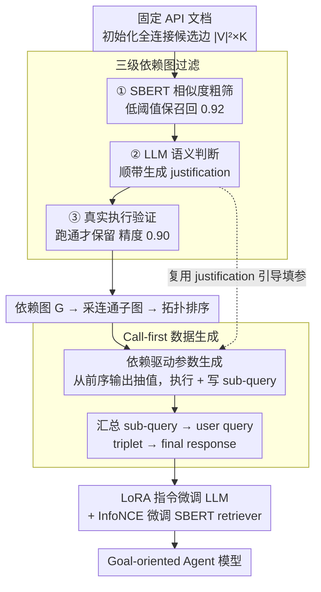

# GOAT: A Training Framework for Goal-Oriented Agent with Tools

**会议**: ACL 2026 Findings  
**arXiv**: [2510.12218](https://arxiv.org/abs/2510.12218)  
**代码**: https://github.com/KU-MIIL/GOAT (有)  
**领域**: LLM Agent / 工具使用  
**关键词**: 目标导向、API 调用、合成数据、call-first 生成、依赖图

## 一句话总结
GOAT 通过从 API 文档自动构建"依赖图 + call-first 合成数据"的流水线，让开源小模型在无需人工标注的情况下学会把高层目标拆成一串相互依赖的 API 调用，在 RestBench / API-Bank / 自建的 GOATBench 上把开源模型推到 SOTA，部分场景甚至超过闭源大模型。

## 研究背景与动机

**领域现状**：LLM 作为 agent 调用外部工具/API 已经成为主流范式，但现有工具学习 benchmark 多数停留在"单步 API 调用"或"指令里把每一步都写清楚"的简单设定（ToolFormer、Gorilla、ToolLLM、API-Bank 等）。

**现有痛点**：真实场景是 **goal-oriented**——用户只说一句高层目标（例如"帮我找出 The Dark Knight 主演演员还演过的高分电影并加入播放列表"），agent 必须自己拆任务、决定调哪些 API、把前一个 API 的输出当作后一个 API 的参数。开源小模型在这种设定下接近 0% 成功率，而 GPT-4 仍能勉强工作，差距源于**缺乏 goal-oriented 训练数据**：API 间依赖关系需要昂贵的人工标注，难以规模化。

**核心矛盾**：现有合成数据流水线普遍采用 **instruction-first**——先让 LLM 生成 query，再让它推 API 调用序列。这本身就是我们想训练的能力，导致**自我强化偏差**：模型只能合成自己已经会做的"简单 case"，没法生产高难度训练信号，结果合成数据只能用于蒸馏，难以拔高开源模型的复杂推理能力。

**本文目标**：(1) 在没有人工标注的前提下自动合成捕捉 API 间依赖的 goal-oriented 训练数据；(2) 让开源模型在 in-domain 真实 API 上达到甚至超越闭源模型的水平。

**切入角度**：作者观察到 agent 通常部署在固定的 API 集合上，**API 文档天然存在**。文档里隐式编码了输入输出规范，足以推导 API 间依赖。同时，从"已执行的调用序列"反向生成自然语言 query，比"从 query 推调用"对 LLM 更友好——前者是抽象总结，后者是规划推理。

**核心 idea**：用 LLM + 三级过滤把 API 文档转成可靠的依赖图，从图里采样连通子图后**先执行 API 再生成 query**（call-first），把 LLM 的总结能力转化为 inverse task 的可靠监督。

## 方法详解

### 整体框架

GOAT 要解决的是「想用开源小模型做 goal-oriented agent 却没有标注数据」这个困境：用户只给一句高层目标，agent 得自己拆任务、决定调哪些 API、还要把前一个 API 的输出当后一个的参数。整条流水线分两段，输入是一组固定 API 的文档，输出是一个学会了 API 间依赖推理的微调模型。第一段从 API 文档自动构建依赖图——初始化成全连接多重有向图后过三级过滤，留下只含可执行依赖的 $G=(\mathcal{V}, \mathcal{E})$，边 $(n_i, n_j, k)$ 表示 $n_i$ 的输出能填进 $n_j$ 的第 $k$ 个参数；第二段从图里采连通子图，拓扑排序后「先执行 API 再生成 query」（call-first）合成训练数据，最后用 LoRA 指令微调 LLM、用 InfoNCE 微调一个 SBERT retriever。

### 关键设计

**1. 三级依赖图过滤：用漏斗式预算控制从组合爆炸里筛出可执行依赖**

候选边的量级是 $|\mathcal{V}|^2 \times K$，全靠 LLM 或真实执行去验证会贵到不可行，所以作者按「便宜→贵、召回高→精度高」串了三级漏斗。第一级是廉价的 SBERT 余弦相似度过滤，阈值 $\tau$ 故意取低以保召回；第二级用单次 LLM 调用判断语义兼容性，并顺手生成「这条边为什么合理」的 justification；第三级做最贵但最硬的执行级验证——LLM 先给 $n_i$ 编参数执行得到输出 $o_i$，再从 $o_i$ 抽内容填进 $n_j$ 的第 $k$ 个参数执行 $c_j$，只有 $c_j$ 真能跑通才保留这条边。三级的精度/召回依次为 0.25/0.92 → 0.59/0.42 → 0.90/0.36，呈典型漏斗形态。这一步把昂贵检查只留给少量幸存边，而真实执行验证是关键——纯看描述会漏掉「语义看着匹配但格式/单位实际不对」的假依赖。

**2. Call-first 数据生成：把数据合成从「难方向」翻成「易方向」**

传统 instruction-first 流水线是先让 LLM 生成 query 再推 API 调用序列，可这恰恰就是我们想训练的能力，于是只能合成模型已经会做的简单 case，陷入自我强化偏差。GOAT 把方向反过来：拿到拓扑排序后的序列 $(n_{k_1}, \dots, n_{k_L})$，逐个实例化——对第 $\ell$ 个 API，若某参数与前序 $m < \ell$ 有依赖边就从 $o_{k_m}$ 抽值，否则由 LLM 按文档造一个合理值，执行得到 $o_{k_\ell}$ 的同时生成自然语言 sub-query $s_{k_\ell}$；所有调用走完后把全部 sub-query 总结成 user query $u$，再喂全部 triplet $\{(s, c, o)\}$ 让 LLM 写出 final response $r$。从 query 到 call 是复杂规划，从 (call, output) 到 query 是总结抽象，后者对 LLM 友好得多。表 5 直接证伪了 instruction-first：同 Llama2-13B 同 prompting 下，call-first 在 TMDB 7.0% vs 5.0%、Spotify 28.1% vs 17.5%。

**3. 依赖驱动的参数生成 + justification 复用：让模型知道该从哪个字段抽值**

API 输出常是嵌套 JSON，LLM 填参数时很容易抽错字段或抽不到——因为 API 间依赖既是语义匹配也是数据结构匹配，纯语义 prompt 覆盖不了「取这个 list 第几个元素的 id 字段」这种细节。GOAT 的巧处在于零成本复用：依赖图构建第二级为了过滤而生成的 justification 文本（「为什么 $n_i$ 的输出能填 $n_j$ 的第 $k$ 个参数」）被原样搬到数据合成阶段，作为参数填充 prompt 的引导先验。一份 LLM 调用产出了两次价值，既省了成本，又给了模型一个强结构先验。

### 一个完整示例

以「找出 The Dark Knight 主演演员还演过的高分电影并加入播放列表」为例：从依赖图里采到一条 4 节点连通子图（search_movie → get_cast → discover_movies → add_to_playlist），拓扑排序后开始 call-first 合成。先执行 search_movie 拿到电影 id，把 id 按依赖边填进 get_cast 取演员 id，再填进 discover_movies 取高分电影，最后填进 add_to_playlist。每一步执行后顺手写出一句 sub-query，全部走完再把这些 sub-query 总结成上面那句完整 user query，并基于全部 (sub-query, call, output) triplet 生成 final response。训练时具体参数值被 mask，逼模型学「该调哪些 API、怎么在调用间传数据」的结构，而非死记某个电影 id。

### 损失函数 / 训练策略

LLM 端用标准指令微调（next-token CE），目标序列覆盖 plan、API call 与 final response；LoRA 配置 $r=8$、$\alpha=16$、dropout 0.05，单卡 H100 训 3 epoch。Retriever 端用 SBERT（all-MiniLM-L6-v2）+ InfoNCE，正样本是 (query, 正确 API doc) 对。训练时 mask 掉参数值，逼模型学结构而非记忆。合成实例规模上，RestGPT-TMDB 有 8570 条，API-Bank 仅 108 条却依然带来大幅提升。

## 实验关键数据

### 主实验

**RestBench**（Success% / Correct Path% / Δ Solution Length）：

| Backbone | 方法 | TMDB SR% | TMDB CP% | Spotify SR% | Spotify CP% |
|---|---|---|---|---|---|
| text-davinci-003 (闭源) | RestGPT | 75.0 | 79.0 | 72.7 | 74.5 |
| Llama2-13B | Baseline (zero-shot) | 0.0 | 0.0 | 3.5 | 7.0 |
| Llama2-13B | **GOAT FT** | **7.0** | **13.0** | **28.1** | **28.1** |
| Vicuna-13B | RestGPT | 9.0 | 15.0 | 12.7 | 20.6 |
| Vicuna-13B | **GOAT FT** | **17.0** | **14.0** | **29.8** | **33.3** |

**API-Bank**（Plan+Retrieve+Call 子集）：

| Backbone | 方法 | Success% | CP% | Correctness% | ROUGE |
|---|---|---|---|---|---|
| GPT-4 (闭源) | API-Bank prompting | - | - | 70.00 | 0.4808 |
| Llama-7B | Baseline | 0.0 | 0.0 | 0.00 | 0.0048 |
| Llama-7B | **GOAT FT** | **38.0** | **42.0** | **42.22** | 0.3173 |

**GOATBench**（660 实例，4 个领域，SA/IA/SR 三指标）：

| Backbone | 方法 | Inter SA | Inter SR | Single SA | Single SR |
|---|---|---|---|---|---|
| GPT-4.1 (闭源) | Baseline | 22.7 | 27.4 | 45.4 | 51.3 |
| Llama2-7B | ReACT + ToolLLM FT | 13.1 | 1.0 | 28.7 | 3.9 |
| Llama2-7B | **ReACT + GOAT FT** | **33.2** | **1.9** | **41.0** | **7.2** |
| Llama3-8B | Baseline | 9.7 | 7.2 | 18.2 | 7.9 |
| Llama3-8B | **GOAT FT** | **59.4** | **12.3** | **69.1** | **16.5** |

### 消融实验

| 配置 | TMDB SR% | Spotify SR% | 说明 |
|---|---|---|---|
| Instruction-first 生成 | 5.0 | 17.5 | 传统范式 |
| **Call-first 生成（GOAT）** | **7.0** | **28.1** | Spotify 上相对提升 60% |

依赖图过滤精度/召回（Tab 6）：

| 阶段 | Precision | Recall | 说明 |
|---|---|---|---|
| Embedding 相似度 | 0.25 | 0.92 | 高召回粗筛 |
| LLM 语义判断 | 0.59 | 0.42 | 中等精度，复用 justification |
| API 真实执行 | 0.90 | 0.36 | 高精度终筛 |

### 关键发现
- **Call-first 是最大胜负手**：Spotify 上 +10.6 个点的绝对提升直接证明"先执行再写 query"对开源模型而言比"先写 query 再推执行"更可学。
- **小数据也能起飞**：API-Bank 只有 108 条合成样本，Llama-7B 就从 0% → 38% Success，说明信号质量远比规模重要。
- **跨 prompting 范式稳定有效**：在 baseline 和 ReACT 两种 prompting 下 GOAT 都涨，证明它增强的是模型本身能力而非特定推理脚本。
- **真实执行验证不可省**：执行级过滤把精度从 0.59 拉到 0.90，留下的边是"既语义合理又跑得通"的金标准。
- **超越 ToolLLM FT**：同样在 RapidAPI 上合成数据，ToolLLM (instruction-first，parallel-API) 在 goal-oriented 设定下被 GOAT 显著反超，验证了任务对齐的重要性。

## 亮点与洞察
- **方向反转的认知工程**：作者抓住了一个关键不对称——LLM 写 query 比规划 API 调用容易得多，于是把数据合成的"难方向"换成"易方向"，让 LLM 总结自己执行的真实结果。这种"用 LLM 强项喂 LLM 弱项"的思路普适性极强，可迁移到代码合成、数学题、表格 QA 等所有"逆向比正向容易"的任务。
- **漏斗式 LLM 调用预算控制**：embedding → LLM 语义 → 真实执行，精度递增、成本递增、保留边数递减——这是处理"组合爆炸 + LLM 昂贵"的通用模板，值得复用到任何需要从大候选集里筛少量精样本的场景。
- **justification 二次复用**：图构建阶段为了过滤生成的"为什么这条边合理"的自然语言解释，被免费复用到数据合成阶段作为参数填充引导，实现一份 LLM 调用两次价值，是工程上很巧妙的成本摊销。
- **小到 108 条样本就显著起效**：传统印象里指令微调需要上万样本，GOAT 说明只要数据*分布对齐目标任务*，开源模型可以从极少高质量数据里挖出大量能力，对低资源 domain 非常有意义。

## 局限与展望
- **泛化到未见 API 仍弱**：作者明确承认 GOAT 是 in-domain 设计，依赖图绑定特定 API 集合；换一组新 API 需要重新跑整条流水线。
- **质量受 API 文档质量制约**：文档语义模糊或参数描述缺失时，依赖图会有较多噪声边，下游数据质量随之下降。
- **真实执行依赖可用 endpoint**：对收费 API、需要鉴权或副作用强的 API（写库、转账）很难做执行级验证，会导致流水线漏掉这部分依赖。
- **没有报告训练成本细节**：合成阶段调 Llama3-70B 的总 token 数没有公开，对实际复现成本评估不友好。
- **改进思路**：(i) 引入"跨 domain 依赖图迁移"——把已构建好的图按参数类型 / 输出 schema 嫁接到新 API；(ii) 用沙箱化执行环境支持写类 API；(iii) 在依赖图上加"语义聚类"，让训练子图覆盖更多稀有依赖模式而非反复采样高连通节点。

## 相关工作与启发
- **vs ToolLLM**：ToolLLM 同样用 RapidAPI 自动合成数据但走 instruction-first，目标是"parallel multi-API + fine-grained instruction"；GOAT 在同一批 API 上用 call-first 针对 goal-oriented 训练，在 GOATBench 上把 ReACT+ToolLLM FT 从 13.1 SA 提到 33.2 SA，直接证明任务对齐 + 生成方向反转的双重价值。
- **vs RestGPT**：RestGPT 是 prompting-only 的强 baseline，把 GPT-4 推到 SOTA，但开源 Llama2-13B 上几乎 0%。GOAT 不改 prompting，靠 LoRA 微调就让开源模型超过 RestGPT-Vicuna，把"prompting 工程"竞争转移到"数据合成工程"。
- **vs ToolFlow / Magnet / ToolDial**：这些方法也用依赖图，但只到"语义启发式"层面，没做真实执行验证，且都不针对 goal-oriented query；GOAT 是首个**执行级 grounded + goal-oriented 对齐**的开源方案。
- **vs API-Bank 训练范式**：API-Bank 用合成的非执行 Python 函数 + instruction-first，Llama-7B 只到 20% Correctness；GOAT 用真实可执行 API + call-first，把同 backbone 推到 42% Correctness，说明执行 grounding 是关键差异。

## 评分
- 新颖性: ⭐⭐⭐⭐ Call-first + 漏斗过滤 + justification 复用三件套都不算彻底原创，但组合到 goal-oriented 这个具体任务上达到了 1+1+1 > 3 的效果。
- 实验充分度: ⭐⭐⭐⭐ 三 benchmark × 多 backbone × 多 prompting 范式 + 关键消融 + 过滤阶段精召分析都齐了；唯一缺憾是没跑多 seed 也没报训练成本。
- 写作质量: ⭐⭐⭐⭐ Pipeline 图清晰，filter 阶段的精召分析有说服力，"call-first 为什么 work"的直觉解释到位。
- 价值: ⭐⭐⭐⭐⭐ 直接给"想用开源模型做 agent 但缺标注"的工业用户一套可落地方案，开源代码 + benchmark，社区影响潜力大。

<!-- RELATED:START -->

## 相关论文

- [\[ACL 2026\] OctoTools: An Agentic Framework with Extensible Tools for Complex Reasoning](octotools_an_agentic_framework_with_extensible_tools_for_complex_reasoning.md)
- [\[NeurIPS 2025\] AgentChangeBench: A Multi-Dimensional Evaluation Framework for Goal-Shift Robustness](../../NeurIPS2025/llm_agent/agentchangebench_a_multi-dimensional_evaluation_framework_for_goal-shift_robustn.md)
- [\[ACL 2026\] CoEvolve: Training LLM Agents via Agent-Data Mutual Evolution](coevolve_training_llm_agents_via_agent-data_mutual_evolution.md)
- [\[ACL 2026\] Supplement Generation Training for Enhancing Agentic Task Performance](supplement_generation_training_for_enhancing_agentic_task_performance.md)
- [\[ICLR 2026\] Efficient Agent Training for Computer Use](../../ICLR2026/llm_agent/efficient_agent_training_for_computer_use.md)

<!-- RELATED:END -->
