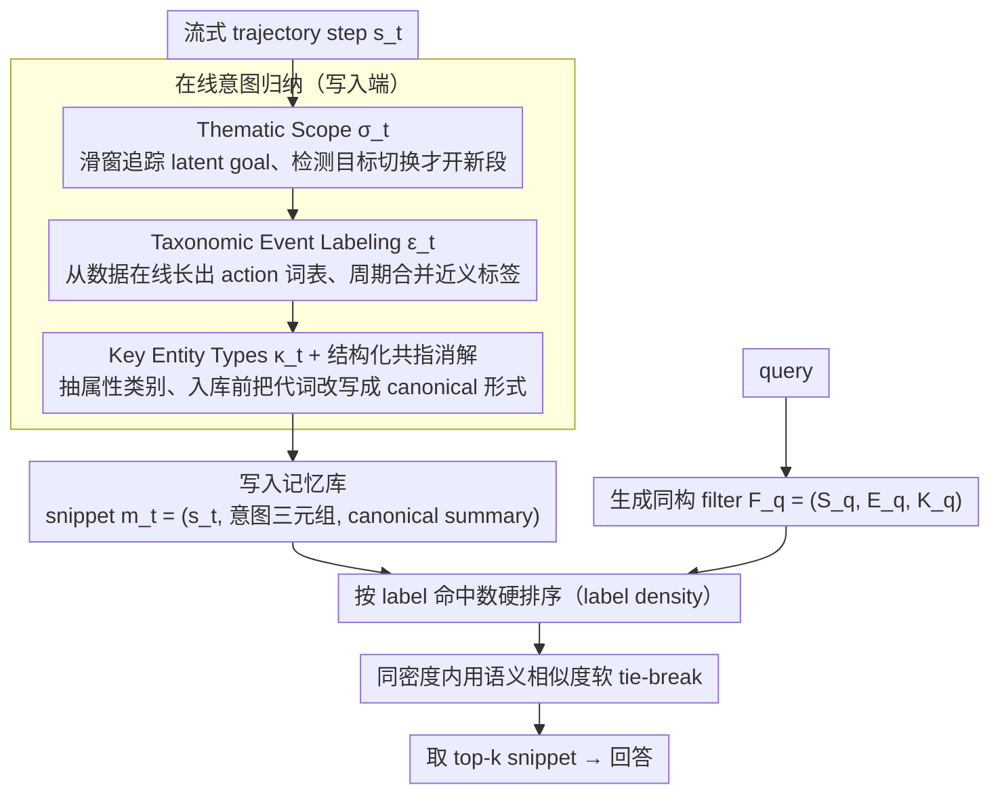

# Grounding Agent Memory in Contextual Intent

**会议**: ACL 2026  
**arXiv**: [2601.10702](https://arxiv.org/abs/2601.10702)  
**代码**: https://contextual-intent.github.io/ (有)  
**领域**: LLM Agent / 记忆系统  
**关键词**: 长程记忆、agent、contextual intent、Event Structure Theory、retrieval cue

## 一句话总结
STITCH 为 LLM agent 的长程记忆引入"contextual intent"（主题域 + 事件类型 + 关键实体类型）三元组作为结构化检索 cue，在每条 trajectory step 上在线归纳；推理时按"标签密度排序"先做结构匹配再做语义打分，在新构建的 CAME-Bench 上随 trajectory 增长不掉点，比最强 baseline 在 Large subset 上提升 35.6% 绝对（100% 相对）。

## 研究背景与动机

**领域现状**：LLM agent 被部署到长程任务（多轮人机协作、deep research、tool-augmented 自主环境），需要在数十到数百步 trajectory 里跟踪状态、消解隐式引用、整合多步信息。现有 agentic memory 系统主要有三类：(i) 向量 RAG（embedding 相似度检索）；(ii) hierarchical summarization (RAPTOR, Secom)；(iii) 知识图谱式 (GraphRAG, A-mem)。

**现有痛点**：(1) **embedding 相似 ≠ 上下文相关**——"Day 1 的酒店价格"和"Day 2 的酒店价格"语义几乎相同但答案完全不同；(2) **summarization 抹掉 episode 边界**——相邻段被合并，但同一目标可能跨非相邻段持续（"Day 2 itinerary"散落在多段中间被打断）；(3) **knowledge graph 缺 episode 级 disambiguation**——同一 entity 在不同 latent goal 下被反复提及，被合并到同一节点；(4) **long-context LLM** (GPT-5-mini 400k, Gemini 2.5) 超过窗口后失效，实时检索开销大。

**核心矛盾**：长程 trajectory 里很多 step 在**语义上相似但在上下文上截然不同**，检索的瓶颈不是召回更多内容，而是"cue quality"——什么样的索引能在 noisy 历史中精准捞回正确的上下文片段。

**本文目标**：(1) 设计一个 domain-agnostic 的结构化检索 cue，能同时(a) 把非相邻的同目标段连起来、(b) 把同实体的不同 occurrence 按角色区分开；(2) 构造一个能真正考察"context-aware 检索"的 benchmark，而非现有基准里 turn-taking + 主题块的"局部检索"陷阱。

**切入角度**：借鉴认知科学的 **Event Structure Theory** (Zacks & Tversky 2001) ——人类回忆长程经验时按 (i) 上位 goal context (partonomy) 和 (ii) 重复出现的 action 类别 (taxonomy) 来组织记忆，再用 entity 角色锚定细节。

**核心 idea**：把每一步用三元组 $\iota_t = (\sigma_t, \epsilon_t, \kappa_t)$ 索引——thematic scope（episode 段标签）+ event type（操作类别）+ key entity types（属性 schema），推理时先按 label 重合度排序、再按语义打分。

## 方法详解

### 整体框架
STITCH 要解决的是"长程 trajectory 里语义相似但上下文不同的 step 如何被精准检索"。它把整个流程拆成在线写入和按需读出两端：写入端对流式 trajectory $T=\{s_1,\dots,s_n\}$（每个 step $s_t=(r_t,a_t,\tau_t)$）逐步在线诱导一个 contextual intent 三元组 $\iota_t=(\sigma_t,\epsilon_t,\kappa_t)$，分别编码这步属于哪个 latent goal 段、是什么操作类别、关注哪类实体属性，再据此把 step 里的代词消歧后写成 canonical summary 入库（memory snippet $m_t=(s_t,\iota_t,c_t)$，$c_t=\mathcal{M}_{\text{sum}}(s'_t,\iota_t)$）；读出端对 query 生成同构的 filter $F_q=(\mathcal{S}_q,\mathcal{E}_q,\mathcal{K}_q)$，先按结构约束的命中数硬排序、再用语义相似度软 tie-break，取 top-$k_{\text{retrieve}}$（实验取 40）。整套设计的核心是让"为什么提到这个内容"这一上下文意图变成可索引的结构化 cue，而不是把检索压力全压在 embedding 相似度上。

### 关键设计

**1. Thematic Scope $\sigma_t$：跨步追踪 latent goal**

长程对话里最隐蔽的陷阱是"Day 1 酒店价"和"Day 2 酒店价"这类事实语义几乎相同、答案却完全相反，纯 embedding 检索必然挑错段。STITCH 用 thematic scope 把 trajectory 切成一个个 behavior episode，给每段贴一个稳定段名（如 "Day 2 Itinerary"、"Model Optimization"），同一 episode 内的 step 共享 scope，直到 LLM 检测到 goal-state divergence 才开新段。

具体由 LLM predictor $\sigma_t=\mathcal{M}_{\text{scope}}(s_t,H_{\text{scope}},\sigma_{t-1})$ 在滑窗历史 $H_{\text{scope}}$（默认 50 turn，作者实验过 10/100 都更差）加上一个 scope 做条件预测，同时维护一份压缩 summary $\Sigma_\sigma$ 把当前 scope 的 gist 传给后续步，防止 context 爆炸。这一步效果最重，消融里去掉 $\sigma_t$ 让 Small subset F1 从 0.844 跌到 0.463（-38 个点）——因为它把近似事实强行分到不同段，retrieval 天然就完成了 disambiguation。

**2. Taxonomic Event Labeling $\epsilon_t$：在线演化的 action 词表**

同一个 "Booking" 操作会散落在 "Day 1"/"Day 2"/"Day 3" 多个 scope 里，需要一条正交于 scope 的 action 维度来做细粒度区分。STITCH 给每步贴一个 event label（"searching"、"comparing"、"Price Inquiry" 等），词表 $\mathcal{V}_\epsilon$ 完全从数据里长出来：先在 $N_{\text{start}}=50$ 步上零样本生成 seed vocabulary，之后每来一步先语义检索 top-$k_{\text{event}}=5$ 候选喂给 LLM 选最佳 $\epsilon_t=\mathcal{M}_{\text{label}}(s_t,\text{Retrieve}(\mathcal{V}_\epsilon,s_t,k_{\text{event}}))$，没合适的就引入新词，每 $k_{\text{update}}=50$ 步做一次近义 label 合并。

它对细粒度检索极有用——去掉 $\epsilon_t$ 让 Large F1 从 0.592 跌到 0.273（-32 个点）；但也暴露一个 granularity trade-off：event 切太细会把本该聚合的 step 拆开，反而轻微伤害 Type 4（Information Synthesis）类问题，这也是作者把 hierarchical label space 留作 future work 的原因。

**3. Key Entity Types $\kappa_t$ 与结构化共指消解：存储前先 ground**

STITCH 抽的是实体的"属性类别"而非具体实例（"Metric" 而非具体数值，"Price"/"Rating" 而非具体酒店），$\kappa_t=\mathcal{M}_{\text{entity}}(s_t,\mathcal{V}_\kappa)$，$\mathcal{V}_\kappa$ 同样在线扩张+周期合并——用类型而非实例让 schema 能跨 travel/debate/dialogue 等 domain 通用。在此基础上做共指消解：检索同 scope 且 event type 兼容的历史 step 组成对齐上下文 $C_{\text{align}}$，让 LLM 把 "Book it." 改写成 "Book Apollo Hotel"（$s'_t=\mathcal{M}_{\text{rewrite}}(s_t,C_{\text{align}})$）。

关键原则是消歧必须在**入库之前**完成，否则后续 retrieval 拿到的永远是带 "it" 的歧义 snippet，临时再消歧只会叠加误差。消融里去掉共指让 Large F1 从 0.592 跌到 0.404（-19 个点），印证了"先消歧、再存储"这条对所有 agentic memory 都通用的设计纪律。

### 一个完整示例
以一条 travel-planning trajectory 为例：当 step "Apollo Hotel 一晚 $180" 流入，写入端先判定它仍属于 "Day 2 Itinerary" scope（$\sigma_t$），贴上 event label "Price Inquiry"（$\epsilon_t$），抽出属性类别 "Price/Hotel"（$\kappa_t$），并把它和上一步 "Book it." 对齐改写成 "Book Apollo Hotel"，最后写成 canonical summary 入库。等用户后来问 "Day 2 订的酒店多少钱"，读出端生成 filter $F_q=(\{\text{Day 2 Itinerary}\},\{\text{Price Inquiry}\},\{\text{Price}\})$，先把 $\iota_t$ 三项全命中的 snippet 排到最前（label density=3），把同样问酒店价但属于 "Day 1" 段的干扰项挡在后面，再在同 density 内用语义相似度细排——结构约束先做硬过滤，正好避开了纯语义检索会犯的"挑错天"错误。

### 损失函数 / 训练策略
STITCH 完全 training-free，所有 intent construction 与 retrieval 都用 gpt-5-mini（默认 reasoning effort）在线推理，没有任何参数更新。固定超参为 $N_{\text{start}}=50$、$k_{\text{update}}=50$、$k_{\text{retrieve}}=40$、$k_{\text{event}}=5$，retrieval token budget 统一设为 4096 以保证与 baseline 公平对比；评测端的 LLM-as-judge 用 gpt-4.1-mini（temp=0）。

## 实验关键数据

### 主实验

CAME-Bench (新构建) + LongMemEval + LoCoMo 综合表（关键列）：

| 方法 | CAME-S F1 | CAME-M F1 | CAME-L F1 | LongMemEval Acc-O | LongMemEval Acc-S | LongMemEval Acc-M | LoCoMo Acc |
|---|---|---|---|---|---|---|---|
| DeepSeek V3.1 (128k) | 0.228 | 0.010 | 0.000 | 0.620 | 0.240 | 0.267 | 0.587 |
| GPT-4.1-mini (1M ctx) | 0.712 | 0.362 | 0.213 | 0.720 | 0.200 | 0.067 | 0.682 |
| GPT-5-mini (400k ctx) | **0.804** | 0.566 | 0.212 | **0.860** | 0.820 | 0.533 | **0.811** |
| text-embedding-3-large RAG | 0.317 | 0.168 | 0.195 | 0.800 | 0.800 | 0.267 | 0.661 |
| RAPTOR | 0.329 | 0.117 | 0.139 | 0.680 | 0.480 | 0.467 | 0.671 |
| GraphRAG | 0.371 | 0.165 | 0.156 | 0.820 | 0.840 | 0.667 | 0.648 |
| HippoRAG 2 | 0.390 | 0.191 | 0.186 | 0.820 | 0.800 | 0.667 | 0.725 |
| A-mem | 0.376 | 0.196 | 0.186 | 0.780 | 0.740 | 0.667 | 0.731 |
| Secom | 0.501 | 0.114 | 0.236 | 0.520 | 0.580 | 0.600 | 0.640 |
| **STITCH (Ours)** | **0.844** | **0.682**† | **0.592**† | **0.860** | **0.860** | **0.800** | 0.703 |

†: 配对 t-test vs. 该 subset 最强 baseline, $p < 0.05$。

**关键 scaling 现象**：从 Small ($N=144$) → Medium ($N=168$, ~6× 长度) → Large ($N=61$, ~17× 长度)，所有 baseline 急剧塌方（GPT-5-mini F1 从 0.804 → 0.566 → 0.212），STITCH 几乎不掉（0.844 → 0.682 → 0.592），在 Large 上比最强 baseline 高 35.6% 绝对（约 100% 相对）。

### 消融实验

| 配置 | CAME-S F1 | CAME-M F1 | CAME-L F1 | 说明 |
|---|---|---|---|---|
| **STITCH (full)** | **0.844** | **0.682** | **0.592** | 完整 |
| w/o thematic scope $\sigma_t$ | 0.463 | 0.257 | 0.213 | **掉幅最大**——scope 是核心 |
| w/o event type $\epsilon_t$ | 0.753 | 0.527 | 0.273 | Large 上掉 32 个点 |
| w/o coreference | 0.578 | 0.489 | 0.404 | 不消歧→snippet 含 "it" |
| w/o key entity type $\kappa_t$ | 0.735 | 0.511 | 0.458 | 实体角色 anchoring 重要 |

错误模式分析（表 3）：question-time label 选择失败 78.4% 是 "Non_Inducible_Label"（问题本身信息不足以推出正确 label），71.8% 是 "Granularity_Mismatch"（标签太粗或太细）。

### 关键发现
- **Thematic scope 比 event type 和 entity type 都更关键**——这与认知科学 Event Structure Theory 一致：人类回忆首先按 episode/goal 索引，再按 action / entity 细分。
- **STITCH 的优势随 trajectory 长度指数放大**：Small subset 上和 GPT-5-mini 几乎平手，Medium 上 +11.6% F1，Large 上 +37 个点 F1，证明 intent-aware 索引解决的是"长度"而非"难度"的瓶颈。
- **Long-context LLM 在 Large 上灾难**："lost in the middle" 现象——GPT-5-mini 在 Large subset F1 仅 0.212，连 STITCH 的 1/3 都不到，长 context 不能替代结构化记忆。
- **Granularity trade-off 是开放问题**：fine-grained event 利于 Type 2 (factual recall)，但伤害 Type 4 (information synthesis)；作者建议未来用 hierarchical label space 而非单层。
- **跨 backbone 稳定**：换成 gpt-4o-mini / gpt-4.1-mini，STITCH 仍稳定超 Secom 和 long-context 基线，证明收益来自方法本身而非特定模型。
- **CAME-Bench 暴露了现有 benchmark 缺陷**：LongMemEval / LoCoMo 上多数 baseline 已接近 saturation（0.7-0.8 acc），但在 CAME-Bench Large 上 F1 跌到 0.2 以下，说明现有评测低估了 long-horizon context tracking 的难度。

## 亮点与洞察
- **认知科学 → 工程化的清晰映射**：Event Structure Theory 的"partonomy + taxonomy + figure"三元组直接对应 thematic scope + event type + entity type，给"为什么这三个 cue 而不是别的"提供了原则性回答，比"凭直觉设计 schema"更稳。
- **Label density 排序的简单优雅**：先按"满足多少个结构约束"排序，再按语义打分 tie-break。这种"硬过滤 + 软排序"的两阶段策略避免了把结构匹配和语义相似度盲目相加导致的相互稀释，是个直接可复用的 retrieval pattern。
- **在线 dynamic vocabulary**：所有 label 词表都是从数据里 inductive 长出来 + 周期合并，没有任何 domain ontology，让方法天然跨 domain（travel + debate + general dialogue 都直接 work）。这种"自展开 schema"思路可迁移到任何需要结构化但不愿手工标 ontology 的场景。
- **Coreference 必须在存储之前**：把 "Book it" 改写成 "Book Apollo Hotel" 后再入库，让后续 retrieval 拿到的永远是 grounded 的 canonical form，避免了"先存歧义、再现场消歧"的复合误差。这一原则对所有 agentic memory 系统都适用。
- **CAME-Bench 的"四问题类型"设计**：Incremental Memory Revision / Context-Aware Factual Recall / Context-Aware Multi-Hop Reasoning / Information Synthesis 这四类把"长程记忆"拆得很干净，未来 benchmark 设计可以直接复用这套 taxonomy。

## 局限与展望
- **ingestion 成本高**：每个 step 要跑多次 LLM call（scope 推断、event 选择、entity 提取、coreference rewrite、summary 生成），比纯 embedding-based memory 慢一个数量级；作者明确把这当 trade-off。
- **Granularity 是"单层 flat"**：event 词表非层级，导致 fine vs coarse 二选一；synthesis 类问题受损。作者建议未来引入 hierarchical schema。
- **buffered update 引入小延迟**：$k_{\text{update}}=50$ 意味着新 event type 形式化要等 50 步，对快速变化的 domain 略滞后。
- **依赖强 LLM 做 intent 推断**：所有 backbone 都是 gpt-mini 系列，开源小模型上能否一样稳没验证；当 LLM 误判 scope boundary 时整条 trajectory 的索引都会偏。
- **label 选择失败模式 78% 是 "non-inducible"**：意味着 query 本身不带足信息推 label，未来可考虑"deferred label refinement"——query 时不强行选 label，让 ranking 阶段做软匹配。
- **改进思路**：(i) 分层 event taxonomy（粗→细两层）同时支撑 filter 和 synthesis；(ii) 用小模型做 scope/event 预测降本；(iii) 引入 user-controlled 编辑接口让人工矫正错误索引；(iv) 探索 multi-modal 扩展，把视觉/音频 step 也纳入同一 intent schema。

## 相关工作与启发
- **vs GraphRAG / A-mem (KG-based)**：图记忆把同 entity 的多次提及合并到同节点，丢失"latent goal" 维度；STITCH 用 thematic scope 明确把同 entity 的不同 occurrence 分到不同段，CAME-Bench Large 上 +40 个点 F1 直接证明 episode-level disambiguation 不可或缺。
- **vs RAPTOR / Secom (summarization-based)**：层次摘要会把非相邻但同 goal 的段切散；STITCH 用 sliding-window scope 在线追踪同 goal 的连续性，对 Type 3 multi-hop reasoning 收益巨大。
- **vs HippoRAG 2 (海马体启发)**：HippoRAG 用 PageRank-style 联想检索，仍是基于实体共现；STITCH 把"为何提到这个实体"显式编码到 $\iota_t$ 里，比联想更精确。
- **vs Long-context LLM (GPT-5-mini 400k, Gemini 2.5)**：硬扩 context 在 trajectory 真正长起来（Large subset ~17× Small）时崩塌，证明"无限 context"不是 long-horizon memory 的解，结构化检索仍不可少。
- **vs LongMemEval / LoCoMo benchmark**：这两个基准要么 turn-taking 严格、要么主题块独立，allow 模型用"局部 adjacency"作弊；CAME-Bench 用 interleaved non-turn-taking + symbolic 规划保证了真实长程依赖。

## 评分
- 新颖性: ⭐⭐⭐⭐⭐ Contextual intent 三元组的设计 + 认知科学的清晰映射 + 在线 dynamic schema 三件套高度原创，CAME-Bench 也填补了 benchmark 空缺。
- 实验充分度: ⭐⭐⭐⭐⭐ 3 benchmark × 13 baseline × 4 ablation 配置 × 跨 backbone × 错误分析 × 段长度敏感性，能想到的 sanity check 都做了。
- 写作质量: ⭐⭐⭐⭐ Figure 1 把"长程记忆"的 4 能力轴拆得非常清晰，Method 部分公式 + 直观解释并行；只是 CAME-Bench 部分的具体 question 例子被放进 Appendix，主文略难想象数据形态。
- 价值: ⭐⭐⭐⭐⭐ 给所有想做 long-horizon agent 的工业方一个 drop-in 的 memory 方案，开源代码 + benchmark；对 deep research / 多轮助手 / tool-use agent 都有直接落地价值。

<!-- RELATED:START -->

## 相关论文

- [\[ACL 2026\] OCR-Memory: Optical Context Retrieval for Long-Horizon Agent Memory](ocr-memory_optical_context_retrieval_for_long-horizon_agent_memory.md)
- [\[ACL 2026\] Mem^p: Exploring Agent Procedural Memory](memp_exploring_agent_procedural_memory.md)
- [\[ACL 2026\] Lightweight LLM Agent Memory with Small Language Models](lightweight_llm_agent_memory_with_small_language_models.md)
- [\[NeurIPS 2025\] TAI3: Testing Agent Integrity in Interpreting User Intent](../../NeurIPS2025/llm_agent/tai3_testing_agent_integrity_in_interpreting_user_intent.md)
- [\[ACL 2026\] From Storage to Experience: A Survey on the Evolution of LLM Agent Memory Mechanisms](from_storage_to_experience_a_survey_on_the_evolution_of_llm_agent_memory_mechani.md)

<!-- RELATED:END -->
