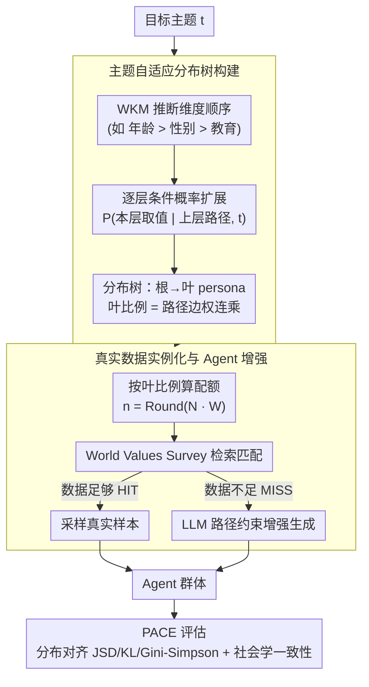

# HAG: Hierarchical Demographic Tree-based Agent Generation for Topic-Adaptive Simulation

**会议**: ACL 2026  
**arXiv**: [2601.05656](https://arxiv.org/abs/2601.05656)  
**代码**: [https://github.com/Libra117/HAG](https://github.com/Libra117/HAG)  
**领域**: LLM Agent  
**关键词**: Agent生成, 人口模拟, 层次化决策, 主题自适应, Agent-Based Modeling

## 一句话总结
提出 HAG 框架，将群体 Agent 生成形式化为两阶段层次化决策过程——先用世界知识模型构建主题自适应人口分布树实现宏观分布对齐，再通过真实数据检索与 Agent 增强保证微观个体一致性，在多领域基准上将群体对齐误差平均降低 37.7%、社会学一致性提升 18.8%。

## 研究背景与动机

**领域现状**：Agent-Based Modeling（ABM）在计算社会科学、经济建模和个性化推荐等领域日益重要，这些模拟系统高度依赖用户 Agent 来模拟偏好与交互行为。Agent 的质量直接决定了模拟系统的保真度。

**现有痛点**：现有 Agent 生成方法分两类：(1) 基于数据检索的方法从真实用户日志中构建 Agent 池，但天然是静态的，无法适应未见或数据稀缺的主题；(2) 基于 LLM 生成的方法通过预定义 schema 或文本推理生成 Agent persona，但缺乏对多维属性联合分布的显式建模，每个 Agent 独立生成导致群体分布与现实不符。

**核心矛盾**：没有现有方法能同时实现"主题自适应的群体宏观分布建模"和"微观个体属性的社会学合理性"。独立生成的 Agent 可能出现属性矛盾（如年龄与职业不匹配），而静态检索无法覆盖新主题。

**本文目标**：设计一个同时满足宏观分布对齐和微观个体一致性的 Agent 群体生成框架。

**切入角度**：作者观察到人口统计结构是主题相关的（如讨论科技和讨论养老的用户群体分布差异巨大），因此将群体生成建模为层次化条件概率推断问题。

**核心 idea**：用世界知识模型（WKM）自顶向下构建主题自适应人口分布树，通过层次化条件概率捕获多维属性的联合分布，再用真实数据填充与 LLM 增强相结合生成最终群体。

## 方法详解

### 整体框架
HAG 要同时啃下两块互相牵制的硬骨头：群体的宏观分布要随主题自适应、个体的微观属性又要社会学合理。它把整件事建模成一个自顶向下的层次化条件概率推断：输入一个目标主题，先让世界知识模型（WKM）推断该主题下人口属性的层级顺序与逐层条件概率，长出一棵从主题根节点到完整 persona 叶节点的分布树，每条根到叶的路径就对应一类人群及其目标占比；再以各叶节点的目标比例为配额，从 World Values Survey 真实用户库里检索填充，数据不足的节点用 LLM 在该路径约束下增强生成，最终拼出一个既对得上宏观分布、个体又自洽的 Agent 群体。整套流程把"主题→分布→个体"串成一条可解释的链路，而不是让每个 Agent 各自独立采样。生成完成后，再用 PACE 框架从群体分布对齐与微观社会学一致性两端量化质量。

### 关键设计

**1. 主题自适应分布树构建：把抽象主题翻译成多维联合分布**

直接让 LLM 逐个生成 persona 的根本问题是各 Agent 独立采样、缺乏对联合分布的显式建模，导致群体分布偏离现实。HAG 改用一棵分布树来承载属性间的依赖：先由 WKM 根据主题识别并排序相关人口维度（如讨论科技时年龄 > 性别 > 教育），定下树的层级顺序，再逐层自顶向下扩展。

每层节点的取值与边权由 WKM 推断的条件概率 $P(f^{(l)}=v^{(l)} \mid f^{(1:l-1)}=v^{(1:l-1)}, t)$ 给出，于是每个叶节点对应一个完整 persona，其目标比例就是根到叶路径上所有边权的连乘。用条件概率链而非独立采样来建模，正是为了让"年龄—职业—教育"这类属性间的真实依赖被显式刻画，从而保证宏观联合分布与主题匹配。

**2. 基于真实数据的实例化与 Agent 增强：用真实数据兜住微观真实性**

有了分布树还得把它落成一个个具体的人，且不能拼出"年龄与职业矛盾"的 Frankenstein Agent。HAG 对每个叶节点 persona 先算出所需人数 $n(\mathbf{v}) = \text{Round}(N \cdot W(\mathbf{v}\mid t))$，然后到 World Values Survey 库里检索匹配的真实用户：能凑齐的 HIT 节点直接采样真实样本，凑不齐的 MISS 节点才让 LLM 在该 persona 的整条路径约束下增强生成。

这样的优先级安排让微观一致性主要由真实数据兜底，LLM 只在数据稀缺处补位，且生成始终被树路径钳制，不会冒出与 persona 不兼容的属性组合——这正是它能避开拼凑式矛盾 Agent 的原因。

**3. PACE 评估框架：从分布对齐和社会学一致性两端量化质量**

Agent 群体生成此前缺一套专门的量化标尺，只看单一维度容易顾此失彼。PACE 把评估拆成两条互补的轴：群体对齐侧用 JSD/KL 散度衡量生成分布与真实分布的保真度、用 Gini-Simpson 指数量化多样性误差；社会学一致性侧则通过聚类提取主流原型来评估典型性，并逐个体检查内部自洽性与上下文合理性。

统计对齐管的是"群体像不像"，语义合理性管的是"个体真不真"，两者合起来才能既挡住分布漂移、又挡住属性矛盾，这套框架也因此能直接迁移到其他群体模拟任务上做评测。

### 训练策略
HAG 无需训练，全程直接调用预训练 LLM 充当 WKM 做条件概率推断，再从既有数据库检索与按需增强，不涉及任何参数更新。

## 实验关键数据

### 主实验
在 Bluesky（社交模拟）、Amazon（产品推荐）、IMDB（电影评论）三个领域上评估：

| 方法 | Bluesky JSD↓ | Bluesky KL↓ | Bluesky ArchRel↑ | Bluesky IndCon↑ |
|------|-------------|-------------|-------------------|-----------------|
| Random Select | 0.628 | 2.489 | 3.000 | 2.599 |
| Topic-Retrieval | 0.578 | 5.725 | 3.250 | 2.928 |
| LLM Generate | 0.539 | 2.487 | 3.063 | 3.197 |
| HAG-Flat | 0.401 | 2.436 | 3.750 | 3.324 |
| **HAG (Ours)** | **0.345** | **1.657** | **3.813** | **3.617** |

### 消融实验

| 配置 | JSD↓ | KL↓ | 说明 |
|------|------|-----|------|
| HAG (Full) | 0.345 | 1.657 | 完整模型 |
| HAG-Flat | 0.401 | 2.436 | 去掉层次化树，平坦化生成 |
| LLM Generate | 0.539 | 2.487 | 无树结构直接 LLM 生成 |

### 关键发现
- HAG 在所有三个领域上群体对齐误差平均降低 37.7%，社会学一致性提升 18.8%
- 层次化树结构是关键：HAG-Flat（无层次化条件概率）相比完整 HAG 在 JSD 上劣化约 16%
- 真实数据检索+增强策略有效避免了"Frankenstein Agent"问题（属性矛盾的拼凑 Agent）

## 亮点与洞察
- 将群体 Agent 生成形式化为层次化决策过程是一个优雅的建模选择，将条件概率链式分解与树结构结合，兼顾了可解释性和生成质量
- PACE 评估框架填补了 Agent 群体生成评估的空白，从统计和语义两个维度提供了系统化的评估方案，可复用于其他群体模拟任务
- 利用 WKM 的世界知识推断主题相关的人口分布，避免了依赖领域专家手动设计的瓶颈

## 局限与展望
- 树构建依赖 WKM 的质量，对于非常罕见或新兴的主题可能推断不准确
- 仅使用 World Values Survey 作为实数据源，文化和地域覆盖有限
- 维度排序对结果有影响，但自动排序的最优性缺乏理论保证
- 未来可探索动态更新树结构以适应实时变化的社会趋势

## 相关工作与启发
- **vs LLM Generate（直接生成）**: 直接用 LLM 生成 Agent 忽略了群体联合分布，HAG 通过树结构显式建模属性依赖
- **vs Topic-Retrieval（主题检索）**: 检索方法受限于已有数据覆盖，HAG 通过 WKM 推断 + LLM 增强实现无数据主题的自适应
- **vs WorldValuesBench**: HAG 继承其属性体系但扩展了动态主题自适应能力

## 评分
- 新颖性: ⭐⭐⭐⭐ 层次化分布树的建模思路新颖，将群体生成与条件概率推断结合
- 实验充分度: ⭐⭐⭐⭐ 三个领域覆盖面广，PACE 评估框架设计合理
- 写作质量: ⭐⭐⭐⭐ 结构清晰，问题定义和方法描述逻辑连贯
- 价值: ⭐⭐⭐⭐ 对 Agent 模拟领域有实用价值，评估框架可推广
- 综合: ⭐⭐⭐⭐ 问题定义清晰，方案设计合理，实验验证充分

<!-- RELATED:START -->

## 相关论文

- [\[ACL 2026\] LiTS: A Modular Framework for LLM Tree Search](lits_a_modular_framework_for_llm_tree_search.md)
- [\[AAAI 2026\] A2Flow: Automating Agentic Workflow Generation via Self-Adaptive Abstraction Operators](../../AAAI2026/llm_agent/a2flow_automating_agentic_workflow_generation_via_self-adaptive_abstraction_oper.md)
- [\[ACL 2026\] AdaRubric: Task-Adaptive Rubrics for Reliable LLM Agent Evaluation and Reward Learning](adarubric_task-adaptive_rubrics_for_reliable_llm_agent_evaluation_and_reward_lea.md)
- [\[CVPR 2025\] ATA: Adaptive Transformation Agent for Text-Guided Subject-Position Variable Background Generation](../../CVPR2025/llm_agent/ata_adaptive_transformation_agent_for_text-guided_subject-position_variable_back.md)
- [\[ACL 2026\] OPeRA: A Dataset of Observation, Persona, Rationale, and Action for Evaluating LLMs on Human Online Shopping Behavior Simulation](opera_a_dataset_of_observation_persona_rationale_and_action_for_evaluating_llms_.md)

<!-- RELATED:END -->
