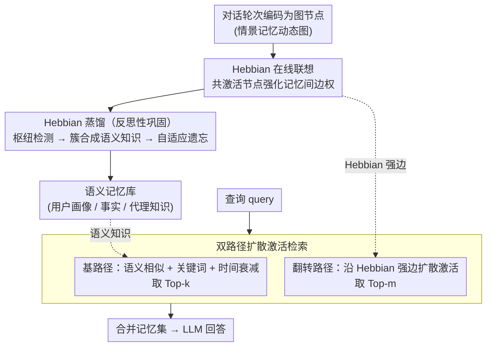

# HeLa-Mem: Hebbian Learning and Associative Memory for LLM Agents

**会议**: ACL 2026  
**arXiv**: [2604.16839](https://arxiv.org/abs/2604.16839)  
**代码**: [GitHub](https://github.com/hela-mem)  
**领域**: LLM Agent / 记忆系统  
**关键词**: Hebbian学习, 联想记忆, 长期对话, 情景-语义双路径, 扩散激活

## 一句话总结
HeLa-Mem 提出了一种受神经科学启发的 LLM 代理记忆架构，将对话历史建模为带 Hebbian 学习动力学的动态图——通过共激活强化记忆间连接、反思性蒸馏将枢纽记忆凝练为语义知识、双路径检索结合语义相似度和 Hebbian 扩散激活，在 LoCoMo 上以显著更少的 token 达到最优性能。

## 研究背景与动机

**领域现状**：LLM 代理的长期记忆是关键挑战——固定上下文窗口无法跨扩展交互保持连贯性。现有记忆系统将对话历史表示为非结构化嵌入向量，通过语义相似度检索信息。

**现有痛点**：(1) 嵌入式检索无法捕捉人类记忆中的联想结构——相关经历通过重复共激活逐渐增强连接；(2) 现有方法各自优化单一维度（结构/检索/更新），忽略它们的相互作用；(3) 更根本的是，记忆的动态演化被忽视——当前系统将存储和检索视为独立的静态过程，无法捕捉记忆间不断重组的连接性。

**核心矛盾**：语义相似度仅捕捉表面关联，但人类记忆中的关联更深——一个今天讨论的话题可能触发一个月前的记忆，不是因为表面关键词相似，而是因为它们属于同一个演化叙事。

**本文目标**：构建一个模拟生物记忆中联想、巩固和扩散激活三个机制的 LLM 代理记忆架构。

**切入角度**：借鉴 Hebbian 学习原理（"一起激活的神经元连在一起"）和情景-语义记忆的双系统理论。

**核心 idea**：用 Hebbian 学习动力学驱动的动态图表示情景记忆 + 反思性蒸馏产生语义记忆 + 双路径扩散激活检索。

## 方法详解

### 整体框架
HeLa-Mem 把对话历史建成一张带 Hebbian 学习动力学的动态图，让记忆像生物大脑一样在使用中不断重组连接。整体是一个三模块的认知循环：在线编码与联想阶段把每个对话轮次编码成图节点，被同时检索（共激活）的节点之间用 Hebbian 规则强化边权；反思性巩固阶段周期性地检测高连接度的枢纽节点，把它周围密集相连的记忆簇蒸馏成结构化语义知识沉淀下来，同时遗忘低权重的陈旧节点；双路径检索阶段在 query 到来时同时走语义相似度（基路径）和沿 Hebbian 强边扩散激活（翻转路径）两条路，合并出最终记忆集。这样存储和检索不再是静态的两端，而是被同一套图动力学耦合起来——"一起被想起的记忆逐渐连得更紧"，从而捕捉纯 embedding 检索看不到的联想结构。

### 关键设计

**1. Hebbian 在线联想：用共激活长出语义看不见的关联**

embedding 相似度只能抓表面关联，但人类记忆里"今天的话题勾起一个月前的事"往往不是因为关键词像，而是因为它们反复被一同想起、属于同一条演化叙事。HeLa-Mem 把这种"一起激活的连在一起"直接写成边权更新规则 $w_{ij}^{(t+1)} = (1-\lambda)\cdot w_{ij}^{(t)} + \eta\cdot\mathbb{I}(v_i, v_j \in \mathcal{K}_t)$：$\mathbb{I}$ 指示两节点是否在当前检索集 $\mathcal{K}_t$ 中被共激活，$\eta$ 是学习率负责强化，$\lambda$ 是突触衰减负责让久不共现的连接慢慢淡去。

于是两条表面不相似的记忆，只要反复被同时检索，就会逐步建立起强连接，模拟出人脑式的联想——这正是后续扩散检索能"跳"到语义远处记忆的物理基础。

**2. Hebbian 蒸馏（反思性巩固）：把高频记忆簇抽象成稳定知识**

动态图若只增不减会无限膨胀、检索噪声越积越多。HeLa-Mem 借鉴大脑睡眠巩固，引入一个反思代理：当某节点 $v_i$ 的累积边权 $D(v_i)=\sum_{j\in\mathcal{N}(i)} w_{ij}$ 超过枢纽阈值 $\delta_{hub}$，说明它已是被反复激活的记忆中枢，就检索该枢纽及其强连接邻居，用 LLM 把这一簇合成为结构化语义知识（用户画像、事实记忆、代理知识）存入语义记忆库；与此同时对低权重且长期未访问的节点做自适应遗忘。

频繁激活的簇被抽象成稳定长期知识、冷门连接被剪掉，既压住了图规模，又把零散情景记忆固化成可直接复用的语义记忆，对应了情景—语义双系统里"巩固"那一环。

**3. 双路径扩散激活检索：同时捞语义近邻和关联近邻**

检索若只看语义相似度，就会漏掉"语义远但关联近"的记忆。HeLa-Mem 先算基激活 $S_{base}(v_i)=(\text{sim}(\mathbf{q}, \mathbf{e}_i)+\alpha\cdot\text{keyword})\cdot\gamma(v_i)$，融合语义相似、关键词命中与时间衰减 $\gamma$；再沿图做扩散激活 $S(v_j)=S_{base}(v_j)+\beta\sum_{i\in\mathcal{N}(j)} S_{base}(v_i)\cdot w_{ij}$，让高分节点把激活顺着 Hebbian 强边传给邻居。最终检索集取基路径 Top-k 与翻转路径 Top-m 的并集，后者专门收那些扩散后才冒头、基路径却没选中的节点。

翻转路径捕捉的恰是"语义上远、关联上近"的记忆，这对需要跨多条记忆串联的多跳推理尤其关键——也是消融里扩散激活贡献最大的来源。

### 损失函数 / 训练策略
HeLa-Mem 无需训练，$\eta$、$\lambda$、$\beta$、$\tau$ 等全部为超参数，Hebbian 学习在检索过程中在线发生、随交互即时更新边权，不涉及任何梯度优化。

## 实验关键数据

### 主实验（LoCoMo 基准）

| 方法 | 多跳F1 | 时序F1 | 开放域F1 | 单跳F1 | Token数↓ |
|------|--------|--------|---------|--------|---------|
| MemGPT | - | - | - | - | 高 |
| A-Mem | - | - | - | - | 中 |
| **HeLa-Mem** | **最优** | **最优** | **最优** | **最优** | **最少** |

### 消融实验

| 配置 | 说明 |
|------|------|
| 无 Hebbian 学习 | 退化为纯语义检索，多跳下降显著 |
| 无反思性蒸馏 | 图不断膨胀，检索噪声增加 |
| 无扩散激活 | 仅基路径，无法发现关联记忆 |

### 关键发现
- HeLa-Mem 在所有四个问题类别上达到最优，同时使用显著更少的 token（位于性能-效率图的"左上角理想区域"）
- 扩散激活对多跳推理贡献最大——这正是 Hebbian 学习捕捉的潜在关联的价值所在
- 平均排名 1.25（所有类别中近乎全部第一），跨四种 LLM 骨干一致表现优异

## 亮点与洞察
- **生物记忆三机制的统一建模**（联想+巩固+扩散激活）提供了一个优雅的认知科学视角
- Hebbian 蒸馏的"枢纽检测→簇合成→语义知识"管线模拟了人脑的记忆巩固
- Token 效率优势说明更精准的检索（而非更多的检索）才是关键

## 局限与展望
- 超参数（$\eta, \lambda, \delta_{hub}$ 等）需要手动调节，对不同场景可能敏感
- 仅在 LoCoMo 单一基准上评估，更多长期对话场景需验证
- 图操作的计算开销随对话长度增长

## 相关工作与启发
- **vs A-Mem**: A-Mem 使用 Zettelkasten 式笔记网络，HeLa-Mem 用 Hebbian 动力学驱动的动态图，后者的连接是从交互中"学习"的
- **vs Mem0/MemGPT**: 这些方法分别优化单一维度，HeLa-Mem 统一了联想、巩固和检索
- **vs APEX-MEM**: APEX-MEM 用属性图+只追加存储，HeLa-Mem 用 Hebbian 学习动态演化图结构

## 评分
- 新颖性: ⭐⭐⭐⭐⭐ Hebbian 学习驱动的记忆架构在 LLM Agent 中是首创
- 实验充分度: ⭐⭐⭐⭐ 四骨干+四类别+消融，但仅单一基准
- 写作质量: ⭐⭐⭐⭐⭐ 认知科学动机清晰，架构描述系统
- 价值: ⭐⭐⭐⭐⭐ 为 LLM 长期记忆提供了生物启发的新范式

<!-- RELATED:START -->

## 相关论文

- [\[ACL 2026\] AnchorMem: Anchored Facts with Associative Contexts for Building Memory in Large Language Models](anchormem_anchored_facts_with_associative_contexts_for_building_memory_in_large_.md)
- [\[ACL 2026\] Mem^p: Exploring Agent Procedural Memory](memp_exploring_agent_procedural_memory.md)
- [\[NeurIPS 2025\] A-MEM: Agentic Memory for LLM Agents](../../NeurIPS2025/llm_agent/a-mem_agentic_memory_for_llm_agents.md)
- [\[ACL 2026\] Lightweight LLM Agent Memory with Small Language Models](lightweight_llm_agent_memory_with_small_language_models.md)
- [\[ACL 2026\] Hierarchical Reinforcement Learning with Augmented Step-Level Transitions for LLM Agents](hierarchical_reinforcement_learning_with_augmented_step-level_transitions_for_ll.md)

<!-- RELATED:END -->
