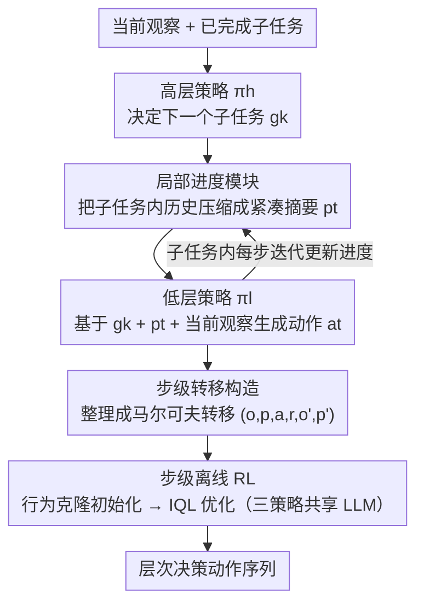

# Hierarchical Reinforcement Learning with Augmented Step-Level Transitions for LLM Agents

**会议**: ACL 2026  
**arXiv**: [2604.05808](https://arxiv.org/abs/2604.05808)  
**代码**: [GitHub](https://github.com/TonyStark042/STEP-HRL)  
**领域**: LLM Agent / 层次强化学习  
**关键词**: 层次强化学习, 步级转移, 局部进度, token效率, 离线RL

## 一句话总结

本文提出 STEP-HRL，通过引入局部进度模块将交互历史迭代压缩为紧凑的文本摘要，使高层和低层策略仅基于单步转移（而非完整历史）做决策，在 ScienceWorld 和 ALFWorld 上显著提升性能和泛化性，同时减少 token 使用。

## 研究背景与动机

**领域现状**：LLM agent 在交互式决策任务中展现出强大能力。RL 为提升 agent 提供了原则性机制——通过环境交互和奖励反馈优化策略。现有 LLM agent 普遍采用"历史条件化"范式——策略以越来越长的历史序列为条件。

**现有痛点**：(1) 注意力机制的二次复杂度使得长历史的推理成本高昂；(2) 未过滤的历史积累了冗余或无关信息，可能遮蔽决策关键信号；(3) 现有 HRL 方法虽然引入时间抽象，但高层和低层策略仍以累积历史为条件，继承了长上下文依赖问题。

**核心矛盾**：长历史条件化是建模选择而非 RL 的必要条件——将长期决策与长上下文混为一谈引入了不必要的计算负担和推理噪声。

**本文目标**：设计一种基于进度（progress-based）而非基于历史（history-based）的 HRL 框架，使策略仅依赖单步转移做决策。

**切入角度**：已完成的子任务序列自然构成全局进度的紧凑摘要；剩余的挑战是如何紧凑表示每个子任务内的局部交互历史。

**核心 idea**：引入局部进度策略 $\pi_\theta^p$ 在每步迭代地将子任务内交互历史压缩为紧凑文本表示，低层策略仅以当前子任务+局部进度+当前观察为条件，消除对完整历史的依赖。

## 方法详解

### 整体框架

STEP-HRL 要解决的核心问题是：让 LLM agent 在长程交互中做层次决策，但又不让策略背上"越滚越长的历史"这个包袱。它的做法是把决策拆给三个共享同一套 LLM 参数的策略协同完成——高层策略 $\pi_\theta^h$ 看着当前观察和已完成子任务，决定下一个该攻克的子任务；低层策略 $\pi_\theta^l$ 在子任务内一步步生成原始动作；而夹在两者之间的局部进度策略 $\pi_\theta^p$ 每走一步就把子任务内的交互历史重新压缩成一段紧凑文本，喂给低层策略当上下文。这样从输入观察到最终动作的整条链路上，没有任何一环需要回看完整历史，所有决策都只依赖常量大小的"单步转移"。整套系统先用行为克隆初始化三个策略，再用步级离线 RL 进一步打磨。

### 关键设计

**1. 局部进度模块：用迭代压缩替代历史积累**

子任务内的交互历史会随着步数不断膨胀，直接喂给策略既贵又吵。局部进度策略的思路是把"积累"换成"压缩"：每一步它都基于前一步进度、上一动作和当前观察重新生成一段固定大小的摘要 $p_t^k \sim \pi_\theta^p(\cdot \mid g_k, a_{t-1}^k, o_t^k, p_{t-1}^k)$，初始进度为空 $p_0^k = \varnothing$。

它和简单的历史截断有本质区别——截断是机械地丢弃旧内容，而局部进度是**选择性**的：它只保留与当前子任务真正相关的信息，主动滤掉冗余和噪声。这一步等价于在每个子任务内插入了一个信息瓶颈，让长上下文依赖被压成一个紧凑的状态变量，从根上解决了注意力二次复杂度和噪声遮蔽的问题。

**2. 步级转移构造：让每次决策都是马尔可夫的**

有了局部进度这个紧凑状态，就可以把整条轨迹重新组织成一系列定长的"步级转移"。低层的转移写成 $(o_t^k, p_t^k, a_t^k, \hat{r}_t^k, o_{t+1}^k, p_{t+1}^k)$，高层的转移写成 $(\hat{p}_{k-1}, o_0^k, g_k, R_k, \hat{p}_k, o_0^{k+1})$，其中 $\hat{p}_k$ 是子任务 $g_k$ 结束时定格的最终局部进度，恰好充当跨子任务的全局进度摘要。

关键在于这些转移都是马尔可夫的——做决策时只需看当前转移里的几个常量大小的量，无需回溯完整历史。这不仅把"长期决策"和"长上下文"彻底解耦，也为后续的离线 RL 提供了状态定义清晰、值估计更稳定的训练样本。

**3. 步级离线 RL：在模仿之上发现更优策略**

行为克隆只能模仿专家，天花板就是数据本身。STEP-HRL 在 BC 初始化之后接一轮基于 Implicit Q-Learning 的离线 RL：三个策略仍共享 LLM 主干，但各自配一套独立的 critic（utterance 级的 $V$ 与 $Q$），用 expectile regression 学值函数、用 advantage-weighted regression 反过来优化策略。低层用内在奖励（子任务完成记 $1$），高层用环境外在奖励。

正是因为前一步把轨迹整理成了马尔可夫的步级转移，这里的值估计才不必在长历史上回传、变得更稳更高效，从而能在模仿的基础上真正搜索出超越专家演示的策略。

### 损失函数 / 训练策略

行为克隆阶段使用自回归交叉熵损失对齐专家演示。离线 RL 阶段联合优化三项：Q-function 的 TD 回归损失、值函数的 expectile 损失，以及策略的 advantage-weighted 损失。三个策略共享同一套 LLM 参数，既压缩了训练与推理开销，也促成了高层规划、低层执行与进度压缩之间的跨层次知识迁移。

## 实验关键数据

### 主实验

**ScienceWorld（30 个科学任务族）**

| 方法 | 总分 | Token 使用 | 泛化性（未见变体） |
|------|------|-----------|-----------------|
| ReAct | 32.1 | 高 | 低 |
| GLIDER (HRL) | 48.2 | 高 | 中 |
| STEP-HRL (BC only) | 52.7 | **低** | 中 |
| **STEP-HRL (BC + RL)** | **57.3** | **低** | **高** |

### 消融实验

| 配置 | ScienceWorld | ALFWorld |
|------|------------|---------|
| 无局部进度（全历史） | 44.8 | 62.3 |
| 固定窗口截断 | 47.2 | 65.1 |
| **局部进度（STEP-HRL）** | **57.3** | **78.4** |

### 关键发现

- 仅行为克隆阶段的 STEP-HRL 已超越现有 HRL 基线（52.7 vs 48.2），验证步级转移本身的有效性
- 离线 RL 进一步提升 4.6 个百分点，证明步级转移使 RL 优化更高效
- 局部进度模块比固定窗口截断提升 10.1 个百分点——选择性信息保留远优于简单截断
- 三策略共享参数减少了训练和推理开销，同时促进了跨层次知识迁移

## 亮点与洞察

- "长期决策 ≠ 长上下文"的核心洞察深刻——步级转移证明了信息压缩可以替代历史积累
- 局部进度作为信息瓶颈自然地实现了注意力聚焦和噪声过滤
- 三策略共享参数的设计在效率和性能间取得了良好平衡

## 局限与展望

- 局部进度的质量依赖于 LLM 的摘要能力——弱 LLM 可能产生低质量进度
- 专家演示的子任务分解和进度标注由 DeepSeek 生成，可能继承其偏差
- 仅在文本环境（ScienceWorld、ALFWorld）验证，对视觉或多模态环境的适用性未知
- 离线 RL 受限于收集数据的质量和多样性

## 相关工作与启发

- **vs GLIDER**: GLIDER 使用 HRL 但仍以完整历史为条件；STEP-HRL 通过局部进度消除历史依赖
- **vs ReAct**: ReAct 将推理和行动交错但无层次结构；STEP-HRL 增加层次抽象+步级优化
- **vs Decision Transformer**: DT 将决策转为序列预测需要完整轨迹；STEP-HRL 仅需单步转移

## 评分

- 新颖性: ⭐⭐⭐⭐ 步级转移+局部进度的 HRL 设计新颖且合理
- 实验充分度: ⭐⭐⭐⭐ 两个基准+详细消融+token 分析+泛化性评估
- 写作质量: ⭐⭐⭐⭐⭐ 问题定义清晰，方法推导完整
- 价值: ⭐⭐⭐⭐ 为 LLM agent 的长期决策提供了更高效的框架

<!-- RELATED:START -->

## 相关论文

- [\[AAAI 2026\] MoralReason: Generalizable Moral Decision Alignment For LLM Agents Using Reasoning-Level Reinforcement Learning](../../AAAI2026/llm_agent/moralreason_generalizable_moral_decision_alignment_for_llm_agents_using_reasonin.md)
- [\[ACL 2026\] Verified Critical Step Optimization for LLM Agents](verified_critical_step_optimization_for_llm_agents.md)
- [\[ACL 2026\] Temp-R1: A Unified Autonomous Agent for Complex Temporal KGQA via Reverse Curriculum Reinforcement Learning](temp-r1_a_unified_autonomous_agent_for_complex_temporal_kgqa_via_reverse_curricu.md)
- [\[ICLR 2026\] Reducing Belief Deviation in Reinforcement Learning for Active Reasoning of LLM Agents](../../ICLR2026/llm_agent/reducing_belief_deviation_in_reinforcement_learning_for_active_reasoning.md)
- [\[ICML 2026\] On Information Self-Locking in Reinforcement Learning for Active Reasoning of LLM Agents](../../ICML2026/llm_agent/on_information_self-locking_in_reinforcement_learning_for_active_reasoning_of_ll.md)

<!-- RELATED:END -->
