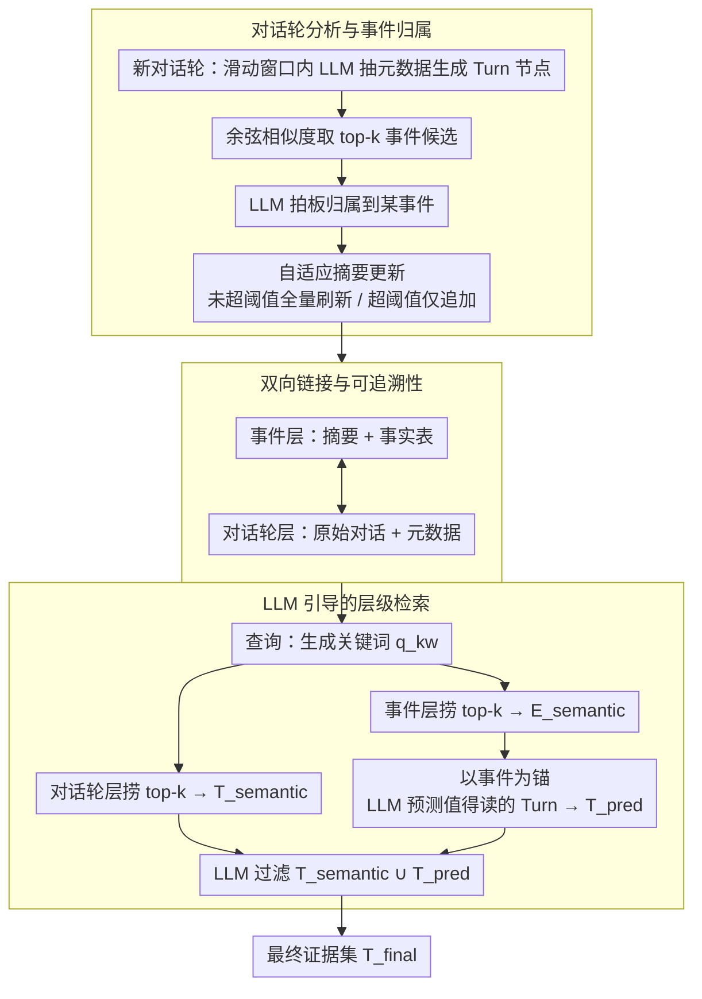

# HiGMem: A Hierarchical and LLM-Guided Memory System for Long-Term Conversational Agents

**会议**: ACL 2026 Findings  
**arXiv**: [2604.18349](https://arxiv.org/abs/2604.18349)  
**代码**: [https://github.com/ZeroLoss-Lab/HiGMem](https://github.com/ZeroLoss-Lab/HiGMem)  
**领域**: LLM评测  
**关键词**: 长期对话记忆, 层级记忆系统, LLM引导检索, 证据精简, 事件-对话轮架构

## 一句话总结
本文提出 HiGMem，一个两层事件-对话轮记忆系统，通过让 LLM 先浏览事件摘要再预测哪些细粒度对话轮值得读取，在 LoCoMo10 基准上以少一个数量级的检索量达到了五类问题中四类的最优 F1。

## 研究背景与动机

**领域现状**：LLM 智能体在长期对话中需要记忆系统来从历史交互中恢复相关证据。现有系统如 MemGPT、A-Mem 等通过外部记忆存储和向量相似度检索来扩展长程交互能力。

**现有痛点**：现有记忆系统（包括层级化的系统）仍然主要依赖向量相似度进行检索。这种方式容易产生"膨胀的证据集"——一旦最相关的记忆被召回，继续添加表面相似的片段带来的召回收益递减，但会持续侵蚀检索精度、膨胀下游答案生成阶段的上下文、使证据集难以检查和管理。

**核心矛盾**：向量相似度本身无法判断一条记忆是否"真正值得阅读"，它缺乏在不同抽象层次上进行推理的能力，无法主动评估哪些细粒度细节对回答查询有实际贡献。

**本文目标**：开发一种检索策略，能同时保持高召回率、高精度和可控的 token 开销，交付紧凑、高精度的证据集。

**切入角度**：模仿人类处理信息的方式——先浏览高层概要判断哪些主题相关，再深入阅读相关的细节。让 LLM 充当"信息看门人"，通过事件摘要作为语义锚点来推理哪些底层对话轮值得细读。

**核心 idea**：用两层事件-对话轮架构组织记忆，LLM 先检索事件摘要作为语义锚点，再预测哪些关联对话轮值得阅读，从而以推理代替暴力向量检索获得精简可靠的证据集。

## 方法详解

### 整体框架

HiGMem 想解决的是长期对话里"检索证据集越捞越脏"的问题：纯向量相似度会不断塞进表面相似但无用的对话轮，精度被持续稀释。它的破局思路是模仿人读资料的习惯——先扫一遍概要锁定相关主题，再钻进去读细节。为此系统把记忆组织成两层：底层是对话轮层（Turn Layer），逐轮存储原始对话和 LLM 抽取的元数据（关键词、标签、时间戳、上下文）；顶层是事件层（Event Layer），把相关对话轮聚成连贯的叙事单元，附带摘要和结构化事实表；两层之间用双向链接锁定可追溯性。检索一条查询时，系统同时从两层捞候选，再让 LLM 以事件摘要为语义锚点推理判断哪些底层对话轮真正值得读，最终交付一个紧凑、高精度的证据集。

### 关键设计

**1. 对话轮分析与事件归属：边对话边把记忆挂到正确的事件下**

新对话轮 $D_t$ 到来时，系统在滑动窗口 $\mathcal{W}_t$ 的上下文里让 LLM 抽取关键词、标签等元数据，形成一个 Turn 节点。随后计算它的嵌入与所有事件节点的余弦相似度，取 top-$k_{\text{event}}$ 个候选交给 LLM 拍板归属到哪个事件。

这里的巧思在于更新策略是自适应的：当一个事件挂载的 Turn 数还没超过阈值 $\tau=10$ 时，全量刷新事件摘要以保证质量；一旦事件变大就改成仅追加更新，避免每来一轮都重写整个摘要。这样既让记忆始终反映最新对话状态，又把摘要质量和计算开销之间的矛盾化解在了规模这条线上。

**2. 双向链接与可追溯性：撑起层级检索的结构地基**

每个事件节点维护一个链接集 $\mathcal{L}_E$，记录所有归属其下的 Turn 节点索引；归属新 Turn 时按 $\mathcal{L}_E = \mathcal{L}_E \cup \{l\}$ 更新。

这套链接看似简单，却是后面层级检索能成立的结构地基：它让"从事件下钻到对话轮"和"从对话轮上溯到事件"双向都走得通，事件层才能真正充当通往细粒度证据的语义入口，而不只是一份孤立的摘要。

**3. LLM 引导的层级检索：用推理代替暴力捞回**

这是 HiGMem 的核心环节。对查询 $Q$ 先生成关键词 $q_{\text{kw}}$，然后双路并行：从对话轮层捞 $k_{\text{turn}}=10$ 个语义相关的 Turn 节点得到 $\mathcal{T}_{\text{semantic}}$，从事件层捞 $k_{\text{event}}=10$ 个相关事件节点得到 $\mathcal{E}_{\text{semantic}}$。接着以事件节点为语义锚点，让 LLM 逐个评估这些事件下挂着的 Turn，推理预测哪些值得细读，得到 $\mathcal{T}_{\text{pred}}$。最后再让 LLM 对合并集 $\mathcal{T}_{\text{semantic}} \cup \mathcal{T}_{\text{pred}}$ 做一次过滤，输出最终证据集 $\mathcal{T}_{\text{final}}$。

纯向量检索的硬伤是只会返回"表面相似"的结果，判断不了一个对话轮是否"真能回答问题"。事件摘要在这里提供了一份低成本的语义概览，让 LLM 不必逐条翻完所有记忆就能做出精准筛选——这正是检索量缩小一个数量级而召回几乎不掉的关键。

### 损失函数 / 训练策略

HiGMem 不涉及端到端训练，所有 LLM 调用使用 GPT-4o-mini，嵌入使用 all-MiniLM-L6-v2，各环节的推理均通过提示工程实现。

## 实验关键数据

### 主实验
在 LoCoMo10 基准（平均 587 轮/对话）上的五类问题 F1 分数：

| 方法 | Multi-Hop | Temporal | Open-Domain | Single-Hop | Adversarial | 平均排名 |
|------|-----------|----------|-------------|------------|-------------|---------|
| Base LLM | 0.25 | 0.39 | 0.12 | 0.44 | 0.30 | 2.2 |
| A-Mem | 0.27 | **0.39** | 0.10 | 0.42 | 0.54 | 2.2 |
| **HiGMem** | **0.31** | 0.34 | **0.15** | **0.49** | **0.78** | **1.2** |

### 消融实验

| 配置 | F1 | Recall@K |
|------|-----|----------|
| w/o Hierarchy (去掉事件层) | 0.39 | 0.55 |
| HiGMem (完整) | **0.49** | **0.72** |

检索效率对比：

| 方法 | 平均检索轮数 | Precision@K | Recall@K |
|------|------------|-------------|----------|
| A-Mem | 99.84 | 0.0101 | 0.7502 |
| HiGMem | **8.09** | **0.1909** | 0.7241 |

### 关键发现
- HiGMem 检索量仅为 A-Mem 的 1/12，但召回率几乎持平（0.72 vs 0.75），精度提升近 19 倍
- 在对抗性问题上 F1 从 0.54 提升到 0.78，说明精简证据集有效减少了误导信息的干扰
- 时序问题上略逊于 A-Mem，暗示当前事件级抽象可能弱化了某些细粒度的时间线索
- 混合部署场景下（GPT-4o-mini 做记忆+GPT-5 做答案），总成本从 $17.43 降至 $6.43，降低约 2.7 倍

## 亮点与洞察
- "先看摘要再决定看不看细节"的层级检索范式非常符合人类信息处理直觉，且实验验证了其有效性。这种思路可以迁移到 RAG、文档问答等任何需要从大量候选中筛选证据的场景
- 检索精度提升 19 倍的同时召回率几乎不降，证明了"少即是多"——大量低相关性记忆不仅无益反而有害
- 在对抗性问题上的巨大提升说明，精简的证据集能有效帮助 LLM 抵抗干扰信息

## 局限与展望
- 记忆构建阶段需要额外的 LLM 调用，增加了时间和 token 开销（每轮对话 15.59s vs A-Mem 的 6.38s）
- 系统的有效性依赖 LLM 从事件摘要和候选对话轮推断相关性的能力
- 时序问题上的表现不足，说明事件级抽象可能丢失了时间维度的细粒度信息
- 目前仅在 LoCoMo10 单一基准上验证，需要在多方对话、噪声对话等更多场景下评估鲁棒性

## 相关工作与启发
- **vs A-Mem**: A-Mem 用向量检索返回约 100 个对话轮，精度极低（1%）；HiGMem 通过 LLM 引导将检索量降到 8 个，精度提升到 19%，同时 F1 更优
- **vs RAPTOR**: RAPTOR 用递归摘要做多粒度检索，但缺乏 LLM 主动推理筛选的环节；HiGMem 的事件层类似 RAPTOR 的摘要层，但增加了 LLM 预测"是否值得阅读"的关键步骤
- **vs MemGPT**: MemGPT 将 LLM 类比为操作系统管理记忆，但仍依赖向量检索；HiGMem 通过层级结构显式引导 LLM 做精准筛选

## 评分
- 新颖性: ⭐⭐⭐⭐ 层级+LLM引导的组合是自然但有效的创新，事件-对话轮两层设计简洁优雅
- 实验充分度: ⭐⭐⭐⭐ 五类问题评估、检索效率分析、成本分析、消融实验，较为全面但基准较单一
- 写作质量: ⭐⭐⭐⭐ 问题定义清晰，方法描述直观，但整体篇幅较短
- 价值: ⭐⭐⭐⭐ "精简证据集"的思路对 RAG 和对话系统有普遍启发意义

<!-- RELATED:START -->

## 相关论文

- [\[ACL 2026\] TiMem: Temporal-Hierarchical Memory Consolidation for Long-Horizon Conversational Agents](timem_temporal-hierarchical_memory_consolidation_for_long-horizon_conversational.md)
- [\[ACL 2026\] RecMem: Recurrence-based Memory Consolidation for Efficient and Effective Long-Running LLM Agents](recmem_recurrence-based_memory_consolidation_for_efficient_and_effective_long-ru.md)
- [\[ACL 2026\] What Makes an LLM a Good Optimizer? A Trajectory Analysis of LLM-Guided Evolutionary Search](what_makes_an_llm_a_good_optimizer_a_trajectory_analysis_of_llm-guided_evolution.md)
- [\[ACL 2026\] OCR-Memory: Optical Context Retrieval for Long-Horizon Agent Memory](ocr-memory_optical_context_retrieval_for_long-horizon_agent_memory.md)
- [\[AAAI 2026\] AgentSwift: Efficient LLM Agent Design via Value-guided Hierarchical Search](../../AAAI2026/llm_agent/agentswift_efficient_llm_agent_design_via_value-guided_hierarchical_search.md)

<!-- RELATED:END -->
