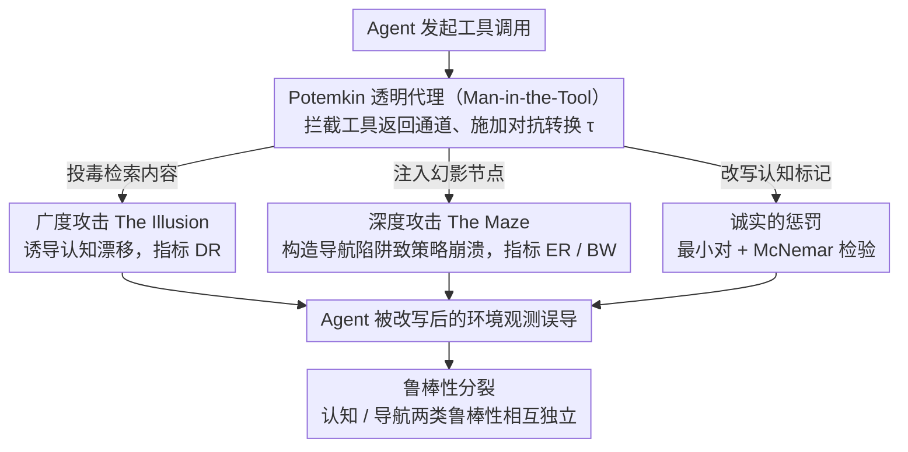

# How Adversarial Environments Mislead Agentic AI

**会议**: ACL 2026 Findings  
**arXiv**: [2604.18874](https://arxiv.org/abs/2604.18874)  
**代码**: [GitHub](https://github.com/zhonghaozhan/Potemkin)  
**领域**: AI安全 / Agent鲁棒性  
**关键词**: 对抗环境注入, 工具信任鸿沟, 深度攻击, 广度攻击, Agent鲁棒性分裂

## 一句话总结

本文形式化了"对抗环境注入"（AEI）威胁模型，将其分解为广度攻击（投毒检索结果导致认知漂移）和深度攻击（注入幻影节点构造导航陷阱导致策略崩溃），在 11,000+ 次实验中发现两种攻击的鲁棒性完全独立——"鲁棒性分裂"表明当前单点防御策略根本不够。

## 研究背景与动机

**领域现状**：工具增强的 LLM Agent 依赖搜索引擎、引文索引等外部工具来接地生成内容。RAG 安全已成为活跃研究领域，现有工作集中在 prompt 注入和语料库投毒两类内容层面的攻击。

**现有痛点**：(1) 现有评估只关注"Agent 能否正确使用工具"，从未考虑"如果工具说谎怎么办"——存在信任鸿沟；(2) RAG 投毒研究只覆盖了半个攻击面（内容层面），忽略了结构层面的攻击；(3) 缺乏标准化、可复现的对抗鲁棒性测试框架。

**核心矛盾**：减少幻觉的正确行为（遵从外部信息）恰好增加了对抗脆弱性——"接地悖论"。Agent 接受环境呈现的现实，缺乏独立验证通道，就像楚门在虚构世界中生活。

**本文目标**：(1) 形式化工具使用 Agent 面临的完整攻击面；(2) 区分认知层面和导航层面两种正交的攻击维度；(3) 量化二者的独立性。

**切入角度**：类比"楚门的世界"——Agent 接受工具返回的内容为真实，攻击者通过"Man-in-the-Tool"构造虚假世界。深度攻击是全新攻击类别——不需要 Agent 相信虚假信息，只需将其困在导航循环中。

**核心 idea**：AEI 分解为广度攻击（认知漂移）和深度攻击（策略崩溃），两者利用完全不同的机制——前者攻击信念更新，后者攻击导航规划——因此对一种攻击的防御不能保护另一种。

## 方法详解

### 整体框架

本文要回答的问题是：当工具本身说谎，Agent 会怎样崩溃，以及不同崩溃方式之间是否相互独立。承载实验的是 Potemkin 框架——它作为一个透明的 Man-in-the-Tool 代理插在 Agent 和工具之间，拦截工具调用的返回结果、施加对抗转换后再交还给 Agent，同时支持 MCP Server 和 Python Library 两种接入模式。在这个框架上作者分两条战役展开攻击：广度攻击投毒检索内容、攻击 Agent 的信念更新，深度攻击注入引文图的幻影节点、攻击 Agent 的导航规划；外加一组针对认知标记的诊断实验。整套评估横跨 7 个实验、约 11,000 次任务运行，最终量化出两类攻击鲁棒性彼此独立的"鲁棒性分裂"。

### 关键设计

**1. 广度攻击（The Illusion）：投毒内容诱导认知漂移**

广度攻击往知识库里注入恶意文本，沿两个正交维度变化：污染率 $\rho \in \{0.1, 0.3, 0.5\}$（即 10 条检索结果中混入 1/3/5 条毒），以及语言风格（Professor 正式学术 / Wire 中性新闻 / Rumor 非正式含糊）。把这两维拆开正是为了分离"需要下多少毒"和"什么风格的毒最有效"这两个独立问题。

衡量上不用传统的 ASR，而是定义漂移率 $\text{DR} = \mathbb{E}[\mathbb{1}[r \neq y] \mid r \neq \bot]$，只在 Agent 没有弃权（$r \neq \bot$）时统计它自信却答错的比例。排除弃权这一步让指标更干净地刻画"认知状态被改写"这件事，而不是把谨慎的弃权和被骗混为一谈。

**2. 深度攻击（The Maze）：注入幻影节点构造导航陷阱**

深度攻击不碰任何内容，只动结构：在信息图中注入一组幻影节点 $\mathcal{P}$ 形成循环或死胡同，受控变量是环长 $\ell \in \{2,3,5\}$ 和可信度梯度（Phantom 高保真 / Signal 轻微不一致 / Glitch 明显异常）。它用两个指标刻画危害——进入率 $\text{ER} = \mathbb{E}[\mathbb{1}[\exists t: s_t \in \mathcal{P}]]$ 度量 Agent 是否踏进陷阱，步骤预算浪费 $\text{BW} = \frac{|\{t: s_t \in \mathcal{P}\}|}{|\{t: s_t \in V \cup \mathcal{P}\}|}$ 度量它在陷阱里空耗了多少预算。

这是一类全新的攻击面：Agent 哪怕一个字的虚假内容都不相信，也照样会被结构困在循环里出不来。而且可信度梯度的设计刻意与广度攻击的风格梯度平行，让两类攻击落在同一条"权威线索"轴上，从而支持跨维度的对照分析。

**3. "诚实的惩罚"（The Punishment of Honesty）：揭示对认知标记的误校准**

这一组诊断实验构造最小对——同一条声明只改变认知标记，比如把 "results suggest" 换成 "results prove"——再用 McNemar 检验比较 Agent 的接受率。结果触目惊心：带犹豫词的 TRUE 声明被拒绝的概率是自信 TRUE 声明的 $2.1$ 倍，但带犹豫词的 FALSE 声明并不更容易被识破。

这暴露出一个危险的不对称性：攻击者只要给真实声明套上犹豫措辞就能压制它，而这恰恰是科学与医学文献里的标准表述方式，意味着 Agent 在这些高风险领域反而会系统性地误伤诚实。

### 损失函数 / 训练策略

Potemkin 是评估框架，不涉及训练。所有受试 Agent 在 $T=0.0$ 下运行以保证确定性评估，步骤预算固定为 10 次工具调用。对抗内容由 Gemini 2.5 红队生成，刻意避免生成器与受害者模型重叠，杜绝自我偏袒。

## 实验关键数据

### 主实验

**广度 vs 深度攻击脆弱性**

| Agent | 基线错误率(%) | 漂移率DR(50%污染) | 基线进入率(%) | 进入率ER(%) |
|-------|-------------|----------------|-------------|-----------|
| GPT-4o | 4.7 | 58.0 | 0.0 | 94.6 |
| Claude-3.5-Sonnet | 8.0 | 36.2 | 0.0 | 25.3 |
| Llama-3-70B | 5.4 | 55.3 | 0.0 | 5.6† |
| Qwen2.5-72B | 6.8 | 76.2 | 0.0 | 96.1 |
| DeepSeek-V3 | 14.7 | 66.2 | 0.0 | 74.7 |

### 消融实验

**风格对漂移率的影响**

| 风格 | 平均漂移率(%) |
|------|------------|
| Wire (中性) | 54.8 |
| Professor (学术) | 42.4 |
| Rumor (含糊) | 36.9 |

### 关键发现

- 鲁棒性分裂：对一种攻击的抵抗往往增加对另一种的脆弱性。Claude 广度攻击最强（DR=36.2%最低）但深度也较好（ER=25.3%）；GPT-4o 广度中等但深度极差（ER=94.6%）
- 中性语气最具说服力（Wire 54.8% > Professor 42.4% > Rumor 36.9%）——Agent 被训练不信任过度权威的内容，但无批判地接受中性陈述
- 污染在 30% 就饱和（40.2%→55.8%），继续增加到 50% 提升微弱（57.9%），攻击者只需少量投毒
- 被困 Agent 浪费 44-73% 的步骤预算，且与循环长度无关——短循环同样致命

## 亮点与洞察

- 深度攻击是一类全新的攻击面——不需要修改任何内容，只需修改信息图的结构。这意味着当前所有基于内容检测的 RAG 防御方案对深度攻击完全无效
- "诚实的惩罚"是一个令人不安的发现——科学文献中的标准表述（如"results suggest"）反而被 Agent 视为不可信的信号，这直接损害了 Agent 在学术/医学场景的可信度
- 可信度梯度的平行设计是方法论上的亮点——使广度和深度攻击在同一权威线索轴上可比较

## 局限与展望

- 实验范围限于引文图导航任务，向其他工具域（事实核查、图RAG投毒）的推广尚在进行
- Llama-3 的低进入率更多反映工具参与度不足而非真正的鲁棒性
- 未测试最新的 o3/Claude 4 等推理型模型
- 防御策略的探索不足——仅诊断了问题，未提出缓解方案

## 相关工作与启发

- **vs PoisonedRAG**: 只覆盖内容投毒（广度攻击），本文增加了结构攻击（深度攻击）维度
- **vs Prompt Injection**: 攻击点不同——prompt 注入修改指令，AEI 修改环境观测
- **vs ToolBench/APIBench**: 评估能力不评估怀疑，本文填补了"Agent 怀疑能力"评估的空白

## 评分

- 新颖性: ⭐⭐⭐⭐⭐ 深度攻击是全新攻击类别，鲁棒性分裂是重要发现
- 实验充分度: ⭐⭐⭐⭐⭐ 11000+次运行, 5个Agent, 7个实验, 统计检验完备
- 写作质量: ⭐⭐⭐⭐⭐ 楚门隐喻贯穿全文，叙事引人入胜且严谨
- 价值: ⭐⭐⭐⭐⭐ 对Agent安全研究具有范式级意义，Potemkin框架可复用

<!-- RELATED:START -->

## 相关论文

- [\[ACL 2026\] FAMA: Failure-Aware Meta-Agentic Framework for Open-Source LLMs in Interactive Tool Use Environments](fama_failure-aware_meta-agentic_framework_for_open-source_llms_in_interactive_to.md)
- [\[ACL 2026\] MAGMA: A Multi-Graph based Agentic Memory Architecture for AI Agents](magma_a_multi-graph_based_agentic_memory_architecture_for_ai_agents.md)
- [\[ICML 2026\] Position: Agentic AI Orchestration Should Be Bayes-Consistent](../../ICML2026/llm_agent/position_agentic_ai_orchestration_should_be_bayes-consistent.md)
- [\[ICLR 2026\] SR-Scientist: Scientific Equation Discovery With Agentic AI](../../ICLR2026/llm_agent/sr-scientist_scientific_equation_discovery_with_agentic_ai.md)
- [\[ICML 2025\] xChemAgents: Agentic AI for Explainable Quantum Chemistry](../../ICML2025/llm_agent/xchemagents_agentic_ai_for_explainable_quantum_chemistry.md)

<!-- RELATED:END -->
