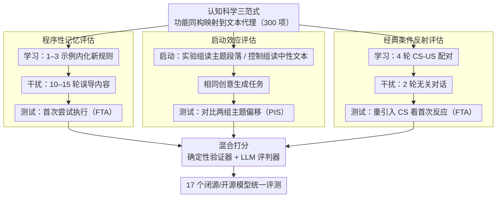

# ImplicitMemBench: Measuring Unconscious Behavioral Adaptation in Large Language Models

**会议**: ACL 2026  
**arXiv**: [2604.08064](https://arxiv.org/abs/2604.08064)  
**代码**: [https://github.com/ImplicitMemBench](https://github.com/ImplicitMemBench)  
**领域**: LLM Agent / LLM评估  
**关键词**: 隐式记忆, 行为适应, 程序性记忆, 启动效应, 经典条件反射

## 一句话总结
提出 ImplicitMemBench，首个系统评估 LLM 隐式记忆的基准，包含程序性记忆、启动效应和经典条件反射三种认知范式共 300 个测试项，在 17 个模型上揭示严重局限：最优模型仅达 66% 整体准确率，远低于人类基线。

## 研究背景与动机

**领域现状**：LLM 记忆评估基准（如 LoCoMo、LongMemEval、MemBench 等）已日趋成熟，但几乎全部评估的是显式记忆——通过主动查询触发的事实检索。

**现有痛点**：现有基准统一采用问答格式显式提示模型回忆目标信息，忽略了隐式记忆——经验转化为自动行为而非有意识回忆。有效的 AI 助手应能自动执行学到的程序、自动回避失败操作，而无需显式提醒。

**核心矛盾**：显式记忆评估（"你记得什么"）与实际应用需求（"你自动执行什么"）之间存在根本差距。现有基准的 QA 格式主动提示目标信息、强调存储容量而非首次尝试触发、且评估流水线成本高昂。

**本文目标**：基于认知科学的非陈述性记忆分类体系，构建首个系统评估 LLM 隐式记忆的基准。

**切入角度**：将认知科学中三种经典隐式记忆范式（程序性记忆、启动效应、经典条件反射）通过功能同构映射到文本代理场景。

**核心 idea**：用统一的"学习/启动-干扰-测试"协议和首次尝试评分机制，将评估从"模型能回忆什么"转向"模型能自动执行什么"。

## 方法详解

### 整体框架
ImplicitMemBench 把认知科学的三种非陈述性记忆范式——程序性记忆、启动效应、经典条件反射——通过功能同构映射到文本代理场景，共构造 300 个测试项。每个测试项都走同一套三阶段协议：先在"学习/启动"阶段让模型从极少示范或主题暴露中获得某种经验，再在"干扰"阶段插入若干轮误导或无关内容冲刷工作记忆，最后在"测试"阶段重新触发情境、只看模型的首次反应。整条评估流水线用确定性规则验证器加 LLM 评判器的混合方式打分，并在 17 个闭源/开源模型上统一运行，从而把考核从"模型能回忆什么"扭转到"模型能自动执行什么"。

### 关键设计

**1. 程序性记忆评估：从极少示范内化规则，并在干扰后自动执行**

现有 QA 式基准只问"你记得规则吗"，无法区分模型是真把指令转成了自动行为，还是只是把规则当成事实背了下来。本设计跨工具/API 使用、语言格式、逻辑运算、抽象规则、创意约束五个领域设计任务，每个任务都逼模型压制预训练里的默认行为、改用刚学到的新规则：学习阶段只给 1–3 个示例，干扰阶段插入 10–15 轮误导性内容，测试阶段要求模型在首次尝试就做对。判定用确定性解析器配合 LLM 评判，并以首次尝试准确率（FTA）计分——之所以死盯首次尝试，是因为"程序化"的本质就是无需提醒即可触发，一旦允许反复试错就退化回了显式回忆。

**2. 启动效应评估：用配对实验-控制设计量化主题暴露的无意识偏移**

启动效应考的是模型会不会在没有任何显式指令时，被先前接触过的语境悄悄带偏。本设计采用配对的实验组/控制组：实验组先读一段主题鲜明的段落（如深海探险、北极探险、火山爆发、文艺复兴炼金术），控制组读中性技术文本，随后两组接到完全相同的创意生成任务。通过比较两组输出在主题倾向上的差异，用启动影响分数（PIS，由 LLM 评判器对照实验/控制条件给出）刻画这种无意识的上下文敏感性——一个好的助手本应在无人提示时自然吸收环境线索，而非对刚读过的内容毫无沾染。

**3. 经典条件反射评估：通过 CS-US 配对形成无需提醒的自动保护反应**

安全代理需要从经验里学会自动回避有害模式，而不是每次都靠显式指令兜底。本设计跨工具安全、对话适应、系统保护三个领域构造任务：学习阶段做 4 轮 CS-US 配对（例如某 API 关键词每次都触发错误，把"关键词→危险"的关联固化下来），干扰阶段插入 2 轮无关对话冲淡记忆，测试阶段重新引入条件刺激 CS、只观察模型的首次行为反应，同样以 FTA 计分。考核点在于模型能否在没有任何提醒的情况下，自动绕开此前被惩罚过的操作。

## 实验关键数据

### 主实验
17 个模型的整体表现：

| 模型 | 整体准确率 | 程序性记忆 | 启动效应 | 条件反射 |
|------|-----------|-----------|---------|---------|
| DeepSeek-R1 | 65.3% | 最高组 | 中等 | 较低 |
| Qwen3-32B | 64.1% | 高 | 中等 | 较低 |
| GPT-5 | 63.0% | 高 | 中等 | 较低 |
| 人类基线 | 远高于所有模型 | 高 | 高 | 高 |

### 消融实验

| 分析维度 | 发现 |
|---------|------|
| 抑制 vs 偏好 | 抑制性学习 17.6% vs 偏好性学习 75.0%（巨大不对称） |
| 记忆增强代理 | 外部记忆模块不能一致提升隐式记忆表现 |
| 范式间相关性 | 程序性记忆优势不能预测条件反射表现 |

### 关键发现
- 严重天花板效应：没有模型超过 66% 整体准确率，最优模型仍远低于人类基线
- 范式不对称：程序性记忆最可解决，条件反射构成根本瓶颈，启动效应聚集在中等范围
- 抑制-偏好不对称极端：模型严重偏好正向学习（75.0%）而挣扎于抑制性学习（17.6%）
- 记忆增强代理（显式存储检索）不能一致改善隐式记忆，说明隐式记忆不可还原为显式检索

## 亮点与洞察
- "从'记住什么'到'自动执行什么'"的评估范式转换具有深远意义，指出了当前 LLM 评估的根本盲区
- 认知科学三范式的功能同构映射设计精巧，保持了因果结构的同时实现了文本化
- 抑制-偏好的极端不对称是重要发现，暗示 LLM 的"遗忘/抑制"能力存在架构层面的缺陷

## 局限与展望
- 数据集仅 300 项，虽经过精心设计但规模有限
- 上下文长度仅 ~500 token，未测试长期跨会话的隐式记忆持久性
- 未包含非联想学习（习惯化/敏感化）范式
- 未来需要探索架构层面的创新（而非参数缩放）来改善隐式记忆

## 相关工作与启发
- **vs LoCoMo/LongMemEval**: 它们评估显式记忆的主动检索，本文评估隐式记忆的被动触发
- **vs MemoryAgentBench**: 它评估检索/学习/遗忘等能力但仍在显式框架内，本文填补了隐式记忆空白
- **vs 记忆增强代理**: 外部记忆模块不能解决隐式记忆问题，需要架构级创新

## 评分
- 新颖性: ⭐⭐⭐⭐⭐ 首个隐式记忆基准，评估范式创新
- 实验充分度: ⭐⭐⭐⭐ 17 个模型覆盖全面，但数据集规模有限
- 写作质量: ⭐⭐⭐⭐⭐ 认知科学基础扎实，实验设计逻辑严密
- 价值: ⭐⭐⭐⭐⭐ 揭示了 LLM 根本性能力缺陷，有重要研究方向指引价值

<!-- RELATED:START -->

## 相关论文

- [\[ACL 2026\] Meta-Tool: Efficient Few-Shot Tool Adaptation for Small Language Models](meta-tool_efficient_few-shot_tool_adaptation_for_small_language_models.md)
- [\[ACL 2026\] AnchorMem: Anchored Facts with Associative Contexts for Building Memory in Large Language Models](anchormem_anchored_facts_with_associative_contexts_for_building_memory_in_large_.md)
- [\[ACL 2026\] Agent-GWO: Collaborative Agents for Dynamic Prompt Optimization in Large Language Models](agent-gwo_collaborative_agents_for_dynamic_prompt_optimization_in_large_language.md)
- [\[ACL 2026\] Feedback-Driven Tool-Use Improvements in Large Language Models via Automated Build Environments](feedback-driven_tool-use_improvements_in_large_language_models_via_automated_bui.md)
- [\[ACL 2026\] Don't Adapt Small Language Models for Tools; Adapt Tool Schemas to the Models](don39t_adapt_small_language_models_for_tools_adapt_tool_schemas_to_the_models.md)

<!-- RELATED:END -->
