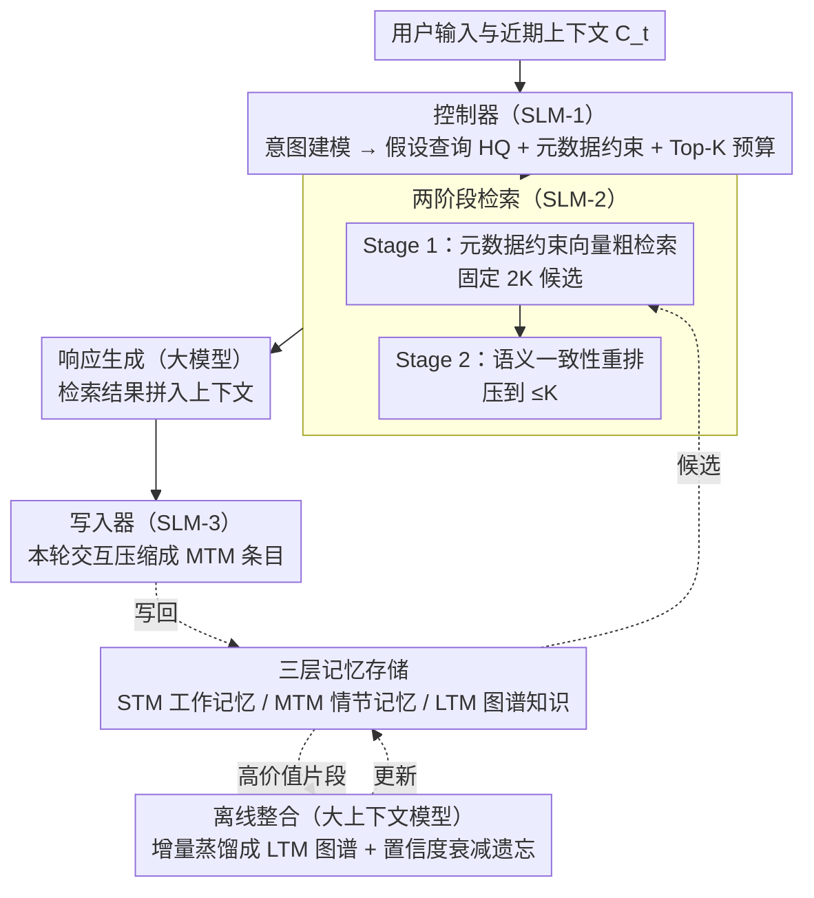

# Lightweight LLM Agent Memory with Small Language Models

**会议**: ACL 2026  
**arXiv**: [2604.07798](https://arxiv.org/abs/2604.07798)  
**代码**: 无  
**领域**: LLM 智能体 / 记忆系统  
**关键词**: 智能体记忆, 小语言模型, 轻量化检索, 在线-离线解耦, 长期对话

## 一句话总结

本文提出 LightMem，一种由多个专用小语言模型（SLM）驱动的轻量级 LLM 智能体记忆系统，通过将记忆操作模块化为控制器（SLM-1）、选择器（SLM-2）和写入器（SLM-3），并将在线处理与离线整合解耦，在 LoCoMo 基准上平均 F1 提升约 2.5（相比 A-MEM），同时实现 83ms 检索延迟和 581ms 端到端延迟。

## 研究背景与动机

**领域现状**：LLM 驱动的智能体在长期对话、多步推理和任务交互方面表现出色，但受限于上下文窗口，需要外部记忆来维持跨轮次一致性。现有记忆系统可分为两类：基于检索的外部记忆（如 MemoryBank、ReadAgent）效率高但检索噪声大、准确率不稳定；基于 LLM 驱动的记忆操作（如 A-MEM、HiAgent）准确率更高但反复调用大模型累积显著延迟。

**现有痛点**：(1) 基于检索的方法受限于查询构建和候选过滤的简单性，引入检索噪声导致回答准确率不稳定；(2) LLM 驱动的方法在长期交互中通过重复模型调用实现记忆操作，累积非平凡的运行时开销；(3) 现有系统缺乏在线/离线的明确解耦，导致效率和效果之间的 trade-off 难以优化。

**核心矛盾**：高频在线记忆操作需要低延迟和可控性，但提升记忆准确率通常需要更强的模型推理能力；将重型抽象和整合操作混入在线路径会严重拖慢响应速度。

**本文目标**：设计一个轻量级记忆系统，将高频在线记忆操作交给专用 SLM 处理，将重型抽象和整合延迟到离线处理，在有限计算预算下实现高效且准确的记忆调用。

**切入角度**：SLM 的最新进展使其能够可靠地处理结构化决策任务（如意图路由、查询构建、语义过滤），这些任务更强调可预测行为和低开销，而非最大化生成能力。

**核心 idea**：通过多个专用 SLM 协同分工处理在线记忆操作（查询解析、检索、写入），将重型整合交给离线大模型处理，在效率和效果之间取得最优平衡。

## 方法详解

### 整体框架

LightMem 把记忆操作拆成在线、离线两条路径，核心思路是"让合适规模的模型做合适的事"：高频、强调可预测行为的在线操作交给三个专用 SLM，低频、需要强推理的重型整合甩到离线给大模型。在线路径里，SLM-1（Controller）做意图建模与检索控制，把用户输入转成假设查询（HQ）并分配检索预算；SLM-2（Selector）执行两阶段检索，先向量粗检索再做语义一致性重排序；SLM-3（Writer）把交互压缩成紧凑的 MTM 条目并增量维护。离线路径则由大上下文模型把高价值 MTM 片段蒸馏成去标识化的长期语义知识（LTM），以图结构知识库存储，从而在不拖慢响应的前提下持续沉淀长期记忆。

### 关键设计

**1. 三层记忆存储（STM/MTM/LTM）：按时间尺度分层，从即时上下文一路覆盖到长期知识**

不同时间尺度的信息需要不同的存储与检索策略，混在一起既难隔离用户又难做隐私控制。LightMem 据此分三层：STM 是 SLM 上下文窗口里的工作记忆，逐轮更新但不持久化、也不被检索；MTM 是个性化情节记忆的唯一载体，每个条目存语义摘要、时间信息与访问统计、检索用嵌入向量和用户标识符，并设容量上限 $|M_u^{\text{MTM}}| \leq B$（$B=10^4$），由写入器（Writer, SLM-3）在每轮交互后把对话压缩成紧凑条目增量维护、超限时驱逐陈旧或低价值条目；LTM 存的是从 MTM 高价值片段离线蒸馏出的去标识化语义知识，用轻量图结构组织以支持多跳推理和跨用户共享。MTM 里的用户标识符还顺带实现了用户级逻辑隔离，在隐私、一致性和可扩展性之间取平衡。

**2. 控制器（Controller, SLM-1）：把原始输入翻译成一份结构化检索计划**

纯检索方法查询构建简单、候选过滤粗糙，是检索噪声的源头。控制器不亲自检索，而是充当“检索控制器”：先推断粗粒度意图（这一问更依赖近期情节细节还是长期稳定知识、是否需要强个性化），据此把原始输入改写成一组假设查询（hypothetical queries, HQ）$\{q_t^{(i)}\}$ 以提升召回覆盖，并生成元数据约束 $\phi_t$（用户标识符、可选时间窗、类型标签）和固定的 Top-K 预算，最终发出检索请求 $\mathcal{Q}_t = \langle \{q_t^{(i)}\},\ \phi_t,\ K \rangle$ 交给下游。把“查什么、怎么约束、返回多少”显式规划出来，既靠元数据约束和用户隔离降噪、靠多 HQ 保召回，又因为全程只用 1B 级 SLM 而行为可预测、开销低。

**3. 两阶段检索（Two-Stage Retrieval, SLM-2）：粗召回保覆盖、SLM 重排保精度**

纯向量检索抓不住细粒度的语义一致性，而让 SLM 直接对全库检索又算不起，两阶段设计正是为了同时绕开这两头。Stage 1 在控制器给出的元数据约束下做向量粗检索，为每个假设查询返回候选、总预算 $2K$（每个 HQ 分到 $2K/n$）；Stage 2 由选择器（Selector, SLM-2）对 $|C|=2K$ 个候选做语义一致性检查与相关性判断，压缩成最终 $|R_t| \leq K$ 个结果拼进上下文辅助生成。这个二比一的压缩一举拿下三件事：固定候选规模带来稳定计算、超越向量相似度的语义精炼、以及显式丢掉约一半候选的噪声抑制——用高效检索保覆盖、用 SLM 验证保精度。

**4. 离线整合（Offline Consolidation）：把高价值片段增量蒸馏成长期语义知识**

抽象与整合是重型操作，一旦混进在线路径就会直接拖慢检索和写入延迟，所以必须严格解耦到离线。大上下文 LLM 在离线只处理增量批次（新写入或被重新激活的 MTM 条目），把片段抽象成隐私保护的知识候选，再通过相似度搜索定位 LTM 中最近的语义锚点、在局部邻域内增量插入与链接；对弱支撑的候选施加置信度衰减，实现自然遗忘。整套流程是增量处理而非从头重建，既保持计算效率，又让 LTM 随交互持续演化。

### 一个完整示例
一次用户提问进来后：SLM-1 先把它解析成假设查询 HQ 并分配检索预算；SLM-2 在 Stage 1 用向量粗检索从 MTM 拉回 $2K$ 个候选，Stage 2 再做语义一致性筛选压到 $\leq K$ 个真正相关的记忆喂给响应模型；交互结束后 SLM-3 把这一轮压缩成紧凑 MTM 条目写回。这些在线步骤全程只用 1B 级 SLM、约 1K tokens 上下文即可完成；与此并行，离线路径择机把高价值 MTM 片段蒸馏进 LTM 图谱，整个重型整合不占用任何在线延迟。

### 损失函数 / 训练策略

SLM-2 用 LoRA 在 2000 个构建的 (Query, Subgraph, Path) 样本上微调。其余 SLM 用量化部署的 Llama-3.2-1B-Instruct（默认）或 Qwen2.5-1.5B-Instruct。MTM 容量上限 $B=10^4$，超限时靠驱逐陈旧/低价值条目和压缩冗余内容维护。离线整合由大上下文 LLM 处理，与在线路径完全解耦。

## 实验关键数据

### 主实验

**LoCoMo 基准关键结果（GPT-4o-mini 作为响应生成器）**

| 方法 | Single-hop F1 | Multi-hop F1 | Temporal F1 | Open-domain F1 | Adversarial F1 | Token Length |
|------|--------------|-------------|------------|---------------|---------------|-------------|
| LoCoMo | 40.36 | 25.02 | 18.41 | 12.04 | 69.23 | 16,910 |
| MemGPT | 41.04 | 26.65 | 25.52 | 9.15 | 43.29 | 16,977 |
| A-MEM | 44.65 | 27.02 | 45.85 | 12.14 | 50.03 | 2,520 |
| LightMem | **45.81** | **28.85** | **46.28** | **13.52** | **54.57** | 1,150 |

**DialSim 基准结果（GPT-4o-mini）**

| 方法 | F1 | BLEU-1 | ROUGE-L | METEOR | SBERT |
|------|-----|--------|---------|--------|-------|
| LoCoMo | 2.55 | 3.13 | 2.75 | 1.64 | 15.76 |
| A-MEM | 3.45 | 3.37 | 3.54 | 2.05 | 19.51 |
| LightMem | **4.12** | **3.95** | **4.20** | **2.48** | **23.40** |

### 消融实验

**DialSim 消融（Llama-3.2-1B）**

| 配置 | F1 | SBERT |
|------|-----|-------|
| LightMem (完整) | 4.12 | 23.40 |
| w/o 语义重排序 | 3.83 | 22.82 |
| w/o HQ 和检索路由 | 3.87 | - |
| w/o MTM | 3.75 | - |
| w/o 离线整合 | 3.96 | - |
| w/o 图结构 | - | 22.82 |

**延迟分析（GPT-4o-mini）**

| 方法 | 检索延迟 P50 (ms) | 检索延迟 P95 (ms) | 端到端 P50 (ms) | 端到端 P95 (ms) |
|------|------------------|------------------|----------------|----------------|
| A-MEM | 856 | 1583 | 914 | 3682 |
| MemGPT | 143 | 451 | 2087 | 3451 |
| LightMem | **83** | **167** | **581** | **1325** |

### 关键发现

- LightMem 在所有模型规模上（从 GPT-4o 到 Llama-3.2-1B）均一致优于基线，证明其增益不依赖于特定骨干模型
- 相比 A-MEM，LightMem 的检索延迟降低 10 倍（856ms → 83ms P50），端到端延迟降低约 36%
- LightMem 使用仅约 1K tokens 的有效上下文就超越了使用 16K+ tokens 的全上下文方法，显著降低推理成本
- MTM 增长到 10,000 条时，LightMem 因 Stage 2 语义过滤保持稳定性能，而纯向量检索的 F1 从 3.95 降至 3.83
- 错误注入压力测试显示，SLM-2 语义重排序是最关键的组件，移除导致最大性能下降

## 亮点与洞察

- "让合适规模的模型做合适的事"这一思想在记忆系统中得到很好的体现——SLM 处理高频结构化任务，大模型处理低频重型任务
- 两阶段检索的 2:1 压缩策略简洁有效，用固定候选大小保证计算稳定性，同时通过语义验证抑制检索噪声
- LTM 的图结构设计支持多跳推理和跨用户知识共享，同时通过去标识化保护隐私

## 局限与展望

- SLM-2 需要在构建的数据上微调，对新领域的泛化能力需要进一步验证
- 离线整合依赖大上下文 LLM，在完全边缘部署场景中可能不可行
- LTM 的图结构维护和自然遗忘机制的具体效果缺乏详细分析
- 仅在两个对话基准上评估，对更复杂的智能体任务（如工具使用、多步规划）的适用性有待验证

## 相关工作与启发

- **vs A-MEM**: A-MEM 通过 LLM 驱动的笔记和自动链接构建自组织记忆网络，但未强调在线/离线解耦；LightMem 用 SLM 替代在线 LLM 调用，延迟降低 10 倍
- **vs MemGPT**: MemGPT 将上下文窗口视为虚拟内存进行分页，但依赖长上下文重放（~16K tokens）；LightMem 仅用 ~1K tokens 达到更好性能
- **vs MemoryBank/ReadAgent**: 这些纯检索方法在所有类别上均显著弱于 LightMem，尤其在多跳和时间推理任务上

## 评分

- 新颖性: ⭐⭐⭐⭐ SLM 驱动的模块化记忆系统和在线/离线解耦是有意义的架构创新
- 实验充分度: ⭐⭐⭐⭐⭐ 6 种骨干模型、5 种基线、详细消融、延迟分析、压力测试，非常全面
- 写作质量: ⭐⭐⭐⭐ 结构清晰，技术细节充分，但部分符号定义较分散
- 价值: ⭐⭐⭐⭐ 为长期对话智能体提供了实用且高效的记忆解决方案，SLM 驱动的思路有广泛应用价值

<!-- RELATED:START -->

## 相关论文

- [\[ACL 2026\] Don't Adapt Small Language Models for Tools; Adapt Tool Schemas to the Models](don39t_adapt_small_language_models_for_tools_adapt_tool_schemas_to_the_models.md)
- [\[ACL 2026\] CLAG: Adaptive Memory Organization via Agent-Driven Clustering for Small Language Model Agents](clag_adaptive_memory_organization_via_agent-driven_clustering_for_small_language.md)
- [\[ACL 2026\] Polaris: A Gödel Agent Framework for Small Language Models through Experience-Abstracted Policy Repair](polaris_a_gödel_agent_framework_for_small_language_models_through_experience-abs.md)
- [\[ACL 2026\] Meta-Tool: Efficient Few-Shot Tool Adaptation for Small Language Models](meta-tool_efficient_few-shot_tool_adaptation_for_small_language_models.md)
- [\[ACL 2026\] AnchorMem: Anchored Facts with Associative Contexts for Building Memory in Large Language Models](anchormem_anchored_facts_with_associative_contexts_for_building_memory_in_large_.md)

<!-- RELATED:END -->
