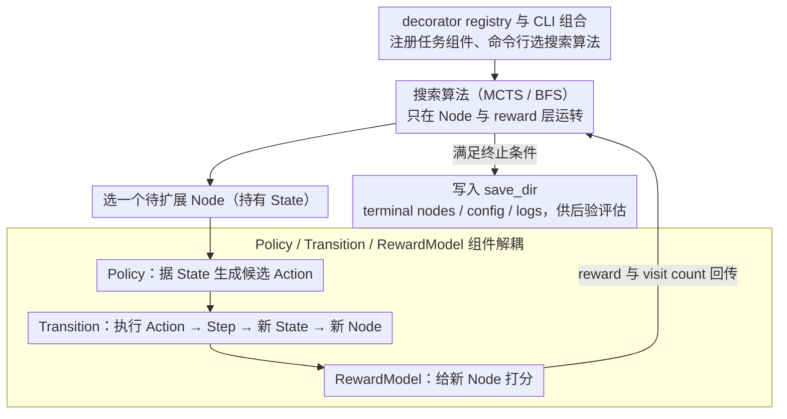

# LiTS: A Modular Framework for LLM Tree Search

**会议**: ACL 2026  
**arXiv**: [2603.00631](https://arxiv.org/abs/2603.00631)  
**代码**: https://github.com/xinzhel/lits-llm  
**领域**: LLM Agent / Tree Search / 推理框架  
**关键词**: LLM Tree Search, MCTS, BFS, Agent Framework, Tool Use

## 一句话总结
LiTS 把 LLM tree search 拆成 Policy、Transition、RewardModel 和统一数据结构，用 decorator registry 让同一套搜索算法、组件和任务逻辑可以在数学推理、环境规划和工具调用之间组合复用，并通过实验指出开放文本动作空间中的 policy diversity 是树搜索瓶颈。

## 研究背景与动机
**领域现状**：Tree-of-Thoughts、RAP、ReST-MCTS 和 LATS 等方法把 LLM 推理看作搜索问题，通过 MCTS、BFS 或类似规划算法探索多条 reasoning trajectories。这类方法在复杂数学、规划和工具调用中很有吸引力。

**现有痛点**：已有实现往往与具体任务深度耦合。换一个任务需要重写状态结构、动作生成、环境转移、奖励模型和评估逻辑；比较不同搜索算法时，也很难保证 domain components 完全一致。结果是算法研究者和领域专家都要做很多重复工程。

**核心矛盾**：tree search 需要统一的搜索接口，但 LLM 任务的状态、动作、工具、环境和 reward 形态非常不同。框架既要足够抽象，支持 MCTS/BFS 等通用算法，又要足够灵活，让用户注入 domain-specific prompts、tools 和 transitions。

**本文目标**：作者希望提出一个模块化 Python 框架，让领域专家只改任务逻辑，算法研究者只改搜索算法，并让组件、算法和任务类型能够正交组合。

**切入角度**：LiTS 把 LLM reasoning agent 拆成三类组件：Policy 生成 action，Transition 执行动作并更新 state，RewardModel 给搜索提供价值信号。所有组件都通过 Action、Step、State、Node 等通用结构通信，再通过 registry 和 CLI 组合。

**核心 idea**：把 LLM tree search 从“每篇论文一套 monolithic implementation”变成“可注册、可替换、可复用的组件语法”。

## 方法详解
LiTS 不是单个算法，而是一个框架。它的关键是定义一套统一 grammar，让不同任务类型都能被 tree search agent 操作：language-grounded 推理中 action 是文本 thought，tool-use 中 action 是结构化 tool call，environment-grounded 中 action 是环境命令，但它们都实现同一套接口。

### 整体框架
架构从下到上分为 data structures、components、prompts、agents 和 run artifacts。data structures 定义 Action、Step、State、Node；components 定义 Policy、Transition、RewardModel；PromptRegistry 支持 explicit parameter、task name、task type、default 的 fallback；agents 包括 chain agents 和 tree search agents；运行时所有 config、checkpoints、terminal nodes、logs 都写到同一 save_dir，支持后验评估。

框架覆盖三类任务：Environment Grounded，例如 BlocksWorld 和 Crosswords；Language Grounded，例如 MATH500；Tool Use，例如 MapEval-SQL。用户通过 `@register_transition`、`@register_dataset`、`@register_policy`、`@register_search`、`@register_resource` 等 decorator 扩展框架。

### 关键设计

**1. 统一数据结构 Action → Step → State → Node：让搜索算法只碰统一节点，不碰任务细节**

如果搜索循环直接依赖具体任务对象，就没法跨任务复用。LiTS 用四层结构把搜索语义和任务语义隔开：Action 是 Policy 产出的原子动作，Step 把动作连同执行结果一起封装，State 累积一串 Steps 并提供 render 方法，Node 则挂上 parent、children、reward、visit count 这些搜索字段。不同任务只去实现对应的 subclass——数学推理用 ThoughtStep、子问题分解用 SubQAStep、工具调用用 ToolUseAction、环境交互用 EnvAction——而 MCTS、BFS 这些算法始终只在 Node 和轨迹接口上工作，完全不知道底下是 SQL 还是 BlocksWorld。

**2. Policy / Transition / RewardModel 组件解耦：把候选生成、状态转移、路径打分拆成三块可换的模块**

把一个 LLM reasoning agent 里“生成动作、执行动作、给动作打分”三件事捆死在一起，就很难单独替换其中一项。LiTS 把它们拆成三类组件：Policy 根据当前 state 生成候选 actions，Transition 执行动作并返回新 state，RewardModel 给节点或动作提供价值信号。Chain 类方法只需要 Policy + Transition，Tree 类方法再额外接上 RewardModel。这样同一套任务组件能在 MCTS 和 BFS 之间复用，同一个搜索算法也能换到新任务组件上测泛化——后面 ToT-BFS 和 ReST-MCTS 能共用完全相同的 ConcatPolicy、ConcatTransition、GenerativePRM、只换搜索算法，正是靠这层解耦。

**3. decorator registry 与 CLI-first 组合：让扩展新任务不用动核心包**

抽象优雅还不够，框架好不好用还取决于用户接入新东西要写多少代码。LiTS 用一套 decorator 把扩展路径压到最短：加一个 Crosswords 任务，只需 `@register_transition`、prompt 和 `@register_dataset`，命令行里 `--dataset crosswords` 就能跑；MapEval-SQL 通过 dataset 和 resource registry 返回 tools 与 tool_context；想换搜索算法，`@register_search("bfs")` 注入一个自定义 BFS 即可。核心包一行不用改，domain experts 的学习成本就被压了下来。

### 一个完整示例：BlocksWorld 上跑一轮 MCTS

以 BlocksWorld 规划任务为例，可以看清这套 grammar 怎么串起来。用户先注册好这个任务的 Policy（根据当前积木摆放生成候选移动动作）、Transition（执行一个移动、更新积木状态）和 RewardModel（判断离目标布局还差多少），命令行指定 MCTS、10 iterations、branching factor 3、max depth 6。

搜索开始后，根 Node 持有初始 State；每轮迭代里，MCTS 选一个待扩展节点，调 Policy 生成最多 3 个候选 Action，每个 Action 经 Transition 变成一个 Step、拼进新的 State、挂成一个子 Node，再由 RewardModel 打分回传、更新 visit count 和 value。算法自始至终只在 Node/reward 层操作，完全不知道底下动作是“把 block A 放到 block B 上”。跑完 10 轮，terminal nodes、config、logs 全写进同一个 save_dir 供事后评估。正是这条链路让 BlocksWorld 的 MCTS 把准确率从 Chain 的 26.7% 抬到 66.7%。

### 损失函数 / 训练策略
LiTS 本身不训练模型，也没有统一损失函数。实验中的“训练策略”主要是搜索配置和推理资源设置：environment-grounded 和 tool-use 实验使用 Claude 3.5 Sonnet via AWS Bedrock，并报告 cost；language-grounded MATH500 使用自部署 Llama3-8B 或 Llama3-8B-Instruct，并报告 wall-clock time。BlocksWorld MCTS 使用 10 iterations、branching factor 3、max depth 6；Crosswords MCTS 使用 30 iterations、max depth 10；MATH500 上所有 tree search 方法使用 10 iterations、branching factor 3、temperature 0.7-0.8。

## 实验关键数据

### 主实验
论文的实验目标不是刷新 SOTA，而是验证组件可复用。环境规划、工具调用和数学推理三类实验分别展示不同扩展路径。

| 任务 | 方法 | Out Tok | Cost / Time | 调用数 | Acc |
|------|------|---------|-------------|--------|-----|
| BlocksWorld (30 ex.) | Chain | 17K | $1.48 | 未报告 | 26.7% |
| BlocksWorld (30 ex.) | MCTS | 488K | $21.99 | 未报告 | 66.7% |
| Crosswords (30 ex.) | Chain | 2.5K | $0.28 | 未报告 | 6.67% / 10.33% |
| Crosswords (30 ex.) | MCTS | 14K | $2.42 | 未报告 | 0% / 22.67% |
| MapEval-SQL (10 ex.) | ReAct | 10.6K | $0.57 | 62 | 40% |
| MATH500 (100 ex.) | CoT | 12.9K | 0.6h | 100 | 17% |
| MATH500 (100 ex.) | RAP (MCTS) | 4.47M | 8.0h | 3.6K | 18% |
| MATH500 (100 ex.) | ReST (MCTS) | 2.24M | 26.0h | 4.0K | 37% |
| MATH500 (100 ex.) | ToT (BFS) | 1.53M | 14.7h | 2.8K | 39% |

### 消融实验
论文没有传统 ablation，而是给出了一个很重要的 failure analysis：在 Crosswords 这种开放动作空间里，temperature escalation 不能解决动作重复，说明 policy diversity 而非 reward quality 是树搜索瓶颈。

| Crosswords action diversity 指标 | 数值 |
|----------------------------------|------|
| Unique states visited | 16 |
| Avg. policy calls per state | 7.9 |
| Duplicate rate (all) | 81.1% |
| Duplicate rate (incorrect) | 81.0% |
| Correct outputs | 17.3% |

### 关键发现
- BlocksWorld 中 MCTS 从 Chain 的 26.7% 提升到 66.7%，说明在有限动作空间和可靠环境转移下，tree search 能明显受益。
- Crosswords 中 MCTS 的 exact match 为 0%，但 partial match 为 22.67%，且 duplicate rate 高达 81.1%；即使有 oracle reward，搜索也因为 action diversity 不足而失败。
- MapEval-SQL 上 ReAct 10 个样本达到 40%；作者尝试 3 个样本的 MCTS，花费 $18.40，总计约 $6.13/example，而 ReAct 约 $0.05/example，MCTS 准确率为 0%，主要瓶颈是 LLM-as-judge reward model 的 self-preference bias。
- MATH500 上 ToT-BFS 与 ReST-MCTS 使用相同 ConcatPolicy、ConcatTransition、GenerativePRM，BFS 以 39% 略高于 MCTS 的 37%，且 wall-clock time 约为 14.7h vs. 26.0h。
- RAP 使用 user-registered components，但在 MATH500 上只有 18%，说明组件 formulation 可能比搜索算法本身更重要。

## 亮点与洞察
- LiTS 的核心贡献是工程抽象，而不是单点算法。它把 tree search 的可复用边界划得比较清楚：算法关心 Node 和 reward，任务逻辑关心 Action/Step/State，工具调用关心 BaseTool 和 resource registry。
- 框架把“公平比较算法”变得更容易。例如 ReST-MCTS 和 ToT-BFS 可以共享完全相同的内置组件，只改变 search algorithm，这比各自独立代码库的比较更可信。
- mode collapse 发现很有启发：开放文本动作空间里，LLM sampling 的随机性发生在 token level，而不是 action semantic level，所以提高 temperature 仍可能产生语义重复动作。
- 对 tool-use agent 来说，reward model 质量是实际瓶颈。MapEval-SQL 的 MCTS 失败表明，如果 LLM-as-judge 偏好冗长但错误的 SQL，树搜索会把更多预算花在错误方向上。

## 局限与展望
- 实验主要是 demonstration-focused，样本规模较小：MATH500 只取 100 个数值答案样本，BlocksWorld/Crosswords 各 30 个，MapEval-SQL 10 个。
- Crosswords mode-collapse 只在单个开放动作环境中展示，需要在更多开放文本任务和不同 decoding 策略下系统验证。
- tool-use tree search 受 LLM-as-judge reward 偏差影响，未来需要校准 verifier、训练 PRM 或任务特定 reward。
- 当前内置搜索算法主要是 MCTS 和 BFS，A*、beam search variants 等仍是未来扩展方向。
- throughput 仍是工程挑战，规模化 tree search 需要并发和批量 LLM 调用。
- 当前 BaseTool 要求用户写 Python class 并注册 resource，作者计划引入 MCP，让外部工具服务器能通过标准 JSON-RPC 接入。

## 相关工作与启发
- **vs LLM Reasoners**: LLM Reasoners 也支持 tree search，但任务逻辑更容易和配置类耦合；LiTS 强调组件共享和 registry 扩展。
- **vs LangGraph**: LangGraph 适合 agent graph 编排，但没有原生 tree search 算法；LiTS 提供预实现 MCTS/BFS，并让组件跨任务复用。
- **vs Tree-of-Thoughts / RAP / ReST-MCTS**: 这些是具体推理方法，LiTS 更像统一实验平台，可以把它们的结构拆成注册组件后复用。
- **对后续工作的启发**: 做新 tree search 算法时，应同时报告组件 formulation 和 reward quality；算法本身不是唯一变量，Policy 的 action diversity 可能决定上限。

## 评分
- 新颖性: ⭐⭐⭐⭐ 框架抽象不算全新概念，但组件边界和 registry 设计实用。
- 实验充分度: ⭐⭐⭐ 展示覆盖三类任务，但样本规模和 SOTA 对比有限。
- 写作质量: ⭐⭐⭐⭐ 架构、扩展示例和失败分析都写得清楚。
- 价值: ⭐⭐⭐⭐ 对 LLM agent/tree search 研究者和工具开发者都有直接工程价值。

<!-- RELATED:START -->

## 相关论文

- [\[ICLR 2026\] ToolTree: Efficient LLM Agent Tool Planning via Dual-Feedback Monte Carlo Tree Search and Bidirectional Pruning](../../ICLR2026/llm_agent/tooltree_efficient_llm_agent_tool_planning_via_dual-feedback_monte_carlo_tree_se.md)
- [\[ICLR 2026\] WebOperator: Action-Aware Tree Search for Autonomous Agents in Web Environment](../../ICLR2026/llm_agent/weboperator_action-aware_tree_search_for_autonomous_agents_in_web_environment.md)
- [\[ICML 2025\] KBQA-o1: Agentic Knowledge Base Question Answering with Monte Carlo Tree Search](../../ICML2025/llm_agent/kbqa-o1_agentic_knowledge_base_question_answering_with_monte_carlo_tree_search.md)
- [\[ACL 2026\] HAG: Hierarchical Demographic Tree-based Agent Generation for Topic-Adaptive Simulation](hag_hierarchical_demographic_tree-based_agent_generation_for_topic-adaptive_simu.md)
- [\[ACL 2025\] MEDDxAgent: A Unified Modular Agent Framework for Explainable Automatic Differential Diagnosis](../../ACL2025/llm_agent/meddxagent_a_unified_modular_agent_framework_for_explainable_automatic_different.md)

<!-- RELATED:END -->
