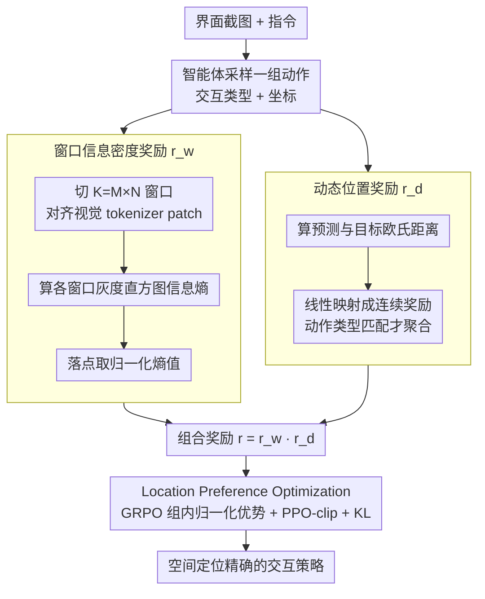

# LPO: Towards Accurate GUI Agent Interaction via Location Preference Optimization

**会议**: ACL 2026  
**arXiv**: [2506.09373](https://arxiv.org/abs/2506.09373)  
**代码**: [GitHub](https://github.com/jqtangust/LPO)  
**领域**: GUI智能体  
**关键词**: GUI交互, 位置偏好优化, 强化学习, 信息熵, GRPO

## 一句话总结

本文提出 Location Preference Optimization (LPO)，通过基于信息熵的窗口奖励和基于物理距离的动态位置奖励，结合 GRPO 框架优化 GUI 智能体的空间定位精度，在离线和在线评估中均达到 SOTA。

## 研究背景与动机

**领域现状**：自主 GUI 智能体通过自然语言作为中介，自动化图形用户界面操作，正成为 AI 应用的重要方向。大多数 GUI 智能体依赖监督微调（SFT）训练，在交互行为预测上取得了初步成功。

**现有痛点**：SFT 方法在**空间定位**方面面临严峻挑战，因为其感知和解释位置数据的能力有限。虽然一些方法尝试用强化学习（RL）增强 UI 动作决策的准确性，但现有 RL 策略缺乏**精确评估交互位置准确性**的机制：UI-TARS 使用文本级精确匹配；UI-R1 和 InfiGUI-R1 使用边界框 IoU 判断；GUI-R1 依赖固定位置边界。这些方法只能提供粗粒度的空间评价。

**核心矛盾**：GUI 交互的核心在于精确的坐标定位，但现有奖励函数无法捕捉位置的**连续距离关系**——离目标近但在边界框外的预测和远离目标的预测获得同样的零奖励。

**本文目标**：设计一种位置感知的偏好优化方法，让 GUI 智能体获得更精确的空间交互能力。**切入角度**：利用信息熵指导区域探索方向，用物理距离构建连续奖励信号。**核心 idea**：用户倾向于在信息密度高的区域交互，距离越近的预测应获得越高的奖励。

## 方法详解

### 整体框架

LPO 针对的是 SFT 训练出来的 GUI 智能体「点不准」的问题：现有 RL 奖励要么靠文本精确匹配、要么靠边界框 IoU，都只能给出离散的粗粒度反馈，落点差一像素和差很远拿到的都是零分。LPO 把 GUI 交互建模成 MDP，状态 $s_t \in \mathbb{R}^{C \times H \times W}$ 是界面截图，动作 $a_t = (\mathcal{A}_t \times \mathcal{E}_t)$ 同时包含交互类型与坐标；智能体对每个状态采样一组动作后，用「窗口信息密度奖励 $r_w$ 看对区域」乘上「动态位置奖励 $r_d$ 点准位置」得到组合奖励，再喂给 GRPO 在大动作空间里做组内相对优化，最终输出空间定位更精确的交互策略。

### 关键设计

**1. 窗口信息密度奖励 $r_w$：用信息熵把智能体的注意力引向功能区域**

GUI 上的可交互元素（按钮、输入框、文本）几乎都聚集在像素变化剧烈、信息密度高的地方，空白背景则基本没有可点目标。LPO 据此把截图切成 $K = M \times N$ 个窗口，对每个窗口计算灰度直方图的信息熵 $\mathcal{H}_{i,j} = -\sum_{b=1}^{B} p_b(\mathbf{W}_{i,j}) \log_2 p_b(\mathbf{W}_{i,j})$，再把预测坐标落到所属窗口，取归一化熵值 $r_w = \mathcal{H}_{i^*,j^*} / (\max_{i,j} \mathcal{H}_{i,j} + \epsilon)$ 作为奖励。窗口的划分刻意与视觉 tokenizer 的 patch 方案对齐，使奖励粒度和模型的感知粒度一致，从而稳定地把策略推向「该有东西可点」的区域。

**2. 动态位置奖励 $r_d$：用连续物理距离取代离散边界判断**

边界框 IoU 这类奖励的根本缺陷是不可微的阶跃——框内得分、框外归零，无法表达「差一点」和「差很多」的区别。LPO 改成直接度量预测坐标 $(x^{*k}, y^{*k})$ 与目标 $(x^k, y^k)$ 的欧氏距离，并线性映射成奖励 $r_k = \max(0, 1 - \frac{\sqrt{(x^k - x^{*k})^2 + (y^k - y^{*k})^2}}{d_{\max}})$，且只在动作类型也匹配时才聚合 $r_d = \frac{1}{K}\sum_{k=1}^{K} r_k$。这样离目标越近奖励越高，给优化器提供了一条平滑的梯度，让策略能持续地把落点往真值收。

**3. Location Preference Optimization：把位置奖励接进 GRPO 做组内偏好优化**

有了连续奖励信号，LPO 用 GRPO 框架完成策略更新：对每个状态采样一组动作 $\{a_g\}_{g=1}^{G}$，把两路奖励相乘得到 $r^{(g)} = r_w^{(g)} \cdot r_d^{(g)}$，在组内归一化得到相对优势 $A^{(g)}$，最后以 PPO-clip 目标加 KL 正则更新。相乘的组合让智能体必须同时「看对区域」又「点准位置」才能拿高分，而 GRPO 的组内相对比较天然适合 GUI 这种动作空间大、奖励稀疏的场景，能在广泛探索中区分不同落点的优劣。

### 损失函数 / 训练策略

SFT 阶段使用多个内部数据集训练基础交互能力。RL 阶段使用 MMind2Web、AITZ、OmniAct 等数据集的偏好数据。学习率 $1 \times 10^{-6}$，下裁剪范围 $\epsilon_1 = 0.2$，上裁剪范围 $\epsilon_2 = 0.28$，KL 系数 $\beta = 1 \times 10^{-4}$。基座模型为 Ovis2 8B。训练约 300 H100 GPU 小时。

## 实验关键数据

### 主实验

| 基准 | 指标 | LPO | GUI-R1 | InfiGUI-R1 | UI-R1 | Base SFT |
|------|------|-----|--------|------------|-------|----------|
| Mind2Web Cross-Task | Step SR | **49.5** | 46.6 | 35.8 | 24.9 | 38.2 |
| Mind2Web Cross-Task | Ele.Acc | **64.3** | 62.5 | 62.6 | 59.5 | 60.3 |
| VisualWebBench | Average | **79.5** | 78.8 | 78.5 | 78.7 | 78.7 |
| ScreenSpot V2 | Average | **90.5** | 88.7 | 89.5 | 88.2 | 89.5 |
| WebVoyager | Overall | **57.6** | 37.5 | 54.1 | 47.3 | 48.0 |

### 消融实验

| 配置 | Step SR (Cross-Task) | Ele.Acc | 说明 |
|------|---------------------|---------|------|
| LPO (Full) | **49.5** | **64.3** | 完整模型 |
| w/o $r_d$ | 42.3 | 56.7 | 去掉动态位置奖励，元素精度大幅下降 |
| w/o $r_w$ | 46.4 | 62.7 | 去掉窗口信息密度奖励，整体精度下降 |

### 关键发现
- LPO 在离线基准（Mind2Web、VisualWebBench、ScreenSpot V2）和在线评估（WebVoyager）上均达到 SOTA
- 动态位置奖励 $r_d$ 对元素定位精度（Ele.Acc）影响最大，去掉后下降 7.6%
- 窗口信息密度奖励 $r_w$ 对决策准确性更重要，去掉后 Step SR 下降 3.1%
- 现有基线方法（UI-R1、GUI-R1）在某些网站上有局部优势，但整体一致性远不如 LPO

## 亮点与洞察
- 信息熵驱动的窗口奖励是一个简单但有效的先验——功能区域确实信息密度更高，可迁移到其他视觉交互任务
- 连续距离奖励替代离散边界框判断是自然且优雅的改进，消除了人为阈值的影响
- 两种奖励相乘的组合方式使得智能体同时优化"看对区域"和"点准位置"，兼顾宏观和微观
- 基于 GRPO 的探索机制适合 GUI 这种大空间、稀疏奖励的场景
- 在线评估（WebVoyager）的验证增强了方法的实际应用说服力

## 局限与展望
- 高度依赖带精确标注的大规模 grounding 数据集，数据收集和标注成本高，限制了实际推广
- 训练需要约 300 GPU 小时计算资源，限制了实时应用和小团队使用
- 窗口划分依赖于视觉 tokenizer 的 patch 方案，对不同基座模型的泛化性有待验证
- 信息熵奖励对某些特殊界面（如全白背景上的少量高对比元素）可能不够鲁棒
- 未来可探索无需 ground-truth 坐标的自监督位置奖励，以及与多步规划的联合优化

## 相关工作与启发
- **vs UI-TARS**: UI-TARS 使用 DPO 需手工构造正负样本对，LPO 基于 GRPO 自动探索，减少人工依赖
- **vs GUI-R1**: GUI-R1 使用固定位置边界作为奖励，LPO 的连续距离奖励更精确
- **vs InfiGUI-R1**: InfiGUI-R1 使用边界框 IoU，LPO 直接使用坐标距离，粒度更细

## 评分
- 新颖性: ⭐⭐⭐⭐ 信息熵窗口奖励和动态距离奖励是对 GUI RL 奖励设计的有意义创新
- 实验充分度: ⭐⭐⭐⭐⭐ 覆盖 3 个离线基准 + 1 个在线基准，公平对比 4 种 RL 基线，消融清晰
- 写作质量: ⭐⭐⭐⭐ 动机图（Figure 1）直观展示了现有方法的局限，方法推导清晰
- 价值: ⭐⭐⭐⭐ 为 GUI 智能体的精确交互提供了实用有效的 RL 训练策略

<!-- RELATED:START -->

## 相关论文

- [\[AAAI 2026\] DEPO: Dual-Efficiency Preference Optimization for LLM Agents](../../AAAI2026/llm_agent/depo_dual-efficiency_preference_optimization_for_llm_agents.md)
- [\[AAAI 2026\] ProBench: Benchmarking GUI Agents with Accurate Process Information](../../AAAI2026/llm_agent/probench_benchmarking_gui_agents_with_accurate_process_infor.md)
- [\[ICML 2026\] Video2GUI: Synthesizing Large-Scale Interaction Trajectories for Generalized GUI Agent Pretraining](../../ICML2026/llm_agent/video2gui_synthesizing_large-scale_interaction_trajectories_for_generalized_gui_.md)
- [\[ACL 2026\] BAPO: Boundary-Aware Policy Optimization for Reliable Agentic Search](bapo_boundary-aware_policy_optimization_for_reliable_agentic_search.md)
- [\[ACL 2026\] Agent-GWO: Collaborative Agents for Dynamic Prompt Optimization in Large Language Models](agent-gwo_collaborative_agents_for_dynamic_prompt_optimization_in_large_language.md)

<!-- RELATED:END -->
