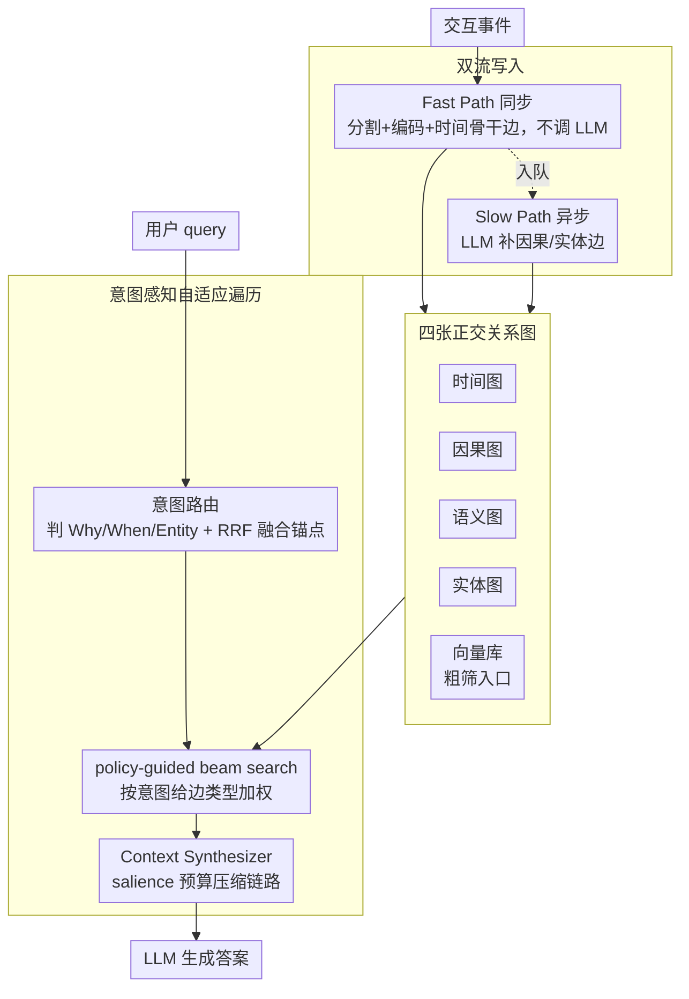

# MAGMA: A Multi-Graph based Agentic Memory Architecture for AI Agents

**会议**: ACL 2026  
**arXiv**: [2601.03236](https://arxiv.org/abs/2601.03236)  
**代码**: https://github.com/FredJiang0324/MAGMA (有)  
**领域**: LLM Agent / 长期记忆 / 图检索  
**关键词**: 多图记忆、agentic memory、意图感知、双流写入、LoCoMo

## 一句话总结
MAGMA 把 LLM agent 的记忆拆成语义 / 时间 / 因果 / 实体四张正交关系图，再用 intent 路由 + 适应性 beam search 在合适的图上做 policy-guided traversal 检索，并配以"快路径同步入库 + 慢路径异步 LLM 巩固"双流写入；在 LoCoMo 上 Judge 0.700 全面超过 A-MEM / Nemori / MemoryOS，同时 query latency 仅 1.47s（比次优快 40%）。

## 研究背景与动机

**领域现状**：LLM 受固定 context window 限制，做不到跨 session 记忆，于是出现 Memory-Augmented Generation (MAG) 范式：用外部记忆 $\mathcal{M}_t$ 跟随交互演化，$o_t = \mathrm{LLM}(q_t, \mathrm{Retrieve}(q_t, \mathcal{M}_t))$，$\mathcal{M}_{t+1} = \mathrm{Update}(\mathcal{M}_t, q_t, o_t)$。代表系统：MemGPT、A-MEM（Zettelkasten 链式笔记）、Nemori（事件分割）、MemoryOS、GraphRAG、Zep 等。

**现有痛点**：① 几乎所有方案把记忆塞进单一仓库（vector store / 单一 KG），用 cosine 相似度做检索，时间 / 因果 / 实体三类关系被纠缠在一起；② 这种"associative proximity"能找出"发生了什么"，但答不了"为什么"，无法做因果链推理；③ A-MEM 的笔记网络主要靠语义嵌入，遗漏时间/因果链；Nemori 有事件分割但内部叙述结构没有显式区分关系维度；④ 写入与检索通常耦合在同步路径上，复杂的结构推理会阻塞 agent 响应。

**核心矛盾**：记忆要既能"快回忆"又能"深推理"——同步路径要快、不能阻塞用户；但结构化关系推理需要 LLM 调用，慢且贵；同时检索要在不同 query 类型（why/when/entity）下都精准，单一相似度永远达不到。

**本文目标**：(a) 用多视图关系图替代单一仓库；(b) 让检索按 query intent 动态选择图视图；(c) 让写入"快"与"巩固"解耦。

**切入角度**：从认知科学借鉴 complementary learning systems（CLS）——海马快、皮质慢；以及 systems 设计的"读路径多视图 + 异步索引"思想。

**核心 idea**：四张正交关系图 + 意图感知的 policy-guided 图遍历 + 双流读写架构。

## 方法详解

### 整体框架

MAGMA 要同时满足两件互相打架的事：记忆既要能「快回忆」不阻塞用户，又要能「深推理」回答 why。它的做法是把整套系统分成读、存、写三层协同。存储层不再是单一向量库，而是一张时变有向多重图 $\mathcal{G}_t=(\mathcal{N}_t,\mathcal{E}_t)$，节点 $n_i = \langle c_i, \tau_i, \mathbf{v}_i, \mathcal{A}_i\rangle$ 存事件的内容、时间戳、稠密向量与结构化属性，边按语义维度切成四张正交关系图，并配一个向量库做粗筛入口。读路径先由意图路由判断 query 想问什么，再在对应关系图上做自适应拓扑检索，最后由 Context Synthesizer 合成答案；写路径拆成快慢两条流，Fast Path 同步入库只做轻量编码，Slow Path 异步用 LLM 把隐含的因果与实体关系补进图里。

### 关键设计

**1. 四张正交关系图作 Data Structure：把单一记忆库拆成可独立访问的四种关系视图**

过去的 memory 系统不论是向量库还是单一 KG，都把时间、因果、实体关系全纠缠在 cosine 相似度里，于是「相似事件」常被误当成「原因事件」。MAGMA 把边集 $\mathcal{E}$ 切成四个语义子空间：Temporal Graph 严格按 $\tau_i < \tau_j$ 连成不可变时间链，提供时序基线；Causal Graph 在条件得分 $S(n_j\mid n_i, q) > \delta$ 时由巩固模块推出方向边，专门支撑 why 查询；Semantic Graph 用无向边连接 $\cos(\mathbf{v}_i, \mathbf{v}_j) > \theta_{\mathrm{sim}}$ 的事件；Entity Graph 把事件挂到抽象实体节点，解决跨时段「同一对象」的识别。向量库仍保留作粗筛 anchor 入口。四张图互为补集而非冗余——时间链保证时序正确、因果链回答 why、实体链维持 object permanence，消融里任意去掉一张都会掉点。

**2. Intent-Aware Adaptive Traversal：先判断 query 想问什么，再到对应的图上做受策略引导的 beam search**

单一 cosine 检索天然偏好「话题相近」，遇到语义相似但因果无关的 distractor 就会被带偏（论文中对抗类 query 让 A-MEM 等掉到 0.2–0.6）。MAGMA 先用轻量分类器把 query 映射到意图 $T_q \in \{\mathrm{Why}, \mathrm{When}, \mathrm{Entity}\}$，并由时间解析器把「last Friday」这类表述折算成绝对时间窗口；再用 Reciprocal Rank Fusion $S_{\mathrm{anchor}} = \mathrm{TopK}\sum_{m\in\{vec,key,time\}}\frac{1}{k+r_m(n)}$ 融合向量 / 关键词 / 时间三路信号定位入口锚点。随后做启发式 beam search，每步转移分 $S(n_j\mid n_i, q) = \exp\big(\lambda_1\phi(\mathrm{type}(e_{ij}), T_q) + \lambda_2 \mathrm{sim}(\vec n_j, \vec q)\big)$，其中 $\phi(r, T_q) = \mathbf{w}_{T_q}^\top \mathbf{1}_r$ 给意图对应的边类型加权（why 给 causal 边权 3–5、entity 给 entity 权 2.5–6），每层取 top-$k$ 并以衰减因子 $\gamma$ 抑制深度爆炸。这相当于把「先确定要找什么、再去找」这条人类直觉显式编码成路径控制。

**3. Dual-Stream 写入：用快慢两条流把「低延迟响应」和「深结构推理」解耦**

实际部署里用户体验的瓶颈是同步延迟，而一次因果推理要花数秒，若写入和结构推理耦合在同步路径上就会卡住 agent。MAGMA 因此把写入拆成两条流：Fast Path（Algo 2）走同步，只做事件分割、编码向量、追加时间骨干边 $n_{t-1}\to n_t$、写入向量库并把节点 id 推进队列，全程不调 LLM，user-facing 延迟只剩毫秒级的向量编码；Slow Path（Algo 3）由异步 worker 从队列取节点，拉出 2-hop 邻域 $\mathcal{N}_{\mathrm{local}}$，用 LLM $\Phi$ 推理隐含的因果与实体边 $\mathcal{E}_{\mathrm{new}} = \Phi_{\mathrm{reason}}(\mathcal{N}(n_t), \mathcal{H}_{\mathrm{history}})$ 再写回图。这正对应认知科学 CLS 理论里海马（快）与新皮层（慢）的互补分工。

### 一个完整示例

假设来一条对抗性 why 查询「为什么 Alice 取消了周五的旅行」：意图路由先判定 $T_q=\mathrm{Why}$、时间解析器锁定上周五的时间窗口；RRF 融合向量 / 关键词 / 时间三路信号，把「Alice 提到旅行」的事件节点选作锚点；beam search 因 why 意图给 causal 边高权，于是不沿语义相近的「Alice 喜欢旅行」滑走，而是顺着因果边走到原因链；Context Synthesizer 再用 salience 预算把链路上的关键节点保留全文、低分节点压成「…3 个中间事件…」，最终交给 LLM 生成因果完整又简洁的回答。这条路径上，Fast Path 早已把事件入库保证了 Alice 当时的发言可被即时检索，而 causal 边则是 Slow Path 事后异步补出来的。

### 损失函数 / 训练策略
- 整个 MAGMA 是**训练-free** 的 retrieval + 检索 + LLM 调用架构，没有自学参数；所有 LLM 调用使用 gpt-4o-mini（T=0）；embedding 用 all-MiniLM-L6-v2（384 维）或 OpenAI text-embedding-3-small（1536 维）；超参 $\lambda_1=1.0, \lambda_2=0.3$–$0.7$，beam width 与 $\mathrm{MaxDepth}=5$、$\mathrm{Budget}=200$ 由 LoCoMo 上经验调出。
- 通过 token budgeting 把低分节点压缩为 "...3 intermediate events..."，高分节点保留全文，把 context 嵌入控制在 prompt 窗口内。

## 实验关键数据

### 主实验

**LoCoMo (LLM-as-Judge, gpt-4o-mini)**

| 方法 | Multi-Hop | Temporal | Open-Domain | Single-Hop | Adversarial | Overall |
|---|---|---|---|---|---|---|
| Full Context | 0.468 | 0.562 | 0.486 | 0.630 | 0.205 | 0.481 |
| A-MEM | 0.495 | 0.474 | 0.385 | 0.653 | 0.616 | 0.580 |
| MemoryOS | 0.552 | 0.422 | 0.504 | 0.674 | 0.428 | 0.553 |
| Nemori | 0.569 | **0.649** | 0.485 | 0.764 | 0.325 | 0.590 |
| **MAGMA** | 0.528 | **0.650** | **0.517** | **0.776** | **0.742** | **0.700** |

整体 +18.6%~45.5% relative 提升，最显著的是 Adversarial（0.742 vs. 次优 0.616），说明 intent routing + 因果边能挡住"语义相似但结构无关"的 distractor。

**LongMemEval（平均上下文 >100K tokens）**：Avg accuracy MAGMA 61.2% > Nemori 56.2% > Full-context 55.0%，而 MAGMA 平均每次 query 只用 0.7–4.2K tokens（Full-context 要 101K），即 **>95% token 节省**。

### 消融实验

| 配置 | Judge | F1 | BLEU-1 |
|---|---|---|---|
| MAGMA (Full) | **0.700** | 0.467 | 0.378 |
| w/o Adaptive Policy | 0.637 | 0.413 | 0.357 |
| w/o Causal Links | 0.644 | 0.439 | 0.354 |
| w/o Temporal Backbone | 0.647 | 0.438 | 0.349 |
| w/o Entity Links | 0.666 | 0.451 | 0.363 |
| Causal Only | 0.590 (Overall) | – | – |
| Temporal Only | 0.577 | – | – |
| Entity Only | 0.531 | – | – |

去掉 Adaptive Policy 掉得最多（-0.063），证明 intent routing 是核心；Causal 和 Temporal 同样关键（各掉 -0.05+）；Entity 影响最小但仍有持续贡献。

### 关键发现
- Adversarial 维度提升最大（+12.6 比次优 A-MEM），说明 distractor 抵抗主要靠"结构对齐"而非"语义匹配"——这是单图系统的盲区。
- MAGMA 总查询时延 1.47s 是次优 A-MEM (2.26s) 的 65%，原因是 adaptive policy 早期剪枝 + dual-stream 把重活挪后台；A-MEM 虽 token 最省（2.62k）但 Judge 只 0.580，"省"得太狠就丢了关键证据。
- 三种 single-graph-only 配置 Overall 都 < 0.60，证明四种关系不可互相替代；Causal-only 反而在 Adversarial 上独霸 0.680，提示因果边对抗噪能力极强。
- 在 ultra-long context 下 MAGMA 仍能精简到 < 5K tokens 还涨点，说明 multi-graph + adaptive policy 实质上做了一次"结构化压缩"。

## 亮点与洞察
- "记忆 = 多视图关系图"这个抽象非常优雅：四张图各自独立、统一节点身份，让检索可以按 query 维度 routing，比 GraphRAG 那种单一异构 KG 更易实现 intent-specific 路径控制。
- Dual-stream 写入是工程上最值得抄的设计——它把"agent 响应低延迟"和"长期记忆深推理"两个相互冲突的目标用 producer-consumer 队列优雅地解耦。RAG/agent 系统几乎都该默认走这种异步巩固模式。
- 用 RRF 融合 vec + keyword + time anchor，再加 intent-weighted edge type bonus，这种把符号 / 稠密 / 时间三路信号同时打进 beam search 的混合检索范式，可以直接迁到任何 graph-based RAG。
- Salience-based token budgeting 把低相关节点压缩成 "...3 events..." 这种 brevity code，保持 prompt 简洁同时不丢链路连续性，对 LLM-as-interpreter 而非 LLM-as-writer 的提示工程很有启发。

## 局限与展望
- 重度依赖 LLM 在 Slow Path 做结构化抽取——若 LLM 出现 relation 抽取错误（hallucinated edges），错误会传到 retrieval；作者用 conservative threshold 但无法根除。
- 多图存储 + 双流处理引入工程复杂度和存储开销，对资源受限场景（边缘设备 / 个人 agent）可能太重。
- 评测只在 LoCoMo / LongMemEval 这类对话长上下文，未覆盖多模态、工具调用、code agent 等更广的 agentic 场景；intent 三分类（why/when/entity）也比较粗，复杂 query 可能需要更细的混合 intent。
- 没有给出"记忆图爆炸增长"后的检索时间增长曲线，长期运行场景下 entity graph 与 causal graph 的稀疏化策略缺失。
- 参数全部经验调优，无系统化的 policy learning，未来可以把 traversal weight $\mathbf{w}_{T_q}$ 改用 RL 学。

## 相关工作与启发
- **vs A-MEM (Xu 2025)**: 都搞结构化 memory，但 A-MEM 是 Zettelkasten 线性笔记 + 语义检索，没分关系维度；MAGMA 显式四图 + intent 路由，Adversarial 维度 0.742 vs A-MEM 0.616 是分关系建模的直接红利。
- **vs Nemori (Nan 2025)**: Nemori 强在事件分割 + 表示对齐，但其内部结构是 narrative chunk，无显式因果 / 实体边；本文消融显示去掉 causal 立掉 0.056。
- **vs GraphRAG / Zep**: 都是 graph-based memory，但 GraphRAG 是 community 摘要驱动的离线 KG，Zep 是单一时序 KG；MAGMA 的分图 + 异步巩固 + intent routing 三件套是更轻量、可在线演化的设计。
- **vs MemGPT / MemoryOS**: 它们偏 OS 比喻和分页式记忆管理，MAGMA 更偏推理结构与认知科学（CLS）。

## 评分
- 新颖性: ⭐⭐⭐⭐ 多图正交 + intent routing + 双流写入三个设计组合起来确实在 agentic memory 里独树一帜
- 实验充分度: ⭐⭐⭐⭐ 两 benchmark、四基线、两种消融（leave-one-out + single-graph-only）、效率分析齐全
- 写作质量: ⭐⭐⭐⭐ 公式整洁，case study + walkthrough 把抽象 pipeline 讲得很具象
- 价值: ⭐⭐⭐⭐ 对生产部署 agentic memory 的人来说，dual-stream + intent routing 两个工程模式可直接落地

<!-- RELATED:START -->

## 相关论文

- [\[ACL 2026\] Dynamic Generation of Multi-LLM Agents Communication Topologies with Graph Diffusion Models](dynamic_generation_of_multi-llm_agents_communication_topologies_with_graph_diffu.md)
- [\[ACL 2026\] SEARL: Joint Optimization of Policy and Tool Graph Memory for Self-Evolving Agents](searl_joint_optimization_of_policy_and_tool_graph_memory_for_self-evolving_agent.md)
- [\[ACL 2026\] How Adversarial Environments Mislead Agentic AI](how_adversarial_environments_mislead_agentic_ai.md)
- [\[NeurIPS 2025\] A-MEM: Agentic Memory for LLM Agents](../../NeurIPS2025/llm_agent/a-mem_agentic_memory_for_llm_agents.md)
- [\[ACL 2026\] Context-Value-Action Architecture for Value-Driven Large Language Model Agents](context-value-action_architecture_for_value-driven_large_language_model_agents.md)

<!-- RELATED:END -->
