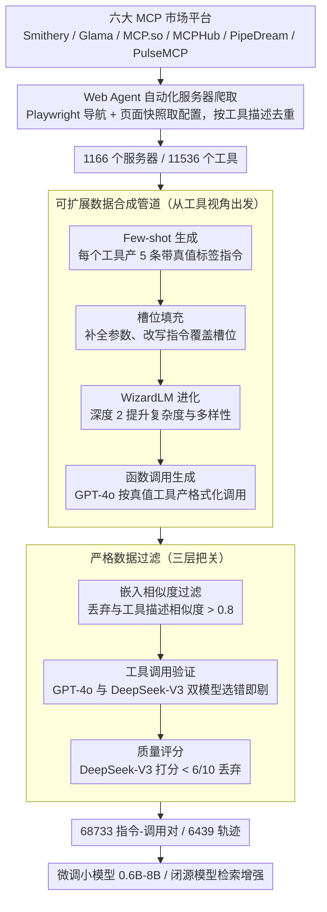

# MCP-Flow: Facilitating LLM Agents to Master Real-World, Diverse and Scaling MCP Tools

**会议**: ACL 2026  
**arXiv**: [2510.24284](https://arxiv.org/abs/2510.24284)  
**代码**: [https://github.com/wwh0411/MCP-Flow](https://github.com/wwh0411/MCP-Flow)  
**领域**: LLM Agent / 工具使用  
**关键词**: Model Context Protocol, 工具使用, 自动化数据构建, 大规模基准, LLM Agent

## 一句话总结

MCP-Flow 提出了一个基于 Web Agent 的自动化管道，从 1166 个真实 MCP 服务器中收集工具信息并合成 68733 条高质量训练数据，使小规模微调模型（0.6B-8B）在 MCP 工具使用上超越 GPT-4o 等 SOTA 大模型。

## 研究背景与动机

**领域现状**：Model Context Protocol (MCP) 作为 LLM 与外部工具交互的统一框架正在快速发展，社区中涌现了大量 MCP 服务器和工具。现有研究开始构建基准来评估模型的 MCP 使用能力，但存在严重局限。

**现有痛点**：三个关键问题——(1) 现有 MCP 研究仅覆盖少量服务器（≤20 个），远低于真实 MCP 生态系统的规模和多样性；(2) 服务器收集严重依赖人工策划，无法跟上 MCP 服务器的快速增长；(3) 没有任何现有框架提供训练支持，仅作为评估平台，无法将评估结果转化为模型能力提升。

**核心矛盾**：真实 MCP 生态系统的复杂性、多样性和快速增长与当前 LLM 有限的 MCP 使用能力之间的差距——即使 SOTA 模型（如 Claude-4-Sonnet）在简单设置下也表现不佳。

**本文目标**：(1) 自动化大规模服务器发现和数据收集；(2) 合成高质量且多样化的训练数据；(3) 通过训练、检索增强和复杂任务评估三个维度验证数据集的价值。

**切入角度**：利用 Web Agent（Playwright）自动化导航 MCP 市场平台，替代人工爬取；结合 few-shot 生成、槽位填充和 WizardLM 进化来合成多样化数据。

**核心 idea**：用自动化管道（服务器发现 + 数据合成 + 严格过滤）构建大规模真实 MCP 训练数据集，让小模型通过微调达到甚至超越大模型的 MCP 工具使用能力。

## 方法详解

### 整体框架

MCP-Flow 要填的是「MCP 工具生态真实、多样、还在快速膨胀」与 LLM 工具使用能力之间的鸿沟，而过去的基准只覆盖二十来个人工策划的服务器、且只能评测不能训练。它把整条流水线做成两段全自动的链路：前段用 Web Agent 从六个真实 MCP 市场平台批量发现并抓取服务器配置，得到 1166 个服务器、11536 个工具的原始素材；后段把工具信息送进「生成—进化—过滤」的数据合成管道，先从工具视角造出带真值标签的指令、再用 WizardLM 进化提升复杂度、最后经三层过滤剔除噪声，最终产出 68733 条指令-函数调用对和 6439 条轨迹，用来微调小模型或给闭源模型做检索增强。

### 关键设计

**1. Web Agent 自动化服务器爬取：用高层指令替代逐站点的解析逻辑**

传统爬虫要为每个网站的 HTML 结构单独写解析代码，根本跟不上 MCP 服务器的快速增长。MCP-Flow 改用 Playwright Web Agent，在预定义工作流里自主导航到目标服务器页面，通过页面快照直接拿到 JSON 配置，统一覆盖 Smithery、Glama、MCP.so、MCPHub、PipeDream、PulseMCP 六个平台。一个关键洞察是去重以工具描述列表为准而非服务器名称或提供者——因为同一服务器在不同平台常换名换接口，只有功能签名才稳定。抓到的服务器再按类型本地化：stdio 服务器经 npm/uvx 部署，SSE 服务器通过 URL 连接；首轮大规模爬取后只需增量补抓新发布的服务器。

**2. 可扩展数据合成管道：从工具视角出发保证指令与真值天然对齐**

要让指令自带正确的工具标签，MCP-Flow 不走「先写指令再标工具」的反向流程，而是以工具为起点四步生成：(a) Few-shot 生成，对每个工具产出 5 条带内在真值标签的指令；(b) 槽位填充，把工具所需参数当作槽位，自动补全缺失值并改写指令以覆盖这些参数；(c) WizardLM 进化，随机选具体化、推理等进化方向、深度设为 2，在可控成本下提升指令复杂度与多样性；(d) 函数调用生成，基于真值工具和输入模式用 GPT-4o 产出格式化调用。从工具出发确保了指令-工具的对应关系，槽位填充补齐参数完整性，进化深度限定为 2 则在生成成本和多样性之间取平衡。

**3. 严格数据过滤：三层把关从不同角度滤掉低质样本**

合成数据难免混进平凡或错误样本，MCP-Flow 用三道独立的过滤把关：(a) 嵌入相似度过滤，计算指令与工具描述的嵌入相似度，丢弃超过 0.8 阈值的——太贴近描述会让工具选择变得平凡；(b) 工具调用验证，让 GPT-4o 和 DeepSeek-V3 各自从标注工具加两个随机候选里选正确工具，两者都失败的样本剔除，确保标注能被独立复现；(c) 质量评分，用 DeepSeek-V3 打分、低于 6/10 的丢弃。三层分别针对「平凡指令、标注错误、整体质量」三类问题，叠起来把数据集的可靠性拉到能让小模型反超 GPT-4o 的水平。

### 损失函数 / 训练策略

采用标准的指令微调，在合成数据上训练 Qwen3-0.6B/4B 和 Llama3.1-8B。此外提供检索增强方案——从数据集中检索相似示例增强闭源模型的 MCP 使用能力。

## 实验关键数据

### 主实验

**MCP 工具选择与格式化（10 工具设置）**

| 模型 | Seen Tool | Unseen Tool | Unseen Server |
|------|-----------|-------------|---------------|
| GPT-4o (Tool/Param/AST) | 88.6/68.2/58.8 | 85.0/71.4/62.0 | 81.4/55.6/50.8 |
| Claude-4-Sonnet | 85.8/68.6/56.6 | 83.0/74.4/63.6 | 72.6/56.0/48.4 |
| MCP-Flow-Qwen-0.6B | **96.8/87.2/75.4** | **98.2/86.8/75.2** | **98.4/70.6/58.0** |
| MCP-Flow-Qwen-4B | **99.2/91.8/81.2** | **98.6/91.4/78.2** | **98.4/72.2/59.8** |
| MCP-Flow-Llama-8B | **98.6/91.0/81.6** | **99.0/91.2/77.6** | **99.4/77.0/65.2** |

**100 工具大规模设置**

| 模型 | Tool | Param | AST |
|------|------|-------|-----|
| GPT-4o | 72.3 | 66.9 | 53.8 |
| MCP-Flow-Qwen-0.6B | 64.7 | 63.4 | 51.6 |
| MCP-Flow-Qwen-4B | **81.7** | **82.1** | **67.0** |

### 消融实验

| 配置 | 关键指标 | 说明 |
|------|---------|------|
| 完整 MCP-Flow 数据 | — | 基线 |
| 移除 WizardLM 进化 | 下降 | 指令复杂度和多样性降低 |
| 移除槽位填充 | 下降 | 参数覆盖不完整 |
| 移除质量过滤 | 下降 | 低质量样本引入噪声 |

### 关键发现

- **0.6B 模型即可超越 GPT-4o**：MCP-Flow-Qwen-0.6B 在 10 工具设置下 Tool 准确率达 96.8%，远超 GPT-4o 的 88.6%，证明了专业化训练数据的价值
- 工具数量增加时所有模型性能下降，但 MCP-Flow 模型下降更缓慢，在 100 工具设置下 4B 模型仍超越 GPT-4o
- 检索增强使 GPT-4o 在 Seen Test 上的 Tool 准确率从 88.6% 提升到 91.2%（+2.6%），Unseen Tool 从 85.0% 到 87.8%（+2.8%）
- 在 GAIA 复杂 Agent 任务上，用 MCP-Flow 替换初始工具调用可以提升 Agent 性能的同时降低推理成本

## 亮点与洞察

- Web Agent 驱动的自动化爬取管道设计非常实用——不需要针对每个平台写解析代码，且支持增量更新，这是工程智慧与研究贡献的结合
- 以工具描述而非名称做去重的洞察体现了对 MCP 生态系统的深入理解
- 从工具视角出发的数据合成思路（先确定目标工具再生成指令）保证了标签的准确性，这比反向流程（先生成指令再标注工具）更可靠

## 局限与展望

- 需要 API Key 或专有软件的服务器被排除，这部分可能包含重要的生产级工具
- 数据合成依赖 GPT-4o，引入了对特定模型的依赖
- 仅评估了工具选择和格式化，对多步骤工具链推理的评估有限
- 服务器质量参差不齐，部分服务器返回的响应可能不可靠

## 相关工作与启发

- **vs ToolBench**: ToolBench 使用 RapidAPI 的 REST API，不稳定且缺乏标准化；MCP-Flow 利用 MCP 统一协议提供更可靠的工具交互
- **vs MCPBench/MCP-Zero**: 这些基准仅覆盖 10-300 个服务器且不提供训练支持；MCP-Flow 覆盖 1166 个服务器并提供完整的训练数据

## 评分

- 新颖性: ⭐⭐⭐⭐ 自动化管道和大规模数据集构建有实际贡献，但核心方法（few-shot + 进化 + 过滤）并非全新
- 实验充分度: ⭐⭐⭐⭐⭐ 多模型对比、三种测试分割、不同工具数量设置、检索增强、Agent 任务评估，非常全面
- 写作质量: ⭐⭐⭐⭐ 结构清晰，但部分细节（如过滤阈值选择）可更充分讨论
- 价值: ⭐⭐⭐⭐⭐ 填补了 MCP 领域训练数据的空白，对 LLM Agent 工具使用研究有重要推动作用

<!-- RELATED:START -->

## 相关论文

- [\[ICML 2026\] MCP-Persona: 用环境模拟评估 LLM agent 在真实个人化应用上的能力](../../ICML2026/llm_agent/mcp-persona_benchmarking_llm_agents_on_real-world_personal_applications_via_envi.md)
- [\[ACL 2026\] AgencyBench: Benchmarking the Frontiers of Autonomous Agents in 1M-Token Real-World Contexts](agencybench_benchmarking_the_frontiers_of_autonomous_agents_in_1m-token_real-wor.md)
- [\[ACL 2026\] Shopping Companion: A Memory-Augmented LLM Agent for Real-World E-Commerce Tasks](shopping_companion_a_memory-augmented_llm_agent_for_real-world_e-commerce_tasks.md)
- [\[ACL 2026\] OctoTools: An Agentic Framework with Extensible Tools for Complex Reasoning](octotools_an_agentic_framework_with_extensible_tools_for_complex_reasoning.md)
- [\[ACL 2026\] GOAT: A Training Framework for Goal-Oriented Agent with Tools](goat_a_training_framework_for_goal-oriented_agent_with_tools.md)

<!-- RELATED:END -->
