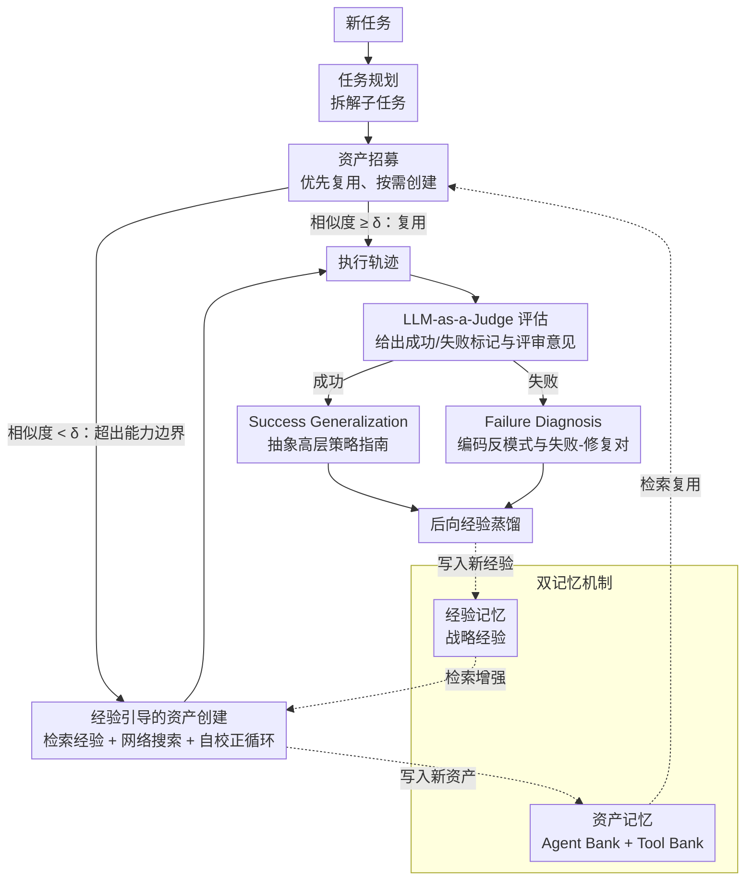

# Mem²Evolve: Towards Self-Evolving Agents via Co-Evolutionary Capability Expansion and Experience Distillation

**会议**: ACL 2026  
**arXiv**: [2604.10923](https://arxiv.org/abs/2604.10923)  
**代码**: [https://buaa-irip-llm.github.io/Mem2Evolve](https://buaa-irip-llm.github.io/Mem2Evolve)  
**领域**: 模型压缩  
**关键词**: 自进化Agent、双记忆机制、能力扩展、经验蒸馏、协同进化

## 一句话总结
本文提出 Mem²Evolve，一种通过双记忆机制（资产记忆 + 经验记忆）实现能力扩展与经验蒸馏协同进化的自进化 Agent 框架，在 6 类任务 8 个基准上平均 Pass@1 达 70.24%，分别超过纯经验进化和纯能力进化的最强基线 11.80% 和 6.46%。

## 研究背景与动机

**领域现状**：LLM Agent 正从静态的任务特定系统向能利用过往经验并自主扩展能力的自进化系统发展。当前的自进化框架主要分为两种范式：经验中心进化（通过积累经验来优化执行策略、提示或建立经验库）和能力中心进化（通过动态创建新工具或专家 Agent 来扩展能力边界）。

**现有痛点**：这两种进化过程被现有框架割裂对待。经验中心进化受限于预定义的静态工具集，无法处理超出现有能力边界的任务。能力中心进化在没有经验指导的情况下从零创建新资产，无法利用已验证的策略或避免已知的陷阱，导致不可复现的成功和重复的错误。

**核心矛盾**：能力扩展和经验积累本质上是相互依赖的——新能力使 Agent 能完成更多任务从而获得更多经验，而经验又能指导更好的能力扩展——但现有方法忽略了这种内在的协同关系。

**本文目标**：设计一个将能力扩展与经验蒸馏统一在同一个进化循环中的自进化 Agent 框架，实现两者的协同进化。

**切入角度**：受皮亚杰的平衡理论启发——智力通过同化（整合新经验）和顺应（调适内部结构）的交互而进化——将 Agent 进化类比为认知发展过程。

**核心 idea**：通过双记忆机制（Asset Memory 存储可复用能力，Experience Memory 存储战略经验），在前向推理和后向进化的循环中实现能力与经验的协同进化。

## 方法详解

### 整体框架
Mem²Evolve 把自进化拆成一个"前向推理 + 后向进化"的闭环。面对新任务时，Agent 先做任务规划，再从资产记忆里以"优先复用、按需创建"的方式招募专家 Agent 与工具来执行（前向）；任务结束后用 LLM-as-a-Judge 评估整条轨迹，把新产生的高质量资产沉淀回资产记忆、把成败经验蒸馏进经验记忆（后向）。两个记忆库每跑完一次任务都同步刷新，使能力边界与战略经验在同一循环里协同生长，而非被割裂优化。

### 关键设计

**1. 双记忆机制：能力与经验分库存储、互为支撑**

纯经验中心的框架受限于固定工具集，纯能力中心的框架又在没有经验时盲目造资产，Mem²Evolve 用两类记忆把这两条线缝在一起。资产记忆 $\mathcal{M}_A = \mathcal{B}_{agt} \cup \mathcal{B}_{tool}$ 负责"能力"：Agent Bank 存专家 Agent 的角色、专业知识、行为策略与可用工具，Tool Bank 存符合 MCP 协议的可执行工具（名称、功能描述、实现代码、文档）。经验记忆 $\mathcal{M}_E = \mathcal{E}_{agt} \cup \mathcal{E}_{tool}$ 负责"知识"：从过往成败中蒸馏的战略经验，每条含标题、描述、适用场景与核心知识。

二者的互补关系正是框架的支点——没有经验指导的能力扩展是盲目的，没有能力扩展的经验积累又被固定工具集封顶，因此把它们放进同一进化循环才能让能力与经验彼此放大。

**2. 经验引导的资产创建：踩着已验证的经验造新工具**

当某个子任务与资产记忆的相似度低于阈值 $\delta$ 时，Agent 判定它超出现有能力边界，触发创建而非复用。与从零硬造不同，工具生成被过往经验和实时检索同时增强：$m_{tool}^{new} \sim \pi_\theta(s_i \mid \text{Retrieve}(s_i, \mathcal{E}_{tool}), \text{Web}(s_i))$，即在检索相关经验和网络搜索结果的条件下采样新工具。生成后还要过一道自校正循环（Self-Correction Loop）：LLM 从评审意见合成测试用例，只有通过全部测试的资产才被保留入库。

这套"经验+网络+自测"的护栏把首次通过验证率从 53.1% 抬到 72.4%（相对提升 36.3%），平均调试迭代次数从 1.01 降到 0.48（减半还多），让新能力的创建既可靠又低成本。

**3. 后向经验蒸馏：从每条轨迹的成败里抽出可迁移知识**

任务一旦完成，LLM-as-a-Judge 先评估执行质量并给出成功/失败标记和评审意见，再按结果走两条蒸馏路径：成功时做 Success Generalization，把有效做法抽象成高层策略指南；失败时做 Failure Diagnosis，把踩坑编码成反模式和失败-修复对。蒸馏出的经验随后并入经验记忆 $\mathcal{M}_E \leftarrow \mathcal{M}_E \cup \{e_{\text{new}}\}$。

关键在于同时吃成功和失败两类信号——成功经验帮 Agent 复现有效策略，失败经验帮它避开已知陷阱，从而把"不可复现的偶然成功"和"重复犯的同类错误"都收敛掉。

### 一个完整示例
以 GAIA 上一道需要解析特定文件格式的题为例：前向阶段任务规划拆出"读取并解析文件"子任务，与资产记忆相似度低于 $\delta$，于是触发经验引导的工具创建——检索 $\mathcal{E}_{tool}$ 中相关解析经验、辅以网络搜索写出工具代码，经自校正循环跑通测试后入 Tool Bank 并完成执行；后向阶段 LLM-as-a-Judge 判定任务成功，Success Generalization 抽出"该类文件应先校验头部再分块解析"的策略指南并写入 $\mathcal{M}_E$。下次遇到相似任务时，该工具被直接复用、该经验被直接检索，无需再次探索。

### 损失函数 / 训练策略
本文为推理时框架，不涉及模型参数训练。资产招募靠 embedding 相似度检索（阈值 $\delta$），任务评估靠 LLM-as-a-Judge，所有基线与 Mem²Evolve 统一以 GPT-5-chat 作为 LLM 骨干。

## 实验关键数据

### 主实验

| 方法 | GAIA Total | ALFWorld | HotpotQA | AIME24 | AIME25 | 平均 |
|------|-----------|----------|----------|--------|--------|------|
| GPT-5 (ReAct) | 18.47 | 86.87 | 41.40 | 66.67 | 60.00 | 48.27 |
| AFLOW (经验中心) | 19.75 | 93.40 | 60.80 | 66.67 | 63.33 | 58.44 |
| Alita (能力中心) | 72.73 | 86.13 | 58.80 | 70.00 | 66.67 | 63.78 |
| Mem²Evolve | **76.31** | **94.31** | **60.80** | **76.70** | **73.33** | **70.24** |

### 消融实验

| 配置 | 平均 Pass@1 | 下降 |
|------|-----------|------|
| Full Mem²Evolve | 70.24 | – |
| w/o Tool Creation | 59.96 | ↓10.28 |
| w/o Agent Memory | 65.51 | ↓4.73 |
| w/o Tool Memory | 67.11 | ↓3.13 |
| w/o Expert Agent Creation | 68.52 | ↓1.72 |

### 关键发现
- 动态工具创建是最关键的组件（移除后下降 10.28%），表明扩展工具集对处理复杂任务至关重要
- 经验引导使工具创建的首次通过率从 53.1% 提升至 72.4%，调试迭代减少一半以上
- 跨任务初始化（用 GAIA 的记忆初始化其他任务）能持续提升性能，效果接近 25% 同任务初始化，说明记忆具有良好的可迁移性
- 在 GAIA 上，Mem²Evolve 达到 76.31% Pass@1，仅次于 OpenAI DeepResearch 的 67.36%（后者为专有系统），显示了框架的强大潜力

## 亮点与洞察
- 双记忆的协同进化范式是本文最大的贡献——受皮亚杰认知发展理论启发，将"同化"（经验积累）和"顺应"（能力调适）统一在一个框架中。这个类比既有理论基础又有实践价值，使得框架的设计逻辑非常清晰。
- "Reuse first, Create on demand" 的前向推理策略非常实用。通过相似度阈值 $\delta$ 自动判断当前任务是否超出能力边界，避免了不必要的资产创建开销，同时在需要时能即时扩展能力。
- 跨任务记忆迁移的实验结果令人印象深刻：用 GAIA 数据积累的记忆初始化后，在 HotpotQA、AIME 等完全不同的任务上也能带来提升，且不产生负迁移，说明蒸馏出的经验具有良好的抽象性和通用性。

## 局限与展望
- 框架依赖沙箱环境来执行自动生成的代码，限制了在需要直接与本地文件系统或无限制网络访问的开放世界环境中的部署
- 资产和经验记忆的持续增长可能带来检索效率和噪声的问题，长期部署下的记忆管理策略（如遗忘、压缩）未被讨论
- LLM-as-a-Judge 在无 ground-truth 标签时的评估可靠性可能影响后向进化的质量
- 工具创建的质量受限于 LLM 的代码生成能力，对于复杂工具可能需要多次迭代才能达到可用质量

## 相关工作与启发
- **vs Alita (Qiu et al., 2025)**: Alita 支持动态工具创建但没有经验引导，Mem²Evolve 在此基础上增加了经验引导的创建和蒸馏机制，平均性能提升 6.46%
- **vs AFLOW (Zhang et al., 2025)**: AFLOW 通过搜索算法优化模块组合，但受限于固定工具集，无法扩展能力边界。Mem²Evolve 在动态扩展工具集的同时积累经验，平均性能提升 11.80%

## 评分
- 新颖性: ⭐⭐⭐⭐ 首次提出能力扩展与经验蒸馏的协同进化范式，理论动机清晰
- 实验充分度: ⭐⭐⭐⭐⭐ 覆盖 6 类任务 8 个基准，消融/单任务/跨任务分析全面
- 写作质量: ⭐⭐⭐⭐ 框架图清晰，与皮亚杰理论的类比富有启发性
- 综合推荐: ⭐⭐⭐⭐ 为构建通用自进化 Agent 提供了实用的框架基础

<!-- RELATED:START -->

## 相关论文

- [\[ICML 2026\] EvolveR: Self-Evolving LLM Agents through an Experience-Driven Lifecycle](../../ICML2026/llm_agent/evolver_self-evolving_llm_agents_through_an_experience-driven_lifecycle.md)
- [\[ACL 2026\] ExpSeek: Self-Triggered Experience Seeking for Web Agents](expseek_self-triggered_experience_seeking_for_web_agents.md)
- [\[ICLR 2026\] Your Agent May Misevolve: Emergent Risks in Self-evolving LLM Agents](../../ICLR2026/llm_agent/your_agent_may_misevolve_emergent_risks_in_self-evolving_llm_agents.md)
- [\[ACL 2026\] SEARL: Joint Optimization of Policy and Tool Graph Memory for Self-Evolving Agents](searl_joint_optimization_of_policy_and_tool_graph_memory_for_self-evolving_agent.md)
- [\[ACL 2026\] HeLa-Mem: Hebbian Learning and Associative Memory for LLM Agents](hela-mem_hebbian_learning_and_associative_memory_for_llm_agents.md)

<!-- RELATED:END -->
