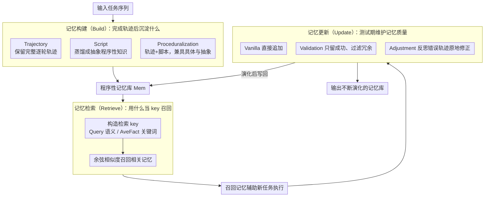

# Mem^p: Exploring Agent Procedural Memory

**会议**: ACL 2026  
**arXiv**: [2508.06433](https://arxiv.org/abs/2508.06433)  
**代码**: [GitHub](https://github.com/zjunlp/MemP)  
**领域**: 模型压缩  
**关键词**: 程序性记忆, Agent学习, 轨迹蒸馏, 记忆更新, 终身学习

## 一句话总结

本文提出 Mem^p 框架，系统性地研究如何为 LLM Agent 构建可学习、可更新、终身演化的程序性记忆——通过将过去的任务轨迹蒸馏为细粒度的分步指令和高层脚本抽象，并配合动态更新机制（添加/验证/反思/淘汰），在 TravelPlanner 和 ALFWorld 上实现了成功率持续提升和执行步数大幅减少。

## 研究背景与动机

**领域现状**：LLM Agent 已能处理复杂的多步任务（如 Deep Research、GUI 操作、长程工具调用），但执行过程需要数十步操作和大量 token 消耗。当前 Agent 每次面对新任务时都从零开始，无法复用之前积累的经验。

**现有痛点**：(1) 现有 Agent 的程序性知识要么是手工设计的 prompt 模板，要么隐含在模型参数中难以更新；(2) LangGraph、AutoGPT 等框架提供了粗粒度的记忆抽象（缓冲区、规则块），但对记忆的构建、检索、修补和淘汰等生命周期操作缺乏系统性优化；(3) Voyager、AWM 等工作虽然利用了程序性记忆，但缺乏对不同构建/检索/更新策略的系统性分析。

**核心矛盾**：许多复杂任务共享深层结构相似性，Agent 在早期任务中已获取了部分程序性知识，却无法有效迁移到后续任务——导致大量重复探索和 token 浪费。

**本文目标**：(1) 将程序性记忆作为一等优化对象，系统探索其构建、检索和更新策略；(2) 使 Agent 能够从过去的轨迹中蒸馏可复用的经验，并在新任务中持续演化。

**切入角度**：受人类程序性记忆（如骑自行车、打字）启发——人类通过将技能编译为自动化子程序来避免每次重新学习。类比地，Agent 应将成功轨迹转化为可复用的推理模式和工具序列。

**核心 idea**：将程序性记忆视为可优化的知识库，通过"轨迹蒸馏 + 向量检索 + 动态更新"三位一体的策略，使 Agent 在连续任务执行中积累和精炼经验。

## 方法详解

### 整体框架

Mem^p 把 Agent 交互建模为 MDP，并把策略从 $\pi(a_t|s_t)$ 扩展为带程序性记忆的 $\pi_{m^p}(a_t|s_t)$，让记忆从隐式的参数/手写 prompt 升级为可被系统优化的一等对象。整个流程沿"输入任务序列 → Build 把完成轨迹蒸馏成记忆 → Retrieve 按相似度召回相关记忆辅助新任务 → Update 在测试期动态增删改记忆库 → 输出不断演化的记忆库 Mem"运转，三个模块各自留出多种可替换策略供逐一消融。

### 关键设计

**1. 记忆构建（Build）：在轨迹的"具体"与脚本的"抽象"之间找平衡**

构建解决的是"完成一个任务后该把什么沉淀下来"，形式化为 $m^{p_t} = B(\tau_t, r_t)$。论文给了三种粒度：Trajectory 直接保留完整的逐轮交互轨迹，Script 用 LLM 分析黄金轨迹并蒸馏成抽象的程序性知识，Proceduralization 则把完整轨迹与高层脚本拼在一起、同时提供具体示例和抽象指导。

三者的取舍正对应一对矛盾——轨迹给出精确执行上下文但泛化差，脚本给出抽象指导却丢了细节。Proceduralization 兼收两者之长，于是脚本部分在新测试集上泛化更好、轨迹部分在相似任务上更精确，成为全模型全数据集的最优构建方式。

**2. 记忆检索（Retrieve）：用什么当 key 决定召回质量**

面对新任务时，记忆要靠相似度被召回，余弦相似度写作 $m_{retrieved} = \arg\max_{m^{p_i} \in Mem} \frac{\phi(t_{new}) \cdot \phi(t_i)}{\|\phi(t_{new})\| \, \|\phi(t_i)\|}$，而召回准不准取决于 key 怎么建。论文比较了三种：Random Sample 随机抽、Query 用查询描述当 key 走语义相似度、AveFact 用 LLM 先提取任务关键词再算平均关键词相似度。

效果上，Query 借语义上下文捕获更贴切的匹配，AveFact 通过聚焦核心任务要素提升检索效率，两者都明显优于随机采样——说明检索的瓶颈不在相似度算子本身，而在如何为任务构造一个能命中"深层结构相似"的 key。

**3. 记忆更新（Update）：靠反思纠错而非无脑追加维持记忆质量**

测试期记忆库需要持续维护，统一写作 $M(t+1) = U(M(t), E(t), \tau_t)$，其中 $U = Add(M_{new}) \ominus Del(M_{obs}) \oplus Update(M_{est})$。论文对比了三档：Vanilla 每完成 $t$ 个任务直接追加，Validation 只留成功轨迹的记忆、过滤失败和冗余，Adjustment 在检索到的记忆导致执行失败时把错误轨迹与原记忆结合做原地修正。

简单追加会让记忆库膨胀、质量被噪声稀释，而基于反思的 Adjustment 最有效——通过不断的错误纠正精炼记忆，使 Agent 在连续任务中逼近线性的掌握度提升，到最后一组任务时比次优策略再高 +0.7 分并少走 14 步。

### 损失函数 / 训练策略

Mem^p 是推理时框架，不涉及模型训练。构建阶段以 GPT-4o、Claude-3.5-sonnet 和 Qwen2.5-72B 作为骨干模型，检索用 text embedding 走向量相似度。

## 实验关键数据

### 主实验

**Build 策略对比（TravelPlanner #CS / ALFWorld Test）**

| 模型 | 策略 | TravelPlanner #CS↑ | ALFWorld Test↑ | Steps↓ |
|------|------|-------------------|----------------|--------|
| GPT-4o | No Memory | 71.93 | 42.14 | 23.76 |
| GPT-4o | Script | 72.08 | 56.43 | 18.52 |
| GPT-4o | Trajectory | 76.02 | 74.29 | 16.49 |
| GPT-4o | Proceduralization | **79.94** | **77.86** | **15.01** |
| Qwen2.5-72B | No Memory | 56.57 | 41.25 | 21.38 |
| Qwen2.5-72B | Proceduralization | **63.82** | **77.19** | **15.32** |

### 消融实验

**Retrieve 策略对比（TravelPlanner，GPT-4o）**

| 检索策略 | #CS↑ | #HC↑ | Steps↓ |
|---------|------|------|--------|
| No Memory | 71.93 | 12.88 | 17.84 |
| Random Sample | 74.59 | 6.72 | 15.12 |
| Key=Query | 73.38 | 8.95 | 15.44 |
| Key=AveFact | **76.02** | 8.25 | **14.64** |

### 关键发现

- Proceduralization（轨迹+脚本）在所有模型和数据集上均为最优策略，ALFWorld 上 GPT-4o 从 42.14% 提升至 77.86%（+35.72%）
- 反思式更新机制到最后一组任务时超越第二优策略 +0.7 分并减少 14 步——证明持续更新中的错误纠正机制至关重要
- 强模型（GPT-4o）构建的程序性记忆迁移到弱模型（Qwen2.5-14B）后仍能提升任务完成率 5% 并减少 1.6 步——记忆具有跨模型可迁移性
- 检索记忆数量增加时性能持续提升，但过多检索会引入不精确记忆导致性能下降

## 亮点与洞察

- 将程序性记忆作为一等优化对象的思路很有价值——不同于之前零散的记忆增强工作，Mem^p 系统性地拆解了构建/检索/更新三个维度并逐一消融
- 记忆的跨模型可迁移性是一个重要发现——意味着可以用强模型积累经验然后"传授"给弱模型，类似于知识蒸馏但在推理时完成
- 反思式更新策略的效果最佳，呼应了 self-refinement 的研究方向——Agent 通过从失败中学习来精炼记忆比简单积累更有效

## 局限与展望

- 目前仅在 TravelPlanner 和 ALFWorld 两个基准上验证，任务多样性有限
- 记忆检索依赖向量相似度，对于结构性差异较大但本质相似的任务可能失效
- 更新策略中仅使用标准的 benchmark 奖励信号，缺乏更精细的反馈机制
- 未探索记忆的长期遗忘和容量上限问题

## 相关工作与启发

- **vs Voyager/AWM**: 这些工作利用程序性记忆增强 Agent 能力，但缺乏对构建/检索/更新策略的系统性分析。Mem^p 补充了这一空白
- **vs ExpeL**: ExpeL 关注从经验中学习，Mem^p 更聚焦于记忆的结构化管理和生命周期优化
- **vs AutoManual**: AutoManual 自动生成操作手册，Mem^p 额外引入了动态更新和跨模型迁移能力

## 评分

- 新颖性: ⭐⭐⭐⭐ 系统性分析程序性记忆的三个维度有价值，但各组件设计本身较直接
- 实验充分度: ⭐⭐⭐⭐ 三种骨干模型+两个数据集+多维度消融，但任务类型有限
- 写作质量: ⭐⭐⭐⭐ 框架清晰、实验设计系统，但部分表述略显冗长
- 价值: ⭐⭐⭐⭐ 为 Agent 记忆系统设计提供了实用的设计指南和经验参考

<!-- RELATED:START -->

## 相关论文

- [\[ACL 2026\] HeLa-Mem: Hebbian Learning and Associative Memory for LLM Agents](hela-mem_hebbian_learning_and_associative_memory_for_llm_agents.md)
- [\[ACL 2026\] Exploring Reasoning Reward Model for Agents](exploring_reasoning_reward_model_for_agents.md)
- [\[NeurIPS 2025\] A-MEM: Agentic Memory for LLM Agents](../../NeurIPS2025/llm_agent/a-mem_agentic_memory_for_llm_agents.md)
- [\[ACL 2026\] OCR-Memory: Optical Context Retrieval for Long-Horizon Agent Memory](ocr-memory_optical_context_retrieval_for_long-horizon_agent_memory.md)
- [\[ACL 2026\] Grounding Agent Memory in Contextual Intent](grounding_agent_memory_in_contextual_intent.md)

<!-- RELATED:END -->
