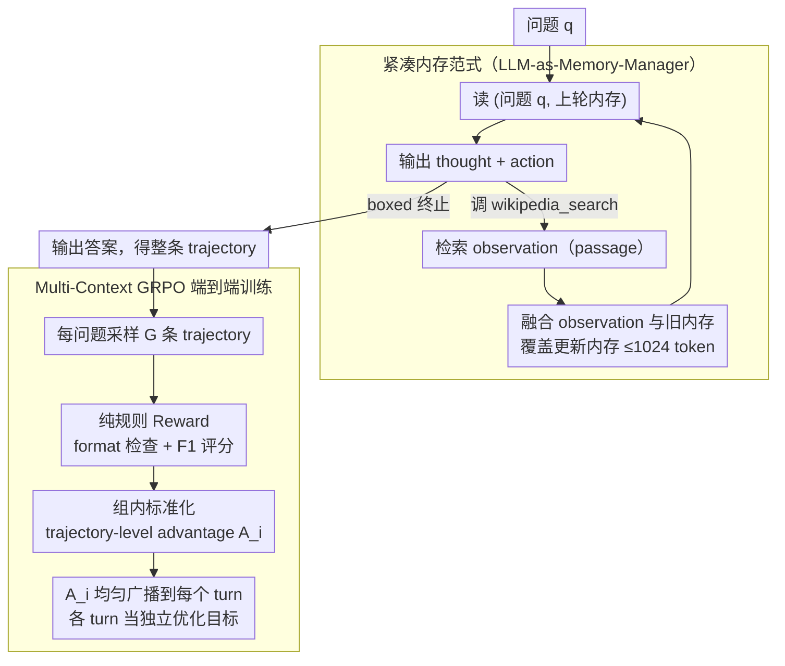

<!-- 由 src/gen_stubs.py 自动生成 -->
# MemSearcher: Training LLMs to Reason, Search and Manage Memory via End-to-End RL

**会议**: ACL 2026  
**arXiv**: [2511.02805](https://arxiv.org/abs/2511.02805)  
**代码**: https://github.com/icip-cas/MemSearcher (有)  
**领域**: LLM Agent / RL / Search Agent  
**关键词**: 搜索 Agent, 内存管理, GRPO, Multi-Context RL, ReAct 替代

## 一句话总结
MemSearcher 把搜索 agent 的"历史拼接"换成"LLM 自管理的紧凑内存"——每轮只看 `(question, memory)` 而不是 `(question, t₁, a₁, o₁, …)`，并用 multi-context GRPO 把整条 trajectory 的 advantage 传播到每一轮独立优化，在 7 个 QA benchmark 上 3B/7B/14B 全面超过同尺寸 ReAct baseline（7B 甚至超 32B ReSearch），context 长度恒定 <4K token。

## 研究背景与动机
**领域现状**：LLM-based search agent（Search-R1, ReSearch, AutoRefine, R1-Searcher 等）大多走 ReAct 范式 —— 每轮把 `thought-action-observation` 累加到 context 里，让 LLM 决定下一步搜什么。这种"对话历史拼接"是当前 RL-based search agent 的事实标准，且配合 GRPO/PPO 端到端训练已经能拿到很强的多跳问答效果。

**现有痛点**：ReAct 把所有历史塞进 context 有两大致命问题：
1. **Context 线性膨胀**：搜索 agent 的 observation 是检索回来的 passage，每轮可能数百到数千 token，多轮跑下来 context 轻松破 10K。Lost-in-the-middle、长 context 性能衰减、KV cache GPU 显存爆炸全都来了。
2. **噪声压制信号**：检索 passage 大部分与问题无关，混在历史里让 LLM 难以聚焦关键事实；论文 Figure 2 给的反例就是 ReAct 把"角色的女友"和"演员现实中的对象"搞混了。

**核心矛盾**：Search agent 必须看多轮历史才能多跳推理，但"看历史 = 拼接全部"在长跑场景下又不可持续。这两者构成根本张力。

**本文目标**：(i) 让 context 长度对轮数 $n$ 保持 $O(1)$；(ii) 同时让 LLM 自己学会"该记什么、该丢什么"；(iii) 端到端用 RL 训练（不用人工标注内存状态）。

**切入角度**：与其外挂 RAG/KG/structured memory 一类附加模块，作者干脆**让同一个 backbone LLM 兼任 reasoning 和 memory manager** —— 一次 prompt 既输出 thought+action，也在 observation 回来后输出更新后的 memory。这种"自反思式内存"训练困难在于：每轮的输入 context $c_{i,j} = (q, m_{i,j-1})$ 都不一样，使一条 trajectory 变成"多个独立优化目标"，vanilla GRPO 算 advantage 时只对整条 trajectory 算一次 reward，没法直接套用。

**核心 idea**：(1) 框架：用 `<memory>` 标签存自然语言内存，每轮 LLM 既是 actor 又是 memory manager。(2) 训练：提出 multi-context GRPO ——一条 trajectory 算一个 reward → 一个 advantage → 把这个 advantage **均匀传播** 给该 trajectory 内所有 turn → 把每个 turn 当独立优化目标。

## 方法详解

### 整体框架
MemSearcher 让同一个 backbone LLM 同时兼任 reasoner、actor 和 memory manager：每轮只把 `(question, memory)` 喂进去，而不是 ReAct 那样拼接全部历史；LLM 输出 thought+action 去调搜索工具，再把检索回的 observation 融进一段 ≤1024 token 的自然语言 `<memory>` 里覆盖更新，如此循环直到 `\boxed{}` 给出答案。配套提出 multi-context GRPO，把整条 trajectory 的稀疏 reward 广播到每一轮当独立优化目标，从而端到端 RL 训出这套"边搜边记"的范式——无需人工标注内存状态。

这套设计把 context 长度对轮数 $n$ 从线性压成恒定，计算成本随之全面下降：

| 方法 | 每轮 Context | 每轮 FLOPs | 总 FLOPs | GPU Memory |
|------|-------------|------------|----------|-----------|
| ReAct | $O(n)$ | $O(n)$ | $O(n^2)$ | $O(n)$ |
| **MemSearcher** | $O(1)$ | $O(1)$ | $O(n)$ | $O(1)$ |

### 关键设计

**1. LLM-as-Memory-Manager 的紧凑内存范式：让 backbone 自己学会记什么、丢什么**

ReAct 把所有 thought-action-observation 往 context 里堆，搜索 observation 又是动辄上千 token 的 passage，几轮下来 context 破万、噪声压住信号。MemSearcher 直接把每轮看到的 context 从 $c_i = (q, t_1, a_1, o_1, \ldots)$ 换成 $c_i = (q, m_{i-1})$：第 $i$ 条 trajectory 的第 $j$ turn 形如 $(q, m_{i,j-1}, t_{i,j}, a_{i,j}, o_{i,j}, m_{i,j})$，thought 在 `<think>`、action 在 `<tool_call>`、observation 在 `<tool_response>`、memory 在 `<memory>` 标签里。每轮的闭环是：LLM 读 $(q, m_{i,j-1})$ → 输出 thought+action（调 wikipedia_search 或 boxed 终止）→ 环境返回 observation → LLM 再被调用，按"读 $o_i$、把对回答 $q$ 有用的新信息整合进来、同时保留 $m_{i-1}$ 全部相关细节"的指引把 $(o_{i,j}, m_{i,j-1})$ 融合改写成新 $m_{i,j}$，长度 ≤1024 token（在 256-2048 区间做了 ablation）。

相比 RAG / KG / Mem0 这类外挂 memory 需要单独训 retriever 或牺牲端到端可微，让同一个 backbone 自管理内存的好处是不引入额外模型、整条 pipeline 仍是一个 LLM 在 act，RL 能端到端覆盖；而内存用自然语言而非 latent token，则保住了可解释、可调试。

**2. Multi-Context GRPO：把"一条轨迹一个 reward"广播到每一轮独立优化**

自管理内存带来一个训练上的硬骨头——一条 trajectory 内每个 turn 的 context $c_{i,j}=(q, m_{i,j-1})$ 都不一样，等于把整条轨迹拆成多个独立优化目标，而 vanilla GRPO 对整条轨迹只算一次 reward，没法直接套。解法是：对每个 question $q$ 按 GRPO 采样 $G$ 条 trajectory，每条算 final reward $R_i$，组内 mean/std 标准化得 trajectory-level advantage $A_i = \frac{R_i - \text{mean}(\{R_j\})}{\text{std}(\{R_j\})}$；关键一步是把 $A_i$ 均匀广播到该轨迹所有 turn，即 $A_{i,j} = A_i,\ \forall j \in [1, n_i]$，再把每个 turn 当独立 PPO/GRPO 目标，objective 对所有 $(i,j)$ 求和，importance ratio $r_{i,j}(\theta) = \pi_\theta(T_{i,j}|c_{i,j}) / \pi_{\theta_{\text{old}}}(T_{i,j}|c_{i,j})$；最后对搜索引擎返回的 observation token 做 loss mask，不计 policy gradient 以稳住训练。

之所以要这样"广播 advantage"，是因为直接对整条 multi-context trajectory 算 ratio 既数值不稳又信号稀疏，而按 turn 拆开后每个 turn 都有自己的梯度，却只有 final reward——用 trajectory-level advantage 强制对齐"哪条轨迹好"，就能让稀疏的 outcome reward 沿所有 turn 反传，把"sparse outcome reward + dense per-turn optimization"在 GRPO 框架下缝合起来。

**3. Reward 设计与训练稳定性：纯规则 reward 配 format warm-up**

奖励全程无 process supervision，只用 format check 加 F1 answer 评估：格式错给 $R=0$，格式对但 F1=0 给 $R=0.1$，F1>0 则 $R=F1$，组内归一化即得 $A_i$。训练超参为 lr=1e-6、KL coef=0.001、clip 0.2、rollout group=5、temperature=1.0，搜索引擎 token 全程 mask。

那个 0.1 的 format reward 充当"warm-up bonus"，避免模型早期满屏 zero reward 完全没信号；用 F1 而非 EM 当 fine-grained reward，则让部分正确的回答也能拿到梯度。整体是 DeepSeek-R1 风格 rule-based reward 在 multi-turn search 场景的合理迁移。

### 损失函数 / 训练策略
基于 verl 库训练，backbone 为 Qwen2.5-3B/7B/14B-Instruct，知识源是 2018 Wikipedia dump，retriever 用 E5，训练数据取 Search-R1 公开的 NQ + HotpotQA train split。3B/7B 跑 8×H100、14B 跑 2×8×H100，一个 epoch 即可（256 batch、5 rollout）。Reward 曲线呈两阶段：前 25 step 急升（学会基础工具+memory 使用），之后缓慢上行（精细化策略）。

## 实验关键数据

### 主实验

**7 benchmark EM 平均分（Avg.）：3B/7B/14B vs SOTA baseline**：

| 尺寸 | 最强 baseline | 本文 | 绝对增益 |
|------|--------------|------|---------|
| 3B | AutoRefine-3B-base = 40.5 | **MemSearcher-3B = 43.8** | +3.3 |
| 7B | ReSearch-7B = 43.6 / R1-Searcher-7B = 40.2 | **MemSearcher-7B = 48.9** | +5.3 |
| 14B+ | Search-R1-14B-base = 47.8 / ReSearch-32B = 48.3 | **MemSearcher-14B = 51.7** | +3.4 vs 32B |

**关键观察**：MemSearcher-3B (43.8) 已超过所有 7B baseline；MemSearcher-7B (48.9) 已超过 32B ReSearch。这说明节省 context 后省下来的 model capacity 全花在了真正的搜索推理上。

**分数据集主表（节选）**：

| 数据集 | Search-R1-7B-base | ReSearch-7B | **MemSearcher-7B** |
|--------|-------------------|-------------|--------------------|
| NQ | 48.0 | 40.9 | **52.7** |
| TriviaQA | 63.8 | 63.7 | **68.1** |
| PopQA | 45.7 | 44.6 | 47.8 |
| HotpotQA | 43.3 | 43.5 | **50.8** |
| 2Wiki | 38.2 | 47.6 | 48.6 |
| Musique | 19.6 | 22.3 | **25.8** |
| Bamboogle | 43.2 | 42.4 | **48.8** |

### 消融与分析

**RL training vs no training（Qwen2.5-Instruct base）**：

| 模型 | w/o training | w/ MemSearcher RL | 提升 |
|------|--------------|-------------------|------|
| Qwen2.5-3B-Instruct | 14.4 | 43.8 | **+29.4** |
| Qwen2.5-7B-Instruct | 25.8 | 48.9 | **+23.1** |
| Qwen2.5-14B-Instruct | 27.7 | 51.7 | **+24.0** |

→ 框架本身需要 RL 才能 unlock，纯 prompting 不够。

**RL vs SFT（Qwen2.5-3B）**：

| 方法 | Avg |
|------|-----|
| SFT (Qwen2.5-72B 蒸馏轨迹) | 28.5 |
| **RL** | **43.8** |

→ SFT 用 72B 蒸馏轨迹比 RL 差 15.3 分，因为 72B 自己也没掌握 MemSearcher，做不出好 teacher；RL 直接奖励"答对"，让模型自学 what-to-retain。

**Memory 长度 ablation（256/512/1024/2048 tokens）**：

- 简单数据集如 Bamboogle 256 token 即饱和；
- 复杂多跳 Musique 256→1024 持续上升；
- 默认 1024 是 trade-off sweet spot。

**Context 长度对比（vs ReAct-based ReSearch）**：MemSearcher 多轮交互平均 context 始终 <4K token，几乎水平线；ReSearch 线性增长，5 轮后突破 10K。

### 关键发现
- **小模型超大模型**：MemSearcher-3B > 7B baseline；7B > 32B ReSearch。压缩 context 节省下来的算力让模型把"capacity 用在刀刃上"。
- **甚至超 Google Web Search**：MemSearcher 在本地 wiki dump 上的成绩超过用 Google 真实搜索的 R1-Searcher 和 ZeroSearch，说明 memory 设计的收益大过 web 索引质量收益。
- **训练曲线两阶段**：前 25 步快速学会格式 + 工具调用，之后缓慢学 memory 策略；和 DeepSeek-R1 的两阶段学习模式呼应。
- **SFT 蒸馏天花板低**：因为 teacher（72B）自己也没掌握 MemSearcher。这是 framework innovation + RL 训练的典型案例——新范式的小模型必须靠 RL 自己探索，而不是从老范式的大模型蒸。
- **Memory 长度敏感性**：复杂任务需要更长 memory，但 1024 是工程上的 sweet spot；这也启发将来可做"自适应 memory 长度"。

## 亮点与洞察
- **"backbone 兼 memory manager"是优雅的极简设计**：不引入额外模块，不破坏端到端可训练性，单 LLM 同时承担 reasoning、acting、memorizing 三职。比 RAG/KG/structured memory 这些外挂方案更内聚。
- **Multi-context GRPO 是个普适算法贡献**：凡是"trajectory 内每 turn context 不同 + final reward 稀疏"的 multi-turn RL 场景（如工具使用、多轮对话、长程规划）都可以套用 trajectory-level advantage propagation。
- **Context 恒定 → 工业可部署**：搜索 agent 在线服务最大成本就是 long context 的 KV cache，MemSearcher 直接砍到 $O(1)$，对低显存服务器（如 4090 / A10）部署友好。
- **"通过让 backbone 学会忘"反而提升性能**：传统直觉是"更多 context = 更好"，本文反证 selective forgetting + 紧凑 memory 在 search 任务上 dominate cluttered history。和 attention 机制本质（关注少量、忽略多数）一致。
- **3B 超 32B 的 capability density 提升**：是个非常有冲击力的实验——说明"以 paradigm 创新换 model scaling"在 agent 时代是可行路径。

## 局限与展望
- **作者承认**：(1) 内存机制简单（纯自然语言 overwrite），更复杂的 RAG-like / structured memory 没探索；(2) Multi-context GRPO 仍可能有 length bias（长 trajectory 贡献多）等待优化。
- **自查**：(1) Memory overwrite 是 destructive 的，没有 long-term archival 机制，对超长任务可能丢失早期重要信息；(2) 实验只在静态 wiki dump，未跑真实 web；(3) 对内存的 quality 没有 explicit reward，只能靠 final answer 反推；(4) Qwen2.5 系列以外的模型族（如 Llama / Mistral）未验证；(5) Format reward = 0.1 虽然帮助但容易引导模型"勉强写对格式但答非所问"，可能掩盖部分失败模式。
- **改进方向**：(1) 分层内存（短期 working memory + 长期 archival）；(2) 在 reward 中加入 memory quality auxiliary signal（比如内存与最终答案的因果归因度）；(3) 自适应 memory length 而非固定 1024；(4) 把 multi-context GRPO 拓展到 dense per-turn reward（如 turn-level relevance reward）；(5) 跨模型族泛化验证。

## 相关工作与启发
- **vs ReAct / Search-R1 / ReSearch / AutoRefine（ReAct 路线）**：他们都拼接全部历史，context 线性涨；本文砍到 $O(1)$ context 并 outperform 他们。
- **vs R1-Searcher / ZeroSearch（真 Web）**：用真 Google API 反而不如本文用静态 wiki，说明 paradigm 本身的优势大过数据源。
- **vs MEM1 / MemAgent（其他 memory-based agent）**：本文是首个把 memory 管理与 RL 端到端结合并用 multi-context GRPO 训练的，是 paradigm 层面的算法贡献。
- **vs HippoRAG / Mem0 / Zep（外挂结构化 memory）**：他们靠 KG / vector store 离线索引；本文用 LLM 自管理在线 memory，零外部依赖。
- **启发**：(1) 凡是 multi-turn agent，都应考虑"压缩历史"而非"拼接历史"；(2) sparse outcome reward + per-turn optimization 可以通过 advantage broadcast 这种简单 trick 缝合；(3) 让 backbone 同时担任多种角色（reasoner + actor + manager）是节省 capacity、保 end-to-end 可训练性的好范式；(4) "新 paradigm 必须 RL 训不能蒸"的现象提醒我们：framework 创新的真实潜力只能用 exploration 而非 imitation 解锁。

## 评分
- 新颖性: ⭐⭐⭐⭐ Memory-managed search agent + multi-context GRPO 的组合在 RL-based search agent 领域是清晰的 paradigm shift；个别组件（GRPO、ReAct 替代思路）不新但拼合得当。
- 实验充分度: ⭐⭐⭐⭐⭐ 7 数据集 × 3 模型尺寸 × 8 baseline + RL/SFT/no-training 三对照 + memory 长度 ablation + context 曲线 + 训练 reward 曲线 + 案例分析，覆盖完整。
- 写作质量: ⭐⭐⭐⭐ Figure 1/2 直观对比 ReAct，公式推导严谨，table 复杂度对比一目了然；附录给出完整训练超参与案例研究。
- 价值: ⭐⭐⭐⭐⭐ 公开代码，工业可部署（<4K context），3B 超 7B baseline 的 capability density 极具吸引力；multi-context GRPO 算法可推广到所有 multi-turn agent RL 训练，影响面广。

<!-- RELATED:START -->

## 相关论文

- [\[ACL 2026\] StructMem: Structured Memory for Long-Horizon Behavior in LLMs](structmem_structured_memory_for_long-horizon_behavior_in_llms.md)
- [\[NeurIPS 2025\] LC-Opt: Benchmarking Reinforcement Learning and Agentic AI for End-to-End Liquid Cooling Optimization in Data Centers](../../NeurIPS2025/llm_agent/lc-opt_benchmarking_reinforcement_learning_and_agentic_ai_for_end-to-end_liquid_.md)
- [\[ACL 2026\] BAPO: Boundary-Aware Policy Optimization for Reliable Agentic Search](bapo_boundary-aware_policy_optimization_for_reliable_agentic_search.md)
- [\[ACL 2026\] OCR-Memory: Optical Context Retrieval for Long-Horizon Agent Memory](ocr-memory_optical_context_retrieval_for_long-horizon_agent_memory.md)
- [\[ACL 2026\] LiTS: A Modular Framework for LLM Tree Search](lits_a_modular_framework_for_llm_tree_search.md)

<!-- RELATED:END -->
