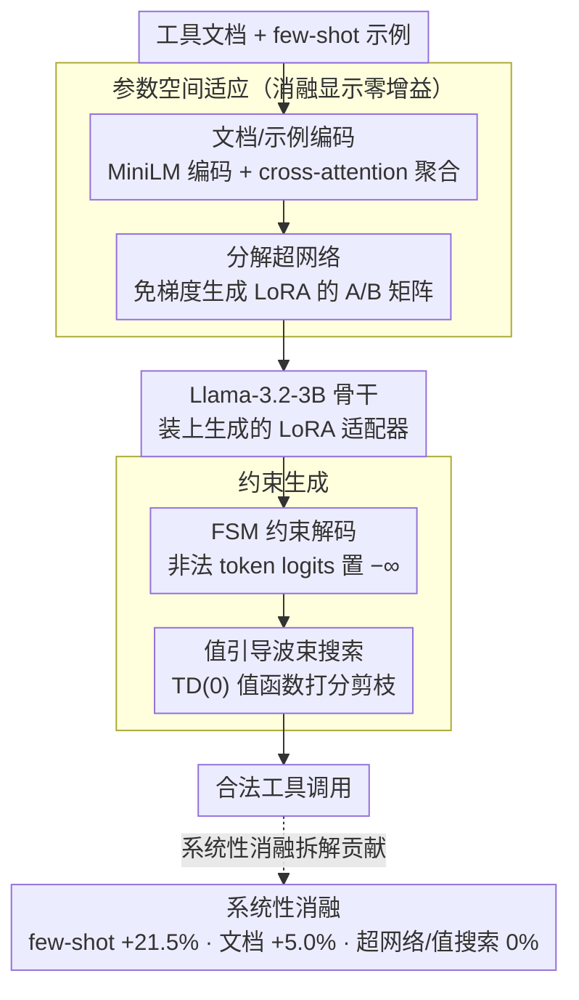

# Meta-Tool: Efficient Few-Shot Tool Adaptation for Small Language Models

**会议**: ACL 2026 Findings  
**arXiv**: [2604.20148](https://arxiv.org/abs/2604.20148)  
**代码**: [GitHub](https://github.com/techsachinkr/Meta-Tool)  
**领域**: 模型压缩  
**关键词**: 小语言模型, 工具使用, few-shot适应, 超网络, 负面结果

## 一句话总结
通过在四个基准上系统对比超网络 LoRA 适应 vs 精心设计的 few-shot 提示，发现 2.28 亿参数的超网络提供零增益——few-shot 示例贡献 +21.5%、文档编码贡献 +5.0%、超网络贡献 0%，3B 模型配合良好提示可达 GPT-5 平均性能的 79.7% 且延迟低 10 倍。

## 研究背景与动机

**领域现状**：工具增强的 LLM Agent 是当前热点，但存在"适应瓶颈"：前沿模型（如 GPT-5）工具调用能力强但延迟和成本高昂，小语言模型（SLM）效率高但缺乏特定工具的程序性知识。主流适应策略分为两极——ICL 灵活但受上下文窗口限制，SFT 效果好但需要大量标注数据且 API 变化后需重训。

**现有痛点**：超网络（Hypernetwork）在其他 NLP 任务中展示了快速适应能力——输入任务描述即可生成 LoRA 适配器权重实现"即时微调"。一个自然的问题是：对于工具使用场景，超网络是否能在 few-shot 提示之上提供额外增益？

**核心矛盾**：复杂的参数空间适应机制（超网络）vs 简单的上下文学习（few-shot + 文档），哪个才是工具使用性能的真正驱动因素？

**本文目标**：通过严格控制实验，系统性地回答"什么驱动了小模型的工具使用性能"这一问题。

**切入角度**：设计四种递进复杂的适应机制（few-shot、文档编码、超网络 LoRA、值引导波束搜索），在四个覆盖不同工具模态的基准上做全面消融。

**核心 idea**：一个经过充分验证的**负面结果**——超网络对工具使用无效，few-shot 示例和结构化文档已经完全规定了任务，参数更新不提供额外信息。这将实践者的注意力从复杂适应架构重新导向提示工程和示例筛选。

## 方法详解

### 整体框架
本文以 Llama-3.2-3B-Instruct 为统一骨干，把"小模型如何学会调用工具"拆成四个逐层叠加的适应机制，再用受控实验逐一拆解谁在真正起作用。输入是工具文档与若干 few-shot 示例，模型经过文档与示例编码、超网络生成 LoRA、FSM 约束解码、值引导波束搜索四道处理后输出符合 schema 的工具调用。整套设计的目的不是堆砌一个更强的系统，而是让每个组件可被单独开关，从而把"工具使用性能从何而来"这个问题量化到百分点。

### 关键设计

**1. 分解超网络：把"即时微调"做到能在消费级显卡上跑**

超网络的卖点是免梯度适应——给定工具文档和少量示例，直接生成一份 LoRA 适配器权重，省去逐任务重训。具体管线分三步：先用 MiniLM 把文档编码成 $v_{doc}$，再用 cross-attention 把示例聚合成原型向量 $v_{proto}$；随后一个共享 MLP 把拼接后的表示投影到隐空间，并用一组可学习的层嵌入区分前 7 层各自的 q/k/v 投影；最后通过二次低秩分解生成 LoRA 的 A/B 矩阵。这层分解把显存复杂度从 $O(L\cdot d\cdot r)$ 压到 $O(L\cdot d\cdot \text{factor})$，使得整个 227.8M 参数的超网络能塞进 24GB 显存训练。值得一提的是，这套精巧设计最终被实验证明是多余的，但它的"完整性"恰恰是负面结论可信的前提——失效不是因为超网络做得太弱。

**2. FSM 约束解码：把语法正确性从模型身上卸下来**

工具调用要求输出严格合法的 JSON，对 3B 小模型来说，语法错误是失败的高频来源。这里把每个工具的 schema 编译成一个正则驱动的有限状态机（FSM），解码时凡是会违反当前 FSM 状态的 token，其 logits 直接被置为负无穷，于是非法分支根本不会被采样。结果是 JSON 语法和类型约束 100% 遵守。这一步的意义在于职责切分：确定性的语法检查交给 FSM，神经网络只需专注语义层面的"该调哪个工具、填什么参数"。

**3. 值引导波束搜索：给"功能正确性"再加一道打分**

FSM 只能保证语法合法，却挡不住"语法对、调用却错"的情况。本文为此再叠一层：先用一条 schema 扰动管线（值替换、边界测试、参数删除）从合法轨迹自动合成训练数据，据此用 TD(0) 学习一个值函数 $V_\phi(s)$，估计从中间状态走向成功的概率；推理时把这个值函数的打分和 LLM 的对数似然一起放进波束搜索，剪掉那些语法合法但功能上没希望的候选。这是四个适应机制里最后、也最重的一层——但消融显示它和超网络一样，没有带来可测增益。

**4. 系统性消融：用严格控制变量支撑"无效"结论**

要证明"超网络没用"远比证明"某方法有用"更需要干净的实验设计。这里用四个交叉配置切分贡献：0-shot/无文档作下界，0-shot+文档量化文档贡献，5-shot/无文档量化示例贡献，5-shot+文档为完整配置；在此之上再叠加 0–5 shot 的灵敏度曲线和噪声鲁棒性测试。正是这套层层隔离的设计，才能把"few-shot 示例贡献 +21.5%、文档 +5.0%、超网络 0%"这样的分解结论落到可复核的数字上。

### 损失函数 / 训练策略
值函数 $V_\phi$ 用 TD(0) 在合成轨迹上学习（TD 损失与打分公式见原文附录 G）；超网络生成 LoRA 在推理时免梯度更新，训练成本集中在值函数与超网络本身。基座模型以 4-bit 量化（NF4）加载，以匹配低延迟部署目标。

## 实验关键数据

### 主实验（执行成功率 %）

| 模型 | Gorilla | Spider 2.0 | WebArena | InterCode | 平均 | 延迟(ms) |
|------|---------|-----------|----------|-----------|------|---------|
| GPT-5 (few-shot) | 38.0 | 72.0 | 54.0 | 72.0 | 59.0 | ~16,490 |
| AgentLM-7B | 8.0 | 44.0 | 8.0 | 40.0 | 25.0 | ~8,880 |
| Llama-3.2-3B | 34.0 | 62.0 | 28.0 | 44.0 | 42.0 | ~1,621 |
| **Meta-Tool (3B)** | **38.0** | **64.0** | **32.0** | **54.0** | **47.0** | **~1,576** |

### 消融实验

| 配置 | Gorilla | Spider 2.0 | WebArena | InterCode | 平均 |
|------|---------|-----------|----------|-----------|------|
| 0-shot + 无文档 | 0.0 | 4.0 | 0.0 | 10.0 | 3.5 |
| 0-shot + 文档 | 2.0 | 24.0 | 26.0 | 50.0 | 25.5 |
| 5-shot + 无文档 | 34.0 | 62.0 | 28.0 | 44.0 | 42.0 |
| **5-shot + 文档** | **38.0** | **64.0** | **32.0** | **54.0** | **47.0** |
| + 超网络 LoRA | 38.0 | 64.0 | 32.0 | 54.0 | **47.0 (零变化)** |

### 关键发现
- **超网络贡献精确为 0%**：在所有四个基准上，启用/禁用超网络结果完全相同，尽管超网络生成了非平凡的权重矩阵
- **few-shot 示例是主要驱动力**：贡献 +21.5 个百分点
- **1-shot 已提供大部分增益**：0→1 shot 平均提升 +8 pp，最大提升在 Spider 2.0（+20 pp）和 Gorilla（+22 pp）
- **错误分析显示瓶颈在语义推理**：722 个失败案例中，schema-heavy 任务残留错误几乎全是语义错误
- **3B 模型达到 GPT-5 的 79.7% 性能，延迟低 10 倍**

## 亮点与洞察
- **高质量的负面结果**是本文最大贡献：不是"我的方法比别人好"，而是"这类看似合理的方法实际上不work"。这种研究对社区非常有价值，避免大量无效投入
- **"few-shot 示例完全规定了工具使用任务"**很有深意：对于工具调用这种结构化输出任务，少量正确的 input-output 示例已经提供了模型需要的所有信息，额外的参数空间适应是冗余的
- **实际部署指导非常直接**：不需要复杂的元学习架构，只需精心策划 few-shot 示例和结构化文档，极大简化工程复杂度

## 局限与展望
- 只在一个 3B 模型上验证，不同规模模型的结论可能不同
- 50 个样本/基准的测试集较小，可能存在统计功效不足
- 超网络架构本身的设计可能不是最优的，负面结果可能与具体实现有关
- 未测试更复杂的多轮工具使用场景
- 未来可以探索是否存在超网络有效的工具使用子场景（如极低资源或高度动态的 API）

## 相关工作与启发
- **vs Gorilla/ToolLLM**: 后者通过大规模微调学习工具使用，但无法应对 API 动态变化。Meta-Tool 的发现表明 few-shot 可能是更灵活的替代
- **vs JTPRO**: JTPRO 优化提示和工具描述文本，Meta-Tool 的发现支持了文本层面优化（而非参数层面）的有效性
- **vs HyperLoRA/Zhyper**: 这些超网络在其他 NLP 任务上有效，但在工具使用上失效，可能因为工具使用更偏向结构化模式匹配

## 评分
- 新颖性: ⭐⭐⭐⭐ 负面结果本身有重要价值，实验设计严谨，但不涉及新方法
- 实验充分度: ⭐⭐⭐⭐ 四个基准、完整消融、灵敏度分析、噪声测试，但样本量偏小
- 写作质量: ⭐⭐⭐⭐⭐ 论述逻辑清晰，负面结果的呈现方式值得学习
- 价值: ⭐⭐⭐⭐ 对工具使用社区有直接指导意义，节省了大量无效探索

<!-- RELATED:START -->

## 相关论文

- [\[ACL 2026\] Don't Adapt Small Language Models for Tools; Adapt Tool Schemas to the Models](don39t_adapt_small_language_models_for_tools_adapt_tool_schemas_to_the_models.md)
- [\[ACL 2025\] Adaptive Tool Use in Large Language Models with Meta-Cognition Trigger](../../ACL2025/llm_agent/meco_metacognition_tool_use.md)
- [\[ACL 2026\] Lightweight LLM Agent Memory with Small Language Models](lightweight_llm_agent_memory_with_small_language_models.md)
- [\[ACL 2026\] ImplicitMemBench: Measuring Unconscious Behavioral Adaptation in Large Language Models](implicitmembench_measuring_unconscious_behavioral_adaptation_in_large_language_m.md)
- [\[ACL 2026\] FAMA: Failure-Aware Meta-Agentic Framework for Open-Source LLMs in Interactive Tool Use Environments](fama_failure-aware_meta-agentic_framework_for_open-source_llms_in_interactive_to.md)

<!-- RELATED:END -->
