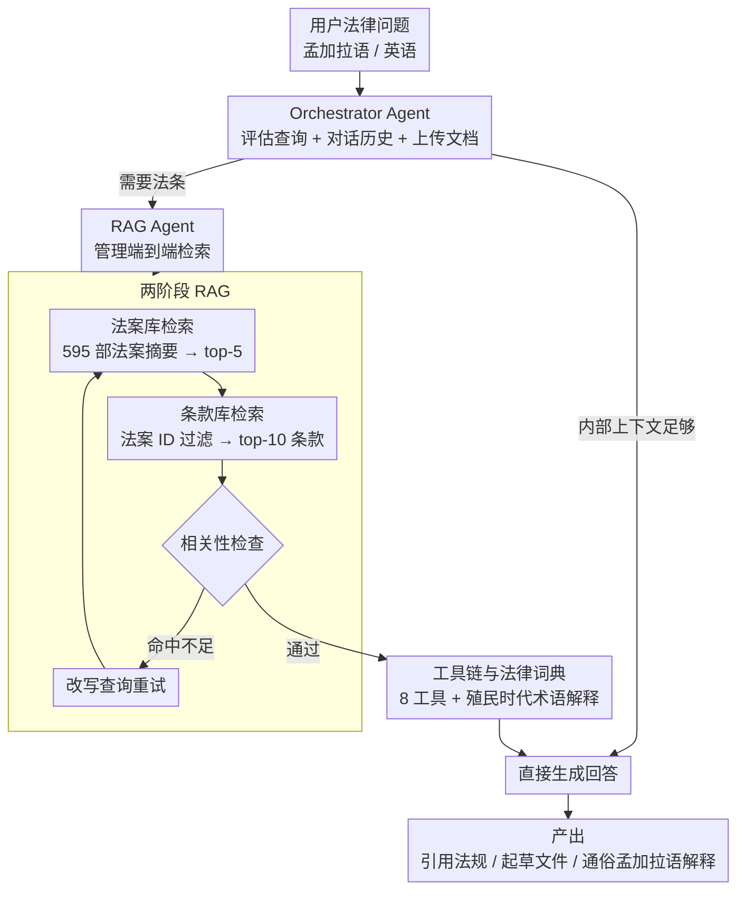

# Mina: A Multilingual LLM-Powered Legal Assistant Agent for Bangladesh

**会议**: ACL 2026  
**arXiv**: [2511.08605](https://arxiv.org/abs/2511.08605)  
**代码**: [GitHub](https://github.com/)  
**领域**: LLM Agent / 法律NLP  
**关键词**: 法律助手, 多语言Agent, RAG, 孟加拉国法律, 低资源语言

## 一句话总结
开发 Mina——面向孟加拉国法律场景的多语言 LLM 法律助手，通过两阶段 RAG 流水线精准检索法案和条款，配合工具链和多语言嵌入，在孟加拉律师资格考试中取得 75-80% 的通过成绩，法律咨询成本仅为传统方式的 0.12-0.61%。

## 研究背景与动机

**领域现状**：孟加拉国司法系统积压 370-440 万案件，仅有 2,100 名法官（每 9 万人 1 名），民事纠纷拖延数十年，律师费用高昂且不受监管，公共法律援助资金有限。

**现有痛点**：(1) AI 法律助手缺乏孟加拉语支持，且未针对孟加拉法律管辖区适配；(2) 孟加拉法律体系根植于殖民时代法典，包含大量波斯语源术语，英语主导的模型无法有效处理；(3) 低收入人群面临法律语言复杂、程序不透明、费用高三重障碍。

**核心矛盾**：语言、法律体系和资源的三重低资源性——孟加拉语 NLP 工具匮乏、法律术语高度专业化且跨语言混合、目标用户缺乏法律和数字素养。

**本文目标**：构建本地化的多语言法律助手，能起草法律文件、引用法规、将复杂法律语言翻译为通俗孟加拉语解释。

**切入角度**：组合成熟组件（多语言嵌入、RAG、LangGraph Agent）并针对双语低资源法律环境深度适配，而非追求单一模块创新。

**核心 idea**：两阶段 RAG 流水线（先检索法案概要再检索具体条款）+ 自定义法律词典 + 多Agent工作流，实现管辖区特定的精准法律回答。

## 方法详解

### 整体框架
Mina 是一套围绕双语低资源法律场景深度适配的多 Agent 系统。系统以 Orchestrator Agent 为中枢，接收用户的孟加拉语/英语法律问题，结合对话历史和已上传文档判断响应路径：内部上下文足以回答时直接生成，否则交给 RAG Agent 触发两阶段 RAG 检索法条、按需调用外部工具，最终产出引用法规、起草文件或把复杂法律语言译为通俗孟加拉语解释。整条链路不追求单一模块的算法创新，而是让多语言嵌入、分层检索、LangGraph 状态机和法律词典在管辖区特定的约束下协同工作。

### 关键设计

**1. 两阶段 RAG：先定位法案、再定位条款，杜绝跨法案串扰**

朴素 RAG 在法律场景的致命问题是常把不相关法案的条款混进同一次检索，生成看似合理实则张冠李戴的回答。这里把检索拆成两层：构建法案数据库（595 部法案的 LLM 摘要）和条款数据库（18,023 条分块索引）两个独立向量库；查询时先用语义关键词在法案库检索 top-5 相关法案，再用法案 ID 过滤条款库取出 top-10 相关条款，检索结果还要过一道相关性检查，命中不足则改写查询重试。法案级保证广度、条款级保证精度，两层分工恰好对应"先找对法、再找对条"的法律检索直觉。

**2. 双 Agent 架构：把决策与检索拆开，换取可维护性**

系统把"要不要检索"和"怎么检索"两件事交给不同角色：Orchestrator Agent 评估查询与上下文，决定直接回答还是触发检索；RAG Agent 则专门管理端到端的检索流程。两者都跑在 LangGraph 状态机上，支持跨轮持久记忆。职责分离让系统模块化，每个 Agent 都能独立调试和扩展，也便于在不动检索逻辑的前提下调整对话策略。

**3. 工具链与法律词典：补上殖民时代法律术语这块领域知识缺口**

孟加拉法律文本根植殖民时代法典，夹杂大量波斯语源术语，是模型理解的主要障碍。系统配了 8 个专用工具来兜住辅助任务：支持 pptx/docx/pdf 的文档解析器、LLM + 正则 fallback 的关键词生成器、DuckDuckGo 网页搜索、问题相关性分析器、社会经济模拟模块，以及最关键的自定义法律词典——它直接解释波斯语源和殖民时代术语。法律词典之所以重要，是因为这部分领域知识无法靠通用多语言 LLM 的预训练覆盖，必须显式补齐。

### 损失函数 / 训练策略
本文不涉及模型训练，整套系统建立在预训练 LLM 的提示工程与 RAG 之上。评估覆盖 GPT-4o、Gemini 系列、Llama 系列、Qwen 等共 13 个模型。

## 实验关键数据

### 主实验（律师资格考试 MCQ，2-Step RAG + Tools）

| 模型 | 2022 年 | 2023 年 | 说明 |
|------|--------|--------|------|
| Gemini-2.5-Flash | **77.0%** | **77.0%** | 最高分，匹配/超越人类平均 |
| GPT-4o | 73.6% | 72.2% | 强基线 |
| Llama3.1-70B | 42.4% | 46.2% | 开源最佳 |
| Qwen3-30B | 70.8% | 72.4% | 开源次佳 |
| w/o RAG (GPT-4o) | 18.6% | 19.2% | RAG 的重要性 |

### RAG 消融实验

| 配置 | MCQ 准确率 | 说明 |
|------|-----------|------|
| w/o RAG | 18.6% | 无检索，几乎随机猜测 |
| Naive RAG | 62.4% | 单阶段检索，常混淆法案 |
| 2-Step RAG | 69.2% | 两阶段检索，精度提升 |
| 2-Step RAG + Tools | 73.6% | 完整系统 |

### 关键发现
- RAG 是系统的核心：无 RAG 时 GPT-4o 仅 18.6%（接近随机选择的 25%），加入 2-Step RAG 后飙升至 69.2%
- 两阶段 RAG 一致优于朴素 RAG 约 7-10 个百分点，验证了分层检索设计的必要性
- 小模型（<4B）即使有 RAG 也表现很差，法律推理对模型规模有底线要求
- 成本分析显示 Mina 运营成本仅为传统法律咨询的 0.12-0.61%，成本节省 99.4-99.9%

## 亮点与洞察
- 系统级创新而非模块级创新的典范——虽然每个组件都是现有技术，但针对双语低资源法律场景的深度适配产生了实用价值
- 两阶段 RAG 的设计简单有效：先宏观定位法案再微观定位条款，避免了跨法案混淆这一关键问题
- 通过律师资格考试是一个很有说服力的评估方式，直接验证了系统在真实法律场景中的可用性

## 局限与展望
- 法律数据库当前仅覆盖 595 部法案，孟加拉法律体系还有大量未数字化的法规和判例
- 未评估在真实用户场景（非考试）中的表现，考试题目可能无法完全代表实际法律咨询需求
- 社会经济模拟模块的实际效果和评估细节不够充分
- 模型的法律建议不具备法律效力，存在误用风险

## 相关工作与启发
- **vs 通用法律AI**: 现有法律 AI 系统（如 Harvey AI）面向英美法系，无法处理孟加拉法律体系的特殊性
- **vs 通用 RAG**: 朴素 RAG 在法律场景中因法案混淆导致严重错误，两阶段设计是领域适配的关键
- **vs 多语言 LLM**: 即使支持孟加拉语的 LLM 也缺乏管辖区特定知识，RAG + 法律词典弥补了这一缺口

## 评分
- 新颖性: ⭐⭐⭐ 系统集成创新为主，单模块创新有限
- 实验充分度: ⭐⭐⭐⭐ 13个模型、三阶段考试评估、法律专家评审
- 写作质量: ⭐⭐⭐⭐ 背景详实，问题动机清晰
- 价值: ⭐⭐⭐⭐⭐ 真实解决低资源法律可及性问题，社会影响大

<!-- RELATED:START -->

## 相关论文

- [\[ACL 2026\] MOOSE-Copilot: A Web-Based Interactive Assistant for Unified Exploratory and Fine-Grained Scientific Hypothesis Discovery](moose-copilot_a_web-based_interactive_assistant_for_unified_exploratory_and_fine.md)
- [\[ACL 2025\] LegalAgentBench: Evaluating LLM Agents in Legal Domain](../../ACL2025/llm_agent/legalagentbench_evaluating_llm_agents_in_legal_domain.md)
- [\[ACL 2026\] Lightweight LLM Agent Memory with Small Language Models](lightweight_llm_agent_memory_with_small_language_models.md)
- [\[ACL 2026\] CoEvolve: Training LLM Agents via Agent-Data Mutual Evolution](coevolve_training_llm_agents_via_agent-data_mutual_evolution.md)
- [\[ACL 2026\] From Storage to Experience: A Survey on the Evolution of LLM Agent Memory Mechanisms](from_storage_to_experience_a_survey_on_the_evolution_of_llm_agent_memory_mechani.md)

<!-- RELATED:END -->
