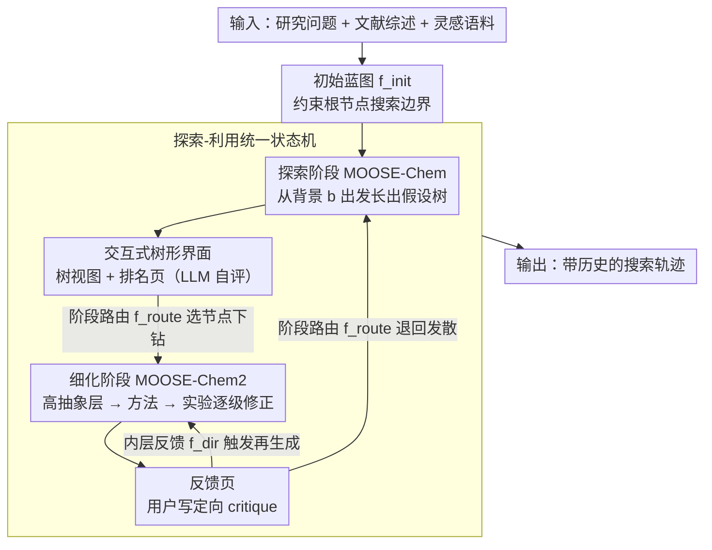

# MOOSE-Copilot: A Web-Based Interactive Assistant for Unified Exploratory and Fine-Grained Scientific Hypothesis Discovery

**会议**: ACL 2026  
**arXiv**: [2605.29475](https://arxiv.org/abs/2605.29475)  
**代码**: https://moosedemo.com (演示网站；缓存未提供 GitHub 仓库链接)  
**领域**: LLM Agent / 科学发现  
**关键词**: 科学假设发现, 人机协同, 探索-利用, 交互式代理, MOOSE-Chem  

## 一句话总结
MOOSE-Copilot 把发散式科研 idea 探索和收敛式细粒度假设 refinement 统一到一个可视化人机协同系统中，并用初始蓝图、阶段路由和反馈三类显式人工信号显著提升科学假设发现效果。

## 研究背景与动机
**领域现状**：LLM 已经被用于科研流程中的假设生成、实验设计、论文写作和评审辅助，其中“科学假设发现”位于研究流程的早期，直接影响后续实验方向和潜在价值。现有自动化发现系统大致分成两类：一类偏发散探索，从研究背景出发生成多样化高层想法；另一类偏细粒度优化，从一个初始概念出发补全方法、实验和执行细节。

**现有痛点**：这两类系统通常被当成独立任务处理。探索式系统能扩展方向，但输出往往粗糙、欠具体；细粒度系统能把一个 idea 打磨成可执行方案，却依赖已经选好的起点。更重要的是，许多 agent 工作流基本自治运行，领域专家只能在事后筛选，难以及时纠偏。

**核心矛盾**：科学发现同时需要 exploration 和 exploitation。完全自动化地在高层灵感空间和细粒度实验空间中联合搜索，会遇到巨大的组合爆炸；但如果只保留人工手工控制，又会损失 LLM 在大规模生成和局部 refinement 上的优势。

**本文目标**：作者希望建立一个统一框架，把 MOOSE-Chem 的探索式搜索和 MOOSE-Chem2 的细粒度 refinement 串起来，同时让人类专家在关键节点注入方向性信息，决定从哪里开始、何时转入细化、以及如何根据反馈重生成。

**切入角度**：论文把 human-in-the-loop 不是当成 UI 功能，而是形式化为 Human-AI Interaction Interface (HAII) protocol。也就是说，人类输入被建模为搜索过程中的路由算子和约束信号，用来裁剪搜索空间、指定粒度转换、修正当前轨迹。

**核心 idea**：用结构化人类信号把“发散搜索 + 收敛优化”的联合空间分解成一条可控的人机协同搜索轨迹。

## 方法详解
MOOSE-Copilot 的核心不是提出一个新的单阶段生成器，而是把已有的 MOOSE-Chem 和 MOOSE-Chem2 放进一个统一状态机里，并给这个状态机配上可视化交互界面。系统左侧负责探索，从背景和 inspiration corpus 中扩展 hypothesis tree；右侧负责 exploitation，把某个粗粒度节点逐层细化成更完整的研究方案。用户在中间扮演导航者，决定哪些节点值得继续探索、哪些节点应该下钻细化，以及哪些生成结果需要带着反馈再生成。

### 整体框架
输入端包括研究问题、可选 literature survey、可选 inspiration knowledge corpus，以及用户自己的初始蓝图。系统首先通过 MOOSE-Chem 把背景 $b$ 和 inspiration knowledge $i_j$ 结合，逐步生成一棵假设树；每条路径代表一串 inspiration-driven updates。随后，用户可以从树上选中某个假设节点，将其路由到 MOOSE-Chem2。MOOSE-Chem2 再用层级搜索策略，从高抽象层的 correction 开始，逐步向方法细节和实验设计层收敛。

输出端不是单个答案，而是一条带历史的 search trajectory。界面提供输入页、树视图、排名页和反馈页：树视图显示假设如何由不同 inspiration 演化；排名页展示 LLM 自评得分；反馈页允许用户选择继续探索还是进入细粒度细化，并输入定向 feedback。

### 关键设计

**1. 探索-利用统一状态机：把发散搜索和细粒度优化拼成一个闭环**

单独跑探索式系统容易得到一堆粗糙、不可执行的 idea，单独跑细化系统又缺一个机制告诉它该从哪个 idea 起步——这正是把两类系统割裂处理的代价。MOOSE-Copilot 的做法是把两边塞进同一个状态机：探索阶段近似 $P(h \mid b)$，从背景 $b$ 出发不断挑选 inspiration、更新中间假设，长出一棵假设树；细化阶段则把树上某个被选中的初始假设 $h_0$ 当成待优化对象，在不同抽象层上逐级修正，使它更可执行、更自洽。两个阶段共享同一条搜索轨迹，于是探索产出的节点天然成为细化的起点，细化暴露的不足又可以回流到探索重新发散，形成真正的 exploration-exploitation 循环，而不是两个互不通气的工具。

**2. 三类 HAII 指导信号：把"人在环里"形式化成三个搜索算子**

全自动系统最难的是判断"什么时候该继续发散、什么时候该收敛、哪个分支值得继续推"，而这恰恰是领域专家几秒钟就能给出直觉的地方。论文没有把 human-in-the-loop 当成 UI 摆设，而是把人类输入抽象成三个作用在搜索过程上的算子：$f_{init}$ 是 initial blueprint，约束根节点的搜索边界，让系统不必在过大的概念空间里盲搜；$f_{route}$ 是 inter-stage routing，让用户决定何时从概念空间 $\mathcal{C}$ 下钻到执行空间 $\mathcal{E}$，或反过来从细化结果退回探索；$f_{dir}$ 是 intra-stage feedback，把用户的 critique 合进上下文并触发 regenerative generation。三者各管一段——起点、阶段切换、轨迹修正——好处是每类信号的边际贡献都能被单独度量，后续系统也能照这个协议比较不同人类信号的价值。

**3. 交互式树形界面：让假设的演化过程看得见、可回退**

科学家要的从来不只是一个自动吐出的答案，而是想知道这个 idea 怎么长出来、在哪里分叉、为什么这一支值得继续。命令行式的 agent 工具既有门槛又藏住了中间状态。MOOSE-Copilot 把每个 hypothesis 做成树中一个节点，配上输入页、树视图、排名页和反馈页：树视图展示假设如何被不同 inspiration 驱动演化，排名页给出 LLM 自评得分，反馈页让用户在"继续探索"和"进入细化"之间选择并写入定向反馈，再决定下一步调用 MOOSE-Chem 还是 MOOSE-Chem2。可视化的中间状态让上面两类信号真正可操作，也让整条 search trajectory 可追踪、可回退。

### 一个完整示例：从背景到一条可执行假设

设研究者输入一个化学背景 $b$ 和一份 inspiration corpus，并写下初始蓝图 $f_{init}$ 圈定关注的反应体系。系统先用 MOOSE-Chem 在这个约束下展开假设树，长出若干条 inspiration-driven 的高层路径；研究者在树视图里浏览这些粗粒度节点，对照排名页的自评分，用 $f_{route}$ 选中其中一条最有潜力的假设把它路由进 MOOSE-Chem2。MOOSE-Chem2 从高抽象层的 correction 开始，逐层向方法细节、实验设计收敛，生成一份更完整的方案。研究者在反馈页发现实验设计这一层有问题，于是写下定向 critique（$f_{dir}$）触发 regenerative generation；如果反馈足够强、重复几轮，这条假设对 ground-truth 元素的 recall 会持续抬升、search steps 反而下降。整个过程不是一次性出答案，而是"发散成树 → 选节点下钻 → 反馈再生成"的可控轨迹。

### 损失函数 / 训练策略
本文没有训练新的大模型，主要评估系统对人类指导信号的响应能力。实验使用 oracle-simulated evaluation：oracle LLM 能访问 ground-truth fine-grained hypothesis，但只能生成方向性 critique，不能直接泄露答案；节点选择也通过 oracle ranking 模拟高质量专家路由。这样做的目的不是估计普通用户的真实表现，而是给出结构化专家信号下的性能上界。

## 实验关键数据

### 主实验
实验在 TOMATO-Chem2 上进行，包含 51 篇顶级论文的研究问题、literature survey 和细粒度 hypothesis 标注。指标是生成假设对 ground-truth elements 的 recall。

| 方法 | 主要设置 | Recall | Search Steps |
|------|----------|--------|--------------|
| baseline_MC | 只用 MOOSE-Chem 探索 | 11.44% | 未报告 |
| baseline_MC2 | 只用 MOOSE-Chem2 细化 | 10.33% | 478.6 |
| MC_with_hint | MOOSE-Chem + initial blueprint | 15.37% | 未报告 |
| MC_with_feedback_with_hint | 初始蓝图 + oracle ranking + feedback + MOOSE-Chem | 16.93% | 未报告 |
| MC2_with_MC_input_oracle_rank | 探索后用 oracle 选节点进入 MOOSE-Chem2 | 18.26% | 336.6 |
| MC2_with_feedback_oracle_rank | oracle 选节点 + 1 次 feedback refinement | 21.98% | 166.1 |
| MC2_with_strong_feedback_x4_oracle_rank | oracle 选节点 + 4 次 strong feedback refinement | 26.96% | 90.1 |

### 消融实验
| 指导信号 | 对比设置 | 观察 |
|----------|----------|------|
| 初始蓝图 | MC 11.44% vs MC_with_hint 15.37% | 初始约束能明显缩小搜索范围，提高粗粒度探索质量 |
| 阶段路由 | self-ranking 进入 MC2 为 12.74%，oracle-ranking 进入 MC2 为 18.26% | 选中哪个节点下钻几乎决定后续 refinement 的上限 |
| 方向反馈 | 普通 feedback x1 为 21.98%，strong feedback x4 为 26.96% | 更强、更明确的反馈能持续推高 recall，并减少 search steps |
| 纯自治细化 | baseline_MC2 为 10.33%，需要 478.6 steps | 没有人类路由和反馈时，细粒度搜索成本高且效果低 |

### 关键发现
- initial blueprint 把探索限制在更合理的起点附近，使系统不必在过大的概念空间中盲搜。
- routing 的作用非常大：同样是从 MOOSE-Chem 输出进入 MOOSE-Chem2，自排序节点只有 12.74%，oracle 选节点达到 18.26%。
- feedback 不只是微调语言表达，而是在细化阶段改变搜索轨迹；strong feedback x4 达到最高 recall 26.96%，同时 search steps 降到 90.1。

## 亮点与洞察
- 最有价值的地方是把“人类参与”形式化成搜索中的三个控制信号，而不是泛泛说 human-in-the-loop。这个抽象让后续系统可以比较不同人类信号的边际贡献。
- 论文很好地区分了探索式 hypothesis discovery 和细粒度 hypothesis discovery。很多科研 agent 论文只展示最终 idea，MOOSE-Copilot 更强调 idea 从粗到细的演化路径。
- 树形界面对科研场景很贴切，因为研究者通常不是一次性接受某个答案，而是在多个分支之间反复比较、回退和下钻。
- oracle-simulated evaluation 的意义在于测系统上限：如果专家信号足够好，框架能不能接得住。结果显示接得住，但也说明真实用户研究仍然必要。

## 局限与展望
- 作者明确承认系统还没有集成自动实验执行，因此从“假设生成”到“实验证伪”的闭环尚未完成。
- 系统也没有使用专门面向科学假设发现的 post-training 方法，生成质量仍依赖底层 LLM 和既有 MOOSE 系列模块。
- 当前评估用 oracle 模拟高质量专家信号，能证明协议有效，但不能直接代表真实科学家的使用成本、认知负担和反馈质量。
- 后续可以把实验执行、文献检索、失败案例回传和 hypothesis ranking 打通，让 $f_{dir}$ 不只来自人类文本反馈，也来自真实实验结果。

## 相关工作与启发
- **vs MOOSE-Chem**: MOOSE-Chem 把探索式假设发现建模为 inspiration-driven search，本文保留这个发散能力，但加入人工蓝图、路由和后续细化。
- **vs MOOSE-Chem2**: MOOSE-Chem2 专注于把一个初始假设逐级细化，本文解决的是初始假设从哪里来、何时进入细化、如何根据反馈再生成。
- **vs IdeaSynth / NOVA / LLM-SR**: 这些系统强调自动生成或迭代 idea，MOOSE-Copilot 更强调交互协议和可视化可控性。
- **启发**: 对科研 agent 来说，“可控的中间状态”可能比“端到端自动生成”更重要；把用户操作抽象为可评估信号，是设计下一代科学发现系统的关键。

## 评分
- 新颖性: ⭐⭐⭐⭐☆ 将探索与细化统一到 HAII 协议中很有辨识度，但底层生成模块主要复用 MOOSE 系列。
- 实验充分度: ⭐⭐⭐☆☆ 有清晰消融和数字，但主要是 oracle-simulated setting，真实用户实验不足。
- 写作质量: ⭐⭐⭐⭐☆ 动机、协议和界面对应关系清楚，读者容易理解系统为什么这样设计。
- 价值: ⭐⭐⭐⭐☆ 对科研 agent 的人机协同设计有直接参考价值，尤其适合复杂科学发现流程。

<!-- RELATED:START -->

## 相关论文

- [\[ICLR 2026\] SR-Scientist: Scientific Equation Discovery With Agentic AI](../../ICLR2026/llm_agent/sr-scientist_scientific_equation_discovery_with_agentic_ai.md)
- [\[CVPR 2026\] Seeing as Experts Do: A Knowledge-Augmented Agent for Open-Set Fine-Grained Visual Understanding](../../CVPR2026/llm_agent/seeing_as_experts_do_a_knowledge-augmented_agent_for_open-set_fine-grained_visua.md)
- [\[ICLR 2026\] NewtonBench: Benchmarking Generalizable Scientific Law Discovery in LLM Agents](../../ICLR2026/llm_agent/newtonbench_benchmarking_generalizable_scientific_law_discovery_in_llm_agents.md)
- [\[ICML 2025\] Evaluating Retrieval-Augmented Generation Agents for Autonomous Scientific Discovery in Astrophysics](../../ICML2025/llm_agent/evaluating_retrieval-augmented_generation_agents_for_autonomous_scientific_disco.md)
- [\[ICML 2025\] Open Source Planning & Control System with Language Agents for Autonomous Scientific Discovery](../../ICML2025/llm_agent/open_source_planning_control_system_with_language_agents_for_autonomous_scientif.md)

<!-- RELATED:END -->
