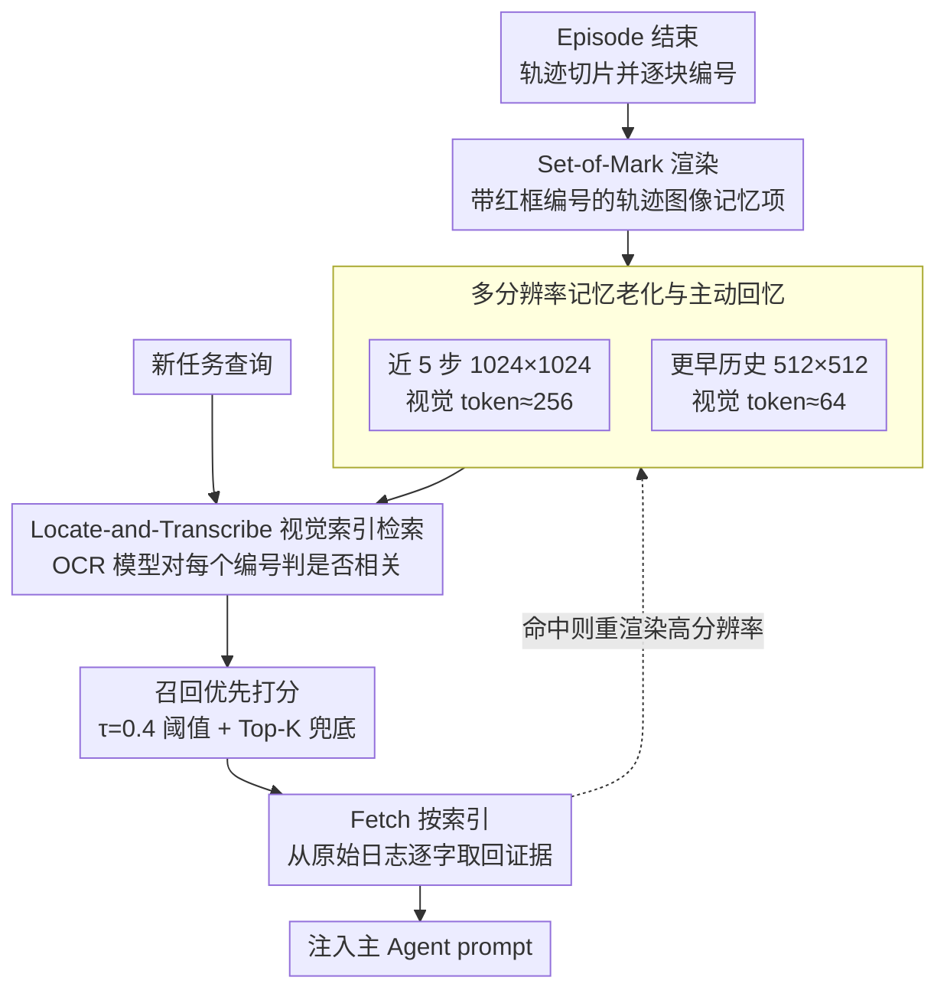

# OCR-Memory: Optical Context Retrieval for Long-Horizon Agent Memory

**会议**: ACL 2026  
**arXiv**: [2604.26622](https://arxiv.org/abs/2604.26622)  
**代码**: 未公开（论文未给出代码链接）  
**领域**: LLM Agent / 长期记忆  
**关键词**: 光学上下文压缩, Agent记忆, 视觉检索, 长上下文, Set-of-Mark  

## 一句话总结
OCR-Memory 将长程 Agent 交互轨迹渲染成带编号锚点的图像，让微调后的 OCR 检索器先在视觉空间定位相关片段、再按索引回取原始文本，从而在严格上下文预算下保留完整历史并提升 Mind2Web 和 AppWorld 上的长程任务表现。

## 研究背景与动机
**领域现状**：LLM Agent 正在从单轮问答走向长期交互系统，例如网页操作、移动应用操作、工具调用和连续任务处理。
这类系统的能力不只取决于当前推理，还取决于它能否复用过去 episode 中积累的失败原因、操作路径、工具反馈和环境状态。

**现有痛点**：最直接的做法是把历史轨迹放进外部记忆，再用文本检索或摘要把相关内容塞回 prompt。
但原始轨迹通常包含大量中间推理、动作、网页结构、API 返回和错误信息，完整保存会很占 token；摘要和抽象技能虽然省 token，却容易丢掉精确字段、时序关系和低层细节。
一旦任务需要回看某个旧步骤中的按钮、报错、参数名或多步因果链，压缩后的文本记忆就会显得过于粗糙。

**核心矛盾**：Agent 长期记忆同时要求“高容量”和“高保真”。
文本上下文窗口限制迫使系统做选择：要么保留大量原始历史但无法放进 prompt，要么压缩历史但牺牲细节。
传统 RAG 还会遇到语义相似但逻辑无关的片段，生成式记忆检索则可能把模糊历史补写成看似合理但并不存在的证据。

**本文目标**：作者希望构造一个长期记忆模块，它能保存任意长的历史轨迹，在检索时只消耗很少上下文预算，并且最终给主 Agent 的证据必须是原文级别的、可追溯的、低幻觉的。
因此问题被拆成三个子问题：如何高密度存储轨迹，如何从压缩表示里找出相关片段，如何把找到的片段恢复成可信文本。

**切入角度**：论文借用了 DeepSeek-OCR 所代表的“光学上下文压缩”观察：密集文本可以被渲染成图像，再以相对少量视觉 token 输入模型。
图像在这里不是为了让 Agent 看场景，而是作为一种高密度的长期记忆介质。
如果视觉模型只负责定位相关区域，而不负责生成最终文本，就可以把“看图找位置”和“返回证据原文”分开。

**核心 idea**：用带视觉锚点的图像记忆代替纯文本记忆，让模型输出相关片段索引，再从外部日志确定性取回原始文本，以视觉压缩换取更大的有效记忆容量。

## 方法详解
OCR-Memory 的核心不是让主 Agent 直接阅读所有历史图像，而是在主 Agent 之外放一个专门的 optical retriever。
这个 retriever 只做一件事：给定当前任务查询和历史轨迹图像，判断哪些编号片段可能有用。
真正注入主 Agent prompt 的仍然是文本，但这些文本不是视觉模型生成出来的，而是根据索引从原始日志里取出的逐字证据。

### 整体框架
系统维护一个外部记忆库，每个记忆项包含三部分：一张由历史轨迹 chunk 渲染得到的图像、图像中每个编号块对应的原始文本片段，以及时间戳和 episode id 等元数据。
当一个 episode 结束后，系统把用户输入、Agent 推理、工具调用、工具返回和环境反馈切成片段，给每个片段分配唯一编号，并用红色边框与编号把它们标在图像上。

当新任务到来时，OCR-Memory 不把所有历史文本塞给主 Agent，而是把当前查询和历史图像输入 DeepSeek-OCR 风格的检索模型。
模型对每张记忆图像中的每个编号输出相关概率或二值标签，系统再根据阈值和 Top-K 规则选择若干片段。
最后，`Fetch` 操作根据这些片段索引回到外部日志，拼接出原始文本证据并注入主 Agent 的 prompt。

这种流程把 Agent 记忆拆成两层：图像层负责低 token 成本的大范围扫描，文本日志层负责高保真的证据恢复。
主 Agent 看到的是精确取回的文本上下文，而不是 OCR 模型自由生成的摘要。

### 关键设计

**1. Locate-and-Transcribe 视觉索引检索：把"生成证据"改成"选择编号"**

历史检索最怕两件事——长序列解码慢，以及视觉模型转写低分辨率图像时凭语义补全不存在的信息。这里的破局点是不让模型写证据，只让它选编号。每个记忆项写成 $m_i=(I_i,\{s_{i,k}\}_{k=1}^{K_i},\pi_i)$，其中 $I_i$ 是带编号的轨迹图像，$s_{i,k}$ 是第 $k$ 个编号对应的原始文本，$\pi_i$ 是元数据。检索模型对每个片段输出是否相关的二值判断，得到索引集合 $\hat{S}(q)=\{(i,k)\mid \hat{y}_{i,k}=1\}$，再由 $Fetch$ 从外部日志确定性取回 $s_{i,k}$。这样一来，任务被约束成可验证的指针选择，最终注入主 Agent 的文本始终是数据库逐字返回的原文，而非模型自由生成，幻觉和解码成本被同时压下。

**2. 召回优先的打分与选择规则：宁可多给，不愿漏掉**

在长程 Agent 任务里，漏掉一个关键历史步骤往往比多塞几个无关片段更致命，所以检索规则显式偏向 recall。模型虽然能给出二值标签，但推理时作者不依赖 greedy 输出，而是读取 "1" 与 "0" 两个标签 token 的 logits，计算相关概率 $p_{i,k}=\exp z_{i,k}(1)/(\exp z_{i,k}(1)+\exp z_{i,k}(0))$。选择时用一个偏低的阈值 $\tau=0.4$，并在没有任何高置信片段时用 Top-K 兜底（实现中 Top-K 为 5，总取回上限 20）。这套偏 recall 的规则保证 retriever 即便不确定，也能给主 Agent 留住最低限度的历史线索。

**3. 多分辨率记忆老化与主动回忆：旧记忆先模糊存、被命中再变清晰**

把所有历史都用高分辨率图像保存，视觉 token 成本会随历史长度爆炸。这里把"记忆衰退"做成一种自适应压缩：最近 5 个交互步骤用 1024×1024 高分辨率（DeepSeek-OCR 视觉 token 预算约 256），更早历史降到 512×512（预算约 64）；一旦某个低分辨率记忆被检索命中，系统就从原始日志重新渲染出高分辨率版本，并在当前 episode 剩余时间内保持高保真。其背后的判断是，多数旧历史只需保留语义轮廓，少数被重新激活的才值得细节，于是容量与可读性之间取得了动态折中。

### 损失函数 / 训练策略
OCR-Memory 基于 DeepSeek-OCR 3B 构建，但原始模型更擅长转写，不一定擅长“根据问题找支持片段”。
作者因此把 HotpotQA 改造成视觉检索训练集：把每个问题的候选段落渲染成带编号的图像，丢弃文本答案，只用 supporting facts 的段落索引构造二值标签。

训练目标是加权二元交叉熵。
因为相关片段远少于无关片段，作者设置正样本权重大于负样本权重，具体实现中 $w_+=2.0$、$w_-=1.0$，从损失层面惩罚漏检。
模型训练时冻结 vision encoder，只用 LoRA 微调 language decoder，LoRA 加在 q_proj、k_proj、v_proj、o_proj，rank 为 16，缩放系数为 32，dropout 为 0.05。

训练超参方面，作者在 HotpotQA distractor 训练 split 上训练 3 个 epoch，AdamW 优化器，峰值学习率 $1e^{-5}$，10% warmup，global batch size 为 128，梯度裁剪为 1.0。
为了匹配推理时的新旧记忆分辨率，训练中还加入 resolution curriculum：按 $[0.3,0.7]$ 的概率采样 1024×1024 和 512×512 两个分辨率，让模型习惯在清晰图和模糊缩略图上都进行索引选择。

主 Agent 与记忆模块解耦。
实验默认主推理模型为 GPT-4、temperature 为 0；后续泛化实验还替换为 Qwen3-32B，验证收益主要来自记忆机制而不是某个特定推理模型。

## 实验关键数据

### 主实验
作者在 Mind2Web Cross-Task split 和 AppWorld 上评估长程 Agent 记忆能力。
Mind2Web 报告元素准确率、动作 F1、Step Success Rate 和 Task Success Rate；AppWorld 报告不同难度下的成功率。
所有记忆方法默认受 4096 token 上下文预算约束。

| 方法 | Mind2Web Ele Acc | Mind2Web F1 | Mind2Web Step SR | Mind2Web Task SR | AppWorld Easy | AppWorld Med | AppWorld Hard | AppWorld Avg |
|------|------------------|-------------|------------------|------------------|---------------|--------------|---------------|--------------|
| Zero-Shot | 40.1 | 46.2 | 37.9 | 2.2 | 68.7 | 36.2 | 20.9 | 41.9 |
| Text Retrieval | 41.3 | 48.2 | 38.9 | 2.7 | 72.5 | 44.8 | 21.4 | 46.2 |
| MemoryBank | 43.8 | 49.5 | 39.2 | 3.3 | 81.3 | 50.1 | 24.9 | 52.1 |
| AWM | 49.1 | 55.7 | 42.6 | 4.3 | 84.1 | 53.6 | 27.2 | 55.0 |
| ACON | 48.2 | 54.1 | 41.4 | 4.1 | 84.8 | 55.1 | 28.7 | 56.2 |
| OCR-Memory | 53.8 | 59.2 | 46.1 | 4.8 | 86.2 | 57.4 | 30.8 | 58.1 |

OCR-Memory 在两个 benchmark 上都优于文本检索和现有记忆系统。
在 Mind2Web 上，相比 AWM，元素准确率从 49.1 提升到 53.8，Step SR 从 42.6 提升到 46.1。
在 AppWorld 上，优势在 Hard 子集最明显：OCR-Memory 达到 30.8，高于 Text Retrieval 的 21.4 和 AWM 的 27.2。
这说明视觉压缩并不只是省 token，它确实帮助系统恢复了对复杂历史细节的访问能力。

### 消融实验
首先看 Set-of-Mark 机制。
作者比较了完整方法、直接生成相关文本的变体，以及预测 bounding box 的变体。

| 配置 | Ele Acc | Step SR | 检索延迟 | 说明 |
|------|---------|---------|----------|------|
| OCR-Memory Full | 53.8 | 46.1 | 1.7s | 带 SoM 编号，输出片段索引并回取原文 |
| w/o SoM (Text Gen) | 46.5 | 39.2 | 5.3s | 让模型生成文本，幻觉更多且解码更慢 |
| w/o SoM (BBox) | 49.2 | 44.5 | 2.1s | 预测框位置较快，但不如编号选择精确 |

这个消融非常关键。
如果不使用 SoM，模型要么进入自由生成模式，要么只能给出不够稳定的空间框。
编号锚点把图像检索变成列表式证据选择，因此同时提升准确率和延迟。

多分辨率主动回忆实验说明，动态压缩比固定低分辨率更稳，比固定高分辨率更省 token。

| 分辨率策略 | Step SR | Task SR | 每帧平均视觉 token | 说明 |
|------------|---------|---------|--------------------|------|
| Static Low-Res 512×512 | 39.7 | 2.9 | 65 | token 最省，但旧图过糊导致语义识别失败 |
| Static High-Res 1024×1024 | 46.5 | 4.9 | 256 | 性能略高，但长期历史成本过大 |
| Dynamic (Ours) | 46.1 | 4.8 | 82 | 接近高分辨率效果，同时接近低分辨率成本 |

作者还从检索准确率和系统成本两侧补充分析。

| 分析项 | 对比对象 | OCR-Memory 结果 | 主要结论 |
|--------|----------|-----------------|----------|
| NIAH 4k / 32k | 视觉压缩长文检索 | 98.5 / 94.1 Recall@1 | 上下文增长到 32k 后仍保持较高检索精度 |
| Experience Retrieval | Dense Text-RAG | Recall@1 78.6 vs 52.7，MRR 0.84 vs 0.61 | 光学检索能更准确找到相关历史片段 |
| 证据忠实度 | 生成式检索 | 100.0 vs 84.3 | 索引回取原文避免了证据文本被生成篡改 |
| 系统效率 | Text-RAG | 596 vs 3980 text tokens/step | 以 1.7s 延迟和 1.47MB/episode 存储换取 6.7× prompt token 降低 |

### 关键发现
- SoM 编号锚点是最核心的工程设计；它让视觉模型不再承担“写证据”的责任，只做“找证据”的判断。
- 多分辨率机制的价值在于成本曲线，而不是单点最高分；动态策略用 82 个视觉 token 接近 256 token 高分辨率的成功率。
- OCR-Memory 在 token budget 越紧时越有优势；论文报告 1024 到 8192 token 范围内都优于 Text-RAG，说明它解决的是上下文瓶颈而非单纯模型容量问题。
- 换成 Qwen3-32B 后仍有收益：Text Retrieval 的 Ele Acc / Step SR / Task SR 为 35.2 / 31.5 / 1.8，OCR-Memory 为 48.6 / 42.3 / 3.9，说明方法对主 Agent backbone 不太敏感。
- 系统并非所有资源都更便宜；它明确用磁盘、渲染和视觉检索延迟，换取主推理上下文中的 token 节省。

## 亮点与洞察
- 最有意思的点是把“图像”当作 Agent 历史的压缩介质，而不是传统多模态任务中的环境观测。这个转向让视觉 token 成为长期文本记忆的容量扩展器。
- Locate-and-Transcribe 的设计很干净：定位由神经模型完成，转写由确定性数据库完成。这样既利用了 VLM/OCR 的视觉理解，又避免把证据恢复交给自由生成。
- 论文没有停留在“压缩率更高”这一个指标上，而是同时报告任务成功、检索级 Recall/MRR、证据忠实度、延迟和存储成本。这个评估方式更接近真实 Agent 系统部署时关心的多资源权衡。
- 主动回忆机制给长期记忆提供了一种很自然的状态管理：旧记忆先模糊存放，被命中后重新变清晰。这个思想可以迁移到文本摘要、向量库或事件日志系统中，用访问频率决定信息保真度。
- 对其他 Agent 系统而言，可复用的 trick 是“索引化证据恢复”。即使不使用 OCR，也可以让模型只输出可验证指针，再由外部存储返回原始证据，减少检索增强系统里的幻觉。

## 局限与展望
- 作者承认 OCR-Memory 需要微调专门的 optical retriever；相比训练自由的 BM25、dense retrieval 或摘要记忆，前期训练成本更高。
- 渲染交互日志为图像会带来额外计算开销，磁盘占用也明显增加。论文的系统效率表中，Text-RAG 每个 episode 约 18KB，而 OCR-Memory 约 1.47MB。
- 部署时需要额外维护 DeepSeek-OCR 视觉编码器和解码器参数；如果主 Agent 已经很大，这会增加显存和工程复杂度。
- 方法依赖渲染质量和视觉锚点可读性。对于极长表格、动态网页、代码 diff 或高度结构化但字体很小的日志，512×512 缩略图可能仍会丢失关键局部线索。
- 现有 aging 策略比较简单，只按最近 5 步和更早历史分两档；未来可以学习更细粒度的记忆保真度策略，例如按任务重要性、失败频率或用户反馈决定分辨率。
- 隐私与安全问题值得进一步研究。Agent 历史图像可能包含用户输入、网页内容和工具返回，比纯文本日志更难做局部脱敏和权限控制。

## 相关工作与启发
- **vs Text-RAG**: Text-RAG 直接用向量相似度取文本片段，优点是简单快速；OCR-Memory 先把历史作为图像扫描，再回取原文，成本更高但在长历史和紧 token 预算下更稳。
- **vs MemoryBank**: MemoryBank 强调长期记忆管理与摘要，适合保存用户偏好和长期状态；OCR-Memory 更关注完整轨迹的细粒度证据恢复，因此更适合需要回看具体操作步骤的 Agent 任务。
- **vs AWM**: AWM 把历史经验抽象成 workflow，提高复用效率；OCR-Memory 不急着抽象，而是保留原始证据，优势在于当任务依赖具体网页元素、API 返回或失败细节时更不容易丢信息。
- **vs ACON**: ACON 属于上下文压缩路线，目标是在文本上下文内优化长程信息；OCR-Memory 则把压缩载体移到视觉模态，并通过索引回表保证最终证据忠实。
- **vs DeepSeek-OCR**: DeepSeek-OCR 证明了光学上下文压缩的可行性；本文把这个能力改造成 Agent 记忆系统，并加入 SoM、HotpotQA 检索微调和主动回忆，使它从“读图中文字”变成“从历史图像中找任务证据”。

## 评分
- 新颖性: ⭐⭐⭐⭐⭐ 视觉模态作为长期 Agent 记忆介质的切入很新，Locate-and-Transcribe 也把幻觉问题处理得很有针对性。
- 实验充分度: ⭐⭐⭐⭐☆ 覆盖主任务、消融、长上下文检索、backbone 泛化和系统成本，但真实线上长期部署与隐私压力测试还不够。
- 写作质量: ⭐⭐⭐⭐☆ 方法线索清楚，表格信息密集；部分公式和表格排版略显机械，读者需要自己把系统流程串起来。
- 价值: ⭐⭐⭐⭐⭐ 对长程 Agent、个人助理和网页自动化都有直接启发，尤其适合上下文窗口仍然昂贵且证据忠实度很重要的场景。

<!-- RELATED:START -->

## 相关论文

- [\[ACL 2026\] StructMem: Structured Memory for Long-Horizon Behavior in LLMs](structmem_structured_memory_for_long-horizon_behavior_in_llms.md)
- [\[ACL 2026\] TiMem: Temporal-Hierarchical Memory Consolidation for Long-Horizon Conversational Agents](timem_temporal-hierarchical_memory_consolidation_for_long-horizon_conversational.md)
- [\[ACL 2026\] Grounding Agent Memory in Contextual Intent](grounding_agent_memory_in_contextual_intent.md)
- [\[ACL 2026\] Lightweight LLM Agent Memory with Small Language Models](lightweight_llm_agent_memory_with_small_language_models.md)
- [\[ICML 2026\] ACON: Optimizing Context Compression for Long-horizon LLM Agents](../../ICML2026/llm_agent/acon_optimizing_context_compression_for_long-horizon_llm_agents.md)

<!-- RELATED:END -->
