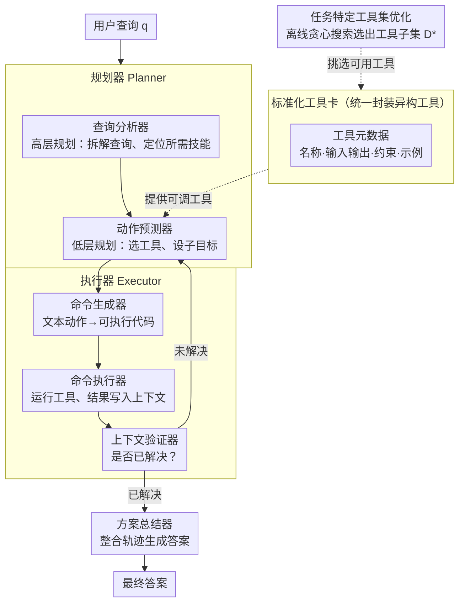

# OctoTools: An Agentic Framework with Extensible Tools for Complex Reasoning

**会议**: ACL 2026  
**arXiv**: [2502.11271](https://arxiv.org/abs/2502.11271)  
**代码**: [https://github.com/octotools/octotools](https://github.com/octotools/octotools)  
**领域**: LLM推理  
**关键词**: 智能体框架, 工具增强推理, 多步规划, 工具卡, 可扩展性

## 一句话总结

OctoTools是一个免训练、用户友好且易于扩展的多智能体框架，通过标准化**工具卡**封装异构工具、**Planner-Executor**分离范式和**任务特定工具集优化**算法，在16个多样化基准上实现了比GPT-4o平均+9.3%、比AutoGen/LangChain等框架最多+10.6%的准确率提升。

## 研究背景与动机

**领域现状**: LLM在摘要、翻译、代码生成等任务上进展迅速，但涉及多步骤、逻辑分解或专业领域知识的复杂推理任务仍具挑战。工具增强LLM是一个有前景的方向，通过将专门子任务卸载到外部工具（搜索引擎、计算器、领域模型等）来增强LLM能力。

**现有痛点**: (1) 许多方法需要大量训练数据和微调，限制了对新领域的适应性；(2) 部分方法仅适用于特定领域（化学、视觉、医疗等），缺乏通用性；(3) 现有通用框架（AutoGen、LangChain、GPT-Functions）更侧重高层抽象或多智能体协作，对复杂推理的定量评测不够深入；(4) 将规划与代码执行合并给单一模型会导致过载和错误。

**核心矛盾**: 如何构建一个既通用（跨域）又高效（多步推理+工具调用）、且无需额外训练的智能体框架。

**本文目标**: 提出一个免训练、模块化、可扩展的智能体框架，能在多样化的复杂推理任务上一致性地提升性能。

**切入角度**: 将工具封装标准化（工具卡），将策略规划与命令执行解耦（Planner vs Executor），将工具选择自动化（工具集优化算法）。

**核心idea**: 通过标准化的工具卡接口 + 分层的Planner-Executor架构 + 贪心工具集优化，构建一个模块化的多步推理管线，每个组件专注于自己的角色。

## 方法详解

### 整体框架

给定用户查询 $q$ 和预训练模型 $\text{LLM}_\theta$，OctoTools 以迭代方式运行：**规划器（Planner）**先做高层规划——查询分析器（Query Analyzer）拆解查询、识别所需技能与候选工具；再在每一步做低层规划——动作预测器（Action Predictor）选定本步工具并设定子目标。随后交给**执行器（Executor）**：命令生成器（Command Generator）把文本动作翻译成可执行代码，命令执行器（Command Executor）调用工具并把结构化结果写入上下文，上下文验证器（Context Verifier）判断问题是否已解决——未解决就回到下一步规划，已解决则由**方案总结器（Solution Summarizer）**整合整条轨迹生成最终答案。所有工具都经**工具卡（Tool Cards）**统一封装，而每个任务实际可调用的工具子集由**任务特定工具集优化**算法离线挑选。

### 关键设计

**1. 标准化工具卡（Tool Cards）：用统一接口封装异构工具**

OctoTools 把搜索引擎、代码执行器、领域分类器等形态各异的工具，统一包装成「工具卡」。每张卡用一份标准化元数据描述工具——名称、输入输出类型、使用约束、最佳实践与调用示例，并实现 `execute()` 和 `get_metadata()` 两个固定函数。关键在于：元数据是写给 LLM 看的，规划器只读卡片就能自主判断某个工具适不适合当前子目标，无需把工具逻辑硬编码进框架；接入新工具也只需新增一张符合规范的卡，不改一行框架代码。它针对的正是以往框架「每加一个工具都要做大量适配工程」的痛点，把工具扩展变成真正的即插即用。

**2. Planner-Executor 分离架构：把「想怎么做」和「具体执行」拆开**

让同一个 LLM 既做规划又生成并执行代码，往往因职责过载而出错。OctoTools 因此把决策与执行解耦成两个 agent。规划器（Planner）只负责「想」：查询分析器先做高层规划，通读查询、识别需要哪些技能与候选工具；动作预测器再做低层规划，逐步选定具体工具、设定本步子目标。执行器（Executor）只负责「做」：命令生成器把文本动作翻译成可执行的 Python 命令，命令执行器调用工具并把结构化结果写入上下文，上下文验证器再检查信息是否完整、是否足以回答问题，据此决定继续迭代还是收尾；最后由方案总结器整合整条推理轨迹给出答案。每个组件用各自的 prompt 模板专注单一角色，既提升了可靠性，也让出错时更容易定位到具体环节。

**3. 任务特定工具集优化：自动挑出对当前任务真正有用的工具子集**

把工具箱里所有工具一股脑开放给规划器，反而会引入噪声、拉低准确率。OctoTools 用一个三阶段贪心搜索在验证集上自动选工具：先用基础工具集 $\mathcal{D}_{\text{base}}$ 跑出基线准确率；再逐个把候选工具 $d_i$ 加进来，测它带来的边际增益 $\Delta_{d_i} = \text{Acc}(\mathcal{D}_i) - \text{Acc}(\mathcal{D}_{\text{base}})$；最后把所有正增益的工具聚合成最优工具集 $\mathcal{D}^* = \mathcal{D}_{\text{base}} \cup \{d_i \mid \Delta_{d_i} > 0\}$。贪心策略放弃了枚举全部 $2^n$ 个子集的全局最优，却把复杂度降到 $O(n)$，实验证明在多数任务上反而优于「全工具」配置。

## 实验关键数据

### 主实验

| 方法 | 平均准确率 (16任务) | vs 0-shot | vs CoT |
|---|---|---|---|
| GPT-4o 0-shot | 49.2% | — | — |
| GPT-4o CoT | 50.8% | — | — |
| OctoTools_base (仅基础工具) | 53.4% | +4.2% | +2.6% |
| **OctoTools** (优化工具集) | **58.5%** | **+9.3%** | **+7.7%** |

| 方法 | 平均准确率 | vs OctoTools |
|---|---|---|
| AutoGen | 47.9% | -10.6% |
| GPT-Functions | 51.0% | -7.5% |
| LangChain | 51.2% | -7.3% |
| **OctoTools** | **58.5%** | — |

### 消融实验

| 消融维度 | 结果 |
|---|---|
| 仅基础工具 vs 全部工具 vs 优化工具集 | 53.9% vs 57.4% vs 58.9% |
| 最大步数 (1→10步) | 性能随步数增加整体提升 |
| 弱LLM (GPT-4o-mini) | 平均仍获得+7.1%增益 |

### 关键发现

1. **工具使用差异显著**: OctoTools外部工具使用率67.8%，而AutoGen仅10.6%、LangChain仅10.7%——说明竞品框架未能有效利用外部工具
2. **分解与工具各有贡献**: 任务可分为三类——主要受益于多步分解的（如Hallusion-VD）、主要受益于工具调用的（如PathCLS +22.2%）、两者兼受益的（如Game of 24）
3. **医疗领域提升最大**: PathCLS +22.2%、PathVQA +21.4%，说明专业领域工具（如CONCH病理分类器）的引入价值极高
4. **代理任务（GAIA-Text）提升显著**: +9.7%，需要5种不同工具协作，展示了框架在复杂多步任务上的优势

## 亮点与洞察

1. **工具卡是核心设计亮点**: 标准化的元数据描述使得工具可以被LLM自主理解和选择，实现了真正的开放式工具扩展
2. **88页论文包含极其详细的分析**: 16个基准、11个工具的完整配置、大量可视化和案例分析，对后续研究有很高参考价值
3. **Planner-Executor分离思路清晰**: 避免了LLM同时做规划和代码生成的过载问题，每个组件有专门的prompt模板
4. **贪心工具集优化简单有效**: 虽然不保证全局最优，但实验证明在多数任务上优于全工具集配置

## 局限与展望

1. **依赖GPT-4o**: 所有实验基于GPT-4o，开源模型上的表现未知（仅尝试了GPT-4o-mini）
2. **工具集优化需要验证集**: 贪心搜索需要100个验证样本，冷启动时不可用
3. **单Agent架构**: 未探索多Agent协作场景，复杂任务可能受益于Agent间的讨论和修正
4. **序列化执行**: 每步只调用一个工具，不支持并行工具调用，可能影响效率
5. **工具卡设计需要人工参与**: 虽然接入新工具比以往简单，但仍需要人工编写元数据和示例

## 相关工作与启发

1. **Chameleon (Lu et al., 2023)**: 之前的plug-and-play组合推理框架，但工具支持有限且不支持多步迭代
2. **Visual Sketchpad (Hu et al., 2024)**: 视觉推理Agent，但受限于视觉领域
3. **AutoGen/LangChain**: 通用Agent框架，但在复杂推理基准上定量表现不如OctoTools
4. **ReAct (Yao et al., 2022)**: 推理+行动交织的经典范式，OctoTools在其基础上引入了工具卡和分层规划

## 评分

- **新颖性**: ⭐⭐⭐⭐ — 工具卡标准化和Planner-Executor分离范式设计精巧，工具集优化算法实用
- **实验充分度**: ⭐⭐⭐⭐⭐ — 16个基准、4个对比框架、详尽的消融和案例分析，88页论文覆盖极全面
- **写作质量**: ⭐⭐⭐⭐ — 结构清晰，可视化丰富，案例展示直观
- **价值**: ⭐⭐⭐⭐ — 提供了一个实用的开源Agent框架模板，对Agent开发者有很高的参考价值

<!-- RELATED:START -->

## 相关论文

- [\[ACL 2025\] Agentic Reasoning: A Streamlined Framework for Enhancing LLM Reasoning with Agentic Tools](../../ACL2025/llm_agent/agentic_reasoning_tools.md)
- [\[ACL 2026\] GOAT: A Training Framework for Goal-Oriented Agent with Tools](goat_a_training_framework_for_goal-oriented_agent_with_tools.md)
- [\[ACL 2026\] Don't Adapt Small Language Models for Tools; Adapt Tool Schemas to the Models](don39t_adapt_small_language_models_for_tools_adapt_tool_schemas_to_the_models.md)
- [\[ACL 2026\] MCP-Flow: Facilitating LLM Agents to Master Real-World, Diverse and Scaling MCP Tools](mcp-flow_facilitating_llm_agents_to_master_real-world_diverse_and_scaling_mcp_to.md)
- [\[ACL 2026\] FAMA: Failure-Aware Meta-Agentic Framework for Open-Source LLMs in Interactive Tool Use Environments](fama_failure-aware_meta-agentic_framework_for_open-source_llms_in_interactive_to.md)

<!-- RELATED:END -->
