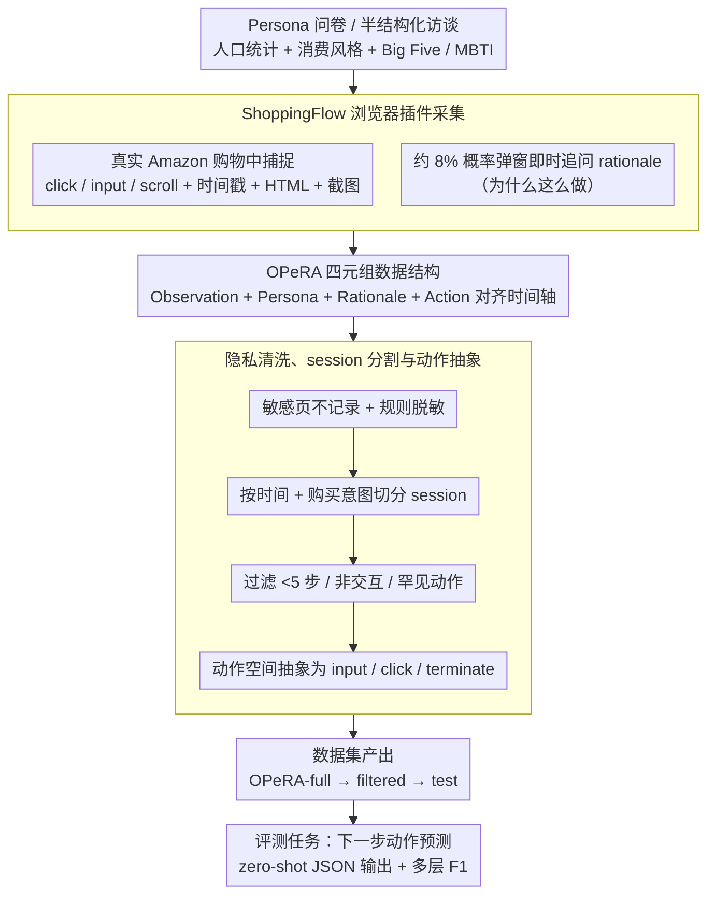

# OPeRA: A Dataset of Observation, Persona, Rationale, and Action for Evaluating LLMs on Human Online Shopping Behavior Simulation

**会议**: ACL 2026  
**arXiv**: [2506.05606](https://arxiv.org/abs/2506.05606)  
**代码**: 无公开代码；数据集: [HuggingFace](https://huggingface.co/datasets/NEU-HAI/OPeRA)  
**领域**: LLM Agent / 用户行为模拟 / 数据集  
**关键词**: 用户行为模拟, 在线购物, Persona, Rationale, Web Agent评测

## 一句话总结

OPeRA 是一个从真实 Amazon 购物过程中采集的用户行为数据集，把 persona、网页观察、细粒度动作和即时 rationale 放在同一条时间轴上，用来评估 LLM 是否真的能模拟特定用户的下一步购物行为。

## 研究背景与动机

**领域现状**：LLM agent 已经能在网页环境里完成搜索、导航、购买、表单填写等任务，也常被用作 UI/UX 测试、社会科学实验、推荐系统评估中的“用户替身”。

**现有痛点**：很多现有评测只看任务是否完成，或者只看最终问卷、购买、点击等聚合结果；这类指标无法回答一个更细的问题：模型在每一步是否像某个真实用户那样观察页面、权衡偏好、解释理由并采取动作。

**核心矛盾**：任务完成型 web agent 追求最短路径和成功率，而真实用户的购物行为经常包含反复比较、阅读评论、修改搜索词、放弃购买等非线性路径。要评估“像不像人”，就不能只记录动作，还需要记录动作发生时的页面上下文、用户长期偏好和当下理由。

**本文目标**：构建一个公开数据集和基准，让研究者可以在同一套真实轨迹上评估 LLM 对特定用户下一步行为的模拟能力。

**切入角度**：作者选择在线购物作为起点，因为购物天然包含个体偏好、预算约束、品牌/价格/评论权衡、多步页面交互和明确的 session 结果，适合作为个性化行为模拟的测试场。

**核心 idea**：用浏览器插件在真实用户自然购物时同步采集 Observation、Persona、Rationale 和 Action，让“用户做了什么”和“为什么这么做”可以一起进入 LLM agent 的行为模拟评测。

## 方法详解

### 整体框架

OPeRA 的构建可以看成“采集—清洗—评测”一条流水线。参与者先填一份 persona 问卷（可选半结构化访谈），随后在四周内装上 ShoppingFlow Chrome 插件，像平时一样在 Amazon 上购物，插件在后台同步记录每一步的动作、时间戳、目标元素、完整与简化 HTML、截图、商品元数据，并以约 8% 的概率弹窗追问用户“为什么这么做”。原始连续日志再经隐私清洗、session 分割、动作过滤和动作空间抽象，得到完整版 OPeRA-full 与更适合建模的 OPeRA-filtered，并从中抽出 OPeRA-test。最终每个购物 session 被组织成一条时间序列，模型要解决的任务是 $a_t = F_{action}(a_{1\ldots t-1}, r_{1\ldots t-1}, o_{1\ldots t}, P_i)$——给定用户 persona $P_i$、历史动作 $a$、历史 rationale $r$ 和当前网页观察 $o$，预测用户接下来会做什么。

### 关键设计

**1. OPeRA 四元组数据结构：把“看到什么”和“为什么做”一起喂给模型**

以往电商数据集大多只留下点击或购买这类聚合结果，丢掉了动作发生时的页面上下文和用户的内心理由，模型只能去拟合点击序列。OPeRA 把行为模拟需要的四类信号统一到同一条用户轨迹里：每个用户带一份 persona（人口统计、购物习惯、消费者风格、Big Five、MBTI 等长期偏好），每个 session 是按时间排序的 action trace，部分动作附有用户自述 rationale，而每一步又配上网页 observation（完整 HTML、简化 HTML、截图、商品元数据）。这样 Observation 对应外部环境、Persona 对应用户长期状态、Rationale 对应当下意图、Action 对应可验证输出，四者刚好覆盖个性化行为模拟的主要变量。

**2. ShoppingFlow 浏览器插件采集：在真实购物中低干扰地抓细粒度信号**

让标注员事后补理由会带来回忆偏差，让用户每步都解释又会破坏自然购物流程，OPeRA 用插件在真实交互现场做折中采集。Content Script 在 Amazon 页面内捕捉 click、input、scroll 等交互并记录时间戳、目标元素与 HTML，Background Script 负责页面级事件、导航与上传，rationale 弹窗则以约 8% 的概率在关键交互后触发、即时询问动作背后的原因。随机即时弹窗既保证了 rationale 贴近用户当下的真实心智，又把对自然行为的扰动控制在可接受范围内。

**3. 隐私清洗、session 分割与动作抽象：把原始浏览日志变成可公开评测的基准**

真实网页日志噪声高、隐私风险大，直接发布既不可行也难评测，所以原始数据要经过一层后处理。系统从不记录登录、账户、结账等敏感页面，并用规则脚本遮蔽用户名、邮编、地址、单位与支付信息；连续行为流先按时间间隔切分、再结合购买意图事件细分 session，少于 5 步、点在非交互区域、罕见页面以及 Amazon Rufus 相关的动作会被过滤。评测时还把动作空间压缩成 input、click、terminate 三类，并把 click 进一步细分为 review、search、product_option、product_link、purchase 等语义类型，让“原始浏览记录”转成“可复现的行为模拟基准”。

### 损失函数 / 训练策略

本文不训练新模型，而是建立 zero-shot、prompt-based 的评测协议。模型必须以严格 JSON 输出下一步动作：click 要给出点击目标，input 要给出输入框与文本，terminate 表示用户决定结束 session。评分采用 exact match 与多层 F1——完整动作生成看 exact match，高层动作类型看 macro / weighted F1，click 子类型看 weighted F1，session outcome 则评估模型能否预测购买或终止，从而把“像不像某个真实用户”这件事拆到动作、类型、子类型和结果四个粒度上分别量化。

## 实验关键数据

### 主实验

OPeRA-full 包含 51 位真实用户贡献的 692 个购物 session、28,904 个 action-observation 对和 604 条人工 rationale。

经过清洗和动作抽象后，OPeRA-filtered 包含 527 个 session、5,856 个 action-observation 对和 207 条 rationale。

实验从 OPeRA-filtered 中抽取 15 位用户、90 个 session 构造 OPeRA-test，评估 GPT-4.1、DeepSeek-R1、Claude-3.7-Sonnet 和 Llama-3.3-70B-Instruct。

| 模型 | Next Action Acc. | Action Type Macro F1 | Click Type Weighted F1 | Outcome Weighted F1 |
|------|------------------|----------------------|------------------------|---------------------|
| GPT-4.1 | 21.51 | 48.78 | 44.47 | 47.54 |
| DeepSeek-R1 | 14.75 | 27.37 | 35.12 | 46.36 |
| Claude-3.7-Sonnet | 10.75 | 31.58 | 27.27 | 43.52 |
| Llama-3.3-70B-Instruct | 8.31 | 24.29 | 19.99 | 36.64 |

主结果说明：即使是最强的 GPT-4.1，完整下一步动作 exact match 也只有约 21.5%。这不是一个“模型换一换就接近解决”的任务，而是暴露了真实用户模拟在细粒度交互层面的难度。

### 消融实验

作者主要考察 persona 和历史 rationale 对模型行为的影响。

| 模型 / 配置 | Next Action Acc. | Action Type Macro F1 | Click Type Weighted F1 | Outcome Weighted F1 |
|-------------|------------------|----------------------|------------------------|---------------------|
| GPT-4.1 full | 21.51 | 48.78 | 44.47 | 47.54 |
| GPT-4.1 w/o persona | 22.06 | 45.55 | 43.45 | 58.47 |
| GPT-4.1 w/o rationale | 21.28 | 34.93 | 42.63 | 51.17 |
| DeepSeek-R1 full | 14.75 | 27.37 | 35.12 | 46.36 |
| DeepSeek-R1 w/o rationale | 15.74 | 27.16 | 32.65 | 47.92 |
| Claude-3.7 full | 10.75 | 31.58 | 27.27 | 43.52 |
| Claude-3.7 w/o rationale | 10.08 | 26.06 | 20.29 | 43.10 |
| Llama-3.3 full | 8.31 | 24.29 | 19.99 | 36.64 |
| Llama-3.3 w/o rationale | 8.76 | 23.60 | 19.22 | 34.19 |

persona 的作用并不总是体现在 exact match 上。它更像是给模型提供“这个用户通常怎么购物”的先验，对动作类型和 click 类型分类更有帮助；但如果模型不能把 persona 与当前页面状态结合起来，额外信息也可能变成噪声。

rationale 的作用更稳定。去掉历史 rationale 后，多数模型在动作类型、click 类型或 outcome 上下降，说明用户“为什么这么做”的中间解释确实能帮助模型对齐当前 session 的意图。

### 错误分析

| 错误类型 | GPT-4.1 | DeepSeek-R1 | Claude-3.7 | Llama-3.3 |
|----------|---------|-------------|------------|-----------|
| 没有预测终止 | 35 (3.9%) | 39 (4.3%) | 40 (4.4%) | 40 (4.4%) |
| 没有预测点击 | 49 (5.4%) | 21 (2.3%) | 33 (3.7%) | 27 (3.0%) |
| 没有预测输入 | 50 (5.5%) | 70 (7.8%) | 55 (6.1%) | 74 (8.2%) |
| 输入字段错误 | 0 (0.0%) | 0 (0.0%) | 1 (0.1%) | 0 (0.0%) |
| 输入文本错误 | 26 (2.9%) | 6 (0.7%) | 19 (2.1%) | 2 (0.2%) |
| 点击按钮错误 | 548 (60.8%) | 633 (70.2%) | 657 (72.8%) | 684 (75.8%) |

### 关键发现

- 最大错误来源是点击目标错误：模型通常知道用户大概率会 click，却很难在复杂网页上选中真实用户会点的具体按钮、商品、筛选项或评论入口。
- terminate 很少被模型预测，尤其 Claude 和 Llama 在表 7 中几乎不输出终止动作。这表明当前 LLM agent 可能带有“完成购物任务”的优化偏见，而真实用户经常会因为不满意、犹豫或信息不足而离开。
- input 也很难，特别是搜索 query 的 exact text。购物中的搜索词并非单纯语义复述，而是用户目标、品牌偏好、预算和页面反馈共同作用后的行为。
- OPeRA 的价值不在于给出高分 leaderboard，而在于证明现有 LLM 对真实用户的 step-level 个性化模拟还很弱。

## 亮点与洞察

- **把 rationale 采集提前到行为发生时**：这比事后标注更接近用户真实心智状态，也让模型可以学习“动作背后的理由”，而不只是拟合点击序列。
- **四元组设计非常适合作为 agent 评测底座**：Observation 对应环境，Persona 对应用户长期状态，Rationale 对应局部意图，Action 对应可验证输出，四者刚好覆盖行为模拟的主要变量。
- **错误分析揭示了 web agent 与 human simulation 的分歧**：会完成任务不等于会模拟人。真实用户会乱逛、犹豫、读评论、改搜索词、提前退出，这些行为恰恰是任务型 agent 容易忽略的部分。
- **数据集能连接推荐、UX 和 agent 研究**：同一条轨迹既能用于下一步动作预测，也能用于个性化推荐、网页设计评估、合成用户轨迹生成和数字分身建模。

## 局限与展望

- 数据域集中在 Amazon 在线购物，用户也主要来自符合招募条件的英语用户群体，跨文化、跨平台和移动端泛化仍需验证。
- OPeRA-filtered 为了可评测性省略了 scroll、navigate、tab activate 等原始动作，降低了动作空间复杂度，也牺牲了真实网页浏览的一部分连续性。
- 截图虽然被采集，但实验没有使用视觉信息；对于电商页面，视觉布局、图片、价格位置和评论呈现方式都可能影响点击决策。
- rationale 是稀疏采样的，且弹窗本身可能轻微干扰用户行为；未来可探索更自然的理由采集方式，例如购物后短回放访谈或多模态行为回放。
- 论文正文中 test action 数和表格 caption 的实例数存在轻微不一致，后续版本最好更清楚地区分抽样动作数、可评测动作数和最终计分实例数。

## 相关工作与启发

- **vs Amazon Review / Amazon-M2 / Taobao 等电商数据集**: 这些数据集规模更大，适合推荐、评论和购买预测，但通常缺少逐步网页 observation、即时 rationale 和细粒度 persona；OPeRA 规模小很多，但行为语义密度更高。
- **vs Mind2Web / WebArena / WebShop 等 web agent 基准**: 这些基准强调任务完成或指令跟随，交互轨迹多由标注员或合成任务产生；OPeRA 强调真实用户自然行为，目标是“模拟这个人下一步会怎么做”。
- **vs 角色扮演 agent / 社会模拟研究**: 许多工作用 persona prompt 生成看似合理的群体行为，但缺少逐步真实轨迹校验；OPeRA 提供了可以对齐到具体用户和具体页面状态的监督信号。
- **启发**: 如果要训练更像人的购物 agent，仅给 persona prompt 不够，可能需要把 rationale 作为中间监督，把 terminate 和犹豫行为纳入奖励，并用网页结构与视觉信息共同建模。

## 评分

- 新颖性: ⭐⭐⭐⭐⭐ 首次把真实用户购物中的 Observation、Persona、Rationale 和 Action 系统整合为公开基准，问题定义很有价值。
- 实验充分度: ⭐⭐⭐⭐ 覆盖四个强模型、persona/rationale 消融和错误分析，但任务仍是 zero-shot 评测，训练型方法和多模态输入尚未展开。
- 写作质量: ⭐⭐⭐⭐ 数据构造链路清楚，表格有帮助；个别实验实例数表述略不一致。
- 价值: ⭐⭐⭐⭐⭐ 对 LLM agent、个性化推荐、UX 自动评测和用户数字分身都有直接参考意义。

<!-- RELATED:START -->

## 相关论文

- [\[ACL 2026\] StructMem: Structured Memory for Long-Horizon Behavior in LLMs](structmem_structured_memory_for_long-horizon_behavior_in_llms.md)
- [\[ACL 2026\] CodeStruct: Code Agents over Structured Action Spaces](codestruct_code_agents_over_structured_action_spaces.md)
- [\[ACL 2026\] HAG: Hierarchical Demographic Tree-based Agent Generation for Topic-Adaptive Simulation](hag_hierarchical_demographic_tree-based_agent_generation_for_topic-adaptive_simu.md)
- [\[ACL 2026\] YIELD: A Large-Scale Dataset and Evaluation Framework for Information Elicitation Agents](yield_a_large-scale_dataset_and_evaluation_framework_for_information_elicitation.md)
- [\[ICML 2026\] MCP-Persona: 用环境模拟评估 LLM agent 在真实个人化应用上的能力](../../ICML2026/llm_agent/mcp-persona_benchmarking_llm_agents_on_real-world_personal_applications_via_envi.md)

<!-- RELATED:END -->
