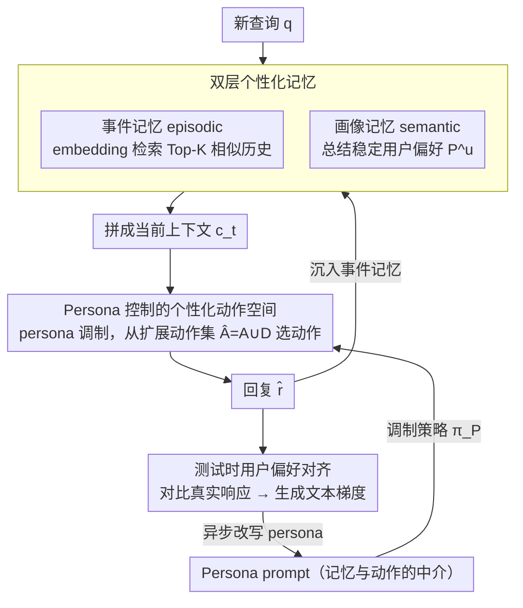

# PersonaAgent: Bridging Memory and Action for Personalized LLM Agents

**会议**: ACL2026  
**arXiv**: [2506.06254](https://arxiv.org/abs/2506.06254)  
**代码**: 论文未明确公开代码  
**领域**: LLM Agent / 个性化智能体  
**关键词**: 个性化 Agent、长期记忆、Persona Prompt、测试时对齐、LaMP

## 一句话总结
PersonaAgent 用“个性化记忆 + 个性化动作 + 可测试时优化的 persona prompt”把用户历史和工具行动连接起来，在 LaMP 多个个性化决策任务上明显超过 RAG、PAG、ReAct 和 MemBank 等基线。

## 研究背景与动机
**领域现状**：LLM agent 已经可以调用工具、维护记忆并执行多步推理，但大多数 agent 仍然偏向通用任务执行。个性化方向则常见于用户画像、检索增强或用户特定微调，这些方法通常只在文本生成阶段利用个人信息。

**现有痛点**：通用 agent 的动作空间不随用户变化，容易采取“一刀切”的策略；用户特定微调难以支撑大规模用户和频繁更新；固定 RAG/PAG 工作流虽然能读取用户数据，但缺少 agentic 决策能力，也无法持续调整工具调用和行为策略。

**核心矛盾**：真正的个人智能需要同时满足 agentic intelligence、真实部署可用性、个人数据利用和实时偏好对齐，而现有方法往往只能覆盖其中一两项。个性化不能只发生在最终回答文本里，还要影响 agent 选择什么工具、检索什么记忆、如何解释当前任务。

**本文目标**：作者希望建立一个统一框架，让 LLM agent 在执行个性化任务时能够读取用户历史、抽象长期偏好、调用个性化工具，并在测试时根据近期交互动态更新用户 persona。

**切入角度**：论文把 persona 定义为每个用户独有的系统提示。它不是静态 profile，而是记忆模块和动作模块之间的中介：记忆为 persona 提供证据，persona 控制动作，动作结果又反过来更新记忆和 persona。

**核心 idea**：用 persona prompt 作为个性化 agent 的中心控制器，并通过近期交互的文本反馈在测试时优化这个控制器。

## 方法详解
PersonaAgent 的设计可以理解为给通用 LLM agent 加上一层“用户级操作系统”。普通 agent 根据任务上下文选择工具；PersonaAgent 则先把用户历史压缩成可操作的 persona，再让 persona 影响工具选择、记忆检索、推理路径和最终决策。

### 整体框架
框架包含两个互补模块和一个中介变量。个性化记忆模块负责保存用户交互，分为 episodic memory 和 semantic memory；个性化动作模块负责根据 persona 调整工具调用和行动策略；persona prompt 则把记忆中的用户证据转成 agent 每一步可使用的行为约束。

当新查询到来时，系统先从 episodic memory 中检索相似历史，再结合 semantic memory 中的稳定用户画像形成上下文。随后 agent 在 persona 调制下选择动作，例如使用外部知识、检索个性化历史、更新记忆或进行 persona-guided reasoning。测试时对齐模块会模拟最近的用户交互，比较 agent 回复和真实用户响应之间的文本差异，再用 LLM 生成“文本梯度”更新 persona。

### 关键设计

**1. 双层个性化记忆：用事件层留证据、用画像层留偏好**

只靠事件检索，上下文又长又噪；只靠一份用户 profile，又会把具体行为细节抹平。PersonaAgent 把记忆拆成两层来同时拿住这两端：episodic memory 为每个用户逐条保存 $(q_i,r_i^{gt},m_i)$，新查询到来时用 embedding 相似度检索 Top-K 历史先例；semantic memory 则用 summarization prompt 把事件集合抽象成稳定的用户画像 $P^u=f_s(S_t,D^u)$。两层各司其职——事件层让 agent 看得见"这个用户以前具体怎么做的"，画像层让它守得住"这个用户长期偏好是什么"——于是检索到的上下文既有具体证据又不被噪声淹没。

**2. Persona 控制的个性化动作空间：把个性化从"答案内容"前移到"行动选择"**

很多个性化任务的关键不在于"说得像用户"，而在于 agent 知道何时该去翻个人历史、何时该依赖外部知识、何时该让长期偏好覆盖通用判断——而通用 agent 的动作空间根本不随用户变化。PersonaAgent 把动作集合从通用的 $A$ 扩展为 $\hat{A}=A\cup D$，其中 $D$ 包含访问用户数据和历史的工具；动作策略写成 $a_t\sim\pi_P(\cdot|c_t)$，由 persona $P$ 调制。这样 persona 不再只是最后生成时的风格装饰，而是直接决定每一步选哪个工具、检索什么记忆、走哪条推理路径，个性化被注入到了行动层而非仅仅输出层。

**3. 测试时用户偏好对齐：用文本梯度让 persona 随近期行为实时演化**

用户偏好会漂移，一次性总结出的 profile 不可能永远准，可又不能为了每个用户单独训一个模型。PersonaAgent 的解法是在测试时优化 persona：给定近期 batch $D_{batch}=\{(q_j,\hat{r}_j,r_j^{gt})\}$，让 LLM 对比 agent 的模拟回复和用户真实响应、生成自然语言形式的 textual loss feedback，再由 LLM_update 据此改写 persona。形式上这相当于在求

$$P^*=\arg\min_P\sum_j L(\hat{r}_j,r_j^{gt}\mid q_j)$$

只不过"梯度"是 LLM 用文字描述的反馈、"更新"是 LLM 对 persona 提示的改写。整个优化异步执行，不挤占下一次在线响应的延迟——既避开了大规模用户场景下频繁训练模型的成本，又保留了个体级的持续适配能力。

### 一个完整示例：一次个性化查询怎么走完闭环

一个新查询 $q$ 进来后，系统先在 episodic memory 里用 embedding 相似度捞出 Top-K 条相似先例，再叠上 semantic memory 给出的稳定画像 $P^u$，拼成当前上下文 $c_t$。接着 agent 在 persona $P$ 的调制下从扩展动作空间 $\hat{A}$ 里选动作——可能是去检索更多个人历史、调用外部知识、做 persona-guided reasoning，或更新记忆——最终给出回复 $\hat{r}$。这次交互的 $(q,\hat{r},r^{gt})$ 会沉进 episodic memory；当近期交互攒够一个 batch，测试时对齐模块就异步比较模拟回复与真实响应，生成文本反馈把 persona 往更贴合用户的方向改写。于是下一轮查询用到的就是被微调过的 persona：记忆喂证据给 persona，persona 控制动作，动作结果又回流更新记忆和 persona，构成一个比固定 RAG 流程更接近长期个人助理的闭环。

### 损失函数 / 训练策略
PersonaAgent 不依赖用户级模型微调，而是通过 prompt 和文本反馈做测试时优化。论文将 persona 优化形式化为 $P^*=\arg\min_P\sum_j L(\hat{r}_j,r_j^{gt}|q_j)$，但实际梯度由 LLM_grad 以自然语言反馈表示，再由 LLM_update 改写 persona。实验中默认使用 Claude-3.5 Sonnet 作为统一执行模型，并保持输入和输出格式一致，以隔离框架设计带来的收益。

## 实验关键数据

### 主实验
| 任务 | 指标 | 强基线 | PersonaAgent | 变化 |
|------|------|--------|--------------|------|
| LaMP-1 Citation Identification | Acc / F1 | MemBank 0.862 / 0.861 | 0.919 / 0.918 | 明显提升引用选择个性化 |
| LaMP-2M Movie Tagging | Acc / F1 | MemBank 0.470 / 0.391 | 0.513 / 0.424 | 更好捕捉用户电影偏好 |
| LaMP-2N News Categorization | Acc / F1 | PAG 0.768 / 0.509 | 0.796 / 0.532 | profile 与动作结合优于固定工作流 |
| LaMP-3 Product Rating | MAE / RMSE | ICL 0.277 / 0.543 | 0.241 / 0.509 | 数值评分误差最低 |

### 消融实验
| 配置 | LaMP-1 Acc/F1 | LaMP-2M Acc/F1 | LaMP-2N Acc/F1 | LaMP-3 MAE/RMSE | 说明 |
|------|---------------|----------------|----------------|-----------------|------|
| Full PersonaAgent | 0.919 / 0.918 | 0.513 / 0.424 | 0.796 / 0.532 | 0.241 / 0.509 | 完整系统 |
| w/o alignment | 0.894 / 0.893 | 0.487 / 0.403 | 0.775 / 0.502 | 0.259 / 0.560 | 去掉测试时对齐后全面下降 |
| w/o persona | 0.846 / 0.855 | 0.463 / 0.361 | 0.769 / 0.483 | 0.277 / 0.542 | persona 中介对 memory-action 桥接很关键 |
| w/o Memory | 0.821 / 0.841 | 0.460 / 0.365 | 0.646 / 0.388 | 0.348 / 0.661 | 历史用户上下文缺失伤害较大 |
| w/o Action | 0.764 / 0.789 | 0.403 / 0.329 | 0.626 / 0.375 | 0.375 / 0.756 | 仅靠推理不够，个性化动作最关键 |

### 关键发现
- PersonaAgent 在四个 decision-making 任务上都是最佳，尤其 LaMP-1 从 MemBank 的 0.862 Acc 提到 0.919，说明 persona-guided memory/action 对 topic-level 用户兴趣很有效。
- 消融显示 action module 的影响最大，去掉后 LaMP-3 MAE 从 0.241 变差到 0.375。这说明个性化工具行动比简单把用户资料塞进 prompt 更重要。
- 测试时 scaling 有收益：增大近期 alignment batch、增加少量 alignment iterations、检索更多 memory entries 都会增强 LaMP-2M 上的个性化效果，但迭代到约 3 次后收益趋于平台或略降。
- 效率分析中 PersonaAgent 平均每样本 1.79 秒，慢于 PAG 的 1.24 秒，但明显快于 ReAct 的 2.61 秒和 MemBank 的 2.92 秒；作者强调 persona optimization 异步完成，不增加实时在线响应延迟。
- 冷启动实验将每个用户限制到 10 条历史交互时，PersonaAgent 仍在四个 LaMP 任务上最优，例如 LaMP-1 Acc 0.845、LaMP-2M Acc 0.476、LaMP-3 MAE 0.301。

## 亮点与洞察
- 论文最有价值的地方是把 persona 从“描述用户的文本”提升成“控制 agent 行动的策略中介”。这使个性化不再只是最后生成时的风格调整，而是贯穿检索、工具选择和推理路径。
- 测试时文本梯度很适合个性化场景。它不需要为每个用户做参数训练，也不要求用户显式写偏好，只要有最近交互的真实响应，就可以迭代改写 persona。
- 记忆和动作的闭环设计比较自然。行动结果可以更新记忆，记忆又改写 persona，persona 再控制下一轮行动，这比固定 RAG 流程更接近长期个人助理。
- 消融结果给了一个清晰信号：如果要做 personalized agent，单纯加 memory 不够，必须让 memory 影响 action policy。

## 局限与展望
- 作者承认文本反馈可能忽略隐式或多模态用户信号，例如情绪、视觉偏好、行为停留时间等。未来可以把点击、语音、图像或生理反馈纳入 persona 更新。
- 个性化数据被频繁用于记忆检索和 persona 优化，会带来隐私风险。论文提到可以探索 federated learning 等隐私保护机制，但当前框架尚未具体实现。
- 实验主要在 LaMP 个性化任务上验证，真实长期部署中的用户偏好漂移、恶意反馈、数据过期和跨设备同步还没有被系统评估。
- persona prompt 的自动更新可能累积错误。如果某次交互的 ground truth 本身噪声较大，文本梯度可能把 persona 推向错误偏好，需要更稳健的更新和回滚机制。

## 相关工作与启发
- **vs RAG / PAG**: RAG 检索用户历史，PAG 进一步使用 profile，但二者通常是固定工作流；PersonaAgent 让 persona 调制动作策略，可以决定何时检索、检索什么、如何使用证据。
- **vs ReAct**: ReAct 具备工具使用和推理能力，但不是用户级对齐；PersonaAgent 在 ReAct 类 agentic loop 上加入个人记忆和 persona 控制。
- **vs MemBank**: MemBank 强调长期记忆，但个性化行动控制较弱；PersonaAgent 的消融显示 memory 重要，但 action module 和 persona bridge 更是性能核心。
- **vs 用户特定微调**: 微调可以做个体对齐，但计算和维护成本高；PersonaAgent 用测试时 prompt 优化避开了大规模用户场景下频繁更新模型参数的问题。

## 评分
- 新颖性: ⭐⭐⭐⭐ 将 memory、action 和 persona prompt 结合成测试时可优化的个性化 agent 框架，概念整合度高。
- 实验充分度: ⭐⭐⭐⭐ 有主实验、消融、persona 分析、test-time scaling、base model 变化、效率和冷启动；真实在线用户研究仍缺失。
- 写作质量: ⭐⭐⭐⭐ 动机清楚，表格覆盖全面；部分公式和算法描述偏 prompt engineering，工程细节仍可更具体。
- 价值: ⭐⭐⭐⭐⭐ 对构建个人助理、推荐式 agent 和长期用户交互系统很有启发，尤其是 persona-as-controller 的设计。

<!-- RELATED:START -->

## 相关论文

- [\[ACL 2026\] ProPer Agents: Proactivity Driven Personalized Agents for Advancing Knowledge Gap Navigation](proper_agents_proactivity_driven_personalized_agents_for_advancing_knowledge_gap.md)
- [\[ICLR 2026\] FingerTip 20K: A Benchmark for Proactive and Personalized Mobile LLM Agents](../../ICLR2026/llm_agent/fingertip_20k_a_benchmark_for_proactive_and_personalized_mobile_llm_agents.md)
- [\[ACL 2026\] Shopping Companion: A Memory-Augmented LLM Agent for Real-World E-Commerce Tasks](shopping_companion_a_memory-augmented_llm_agent_for_real-world_e-commerce_tasks.md)
- [\[ACL 2026\] CodeStruct: Code Agents over Structured Action Spaces](codestruct_code_agents_over_structured_action_spaces.md)
- [\[NeurIPS 2025\] A-MEM: Agentic Memory for LLM Agents](../../NeurIPS2025/llm_agent/a-mem_agentic_memory_for_llm_agents.md)

<!-- RELATED:END -->
