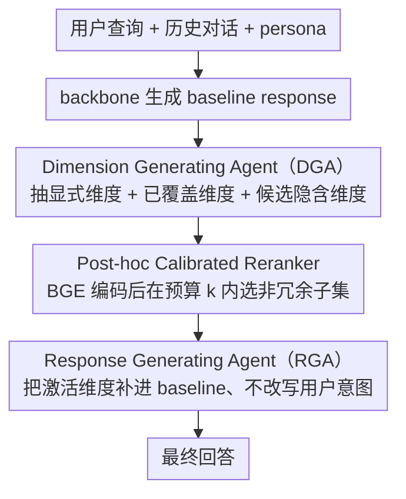

# ProPer Agents: Proactivity Driven Personalized Agents for Advancing Knowledge Gap Navigation

**会议**: ACL 2026  
**arXiv**: [2601.09926](https://arxiv.org/abs/2601.09926)  
**代码**: [GitHub](https://github.com/i-kiran/ProPer-Agent)  
**领域**: LLM Agent / 个性化助手 / 主动性校准  
**关键词**: 主动式助手, 知识缺口, 维度建模, 个性化 Agent, 校准式 proactivity

## 一句话总结
ProPer 把主动式助手建模为“发现并校准用户未说出的任务维度”的问题，通过 Dimension Generating Agent、post-hoc reranker 和 Response Generating Agent 选择性补足知识缺口，在医疗、代码和购物推荐任务上显著提升回答质量与 win rate。

## 研究背景与动机

**领域现状**：传统对话助手遵循 ask-and-respond 模式，用户问什么就答什么。主动式助手希望提前发现用户需求，例如补充风险、提示约束、追问缺失信息或给出更完整的建议。

**现有痛点**：很多主动式系统要么频繁追问，给用户增加负担；要么基于上下文外推，容易在错误时机插入不需要的建议。它们通常只处理用户已经表达出的 known unknowns，而缺少对 unknown unknowns 的显式建模。

**核心矛盾**：好的主动性不是“说更多”，而是在用户没意识到的关键维度上适度介入。介入不足会让回答遗漏重要风险，介入过多又会显得打扰、跑题或不尊重用户意图。

**本文目标**：提出一个可控的主动式个性化 Agent 框架，显式建模用户知识缺口，并通过校准机制决定哪些隐含维度值得进入最终回答。

**切入角度**：作者引入 dimensions 作为中间表示。一个 dimension 是完成任务时应考虑的结构化因素，例如输入规模、风险约束、偏好权衡、疾病严重性、预算或可替代方案。

**核心 idea**：先让 DGA 学会生成“当前用户可能没有意识到但任务相关”的隐含维度，再用 reranker 控制数量、相关性和多样性，最后让 RGA 在不打断用户意图的前提下补充这些维度。

## 方法详解

### 整体框架

ProPer 把主动性拆成“先发现缺口、再校准介入”两步，串成一条从查询到回答的流水线。系统接收当前用户查询、历史对话和可选 persona 后，先让 backbone 生成一个 baseline response，再由 Dimension Generating Agent（DGA）从查询和回答中抽出用户显式维度、系统已覆盖维度，以及一批“用户可能没意识到但任务相关”的候选隐含维度；post-hoc reranker 在预算约束下从候选里挑出少量 activated dimensions；最后 Response Generating Agent（RGA）在不改写用户意图的前提下，把这些维度补进 baseline response 形成最终回答。这里的 dimension 指完成任务时应考虑的结构化因素，例如输入规模、风险约束、偏好权衡、疾病严重性、预算或可替代方案。

### 关键设计

**1. Dimension Generating Agent（DGA）：把“该补什么”做成结构化预测**

普通 LLM 直接扩写回答时，很容易凭语言流畅性堆砌内容，却说不清到底补了哪些关键维度。DGA 把“应该补什么”独立成一个结构化预测问题：训练时用成功交互轨迹中的 dimension-level supervision 微调，学习那些在用户查询和参考回答里显式出现、且对任务成功有帮助的维度；推理时再根据当前用户状态提出候选 implicit dimensions 并输出置信度。这样系统对 unknown unknowns 的发现就有了一个可检查的结构化来源，而不是藏在生成文本里。

**2. Post-hoc Calibrated Reranker：给主动性装上节流阀**

主动性需要节制——若不加筛选，系统可能把所有潜在维度一股脑塞进回答，反而显得啰嗦跑题。reranker 先用 BGE-small 把所有维度编码，再选出一个预算为 $k$ 的子集，选择目标同时考虑三件事：DGA 给出的置信度、与尚未满足的显式需求的对齐程度、以及候选之间的非冗余性，其中 $\lambda_1$ 控制知识缺口的激活强度、$\lambda_2$ 控制多样性。有了预算与多样性约束，回答就从“什么都补”变成“有针对性地补几条”。

**3. Response Generating Agent（RGA）：把维度补进回答又不越界**

主动式助手最常见的失败是“过度热心”，发现缺口后忍不住重写整段、改变用户原本的诉求。RGA 是一个 prompt-driven 的生成模块，输入 baseline response、用户查询、显式维度和 activated dimensions，prompt 要求它保留 baseline 的结构、优先以简短信息补充缺口；只有当某个隐含维度确实需要用户特定信息时，才最多追问一个澄清问题。这套约束让模型在介入时仍能保持语气、范围和介入强度的校准。

### 一个完整示例

以医疗咨询为例：用户问“我该不该打某种疫苗”，baseline response 给出一句笼统的“建议接种”。DGA 从中识别出用户显式关心的是“是否接种”，但任务相关的隐含维度还包括风险框架、共病因素、禁忌情况和可替代方案；reranker 在预算 $k$ 内挑出彼此不冗余、又最贴合用户未满足需求的几条（如共病因素与禁忌）；RGA 据此在保留原结构的基础上补上简短的风险背景与防护提示，并就用户是否有特定基础疾病追问一句，最终给出既不打扰、又显著更完整的回答。

### 损失函数 / 训练策略

只有 DGA 需要训练。它的监督来自 dimension annotation：用 GPT-5 从原始交互中抽取 user-explicit 与 system-explicit dimensions，整理成结构化 JSON 训练样本去微调 DGA。reranker 不训练大模型，而是用固定目标函数在候选集合上做子集选择。RGA 则完全依赖领域特定 prompt，在医疗、代码竞赛和购物推荐三个域分别定义各自的主动性边界。

## 实验关键数据

### 主实验
评估覆盖 Medical (MD)、Code-Contests 和 PWAB 三个域。Gpt-5 作为 judge，为回答打 0-5 分并给出 win rate。

| 对比 | MD μScore / Win% | Code μScore / Win% | PWAB μScore / Win% |
|------|------------------|--------------------|--------------------|
| Llama-8B | 2.19 / 10.52 | 1.26 / 15.51 | 2.34 / 6.83 |
| Llama-8B + ProPer | 3.86 / 89.48 | 2.13 / 84.49 | 4.06 / 93.17 |
| Qwen-8B | 2.93 / 18.73 | 2.24 / 24.76 | 3.12 / 12.50 |
| Qwen-8B + ProPer | 4.03 / 81.27 | 2.84 / 75.24 | 4.29 / 87.50 |
| GPT-4 vs Llama-ProPer | 3.28 / 29.74 | 3.19 / 68.93 | 3.46 / 23.61 |
| Llama-8B + ProPer vs GPT-4 | 3.73 / 70.26 | 2.08 / 31.07 | 4.11 / 76.39 |
| GPT-4 vs Qwen-ProPer | 3.26 / 19.26 | 3.11 / 43.63 | 3.53 / 17.40 |
| Qwen-8B + ProPer vs GPT-4 | 4.03 / 80.74 | 2.97 / 56.37 | 4.24 / 82.60 |

### 消融实验

| $(\lambda_1, \lambda_2)$ | Llama MD | Qwen MD | Llama Code | Qwen Code | Llama PWAB | Qwen PWAB |
|---------------------------|----------|---------|------------|-----------|------------|-----------|
| (8.0, 1.0) | 4.00 | 4.15 | 2.11 | 2.81 | 3.96 | 3.71 |
| (2.0, 0.5) | 3.75 | 4.01 | 2.12 | 2.89 | 4.06 | 3.91 |
| (0.0, 0.2) | 3.70 | 3.91 | 2.08 | 2.79 | 4.17 | 3.80 |

### 多轮鲁棒性

| 域 | 多轮模拟样本数 | ProPer 胜场 | 解释 |
|----|----------------|-------------|------|
| Medical | 12 | 11 | 风险、约束和用户需求会逐轮显现，主动维度有用 |
| Code-Contests | 12 | 9 | 任务更明确，baseline 在窄问题上偶尔足够 |
| PWAB | 12 | 12 | 购物偏好和权衡适合用隐含维度补全 |

### 关键发现
- ProPer 平均在约 84% 样本上胜过同 backbone base LLM，说明提升不是来自更大模型，而是来自显式知识缺口建模。
- 医疗和购物推荐提升最大，因为这些任务天然包含风险、偏好、约束和 trade-off；代码竞赛任务目标明确，主动补充空间较小。
- 去掉 DGA 的性能下降比去掉 reranking / RGA 更明显，说明“发现什么缺口”比“如何措辞补充”更基础。
- CoT prompting 能改善 base LLM，但仍不如 ProPer，表明简单让模型自我反思不足以稳定发现用户 unknown unknowns。
- 多轮小样本实验显示 ProPer 的主动性没有明显漂移，至少在短轨迹中能保持适度介入。

## 亮点与洞察
- dimensions 是一个很有用的中间表示。它不像完整计划那么重，也比普通关键词更结构化，适合承载“用户没说但任务需要”的信息。
- 论文把 proactivity 从“是否主动问问题”转成“选择哪些缺口值得补”，这个定义更接近真实助手体验。
- 预算 $k$ 与 $(\lambda_1,\lambda_2)$ 让主动性变成可控旋钮。不同领域可以采用不同介入强度，而不是一个全局 prompt 解决所有任务。
- 医疗案例中的提升很能说明问题：ProPer 不只是给答案，还会补充风险框架、疫苗背景、实际防护和共病因素，帮助用户建立更完整问题表征。

## 局限与展望
- 主要评估依赖 Gpt-5 judge，可能偏好更详尽或更有结构的回答；还需要用户研究衡量信任、打扰感和长期任务成功。
- implicit dimensions 目前是自由文本，解释性强但不够规范，可能存在冗余、措辞不一致和跨域难以比较的问题。
- $(\lambda_1,\lambda_2)$ 是固定扫参，不是根据用户状态动态学习；真实系统需要根据用户熟练度、风险偏好和会话阶段自适应。
- 多轮实验只有每域 12 个模拟对话，更多轮、更复杂互动和真实用户反馈仍待验证。
- ProPer 不维护持久用户模型，也没有使用多模态或环境状态；个性化主动性仍比较浅。
- 医疗域虽然表现好，但真实临床助手的安全、合规和责任边界远超 benchmark 分数。

## 相关工作与启发
- **vs clarification-based agents**: 澄清式系统主要处理用户已知但没说清的需求，ProPer 更关注用户尚未意识到的任务维度。
- **vs context extrapolation agents**: 许多主动式 agent 从环境状态或历史行为外推，ProPer 则显式生成维度并通过 reranker 控制介入。
- **vs CoT/self-refine**: CoT 让模型反思回答缺陷，但缺少外显的知识缺口表示；ProPer 的 DGA 更像一个可检查的缺口生成器。

## 评分
- 新颖性: ⭐⭐⭐⭐ 用 dimensions 建模 unknown unknowns，并把主动性校准拆成 DGA/reranker/RGA，思路清晰。
- 实验充分度: ⭐⭐⭐⭐ 覆盖三个域、组件消融和多轮鲁棒性，但真人评测和长程交互不足。
- 写作质量: ⭐⭐⭐⭐ 概念定义较完整，方法图和 RQ 组织清楚。
- 价值: ⭐⭐⭐⭐ 对构建不打扰但有帮助的个性化 Agent 很有启发。

<!-- RELATED:START -->

## 相关论文

- [\[ACL 2026\] PersonaAgent: Bridging Memory and Action for Personalized LLM Agents](personaagent_bridging_memory_and_action_for_personalized_llm_agents.md)
- [\[AAAI 2026\] PerTouch: VLM-Driven Agent for Personalized and Semantic Image Retouching](../../AAAI2026/llm_agent/pertouch_vlm-driven_agent_for_personalized_and_semantic_image_retouching.md)
- [\[ICML 2026\] Scaling, Benchmarking, and Reasoning of Vision-Language Agents for Mobile GUI Navigation](../../ICML2026/llm_agent/scaling_benchmarking_and_reasoning_of_vision-language_agents_for_mobile_gui_navi.md)
- [\[ICLR 2026\] FingerTip 20K: A Benchmark for Proactive and Personalized Mobile LLM Agents](../../ICLR2026/llm_agent/fingertip_20k_a_benchmark_for_proactive_and_personalized_mobile_llm_agents.md)
- [\[ICML 2026\] Process Reward Agents for Steering Knowledge-Intensive Reasoning](../../ICML2026/llm_agent/process_reward_agents_for_steering_knowledge-intensive_reasoning.md)

<!-- RELATED:END -->
