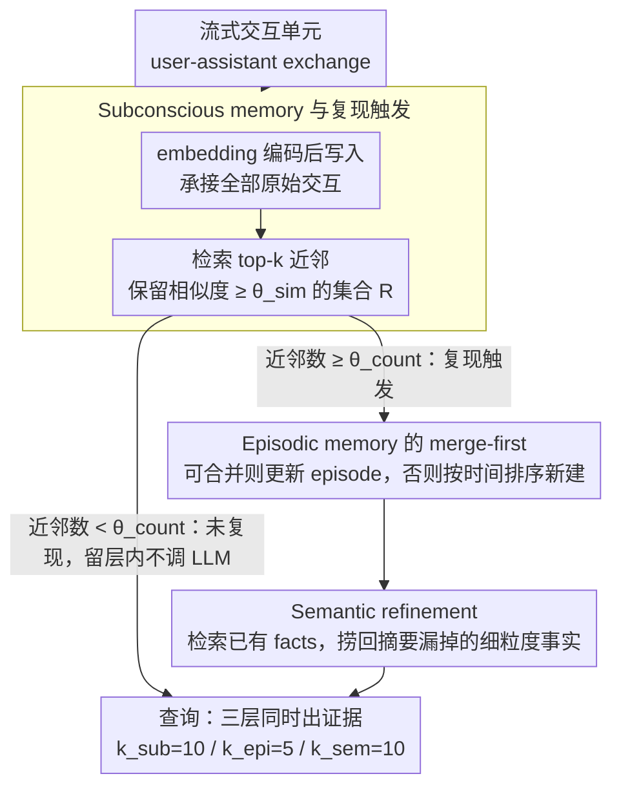

# RecMem: Recurrence-based Memory Consolidation for Efficient and Effective Long-Running LLM Agents

**会议**: ACL2026 Findings  
**arXiv**: [2605.16045](https://arxiv.org/abs/2605.16045)  
**代码**: https://github.com/CaiusDai/RecMem  
**领域**: LLM Agent / 长期记忆 / Memory System  
**关键词**: 长程Agent, 记忆固化, 递归触发, 语义记忆, 成本效率  

## 一句话总结
RecMem 借鉴人类记忆中的“重复出现才固化”原则，把原始交互先放入轻量 subconscious memory，只有检测到语义复现时才调用 LLM 生成 episodic 与 semantic memory，从而在 LoCoMo 和 LongMemEval-S 上以显著更低构建 token 成本达到或超过主流记忆系统的问答准确率。

## 研究背景与动机
**领域现状**：长程 LLM agent 需要跨多轮、多会话保留用户事实、偏好、事件和任务状态。现有外部记忆系统通常把交互内容加工成摘要、事实、知识图谱或记忆节点，再通过检索增强回答。

**现有痛点**：Mem0、A-Mem、MemoryOS 等系统虽然结构不同，但大多采用 eager memory consolidation，即每来一段新交互就调用 LLM 抽取、总结或合并记忆。这种策略最大的问题是构建成本高，而且很多一次性、噪声性、低信息量交互其实没有必要立刻进入长期记忆。

**核心矛盾**：长期 agent 需要不丢信息，但不应该为每个交互都支付 LLM 级别的固化成本。过早固化会浪费 token，也可能把临时信息过度结构化；完全不固化又会让后续检索缺少跨时间组织。

**本文目标**：设计一种训练无关、文本外部记忆系统，在流式交互中减少记忆构建阶段的 LLM 调用，同时保持长程问答准确率。

**切入角度**：作者从认知科学中的 multi-store theory 和 Complementary Learning Systems 出发，认为孤立经验先保留在快速编码层，只有重复激活的模式才值得固化为长期记忆。

**核心 idea**：用 cheap embedding store 先承接所有原始交互，再用语义相似度和复现次数触发 LLM 固化，把“何时记忆”作为一等问题，而不是默认每条交互都要被 LLM 总结。

## 方法详解

### 整体框架
RecMem 想解决的不是「记什么」，而是「什么时候值得花 LLM 把交互固化成长期记忆」。它把记忆分成三层各司其职：subconscious memory 用最廉价的方式承接所有原始交互并支持检索，episodic memory 存跨多轮的事件叙事，semantic memory 存细粒度事实。整套系统不引入新检索模型，关键全在「构建时机」上：只有当一个主题在 subconscious 层反复出现、攒够足够多语义相近的历史交互时，系统才舍得调用 LLM 往上固化。

流式交互到来时，系统先把一个 user-assistant exchange 当作原子单元 $u_i=(m_i^{usr},m_i^{ast},\tau_i)$，用 embedding 模型编码成 $v_i=\Phi(u_i)$ 写入 subconscious store。对每个新单元，它在 store 里检索 top-$k$ 近邻，留下相似度不低于 $\theta_{sim}$ 的相关集合 $\mathcal{R}_i$；当 $|\mathcal{R}_i|\geq \theta_{count}$ 时，说明这个主题在持续复现、值得固化，系统就把 $\mathcal{R}_i\cup\{s_i\}$ 送进 episodic 和 semantic 层；否则这条交互就静静躺在 subconscious memory 里，不花一个 LLM token。查询阶段三层同时出证据，默认预算 $k_{sub}=10$、$k_{epi}=5$、$k_{sem}=10$——semantic 给到 episodic 的两倍，好让精确事实补上事件摘要丢掉的细节。

### 关键设计

**1. Subconscious memory 与复现触发：用「出现几次」当固化的开关，而不是来一条总结一条**

eager consolidation 的浪费在于很多交互只是一次性闲聊、噪声或低信息量内容，却照样要付 LLM 抽取/总结的费用。RecMem 让每个新单元只做轻量结构化和向量化写入 subconscious store，然后看它能不能在历史里找到同伴：检索相似邻居，若相似度超过 $\theta_{sim}$ 的邻居数攒到 $\theta_{count}$，才扣动 LLM 固化的扳机。论文按场景给了两套阈值——开放闲聊用 $\theta_{sim}=0.7,\ \theta_{count}=5$，长任务型交互用 $\theta_{sim}=0.6,\ \theta_{count}=4$。这套「复现即显著」的代理之所以有效，是因为反复被提起的主题往往比一次性信息更稳定、更可能在未来被查询，把 token 花在它们身上回报更高；而那些没复现的内容也没丢，仍原样留在 subconscious 里随时可检索。

**2. Episodic memory 的 merge-first 策略：同一主题不碎成一堆平行摘要**

长程对话里一个主题常常反复出现又慢慢演化，如果每次复现都新生成一个 episode，同一条线索会被切成好几份互不相干的摘要。RecMem 让新交互先试着和最近的 episodic entry 合并：相似度够高就用 LLM merge 去更新已有 episode；不够高才在复现触发后,把相关交互按时间戳排序、交给 LLM 生成一个新 episode。merge-first 的好处是让每个主题保持一条时间锚定、连贯演进的叙事，而不是一地碎片。

**3. Semantic refinement：把摘要压缩时漏掉的细粒度事实捞回来**

event-level summary 越合并越抽象，恰好会损失用户偏好、时间、实体关系这些回答精确问题时真正需要的证据。为此 RecMem 对每个 episode 先检索相关的已有 semantic facts，再让 LLM 同时做两件事：从 raw interactions、episode summary 和历史 facts 里恢复被摘要遗漏的关键实体与细节，并维护已有事实、处理偏好变化（如用户口味变更）。每个事实作为独立 semantic entry 单独存储，于是 semantic 层就成了对 episodic 抽象的细节补偿——粗摘要负责「发生过什么」，细事实负责「精确命中那一个点」。

### 一个例子：一个反复出现的主题如何被固化
假设用户在不同会话里多次提到「我在准备马拉松」：第 1 次提起时只有它自己，subconscious 里找不到足够近邻（$|\mathcal{R}|=1 < \theta_{count}$），系统只把它向量化存下，不动 LLM。随着「这周跑了 20 公里」「换了双新跑鞋」「目标是 4 月那场比赛」陆续到来，subconscious 检索把这些语义相近的单元聚到一起；当相关邻居数攒到阈值 $\theta_{count}$，复现触发——LLM 把这组交互按时间排序合并成一个 episode（「用户正在备战 4 月马拉松，训练里程逐周增加」），semantic refinement 再抽出「目标赛事=4 月」「新跑鞋」这类独立事实。之后问「用户的比赛是什么时候」，semantic 层直接命中精确事实，episodic 层补上训练演化的背景。整段过程里，只有真正复现的主题付了 LLM 成本。

### 损失函数 / 训练策略
RecMem 是 training-free 外部记忆系统，不需要微调 LLM。系统主要依赖 embedding 检索、静态阈值和 LLM prompt 完成 consolidation、merge、refinement 与 answering。实验中使用 GPT-4o-mini 和 GPT-4.1-mini 两个后端，temperature=0.0，embedding 使用 text-embedding-3-small。

## 实验关键数据

### 主实验
| 数据集 / 模型 | 指标 | RecMem | 最强对比记忆系统 | 构建成本对比 |
|---------------|------|--------|------------------|--------------|
| LoCoMo / GPT-4.1-mini | Overall accuracy | 81.10 | A-Mem 68.83 / MemoryOS 67.60 | 193.2K construction tokens vs Mem0 1520.8K、A-Mem 1459.93K |
| LoCoMo / GPT-4o-mini | Overall accuracy | 72.47 | MemoryOS 63.64 / A-Mem 60.84 | 202.4K construction tokens vs Mem0 1233.5K、A-Mem 1143.3K |
| LongMemEval-S / GPT-4.1-mini | Overall accuracy | 76.80 | MemoryOS 74.40 / A-Mem 71.60 | 365.49K construction tokens vs Mem0 1626.54K、A-Mem 1264.25K |
| LongMemEval-S / GPT-4o-mini | Overall accuracy | 69.20 | MemoryOS 67.80 / Mem0 64.00 | 329.55K construction tokens vs Mem0 1244.87K、A-Mem 1180.23K |

### 消融实验
| 配置 | LoCoMo GPT-4.1-mini Overall | 说明 |
|------|-----------------------------|------|
| Full RecMem | 81.10 | 三层记忆完整 |
| w/o subconscious memory | 51.88 | 去掉原始交互承载层，下降最大 |
| w/o episodic memory | 79.94 | 事件叙事被去掉，影响较小 |
| w/o semantic memory | 70.58 | 细粒度事实缺失，下降明显 |
| Direct semantic extraction | 74.22 | 不借助 episode 做 refinement，低于 79.94 |

### 关键发现
- RecMem 在 LoCoMo GPT-4.1-mini 上比 Mem0 少约 87.3% 构建 token，比 A-Mem 少约 86.8%，同时整体准确率更高。
- 在更长的 LongMemEval-S 上，Full Context 不再占优；RecMem 用更低构建成本取得最高整体准确率。
- temporal reasoning 是 RecMem 的强项，因为 subconscious clustering 能跨时间聚合共指主题，episodic consolidation 又按时间排序恢复演化过程。
- 消融显示 subconscious memory 是系统底座；semantic memory 比 episodic memory 对最终准确率更关键，因为许多问题需要精确事实而非粗粒度事件摘要。

## 亮点与洞察
- 论文把“记什么”推进到“什么时候值得固化”。这个角度很实用，因为长程 agent 的成本瓶颈常常发生在持续写入阶段，而不是单次查询阶段。
- Subconscious layer 的价值不只是省钱，也是一种保真备份。即便某条信息没有复现到足以固化，它仍然可以在查询时被直接检索。
- Semantic refinement 解释了为什么单纯 summary memory 不够：摘要越合并越抽象，恰好会损失用户偏好、时间、实体关系这类问答需要的细粒度证据。

## 局限与展望
- 复现触发依赖静态阈值 $\theta_{sim}$ 和 $\theta_{count}$，不同领域、不同交互密度可能需要重新调参。
- 用复现作为 salience proxy 会漏掉只出现一次但很重要的信息，例如一次性截止日期、医疗提醒或合同条款。虽然 subconscious memory 仍保留原文，但不会主动形成高层记忆。
- 10/5/10 的检索预算和三层结构在本文基准上有效，但在多用户、多模态或工具执行日志中，是否仍然最优还需要验证。
- 未来可以做自适应触发：根据用户、任务类型、风险等级动态调整阈值，而不是用固定经验值。

## 相关工作与启发
- **vs Mem0**: Mem0 倾向于把交互抽取成原子事实并持续更新；RecMem 推迟这一步，只在主题复现后做事实抽取。
- **vs A-Mem**: A-Mem 用类 Zettelkasten 的记忆笔记和连接关系组织交互；RecMem 更强调流式写入中的成本控制和复现触发。
- **vs MemoryOS**: MemoryOS 用层级记忆模拟操作系统式管理；RecMem 的三层结构更简单，但通过 subconscious + episodic + semantic 的职责分工获得较强性价比。
- **启发**: 在长期 agent 里，不必把所有交互都立即总结成“永久记忆”；可以先建立廉价、可检索、可延迟固化的缓冲层。

## 评分
- 新颖性: ⭐⭐⭐⭐☆ 递归触发固化的想法清晰且有效，更多是范式调整而非复杂模型创新。
- 实验充分度: ⭐⭐⭐⭐☆ 两个长记忆基准、两个 LLM 后端、多个记忆系统和消融都覆盖到；真实在线部署分析可再加强。
- 写作质量: ⭐⭐⭐⭐☆ 方法动机顺畅，三层结构讲得清楚，成本指标很有说服力。
- 价值: ⭐⭐⭐⭐⭐ 对长程 agent 的记忆系统设计很有实践价值，尤其适合把 token 成本纳入核心评价的场景。

<!-- RELATED:START -->

## 相关论文

- [\[ACL 2026\] TiMem: Temporal-Hierarchical Memory Consolidation for Long-Horizon Conversational Agents](timem_temporal-hierarchical_memory_consolidation_for_long-horizon_conversational.md)
- [\[ACL 2026\] HiGMem: A Hierarchical and LLM-Guided Memory System for Long-Term Conversational Agents](higmem_a_hierarchical_and_llm-guided_memory_system_for_long-term_conversational_.md)
- [\[ACL 2026\] OCR-Memory: Optical Context Retrieval for Long-Horizon Agent Memory](ocr-memory_optical_context_retrieval_for_long-horizon_agent_memory.md)
- [\[ACL 2026\] StructMem: Structured Memory for Long-Horizon Behavior in LLMs](structmem_structured_memory_for_long-horizon_behavior_in_llms.md)
- [\[ACL 2026\] PersonaAgent: Bridging Memory and Action for Personalized LLM Agents](personaagent_bridging_memory_and_action_for_personalized_llm_agents.md)

<!-- RELATED:END -->
